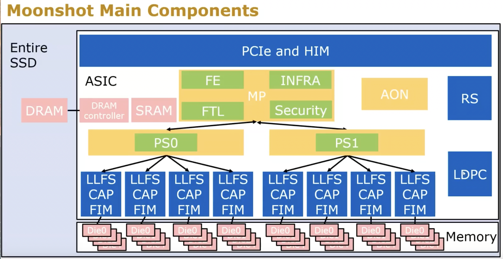
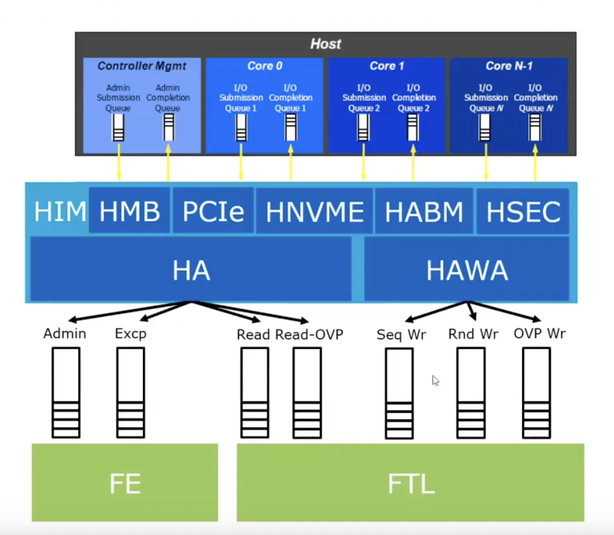
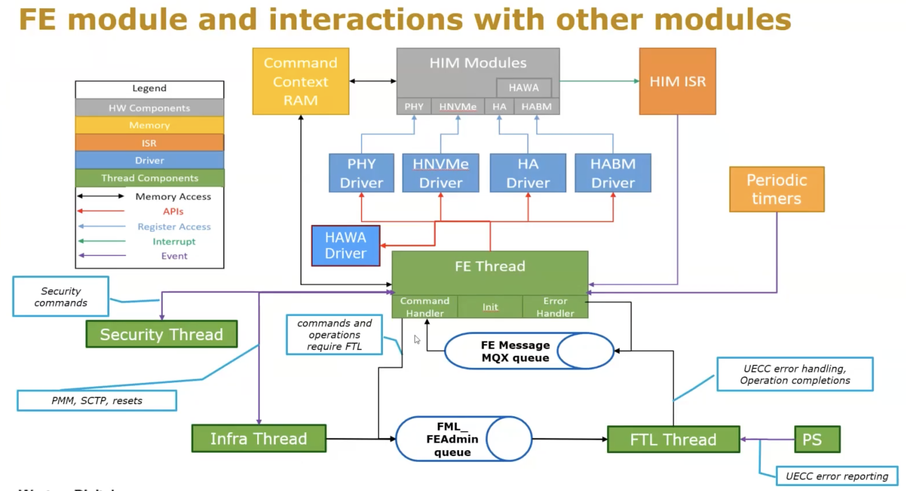

.. include:: ../_static/.special.rst
##############
SSD Firmware
##############

.. contents:: Table of Contents
   :depth: 2

闪存管理 (Flash Management)
***************************

:problem:`Challenge`
====================

.. note::

    * PCIe / NVMe standards
    * 维护逻辑地址 (LBA) 和 物理地址 (PBA) 之间的mapping关系
    * 支持正常关闭 `GSD: Graceful Shutdown` 和 断电关闭 `UGSD: Ungraceful Shutdown`
    * Performance
    * Endurance: 闪存单元总共的重写 `rewrite` 次数
    * Wear Leveling: 均衡各单元读写次数, 避免某些闪存单元损坏
    * Error handling
    * Power + Thermal

Moonshot 结构
*************

.. contents:: Table of Contents
   :depth: 2
   :local:
   :backlinks: none

:problem:`PCIe`
===============

* :ref:`link-pcie`

:problem:`HIM`
=======================

.. note::

    * 管理交互各种Host的queue, 给 host interface 提供 hardware automation
    * 自动化的指令读取 + 编译
    * write command: 指令累积到`32K`

:problem:`FE (Front-End)`
=========================

.. note::

    * 给 `HIM` 提供 firmware interface
    * `NVMe Protocol`

      * admin commands
      * non-fast path I/O commands
      * error handling

    * Power Management

:problem:`FTL (Flash Translation Layer)`
========================================

.. note::

    * Read Flow

      * Translate LBA (Logical) to VBA (physical)
      * VBA 还需一层Physical Storage 转译至 PBA, 才可得到最底层的物理位置
      * Read Look Ahead (RLA): 预测是否为 sequential reading, 可进行相应的优化
    * Write Flow

      * Routing: 决定数据存储位置

        * SLC/TLC
        * random/sequential

      * Update mapping table
      * Handle unaligned writes: read modify writes