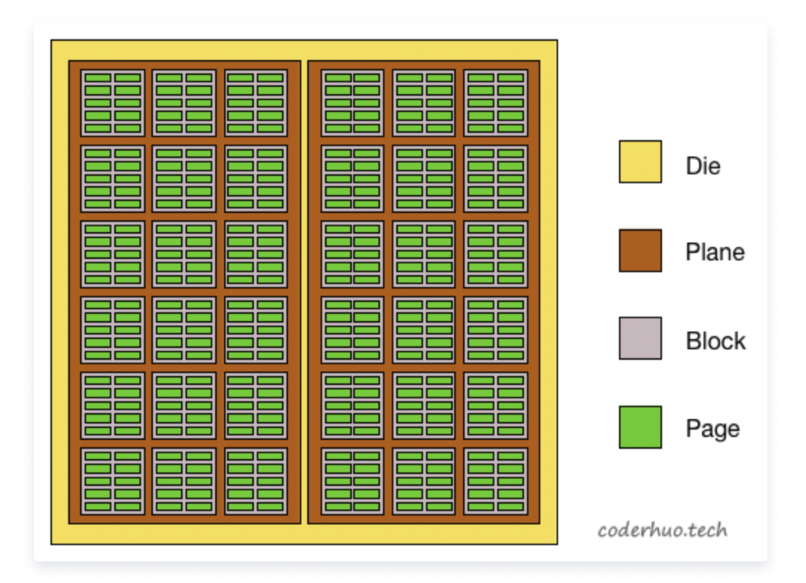

.. include:: ../_static/.special.rst
##############
NAND Flash
##############

.. contents:: Table of Contents
   :depth: 2

NAND Flash 结构
***************

.. note::

    * `package`: 存储芯片, NAND Flash颗粒
    * `die`: `package` 下可独立 **执行命令** 并 **返回状态** 的最小单元
    * `plane`: `die` 下并发操作的单元
    * `block`: `plane` 下最小擦除`erase`单元
    * `WL (Word Line)`: `cell` 通过串行方式连接, 横向连接(X轴)构成Word Line, 多个构成 `block`
    * `page`: `block`下最小读写 `read/write` 单元, 多个构成 `WL`
    * `cell (memory cell)`: 最小单位, `SLC` 存储 `1 bit`, `MLC` 存储 `2 bit`, `TLC` 存储 `3 bit`
    * `BL (Bit Line)`: `cell` 通过串行方式连接, 纵向连接(Y轴)构成Bit Line

NAND Cell
*********
Cell Criteria
=============

.. note::

   * Data Rentention

      * 温度对于电压分布的影响
      * 温度升高导致不同数据电压区别不明显

    * Endurance

      * PEC (Program Erace Cycle)
      * Cycling: faster to program, slower to erase, wider voltage distribution