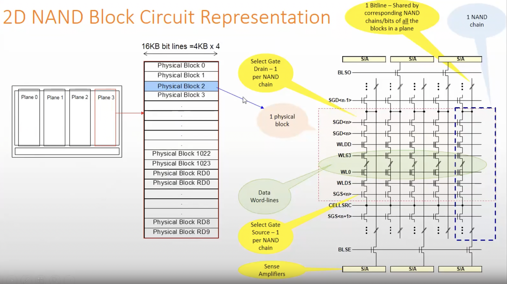
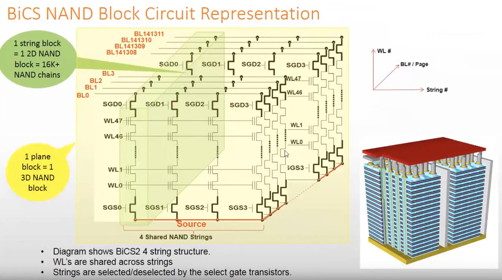
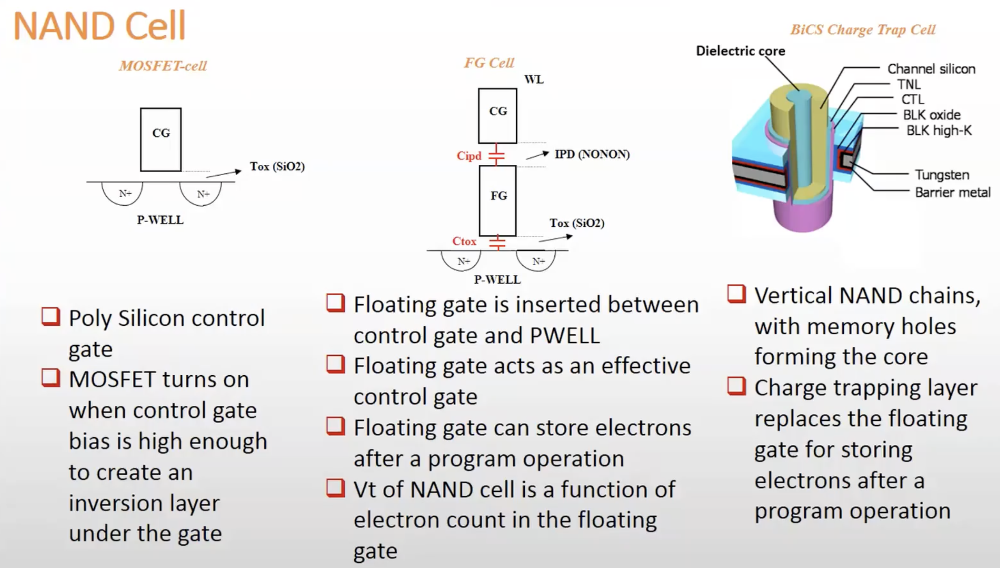
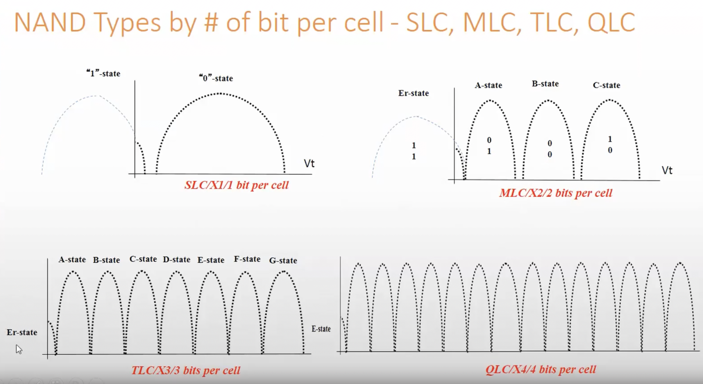

.. include:: ../_static/.special.rst
##############
NAND Flash
##############

.. contents:: Table of Contents
   :depth: 2

NAND Flash 结构
***************

.. note::

    * `cell (NAND memory cell)`: 最小单位

      * `SLC` 存储 `1 bit`
      * `MLC` 存储 `2 bit`
      * `TLC` 存储 `3 bit`
      * `QLC` 存储 `4 bit`
    * `WL (Data Word Line)`: 同一 `block` 中, 横向(X轴)的 **物理连接** 构成 **Word Line**

      * WL的长度 = `page` 大小 **in bits**
    * `BL (Bit Line)`: 同一 `plane` 中纵向(Y轴)的 **物理连接** 构成 **Bit Line**

      * `Bit Line` 由同一 `plane` 下的所有 `block` 共享
    * `NAND chain`: 同一 `block` 中, `cell` 通过串行方式由 `Bit Line` **纵向** 连接在一起形成, 两头有 `select gate`
    * `page (Physical Page)`: 同一 `block` 中, `cell` 通过串行方式由 `Word Line` **横向** 连接在一起形成

      * 最小 **读写 (read/write)** 单元
    * `block (Physical Block)`: `NAND memory cell` 矩阵, 即多条 `WL` 纵向连接在一起

      * 最小 **擦除 (erase)** 单元
    * `plane (Physical Plane)`: 多个 `physical block` 通过 `BL` 纵向连接在一起

      * `block` 分享每一条 `BL` 的 `sense amplifier`
      * 最小 **并发操作** 的单元
    * `die`: `package` 下可独立 **执行命令** 并 **返回状态** 的最小单元
    * `package`: 存储芯片, NAND Flash颗粒

.. note::

* 如图所示为1个 `block`
* 绿色方框为1个 `string block`, 即1个 `2D NAND block`

  * `Word Line` 由同一 `block` 下的所有 `string` 共享

NAND Cell
*********

Cell Criteria
=============

Trade off for `higher performance`

.. note::

   * Read/Write/Erase Performance
   * Data Rentention

      * 温度对于电压分布有影响
      * 温度升高导致不同数据电压区别不明显
      * 表示不同温度下NAND正确存储数据的能力

   * Cross Temperature

     * 一次读写 `PE Cycle` 中 **读操作** 和 **写操作** 之间的温差
     * 会导致电压偏移 `voltage shift`, 使数据不准确

   * Endurance

      * PEC (Program Erace Cycle)
      * Cycling: faster to program, slower to erase, wider voltage distribution

   * Read Disturb

     * read stress

   * Power Consumption
   * DPPM
   * Bit Error Rate (BER) and Sector Error Rate (SER)

Trade off for `die size`

.. note::

   * Die size and capacity
   * IO Speed
   * Block number
   * Plane/String number
   * Program/Read parallelism

Cell Structure
==============

.. note::

   * :math:`2^{x}` number of states including `erase state`
   * `normal distribution bell shape` 之间的间隔越大, NAND越可靠