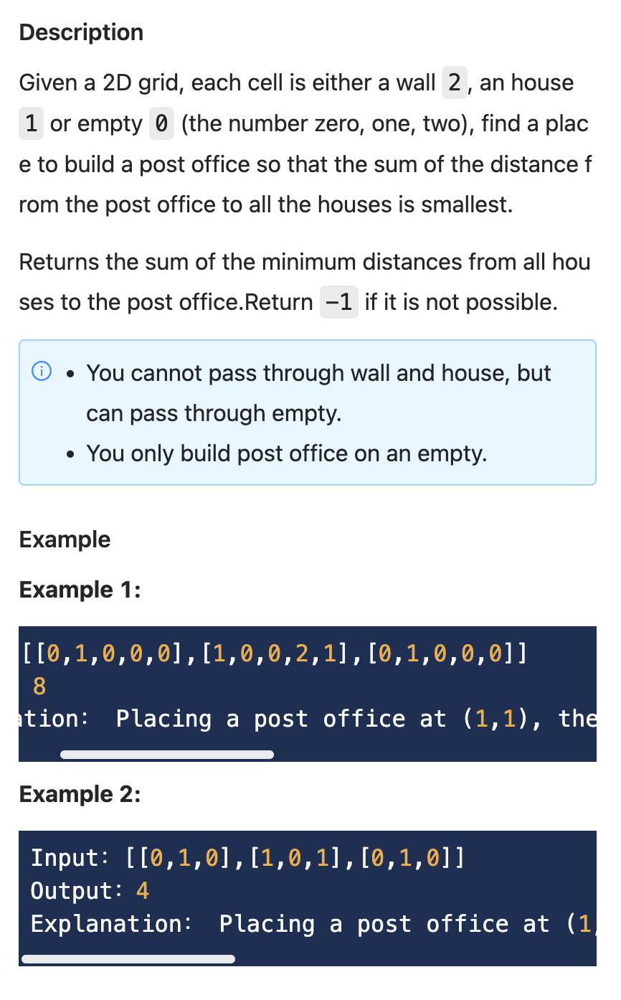

.. include:: ../_static/.special.rst

#######################
Breadth First Search
#######################

Table of Contents
*****************

.. contents::

BFS Application Scenario
*****************************

.. danger::

    - Can only be performed on **simple graph**
    - Level Order Traversal (二叉树层序遍历)
        - Tree
        - Graph
        - Array
    - Connected Components (连通块问题)
        - From a point in graph, find all other connected points in the graph
        - Find **all solutions** without recurssion
    - Topological Sort
        - Performed on directed graph

    - Shortest Path
        - Simple Graph: BFS
        - Complex Graph: SPFA, Dijkstra
    - Longest Path
        - Level Order: path must have directions without loop
        - Graph with level order: Dynamic Programming
        - Graph without level order: DFS

BFS Template
*****************************

.. caution::

    .. code-block:: python

        # Step 1 初始化
        # 把初始节点放到deque里，如果有多个就都放进去
        # 标记初始节点距离为0， 记录在distance的dict里
        # distance起到判断是否访问过和记录距离的作用
        queue = collections.deque()
        visited = set()

        # 初始化, 初始点加入队列
        queue.append(0)
        visited.add(0)

        # Step 2 不断访问队列
        # while循环每次pop队列中的一点
        while queue:
            for i in range(len(queue)):
                node = queue.popleft()
                # Step 3 拓展相邻节点
                # 把pop出的节点的相邻点入队并存距离
                for neighbor in node.get_neighbors():
                    if not self.is_valid(neighbor):
                        continue
                    queue.append(neighbor)
                    visited.add(neighbor)

Simple Graph Shortest Path (简单图最短距离)
************************************************

Word Ladder (单词接龙)
======================

`LintCode 120 Hard <https://www.lintcode.com/problem/120/>`_

.. hint::
    BFS

.. note::
    - Time: :math:`O(26L^2)`
    - Space: :math:`O(L^2)`

    .. code-block:: python

        class Solution:
            """
            @param: start: a string
            @param: end: a string
            @param: dict: a set of string
            @return: An integer
            """
            def ladderLength(self, start, end, dict):
                dict.add(end)
                queue = collections.deque([start])
                distance = {start: 1}

                while queue:
                    word = queue.popleft()
                    if word == end:
                        return distance[word]
                    
                    for next_word in self.get_next_word(word):
                        if next_word not in dict or next_word in distance:
                            continue
                        queue.append(next_word)
                        distance[next_word] = distance[word] + 1
                return 0
            
            def get_next_word(self, word):
                words = []
                for i in range(len(word)):
                    # Skip i char
                    left, right = word[:i], word[i + 1:]
                    for char in "abcdefghijklmnopqrstuvwxyz":
                        if word[i] == char:
                            continue
                        words.append(left + char + right)
                return words

Knight Shortest Path (骑士的最短路线)
======================================================

`LintCode 611 Medium <https://www.lintcode.com/problem/611/>`_

.. hint::
    BFS

    - Use distance dict to track both distance and visited

.. note::
    - Time: :math:`O(MN)`
    - Space: :math:`O(MN)`

    .. code-block:: python

        """
        Definition for a point.
        class Point:
            def __init__(self, a=0, b=0):
                self.x = a
                self.y = b
        """

        class Solution:
            def __init__(self):
                self.DIRECTION = [
                    (1, 2),
                    (1, -2),
                    (-1, 2),
                    (- 1, -2),
                    (2, 1),
                    (2, -1),
                    (-2, 1),
                    (-2, -1)
                ]

            """
            @param grid: a chessboard included 0 (false) and 1 (true)
            @param source: a point
            @param destination: a point
            @return: the shortest path 
            """
            def shortestPath(self, grid, source, destination):
                if not grid or not grid[0]:
                    return -1
                
                queue = collections.deque([(source.x, source.y)])
                distance = {(source.x, source.y): 0}
                while queue:
                    x, y = queue.popleft()
                    if x == destination.x and y == destination.y:
                        return distance[(x, y)]
                    for dx, dy in self.DIRECTION:
                        next_x, next_y = x + dx, y + dy
                        if not self.is_valid(grid, next_x, next_y, distance):
                            continue
                        queue.append((next_x, next_y))
                        distance[(next_x, next_y)] = distance[(x, y)] + 1
                return -1

            def is_valid(self, grid, x, y, distance):
                n = len(grid)
                m = len(grid[0])
                if not(0 <= x < n and 0 <= y < m):
                    return False
                if (x, y) in distance.keys():
                    return False
                return not grid[x][y]

Knight Shortest Path II (骑士的最短路线 II)
======================================================

`LintCode 630 Medium <https://www.lintcode.com/problem/630/>`_

.. note::

    .. code-block:: python

        from typing import (
            List,
        )

        class Solution:
            """
            @param grid: a chessboard included 0 and 1
            @return: the shortest path
            """
            def __init__(self):
                self.DIRECTIONS = [(1, 2), (-1, 2), (2, 1), (-2, 1)]

            def shortest_path2(self, grid: List[List[bool]]) -> int:
                if not grid or not grid[0]:
                    return -1
                n = len(grid)
                m = len(grid[0])

                queue = collections.deque([(0, 0)])
                distance = {(0, 0): 0}
                while queue:
                    x, y = queue.popleft()
                    for delta_x, delta_y in self.DIRECTIONS:
                        next_x = x + delta_x
                        next_y = y + delta_y
                        if not self.is_valid(grid, distance, next_x, next_y):
                            continue
                        queue.append((next_x, next_y))
                        distance[(next_x, next_y)] = distance[(x, y)] + 1
                if (n - 1, m - 1) in distance:
                    return distance[(n - 1, m - 1)]
                return -1
            
            def is_valid(self, grid, distance, x, y):
                if x < 0 or x >= len(grid):
                    return False
                if y < 0 or y >= len(grid[0]):
                    return False
                if grid[x][y] == 1:
                    return False
                if (x, y) in distance:
                    return False
                return True

Level Order Traversal (层序遍历)
************************************

Clone Graph (克隆图)
======================================================

`LintCode 137 Medium <https://www.lintcode.com/problem/137/>`_

.. hint::
    BFS

    - Remember add visited right before add neighbor to queue
    - Otherwise the will wait until next node has current node as neighbor to add to visited, which lead to replicate in queue

.. note::

    .. code-block:: python

        """
        class UndirectedGraphNode:
            def __init__(self, x):
                self.label = x
                self.neighbors = []
        """

        class Solution:
            """
            @param node: A undirected graph node
            @return: A undirected graph node
            """
            def cloneGraph(self, node):
                if not node:
                    return None
                
                nodes = self.find_nodes(node)
                mapping = self.copy_nodes(nodes)
                self.copy_edges(nodes, mapping)
                return mapping[node]
            
            def find_nodes(self, node):
                queue = collections.deque([node])
                visited = set([node])
                while queue:
                    current = queue.popleft()
                    for neighbor in current.neighbors:
                        if neighbor in visited:
                            continue
                        visited.add(neighbor)
                        queue.append(neighbor)
                return list(visited)
            
            def copy_nodes(self, nodes):
                mapping = {}
                for node in nodes:
                    mapping[node] = UndirectedGraphNode(node.label)
                return mapping
            
            def copy_edges(self, nodes, mapping):
                for node in nodes:
                    new_node = mapping[node]
                    new_node.neighbors = [mapping[neighbor] for neighbor in node.neighbors]

Binary Tree Level Order Traversal (二叉树的层次遍历)
======================================================

`LintCode 69 Easy <https://www.lintcode.com/problem/69/>`_

.. hint::
    BFS

    - Use single queue to track a level in binary tree

.. note::
    Time: :math:`O(n)`
    Space: :math:`O(n)`

    .. code-block:: python

        """
        Definition of TreeNode:
        class TreeNode:
            def __init__(self, val):
                self.val = val
                self.left, self.right = None, None
        """

        class Solution:
            """
            @param root: A Tree
            @return: Level order a list of lists of integer
            """
            def levelOrder(self, root):
                if not root:
                    return []
                
                que = collections.deque([root])
                result = []
                while que:
                    result.append([node.val for node in que])
                    for _ in range(len(que)):
                        node = que.popleft()
                        if node.left:
                            que.append(node.left)
                        if node.right:
                            que.append(node.right)
                return result

Longest Path On The Tree (树上最长路径)
=======================================

`LintCode 1469 Medium <https://www.lintcode.com/problem/1469/>`_

- Input: n=5,starts=[0,0,2,2],ends=[1,2,3,4],lens=[1,2,5,6], Output: 11
- Input: n=5,starts=[0,0,2,2],ends=[1,2,3,4],lens=[5,2,5,6], Output: 13

.. hint::
    Depth First Search

    - 不能快速找到neighbor
    - Build graph need two directions to build path
    - The longest path is max chain leaf to second max chain leaf, so distance will be :code:`max_chain + second_max_chain`
    - **Eventually stack limit exceeds**

.. note::
    Time: :math:`O(N^2)`

    .. code-block:: python

        from typing import (
            List,
        )

        class Solution:
            """
            @param n: The number of nodes
            @param starts: One point of the edge
            @param ends: Another point of the edge
            @param lens: The length of the edge
            @return: Return the length of longest path on the tree.
            """
            def longest_path(self, n: int, starts: List[int], ends: List[int], lens: List[int]) -> int:
                # 不能快速找到neighbor
                # Build graph
                # Need two directions
                neighbors = {}
                for i in range(n - 1):
                    start = starts[i]
                    end = ends[i]
                    dist = lens[i]

                    if start not in neighbors:
                        neighbors[start] = []
                    if end not in neighbors:
                        neighbors[end] = []
                    
                    neighbors[start].append((end, dist))
                    neighbors[end].append((start, dist))
                
                chain, path = self.dfs(0, -1, neighbors)
                return path

            def dfs(self, root, parent, neighbors):
                max_path = 0
                max_chain = 0

                # The longest path is max chain leaf to second max chain leaf
                # So distance will be max_chain + second_max_chain
                child_max_chain = 0
                child_second_chain = 0

                for neighbor, dist in neighbors[root]:
                    if neighbor == parent:
                        continue
                    child_chain, child_path = self.dfs(neighbor, root, neighbors)
                    child_chain += dist

                    max_chain = max(child_chain, max_chain)
                    max_path = max(child_path, max_path)

                    # Compare current child chain to determine the max and second chain among all children of root
                    _, child_second_chain, child_max_chain = sorted([child_max_chain, child_second_chain, child_chain])
                
                max_path = max(child_max_chain + child_second_chain, max_path)
                return (max_chain, max_path)
                
.. hint::
    Breadth First Search + Depth First Search

    - BFS: from root, find the farthest node **start**
    - BFS: from node **start**, find the farthest node **end**
    - The longest path is **start** to **end**

      - Root -> S has the the largest distance
      - Root -> S > Root -> S'
      - Root -> S - Root -> x > Root -> S' - Root -> x
      - Path Sx > path S'x

.. note::
    Time: :math:`O(MN)`

    .. code-block:: python

        class Solution:
            """
            @param n: The number of nodes
            @param starts: One point of the edge
            @param ends: Another point of the edge
            @param lens: The length of the edge
            @return: Return the length of longest path on the tree.
            """
            def longest_path(self, n: int, starts: List[int], ends: List[int], lens: List[int]) -> int:
                # 不能快速找到neighbor
                # Build graph
                # Need two directions
                neighbors = {}
                for i in range(n - 1):
                    start = starts[i]
                    end = ends[i]
                    dist = lens[i]

                    if start not in neighbors:
                        neighbors[start] = []
                    if end not in neighbors:
                        neighbors[end] = []
                    
                    neighbors[start].append((end, dist))
                    neighbors[end].append((start, dist))
                
                start, _ = self.bfs(0, neighbors)
                end, result = self.bfs(start, neighbors)
                return result

            def bfs(self, root, neighbors):
                queue = collections.deque()
                distance = {}

                queue.append(root)
                distance[root] = 0

                max_distance = 0
                max_node = None

                while queue:
                    current = queue.popleft()
                    if max_distance < distance[current]:
                        max_distance = distance[current]
                        max_node = current

                    for neighbor, edge in neighbors[current]:
                        if neighbor in distance:
                            continue
                        queue.append(neighbor)
                        distance[neighbor] = distance[current] + edge
                return max_node, max_distance

Connected Components (连通块问题)
************************************

Problem
=======

.. _lint-433-problem:

Number of Islands (岛屿的个数)
------------------------------

`LintCode 433 Easy <https://www.jiuzhang.com/problem/number-of-islands/>`_

.. code-block:: bash

    Input:
    [
    [1,1,0,0,0],
    [0,1,0,0,1],
    [0,0,0,1,1],
    [0,0,0,0,0],
    [0,0,0,0,1]
    ]
    Output:
    3

    Input:
    [
    [1,1]
    ]
    Output:
    1

:solution:`433 BFS`
^^^^^^^^^^^^^^^^^^^^^^^^^^^^^^^^^^^^^

.. hint::
    - Using DFS
        - space complexity (stack depth) depends on number of 1s, which is :math:`O(MN)`
        - Time complexity is also :math:`O(MN)`, this leads to stack overflow
        - When time complexity equals space complexity in dfs, stack overflow

.. note::
    - Time: :math:`O(M + N)`
    - Space: :math:`O(MN)`

    .. code-block:: python

        class Solution:
            def __init__(self):
                self.DIRECTION = [
                    (1, 0),
                    (-1, 0),
                    (0, 1),
                    (0, -1)
                ]
            """
            @param grid: a boolean 2D matrix
            @return: an integer
            """
            def numIslands(self, grid):
                if not grid or not grid[0]:
                    return 0
                
                islands = 0
                visited = set()
                for i in range(len(grid)):
                    for j in range(len(grid[0])):
                        if grid[i][j] and (i, j) not in visited:
                            self.search_island(grid, i, j, visited)
                            islands += 1
                return islands
            
            def search_island(self, grid, x, y, visited):
                queue = collections.deque([(x, y)])
                visited.add((x, y))
                while queue:
                    x, y = queue.popleft()
                    for delta_x, delta_y in self.DIRECTION:
                        new_x = x + delta_x
                        new_y = y + delta_y
                        if not self.is_valid(grid, new_x, new_y, visited):
                            continue
                        queue.append((new_x, new_y))
                        visited.add((new_x, new_y))

            def is_valid(self, grid, x, y, visited):
                n, m = len(grid), len(grid[0])
                if not (0 <= x < n and 0 <= y < m):
                    return False
                if (x, y) in visited:
                    return False
                return grid[x][y]

:solution:`434 Union Find`
^^^^^^^^^^^^^^^^^^^^^^^^^^^^^^^^^^^^^

.. seealso::

  - See reference :ref:`lint-434-union_find`

Friend Circles (朋友圈)
======================================================

`LintCode 1179 Medium <https://www.lintcode.com/problem/1179/>`_

.. hint::
    BFS

.. note::
    Time: :math:`O(n^2)`
    Space: :math:`O(n)`

    .. code-block:: python

        class Solution:
            """
            @param M: a matrix
            @return: the total number of friend circles among all the students
            """
            def findCircleNum(self, M):
                if not M:
                    return 0
                if not M[0]:
                    return 0
                visited = set()
                queue = collections.deque()
                counter = 0
                for i in range(len(M)):
                    if i not in visited:
                        queue.append(i)
                        counter += 1
                        visited.add(i)
                    while queue:
                        person = queue.popleft()
                        flag = True
                        for j in range(len(M[person])):
                            if M[person][j] == 0:
                                continue
                            if j not in visited:
                                queue.append(j)
                                visited.add(j)
                return counter

Modern Ludo I (飞行棋 I)
======================================================

`LintCode 1565 Medium <https://www.lintcode.com/problem/1565/>`_

BFS
-----

.. hint::
    BFS + BFS

    - connection might have many levels
    - Build graph on connections with adjacency list
    - For connection of two points [a, b]:

      - left point to point :code:`a` is distance 1
      - point :code:`a` to point :code:`b` is distance 0
      - Therefore, all nodes reached from **left point** is of distance 1, it's a **simple graph**, can use BFS

.. note::

    .. code-block:: python

        class Solution:
            """
            @param length: the length of board
            @param connections: the connections of the positions
            @return: the minimum steps to reach the end
            """
            def modern_ludo(self, length: int, connections: List[List[int]]) -> int:
                graph = self.build_graph(length, connections)
                queue = collections.deque([1])
                distance = {1: 0}
                while queue:
                    node = queue.popleft()
                    limit = min(length + 1, node + 7)
                    for neighbor in range(node + 1, limit):
                        connected = self.get_unvisited(graph, distance, neighbor)
                        for con in connected:
                            if con == length:
                                return distance[node] + 1
                            distance[con] = distance[node] + 1
                            queue.append(con)
                return distance[length]

            
            def build_graph(self, length, connections):
                graph = {i: set() for i in range(length + 1)}
                for a, b in connections:
                    graph[a].add(b)
                    # Only jump from small to large
                    # No reverse direction
                return graph

            # Use another level of bfs to search connected node on neighbor
            def get_unvisited(self, graph, distance, node):
                unvisited = set()
                queue = collections.deque([node])
                while queue:
                    current = queue.popleft()
                    if current in distance:
                        continue
                    unvisited.add(current)
                    for neighbor in graph[current]:
                        if neighbor not in distance:
                            queue.append(neighbor)
                            unvisited.add(neighbor)
                return unvisited

SPFA
-----

.. hint::

    - Consider as a complex graph
    - In simple graph bfs we consider a node already visited in :code:`distance` must already be the shortest path
    - In complex graph if current distance is shorter than :code:`distance[node]`, we update the shortest distance and put node back in queue to search again
    - When :code:`next_node` and :code:`node` are connected

      - :code:`distance[next_node] = distance[node] + 0` is the ideal situation
      - If :code:`if distance[next_node] > distance[node] + 0`, :code:`distance[next_node]` recorded a longer path
      - We should update :code:`distance[next_node]`, put it back in queue to search for optimized path

.. note::

    .. code-block:: python

        class Solution:
            """
            @param length: the length of board
            @param connections: the connections of the positions
            @return: the minimum steps to reach the end
            """
            def modern_ludo(self, length: int, connections: List[List[int]]) -> int:
                graph = self.build_graph(length, connections)
                queue = collections.deque([1])
                distance = {i: float('inf') for i in range(1, length + 1)}
                distance[1] = 0
                while queue:
                    node = queue.popleft()
                    # Search node connection
                    for next_node in graph[node]:
                        # Next node distance should be
                        # distance[node] + 0 when connected with node
                        # distance[next_node] > distance[node] means 
                        # distance[next_node] is not optimized path
                        if distance[next_node] > distance[node]:
                            distance[next_node] = distance[node]
                            queue.append(next_node)
                    limit = min(node + 7, length + 1)
                    # Search node next step
                    for next_node in range(node + 1, limit):
                        if distance[next_node] > distance[node] + 1:
                            distance[next_node] = distance[node] + 1
                            queue.append(next_node)    
                return distance[length]

            
            def build_graph(self, length, connections):
                # No pre process on node 1
                graph = {i: set() for i in range(1, length + 1)}
                for a, b in connections:
                    graph[a].add(b)
                    # Only jump from small to large
                    # No reverse direction
                return graph

SPFA + Priority Queue
---------------------

.. hint::

    - It's better to search shortest path first to avoid update and double search
    
.. note::

    .. code-block:: python

        class Solution:
            """
            @param length: the length of board
            @param connections: the connections of the positions
            @return: the minimum steps to reach the end
            """
            def modern_ludo(self, length: int, connections: List[List[int]]) -> int:
                import heapq

                graph = self.build_graph(length, connections)
                queue = [(0, 1)]
                distance = {i: float('inf') for i in range(1, length + 1)}
                distance[1] = 0
                while queue:
                    dist, node = heapq.heappop(queue)
                    # Search node connection
                    for next_node in graph[node]:
                        # Next node distance should be
                        # distance[node] + 0 when connected with node
                        # distance[next_node] > distance[node] means 
                        # distance[next_node] is not optimized path
                        if distance[next_node] > dist:
                            distance[next_node] = dist
                            heapq.heappush(queue, (dist, next_node))
                    limit = min(node + 7, length + 1)
                    # Search node next step
                    for next_node in range(node + 1, limit):
                        if distance[next_node] > dist + 1:
                            distance[next_node] = dist + 1
                            heapq.heappush(queue, (dist + 1, next_node))  
                return distance[length]

            
            def build_graph(self, length, connections):
                # No pre process on node 1
                graph = {i: set() for i in range(1, length + 1)}
                for a, b in connections:
                    graph[a].add(b)
                    # Only jump from small to large
                    # No reverse direction
                return graph

.. _lint-1565-dp:

Dynamic Programming
-------------------

.. hint::

    - Build graph recording :code:`to_node` for all :code:`from_node`
    - State: dp[i] is the steps from :code:`i` to node :code:`length`
    - Function: :code:`dp[from] = min(dp[to] + 1, 0)`

      - :code:`dp[to]` is the next step, step + 1
      - :code:`from` and :code:`to` two nodes are connected, step + 0
    - Initialization: :code:`dp[length] = 0`, :code:`dp[1, length - 1] = float('inf')`
    - Answer: :code:`dp[1]`

.. note::

    .. code-block:: python

        class Solution:
            """
            @param length: the length of board
            @param connections: the connections of the positions
            @return: the minimum steps to reach the end
            """
            def modern_ludo(self, length: int, connections: List[List[int]]) -> int:
                graph = self.build_graph(length, connections)
                dp = [float('inf')] * (length + 1)
                dp[length] = 0
                for from_node in range(length - 1, 0, -1):
                    limit = min(from_node + 7, length + 1)
                    for to_node in range(from_node + 1, limit):
                        dp[from_node] = min(dp[from_node], dp[to_node] + 1)
                    for to_node in graph[from_node]:
                        dp[from_node] = min(dp[from_node], dp[to_node])
                return dp[1]

            def build_graph(self, length, connections):
                # No pre process on node 1
                graph = {i: set() for i in range(1, length + 1)}
                for a, b in connections:
                    graph[a].add(b)
                    # Only jump from small to large
                    # No reverse direction
                return graph

Build Post Office II (邮局的建立 II)
====================================

`LintCode 573 Hard <https://www.lintcode.com/problem/573/>`_

.. hint::
    Brutal Force BFS

    - Enumerate on empty locations
    - From each empty location, bfs for distance sum
    - If current node is house, do not add to queue
    - Check distance of all node: :math:`O(mn)`, have :code:`empty` number of sources, worst case :math:O(`m^2 n^2`)

.. hint::
    BFS

    - Enumerate on house locations
    - Optimize if :math:`empty >> houses`

    .. code-block:: python

        class GRID:
            EMPTY = 0
            HOUSE = 1
            WALL = 2

        class Solution:
            """
            @param grid: a 2D grid
            @return: An integer
            """
            def is_valid(self, x, y, grid):
                m = len(grid)
                n = len(grid[0])
                if x < 0 or y < 0 or x >= m or y >= n:
                    return False
                return grid[x][y] == GRID.EMPTY

            def bfs(self, grid, i, j, dist_sum, reach_count):
                distance = {(i, j): 0}
                queue = collections.deque([(i, j)])
                while queue:
                    x, y = queue.popleft()
                    for dx, dy in [(1, 0), (-1, 0), (0, 1), (0, -1)]:
                        x_, y_ = x + dx, y + dy
                        empty_pos = (x_, y_)
                        if not self.is_valid(x_, y_, grid):
                            continue
                        if empty_pos in distance:
                            continue
                        queue.append(empty_pos)
                        distance[empty_pos] = distance[(x, y)] + 1
                        dist_sum[empty_pos] = dist_sum.get(empty_pos, 0) + \
                                                distance[empty_pos]
                        reach_count[empty_pos] = reach_count.get(empty_pos, 0) + 1

            def shortest_distance(self, grid: List[List[int]]) -> int:
                if not grid or not grid[0]:
                    return 0
                n, m = len(grid), len(grid[0])
                dist_sum = {}
                reach_count = {}
                houses = 0
                for i in range(n):
                    for j in range(m):
                        if grid[i][j] == GRID.HOUSE:
                            self.bfs(grid, i, j, dist_sum, reach_count)
                            houses += 1
                result = float('inf')
                for i in range(n):
                    for j in range(m):
                        if reach_count.get((i, j), -1) != houses:
                            continue
                        result = min(result, dist_sum[(i, j)])
                return result if result != float('inf') else -1     

The Maze III (迷宫 III)
======================================================

`LintCode 789 Hard <https://www.lintcode.com/problem/789/>`_

.. image:: ../_static/question/lint_789_1.png
   :scale: 30 %
   :alt: Warning!

.. code-block:: bash

    Input:
    [[0,0,0,0,0],[1,1,0,0,1],[0,0,0,0,0],[0,1,0,0,1],[0,1,0,0,0]]
    [4,3]
    [0,1]

    Output:
    "lul"

.. code-block:: bash

    Input:
    [[0,0,0,0,0],[1,1,0,0,1],[0,0,0,0,0],[0,1,0,0,1],[0,1,0,0,0]]
    [0,0]
    [1,1]
    [2,2]
    [3,3]
    Output:
    "impossible"

.. hint::
    - Track both distance and number of steps
    - Use python tuple comparison to compare :code:`(distance, path)`

.. note::

    .. code-block:: python

        DIRECTIONS = {
            'd': (1, 0),
            'l': (0, -1),
            'r': (0, 1),
            'u': (-1, 0)
        }

        class GRID:
            SPACE = 0
            WALL = 1

        class Solution:
            """
            @param maze: the maze
            @param ball: the ball position
            @param hole: the hole position
            @return: the lexicographically smallest way
            """
            def move_ball(self, x, y, direct, maze, hole):
                dx, dy = DIRECTIONS[direct]
                while (x, y) != hole and not self.is_wall(x, y, maze):
                    x += dx
                    y += dy
                if (x, y) == hole:
                    return x, y
                return x - dx, y - dy

            def is_wall(self, x, y, maze):
                if not (0 <= x < len(maze) and 0 <= y < len(maze[0])):
                    return True
                return maze[x][y] == GRID.WALL

            def find_shortest_way(self, maze: List[List[int]], ball: List[int], hole: List[int]) -> str:
                if not ball or not hole or not maze or not maze[0]:
                    return "impossible"
                hole = (hole[0], hole[1])
                queue = collections.deque([(ball[0], ball[1])])
                distance = {(ball[0], ball[1]): (0, '')}

                while queue:
                    x, y = queue.popleft()
                    dist, path = distance[(x, y)]
                    for direct in DIRECTIONS:
                        x_, y_ = self.move_ball(x, y, direct, maze, hole)
                        dist_ = dist + abs(x - x_) + abs(y - y_)
                        path_ = path + direct

                        if (x_, y_) in distance and distance[(x_, y_)] <= (dist_, path_):
                            continue
                        queue.append((x_, y_))
                        distance[(x_, y_)] = (dist_, path_)
                
                return distance.get(hole, (-1, "impossible"))[1]

Sliding Puzzle II (滑动拼图 II)
======================================================

`LintCode 794 Hard <https://www.lintcode.com/problem/794/>`_

.. hint::
    BFS

    - Use string of length 9 to denote current state of matrix
    - Use 4 directions to list all possible states

.. note::

    .. code-block:: python

        class Solution:
            """
            @param init_state: the initial state of chessboard
            @param final_state: the final state of chessboard
            @return: return an integer, denote the number of minimum moving
            """
            def matrix_to_str(self, state):
                str_list = []
                for i in range(3):
                    for j in range(3):
                        str_list.append(str(state[i][j]))
                return "".join(str_list)
            
            def get_next_states(self, state):
                states = []
                directions = [(0, 1), (1, 0), (0, -1), (-1, 0)]
                zero_idx = state.find('0')
                start_x, start_y = zero_idx // 3, zero_idx % 3

                for direct in directions:
                    next_x = start_x + direct[0]
                    next_y = start_y + direct[1]

                    if not (0 <= next_x < 3 and 0 <= next_y < 3):
                        continue
                    next_state = list(state)
                    # switch 0 with neighboring grid
                    next_state[start_x * 3 + start_y] = next_state[next_x * 3 + next_y]
                    next_state[next_x * 3 + next_y] = '0'
                    states.append("".join(next_state))
                return states

            def min_move_step(self, init_state: List[List[int]], final_state: List[List[int]]) -> int:
                source = self.matrix_to_str(init_state)
                target = self.matrix_to_str(final_state)
                if source == target:
                    return 0
                
                queue = collections.deque([source])
                distance = {source: 0}
                while queue:
                    current = queue.popleft()
                    if current == target:
                        return distance[current]
                    for next_state in self.get_next_states(current):
                        if next_state in distance:
                            continue
                        queue.append(next_state)
                        distance[next_state] = distance[current] + 1
                
                return -1

.. hint::
    Bidirectional BFS

    - BFS on both source and target, the expansion of middle states in BFS search tree is optimized
    - Meeing ponit of source and target bfs tree must be the answer
    - Can use when starting and ending point are both known in bfs search
    - :code:`extend_queue` **use for loop** instead of while to extend only 1 step

.. note::
    Time: :math:`O(\sqrt{N})`

    .. code-block:: python

        class Solution:
            """
            @param init_state: the initial state of chessboard
            @param final_state: the final state of chessboard
            @return: return an integer, denote the number of minimum moving
            """
            def matrix_to_str(self, state):
                str_list = []
                for i in range(3):
                    for j in range(3):
                        str_list.append(str(state[i][j]))
                return "".join(str_list)
            
            def get_next_states(self, state):
                states = []
                directions = [(0, 1), (1, 0), (0, -1), (-1, 0)]
                zero_idx = state.find('0')
                start_x, start_y = zero_idx // 3, zero_idx % 3

                for direct in directions:
                    next_x = start_x + direct[0]
                    next_y = start_y + direct[1]

                    if not (0 <= next_x < 3 and 0 <= next_y < 3):
                        continue
                    next_state = list(state)
                    # switch 0 with neighboring grid
                    next_state[start_x * 3 + start_y] = next_state[next_x * 3 + next_y]
                    next_state[next_x * 3 + next_y] = '0'
                    states.append("".join(next_state))
                return states

            def extend_queue(self, queue, forward_dist, backward_dist):
                for i in range(len(queue)):
                    current = queue.popleft()
                    for next_state in self.get_next_states(current):
                        if next_state in forward_dist:
                            continue
                        if next_state in backward_dist:
                            return True
                        queue.append(next_state)
                        forward_dist.add(next_state)
                return False

            def min_move_step(self, init_state: List[List[int]], final_state: List[List[int]]) -> int:
                source = self.matrix_to_str(init_state)
                target = self.matrix_to_str(final_state)
                if source == target:
                    return 0
                
                forward_queue = collections.deque([source])
                backward_queue = collections.deque([target])
                forward_dist = set()
                backward_dist = set()

                steps = 0
                while forward_queue and backward_queue:
                    steps += 1
                    if self.extend_queue(forward_queue, forward_dist, backward_dist):
                        return steps
                    
                    steps += 1
                    if self.extend_queue(backward_queue, backward_dist, forward_dist):
                        return steps
                
                return -1

Topological Sort (拓扑排序)
************************************

.. danger::

    - In-degree (入度)
        - In directed graph, the number of edges of current node
    - Count every node's in-degree
    - Put every node with 0 in-degree into queue for start points
    - Pop nodes form node, for every edge **pointing out to other node**, other node **in-degree -1**
    - Push new 0 in-degree nodes to queue

Topological Sorting (拓扑排序)
======================================================

`LintCode 127 Medium <https://www.lintcode.com/problem/127/>`_

.. hint::
    BFS

.. note::
    - Time: :math:`O(M + N)`

    .. code-block:: python

        """
        class DirectedGraphNode:
            def __init__(self, x):
                self.label = x
                self.neighbors = []
        """

        class Solution:
            """
            @param graph: A list of Directed graph node
            @return: Any topological order for the given graph.
            """
            def topSort(self, graph):
                if not graph:
                    return []
                
                indegree = self.get_indegree(graph)
                starters = [n for n in indegree if indegree[n] == 0]
                queue = collections.deque(starters)
                sorting = []
                while queue:
                    current = queue.popleft()
                    sorting.append(current)
                    for neighbor in current.neighbors:
                        indegree[neighbor] -= 1
                        if indegree[neighbor] == 0:
                            queue.append(neighbor)
                return sorting

            def get_indegree(self, graph):
                indegree = {x: 0 for x in graph}

                for node in graph:
                    for neighbor in node.neighbors:
                        indegree[neighbor] += 1
                return indegree