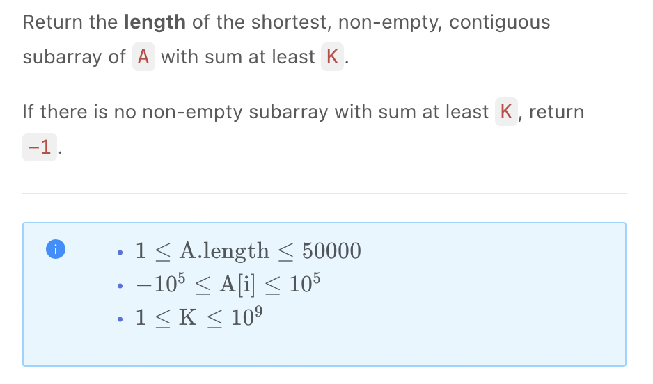

.. include:: ../_static/.special.rst

##############
Binary Search
##############

.. contents:: Table of Contents
   :depth: 2

Summary
*******

Use Case
========

.. warning::

    - **分治** 编程思想
    - 二分查找的数据集拥有 **连续且有限的范围**
    - 查找的 **分界线** 满足: :math:`> x` 时所有数据都满足条件, :math:`< x` 时所有数据都不满足条件, 可用二分查找 **满足条件的分界线**

.. warning::

    - DFS 使用递归
    - 二叉树中序遍历 不使用递归
    - 链表 不使用递归

Template
========

:problem:`Classical Binary Search (经典二分查找问题)`
-----------------------------------------------------

`LintCode 457 Easy <https://www.jiuzhang.com/problem/classical-binary-search/>`_

:solution:`457 Binary Search`
^^^^^^^^^^^^^^^^^^^^^^^^^^^^^

.. caution::

    - 寻找 **最后一次target出现的位置**, 可能 **出现死循环**, 使用 :code:`while start + 1 < end` 可避免

      - :code:`nums = [1, 1], target = 1`, 正确答案为 :code:`index == 1`
      - :code:`mid = 0`
      - :code:`start = mid`, 继续下一轮查找, 死循环出现
      - 使用 :code:`while start + 1 < end`, 在结束循环后 **分别检查** :code:`start, end` 两个位置

    - :code:`while start + 1 < end`, 循环结束: :code:`start == end - 1`
    - 在结束循环后 **分别检查** :code:`start, end` 两个位置
    - 当 :code:`nums[mid] == target`
        - 当寻找 **target首次出现位置**, 应该寻找左边section里更早出现的相同值
        - 使用 :code:`end = mid`, 使下次搜索进入 **左边section**
        - 当寻找 **target最后一次出现位置**, 应该寻找右边section里更晚出现的相同值
        - 使用 :code:`start = mid`, 使下次搜索进入 **右边section**

    .. code-block:: python

        class Solution:
            # @param nums: The integer array
            # @param target: Target number to find
            # @return the first position of target in nums, position start from 0 
            def binarySearch(self, nums, target):
                if not nums:
                    return -1

                start, end = 0, len(nums) - 1
                # 用 start + 1 < end 而不是 start < end 的目的是为了避免死循环
                # 在 first position of target 的情况下不会出现死循环
                # 但是在 last position of target 的情况下会出现死循环
                # 样例：nums=[1，1] target = 1
                # 为了统一模板，我们就都采用 start + 1 < end，就保证不会出现死循环
                while start + 1 < end:
                    # python 没有 overflow 的问题，直接 // 2 就可以了
                    # java和C++ 最好写成 mid = start + (end - start) / 2
                    # 防止在 start = 2^31 - 1, end = 2^31 - 1 的情况下出现加法 overflow
                    mid = (start + end) // 2

                    # > , =, < 的逻辑先分开写，然后在看看 = 的情况是否能合并到其他分支里
                    if nums[mid] < target:
                        start = mid
                    elif nums[mid] > target:
                        end = mid
                    else:
                        # 当寻找首次位置，应该寻找左边section里更早出现的相同值
                        # 使用 end = mid
                        # 当寻找最后一次位置，应该寻找右边section里更晚出现的相同值
                        # 使用 start = mid
                        end = mid

                # 因为上面的循环退出条件是 start + 1 < end
                # 因此这里循环结束的时候，start 和 end 的关系是相邻关系（1和2，3和4这种）
                # 因此需要再单独判断 start 和 end 这两个数谁是我们要的答案
                # 如果是找 first position of target 就先看 start，否则就先看 end
                if nums[start] == target:
                    return start
                if nums[end] == target:
                    return end

                return -1

Binary Search On Sorted Array (有序数组上二分查找)
**************************************************

.. contents:: Table of Contents
   :depth: 2
   :local:
   :backlinks: none

Use Case
========

.. warning::
    - 数据 **已排序**
    - 查找的 **分界线** 满足: :math:`> x` 时所有数据都满足条件, :math:`< x` 时所有数据都不满足条件

Problem
=======

:problem:`Find K Closest Elements (在排序数组中找最接近的K个数)`
----------------------------------------------------------------

`LintCode 460 Medium <https://www.jiuzhang.com/problem/460-find-k-closest-elements/>`_

:solution:`460 Binary Search + Reverse Two Pointers`
^^^^^^^^^^^^^^^^^^^^^^^^^^^^^^^^^^^^^^^^^^^^^^^^^^^^

.. hint::

    - 二分查找 **首个** :code:`>= target` 的数, **未找到返回** :code:`len(A)`
    - 背向双指针找到 :code:`k` closest numbers

.. note::
    Time: :math:`O(\log n)`
    Space: :math:`O(k)`

    .. code-block:: python

        class Solution:
            """
            @param A: an integer array
            @param target: An integer
            @param k: An integer
            @return: an integer array
            """
            def kClosestNumbers(self, A, target, k):
                if not A:
                    return []
                right = self.find_gap(A, target)
                left = right - 1
                result = []
                for _ in range(k):
                    if self.is_left_closer(A, target, left, right):
                        result.append(A[left])
                        left -= 1
                    else:
                        result.append(A[right])
                        right += 1
                return result

            def is_left_closer(self, A, target, left, right):
                if left < 0:
                    return False
                if right == len(A):
                    return True
                return target - A[left] <= A[right] - target

            # Find first >= target number in A
            def find_gap(self, A, target):
                start, end = 0, len(A) - 1
                while start + 1 < end:
                    mid = (start + end) // 2
                    if A[mid] >= target:
                        end = mid
                    else:
                        start = mid
                if A[start] >= target:
                    return start
                if A[end] >= target:
                    return end
                # All smaller than target
                return len(A)

:problem:`Maximum Number in Mountain Sequence (山脉序列中的最大值)`
-------------------------------------------------------------------

`LintCode 585 Medium <https://www.jiuzhang.com/problem/maximum-number-in-mountain-sequence/>`_

:solution:`585 Binary Search`
^^^^^^^^^^^^^^^^^^^^^^^^^^^^^

.. hint::
    Binary Search

    - 数组被 **断点** 分为 **单增** 和 **单减** 两部分

.. note::
    Time: :math:`O(\log n)`
    Space: :math:`O(1)`

    .. code-block:: python

        class Solution:
            """
            @param nums: a mountain sequence which increase firstly and then decrease
            @return: then mountain top
            """
            def mountainSequence(self, nums):
                if not nums:
                    return -1
                start, end = 0, len(nums) - 1
                while start + 1 < end:
                    mid = (start + end) // 2
                    if nums[mid] <= nums[mid + 1]:
                        start = mid
                    else:
                        end = mid
                if nums[start] > nums[end]:
                    return nums[start]
                return nums[end]

.. _lint-159-problem:

:problem:`Find Minimum in Rotated Sorted Array (寻找旋转排序数组中的最小值)`
----------------------------------------------------------------------------

`LintCode 159 Medium <https://www.jiuzhang.com/problem/find-minimum-in-rotated-sorted-array/>`_

.. code-block:: bash

    Example 1:

    Input: [4, 5, 6, 7, 0, 1, 2]
    Output: 0
    Explanation: 
    The minimum value in an array is 0.
    Example 2:

    Input: [2,1]
    Output: 1
    Explanation:
    The minimum value in an array is 1.

:solution:`159 Binary Search`
^^^^^^^^^^^^^^^^^^^^^^^^^^^^^

.. hint::
    - Binary sections
        - Left section > nums[-1]
        - Right section <= nums[-1]
    - Binary search on :code:`target = nums[-1]`, find first number :code:`<= target`

.. note::
    Time: :math:`O(\log n)`
    Space: :math:`O(1)`

    .. code-block:: python

        class Solution:
            """
            @param nums: a rotated sorted array
            @return: the minimum number in the array
            """
            def findMin(self, nums):
                if not nums:
                    return -1
                start, end = 0, len(nums) - 1
                target = nums[end]
                while start + 1 < end:
                    mid = (start + end) // 2
                    if nums[mid] < target:
                        end = mid
                    else:
                        start = mid
                if nums[start] > nums[end]:
                    return nums[end]
                return nums[start]

:problem:`Search in Rotated Sorted Array (搜索旋转排序数组)`
------------------------------------------------------------

`LintCode 62 Medium <https://www.jiuzhang.com/problem/search-in-rotated-sorted-array/>`_

.. code-block:: bash

    Example 1:
    Input:
    array = [4, 5, 1, 2, 3]
    target = 1
    Output:
    2
    Explanation:
    1 is indexed at 2 in the array.

    Example 2:
    Input:
    array = [4, 5, 1, 2, 3]
    target = 0
    Output:
    -1
    Explanation:
    0 is not in the array. Returns -1.

    挑战
    O(logN) time

:solution:`61 Two Binary Search`
^^^^^^^^^^^^^^^^^^^^^^^^^^^^^^^^

.. hint::

    - First binary search: find minimum with :ref:`lint-159-problem`
    - Second binary search: depend on target and nums[end], search in either left or right section

.. note::
    Time: :math:`O(\log n)`
    Space: :math:`O(1)`

:solution:`61 Binary Search`
^^^^^^^^^^^^^^^^^^^^^^^^^^^^

.. hint::
    Binary Search

    - One Binary Search: after split left and right sections are both still rotated sorted array

.. note::
    Time: :math:`O(\log n)`
    Space: :math:`O(1)`

    .. code-block:: python

        class Solution:
            """
            @param A: an integer rotated sorted array
            @param target: an integer to be searched
            @return: an integer
            """
            def search(self, A, target):
                if not A:
                    return -1
                start, end = 0, len(A) - 1
                while start + 1 < end:
                    mid = (start + end) // 2
                    if A[mid] > A[start]:
                        if A[start] <= target <= A[mid]:
                            end = mid
                        else:
                            start = mid
                    else:
                        if A[mid] <= target <= A[end]:
                            start = mid
                        else:
                            end = mid
                if A[start] == target:
                    return start
                if A[end] == target:
                    return end
                return -1

Exponential Backoff (指数回退法/倍增法)
************************************************

.. contents:: Table of Contents
   :depth: 2
   :local:
   :backlinks: none

Use Case
========

.. warning::
    - 数据边界不确定时, 使用二分查找 **数据边界**

Problem
=======

:problem:`Search in Big Sorted Array (在大数组中查找)`
------------------------------------------------------

`LintCode 447 Easy <https://www.jiuzhang.com/problem/search-in-a-big-sorted-array/>`_

.. code-block:: bash

    Example 1:

    Input: [1, 3, 6, 9, 21, ...], target = 3
    Output: 1
    Example 2:

    Input: [1, 3, 6, 9, 21, ...], target = 4
    Output: -1
    挑战
    O(logn) time, n is the first index of the given target number.

:solution:`447 Exponential Backoff`
^^^^^^^^^^^^^^^^^^^^^^^^^^^^^^^^^^^

.. hint::
    - Time complexity :math:`O(\log k)` indicates a 2 exponential trying mechanism to check the boundary
    - It's a reverse binary search partition process

.. note::
    Time: :math:`O(\log k)`
    Space: :math:`O(1)`

    .. code-block:: python

        class Solution:
            """
            @param reader: An instance of ArrayReader.
            @param target: An integer
            @return: An integer which is the first index of target.
            """
            def searchBigSortedArray(self, reader, target):
                k = 1
                while reader.get(k - 1) < target:
                    k *= 2
                start, end = k // 2 - 1, k - 1
                while start + 1 < end:
                    mid = (start + end) // 2
                    if reader.get(mid) > target:
                        end = mid - 1
                    elif reader.get(mid) < target:
                        start = mid + 1
                    else:
                        end = mid
                if reader.get(start) == target:
                    return start
                if reader.get(end) == target:
                    return end
                return -1

子问题上使用二分查找 Binary Search on Subproblem
************************************************

.. contents:: Table of Contents
   :depth: 2
   :local:
   :backlinks: none

Use Case
========

.. warning::

  - 二分查找的数据集 **拥有连续范围**
  - 如果子问题答案满足条件: :math:`> x` 时所有答案都满足条件, :math:`< x` 时所有答案都不满足条件, 可用二分查找 **满足条件的分界线**
  - 无序数据 **转化为子问题答案** 时变成 **有序且有明确分界线** 的数据集时, 使用 **二分查找**

Problem
=======

:problem:`Find Peak (寻找峰值)`
-------------------------------

`LintCode 75 Medium <https://www.jiuzhang.com/problem/find-peak-element/>`_

.. code-block:: bash

    Example 1:
    Input:
    A = [1, 2, 1, 3, 4, 5, 7, 6]
    Output:
    1
    Explanation:
    Returns the index of any peak element. 6 is also correct.

    Example 2:
    Input:
    A = [1,2,3,4,1]
    Output:
    3
    Explanation:
    return the index of peek.

    挑战
    Time complexity O(logN)O(logN)

:solution:`75 Binary Search`
^^^^^^^^^^^^^^^^^^^^^^^^^^^^

.. hint::

    - If :code:`A[mid] < A[mid + 1]` a peak is at right
    - If :code:`A[mid] > A[mid + 1]` a peak is at left

.. note::
    Time: :math:`O(\log n)`
    Space: :math:`O(1)`

    .. code-block:: python

        class Solution:
            """
            @param A: An integers array.
            @return: return any of peek positions.
            """
            def findPeak(self, A):
                if not A:
                    return -1
                
                start = 0
                end = len(A) - 1
                while start + 1 < end:
                    mid = (start + end) // 2
                    if A[mid] < A[mid + 1]:
                        start = mid
                    else:
                        end = mid
                if A[start] > A[end]:
                    return start
                return end

:problem:`Minimum Size Subarray Sum (和大于S的最小子数组)`
----------------------------------------------------------

.. seealso::
    - :ref:`lint-406-problem`

.. _lint-406-binary-search:

:solution:`406 Binary Search`
^^^^^^^^^^^^^^^^^^^^^^^^^^^^^

.. hint::

    - Loop on start pointer :math:`n` times
    - Each loop binary search on end pointer for :math:`\log n` time

.. note::
    - Time: :math:`O(n \log n)`
    - Space: :math:`O(n)` prefix sum array

    .. code-block:: python

        from typing import (
            List,
        )

        class Solution:
            """
            @param nums: an array of integers
            @param s: An integer
            @return: an integer representing the minimum size of subarray
            """
            def minimum_size(self, nums: List[int], s: int) -> int:
                if not nums:
                    return -1
                prefix_sum = self.get_prefix_sum(nums)
                length = len(nums)
                result = float('inf')
                for start in range(length):
                    end = self.search_end(prefix_sum, start, s)
                    if end != -1:
                        result = min(result, end - start + 1)
                return -1 if result == float('inf') else result
            
            def get_prefix_sum(self, nums):
                prefix_sum = [0] * (len(nums) + 1)
                for i in range(len(nums)):
                    prefix_sum[i + 1] = prefix_sum[i] + nums[i]
                return prefix_sum
            
            def search_end(self, prefix_sum, start, s):
                left = start
                right = len(prefix_sum) - 2
                while left + 1 < right:
                    mid = (left + right) // 2
                    if prefix_sum[mid + 1] - prefix_sum[start] >= s:
                        right = mid
                    else:
                        left = mid
                if prefix_sum[left + 1] - prefix_sum[start] >= s:
                    return left
                if prefix_sum[right + 1] - prefix_sum[start] >= s:
                    return right
                return -1

.. seealso::
    Follow up

    - When result **is** :code:`k`, reference :ref:`lint-1844-problem`
    - When result is **at least** :code:`k`, reference :ref:`lint-1507-problem`
    - When result is **at least** :code:`k`, and all numbers are **positive**, reference :ref:`lint-406-problem`
 
.. _lint-1507-problem:

:problem:`Shortest Subarray with Sum at Least K (和至少为 K 的最短子数组)`
--------------------------------------------------------------------------

`LintCode 1507 Hard <https://www.jiuzhang.com/problem/shortest-subarray-with-sum-at-least-k/>`_

.. code-block:: bash

    Example 1:
    Input: A = [1], K = 1
    Output: 1

    Example 2:
    Input: A = [1,2], K = 4
    Output: -1

:solution:`1507 Binary Search`
^^^^^^^^^^^^^^^^^^^^^^^^^^^^^^

.. hint::
    - The **length of subarray** that sums to be greater than :code:`k` is a **ranged, continuous** array of integers

      - The range of the length is :code:`[1:n]`
      - The left side length smaller than :code:`mid`, sum of subarray is less than :code:`k`
      - The right side length greater than or equal to :code:`mid`
      - We construct a binary search scenario

    - The condition of binary search: for binary search array length :code:`x`

      - Check if sum of subarray >= :code:`k` and :code:`array_length = x``
      - Check if sum of subarray >= :code:`k` and :code:`array_length <= x`
      - Force :code:`array_length = x`, will break the condition on one side if length keep increasing
      - Choose :code:`array_length <= x` as condition

    - The possible range of length is :code:`[1, len(nums)]`, choose length :code:`mid`

      - Use a sliding window of length :code:`mid` on **prefix sum array**
      - Every time choose the smallest prefix sum inside the sliding window, thus :code:`prefix_sum[i] - min(prefix_sum_window)` will get **the largest possible k**

        - If :code:`k` is smaller than requirement, left side smaller length all False, :code:`left = mid`
        - If :code:`k` is larger than requirement, right side greater length all True, :code:`right = mid`

    - The sliding window will pop left most element when full, also will have to know the **minimum value**, this suggests **min heap**

      - The min heap use **lazy deletion** in order to optimize the pop time to :math:`O(\log n)`, which is the average time cost even with the while loop

.. note::
    Time: :math:`O(n \cdot \log n \cdot \log n) = O(n \log^2 n)`

    .. code-block:: python

        class Heap:
            def __init__(self):
                self.min_heap = []
                self.deleted_set = set()
            
            def push(self, idx, value):
                import heapq
                heapq.heappush(self.min_heap, (value, idx))
            
            def _lazy_delete(self):
                import heapq
                while self.min_heap and self.min_heap[0][1] in self.deleted_set:
                    # pop all elements that is in deleted set from heap
                    prefix_sum, idx = heapq.heappop(self.min_heap)
                    # clear cache as current loop finishes
                    self.deleted_set.remove(idx)

            def top(self):
                self._lazy_delete()
                return self.min_heap[0]
            
            def pop(self):
                import heapq
                self._lazy_delete()
                return heapq.heappop(self.min_heap)
            
            def delete(self, index):
                self.deleted_set.add(index)
            
            def is_empty(self):
                return not bool(self.min_heap)

        class Solution:
            """
            @param a: the array
            @param k: sum
            @return: the length
            """
            def shortest_subarray(self, a: List[int], k: int) -> int:
                prefix_sum = self.get_prefix_sum(a)
                start = 1
                end = len(a)
                while start + 1 < end:
                    mid = (start + end) // 2
                    if self.is_valid(prefix_sum, k, mid):
                        end = mid
                    else:
                        start = mid
                if self.is_valid(prefix_sum, k, start):
                    return start
                if self.is_valid(prefix_sum, k, end):
                    return end
                return -1

            
            def is_valid(self, prefix_sum, k, length):
                min_heap = Heap()
                for end in range(len(prefix_sum)):
                    # Get the index of element to delete
                    # one more step left to the current first element in heap
                    del_idx = end - length - 1
                    if del_idx >= 0:
                        min_heap.delete(del_idx)
                    if not min_heap.is_empty() and \
                        prefix_sum[end] - min_heap.top()[0] >= k:
                        return True
                    min_heap.push(end, prefix_sum[end])
                return False
            
            def get_prefix_sum(self, a):
                prefix_sum = [0] * (len(a) + 1)
                for i in range(len(a)):
                    prefix_sum[i + 1] = prefix_sum[i] + a[i]
                return prefix_sum

:solution:`1507 Mono Queue`
^^^^^^^^^^^^^^^^^^^^^^^^^^^

.. hint::
    - 使用前缀和数组快速计算子数组和
    - 移动指向子数组结束位置的右指针 :code:`i`, 检查使得和 :math:`\geq k` 的左指针位置
    - 检查单调队列中的 :code:`prefix_sum` index, 作为 **子数组左端点** 的记录, 因为子数组和为 :code:`prefix_sum[j + 1] - prefix_sum[i]`

      - 如果当前元素比队末元素小, 求和时减去 :code:`prefix_sum[i]` 必 **更大** 且距离更近
      - 所以要维护单调队列为 **单增**, 去掉所有 **大于等于当前元素** 的队末元素
    - 检查当前子数组和是否满足 :math:`\geq k` 的条件, 若满足, 比较记录当前数组长度

      - :code:`deque.popleft()`, 队左元素必不可再遇到比当前长度更短的子数组, 因为右边界继续移动只会使与左端点距离增加
      - pop掉使得当前长度被记录, 下一个元素成为新的队左元素并可以被同样检查

.. note::

    .. code-block:: python

        from collections import deque
        class Solution:
            """
            @param A: the array
            @param K: sum
            @return: the length
            """
            def shortestSubarray(self, A, K):
                deq = deque([])
                result = float('inf')
                prefix_sum = [0] * (len(A) + 1)
                for i in range(len(A)):
                    prefix_sum[i + 1] = prefix_sum[i] + A[i]
                for end in range(len(A) + 1):
                    prefix_sum += A[end]
                    # 满足条件, 去除队左元素并检查新的队左元素
                    while deq and prefix_sum[end] - prefix_sum[deq[0]] >= K:
                        result = min(result, end - deq.popleft())
                    # 维护队列单调递增性, 找到距离右端点最近的左端点
                    while deq and deq[end] >= prefix_sum[deq[-1]]:
                        deq.pop()
                    deq.append(end)

                return result if result != float('inf') else -1

.. seealso::
    Follow up

    - When result **is** :code:`k`, reference :ref:`lint-1844-problem`
    - When result is **at least** :code:`k`, reference :ref:`lint-1507-problem`
    - When result is **at least** :code:`k`, and all numbers are **positive**, reference :ref:`lint-406-problem`

:problem:`Wood Cut (木材加工)`
------------------------------

`LintCode 183 Hard <https://www.jiuzhang.com/problem/wood-cut/>`_

.. code-block:: bash

    Example 1
    Input:
    L = [232, 124, 456]
    k = 7
    Output: 114
    Explanation: We can cut it into 7 pieces if any piece is 114 long, however we can't cut it into 7 pieces if any piece is 115 long.
    And for the 124 logs, the excess can be discarded and not used in its entirety.

    Example 2
    Input:
    L = [1, 2, 3]
    k = 7
    Output: 0
    Explanation: It is obvious we can't make it.
    挑战
    O(n log Len), where Len is the longest length of the wood.

:solution:`183 Binary Search`
^^^^^^^^^^^^^^^^^^^^^^^^^^^^^

.. hint::

    - Identify the left and right sections for binary search
    - For **log length** :code:`l = 1, 2, 3, ...`, the total number of logs is :math:`\sum^i_{n = 0} (a[i] // l)`
    - For :code:`l` large enough, it's too long for a log :code:`a[i]` to produce 1 log, e.g. :code:`l = 4, a[i] = 3`
    - For :code:`l` large enough, it's too long for the longest :code:`a[i]` to produce log, the total log produced :code:`k` is 0
    - log produced array
        - Index is :code:`l = 1, 2, 3, ...`
        - Value is total log produced :code:`k`
    - The left and right section of result array is at a specific :code:`l` where :code:`>= l` array values are **all 0**
    - Binaray search on the result array for max :code:`l`
    - The largest l
        - :code:`max(L)`
        - :code:`sum(L) // k`

.. note::
    Time: :math:`O(n \log min(max(L), sum(L) // k)) = O(n \log Len)`
    Space: :math:`O(1)`

    .. code-block:: python

        class Solution:
            """
            @param L: Given n pieces of wood with length L[i]
            @param k: An integer
            @return: The maximum length of the small pieces
            """
            def woodCut(self, L, k):
                if not L:
                    return 0
                
                start = 1
                end = min(max(L), sum(L) // k)
                # Notice end might be less than 0
                # When k is larger than sum(L)
                if start > end:
                    return 0

                while start + 1 < end:
                    mid = (start + end) // 2
                    total = self.get_total(L, mid)
                    if total >= k:
                        start = mid
                    else:
                        end = mid
                if self.get_total(L, end) >= k:
                    return end
                if self.get_total(L, start) >= k:
                    return start
                return 0

            def get_total(self, L, length):
                return sum([l // length for l in L])