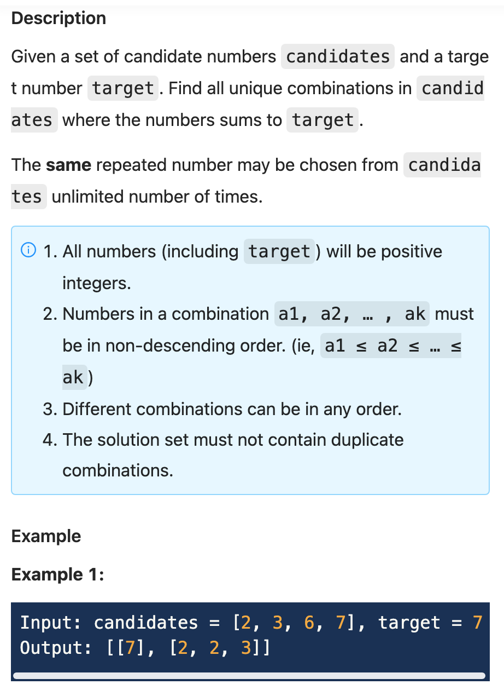
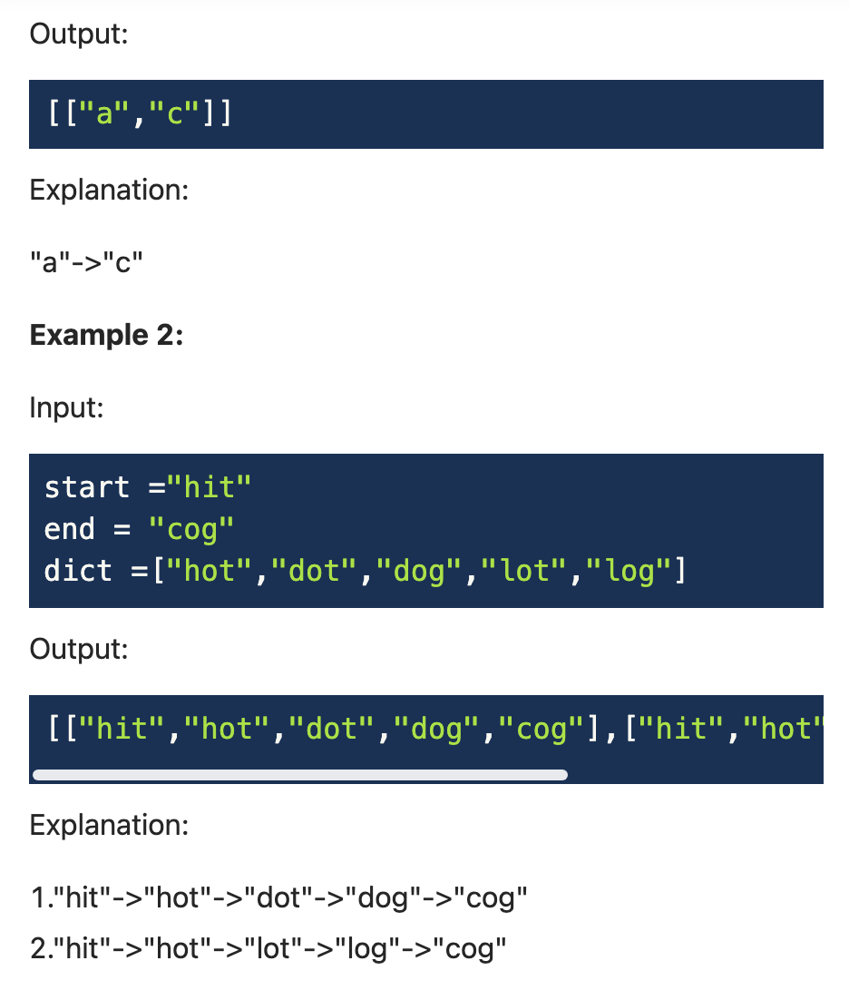
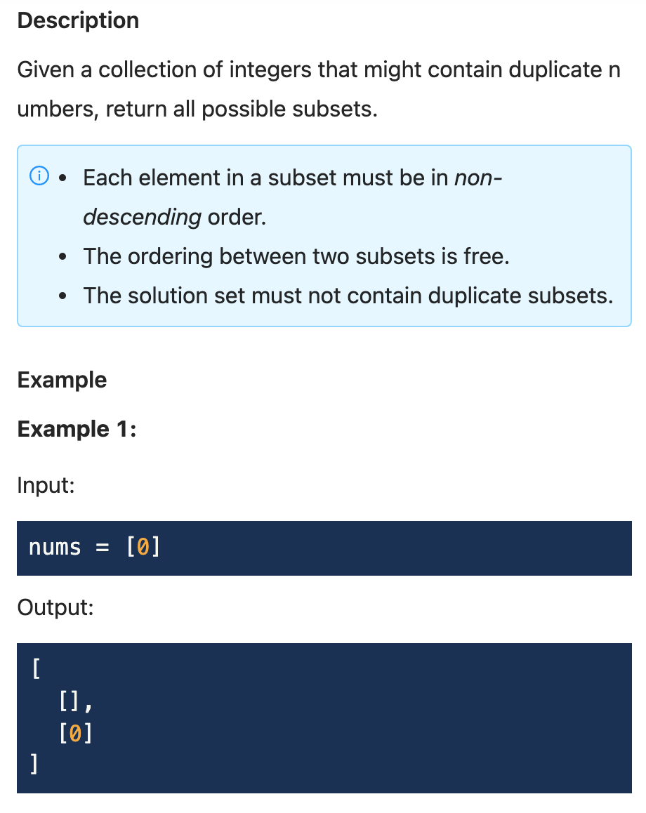
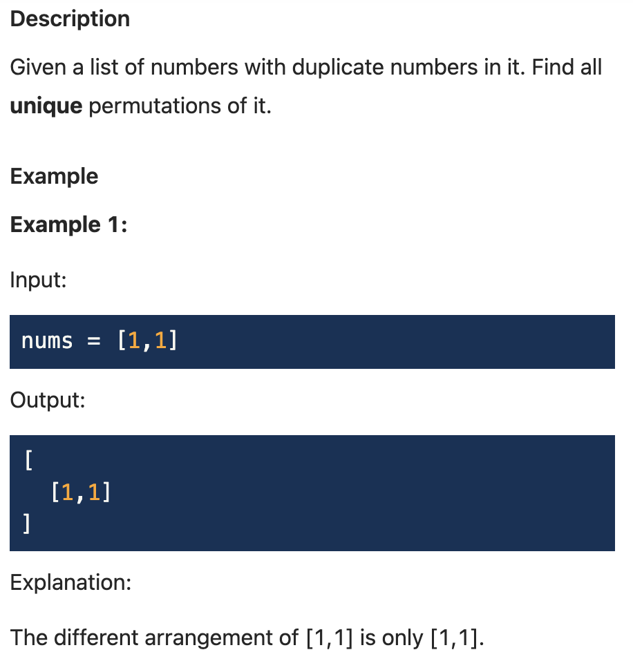

.. include:: ../_static/.special.rst

#######################
Depth First Search
#######################

Table of Contents
*****************

.. contents::

DFS Application Scenario
******************************************

.. danger::
    - Tree

      - Divide and Conquer
      - Traverse Tree
    - Get **all solutions**
    - Permutation
    - Combination

.. danger::

    - Step 1: Build search tree
    - Step 2: Confirm all the parameters used to indicate **last node** in search tree
    - Step 3: Confirm the rule to traverse from **last node** to **curren node**

Tree Traverse (树的遍历)
************************

Traverse Template
=================

Pre Order Traverse (前序遍历)
-----------------------------

.. caution::

    - Use stack array to replace system stack

    .. code-block:: python

        def preorder(self, root):
            if not root:
                return []
            
            stack = [root]
            preorder = []

            while stack:
                node = stack.pop()
                preorder.append(node.val)

                # Add right node first to keep left node pop out first
                if node.right:
                    stack.append(node.right)
                if node.left:
                    stack.append(node.left)
            
            return preorder

In Order Traverse (中序遍历)
----------------------------

.. caution::

    - Use stack array to replace system stack

    .. code-block:: python

        def preorder(self, root):

            stack = []
            inorder = []

            # Add all left child to stack first
            while root:
                stack.append(root)
                root = root.left

            while stack:
                node = stack[-1] # Peep only
                inorder.append(node.val)

                # No right children, prepare to pop out stack
                if not node.right:
                    node = stack.pop()
                    # Check if node is on right branch of some parent
                    # If so left node must already have been visited
                    # Pop out all nodes along the way
                    while stack and stack[-1].right == node:
                        node = stack.pop()
                # Have right children, is a parent, need to explore right branch
                else:
                    node = node.right
                    # Entering a new root, add all left nodes first
                    while node:
                        stack.append(node)
                        node = node.left
            return inorder

Tree Structure from Order
-------------------------

  - **Preorder + Inorder** can determine a tree
  - **Postorder + Inorder** can determine a tree
  - **Preorder + Postorder** can not determine a tree
  - **Single order** can not determine a tree

Symmetric Tree (对称树)
======================================

`LintCode 1360 Medium <https://www.lintcode.com/problem/1360/>`_

.. hint::

    - Consider it as recusive test on left branch and right branch being the same

.. note::
    Time: :math:`O(n)`, height :math:`O(\dfrac{n}{2})` times constant time each call
    Sapce: :math:`O(h)`, where :code:`h` is height of the tree. Best case :math:`O(\log n)`, worst case :math:`O(n)`

    .. code-block:: python

        """
        Definition of TreeNode:
        class TreeNode:
            def __init__(self, val):
                self.val = val
                self.left, self.right = None, None
        """

        class Solution:
            """
            @param root: root of the given tree
            @return: whether it is a mirror of itself 
            """
            def is_symmetric(self, root: TreeNode) -> bool:
                if not root:
                    return True
                return self.check_symmetric(root.left, root.right)
            
            def check_symmetric(self, left, right):
                if not left and not right:
                    return True
                if not left or not right:
                    return False
                if left.val != right.val:
                    return False
                
                return self.check_symmetric(left.right, right.left) and \
                    self.check_symmetric(left.left, right.right)

Equal Tree Partition (相等树划分)
======================================

`LintCode 864 Medium <https://www.lintcode.com/problem/864/>`_

.. hint::

    - A subtree must include **all sub branches** traced back to the root node
    - If we add root value to total sum, we might end up in a partition where one is full tree and another is null, which is not a legal partition
    - Comparing only the child branch sum without adding root value into it

.. note::

    .. code-block:: python

        """
        Definition of TreeNode:
        class TreeNode:
            def __init__(self, val):
                self.val = val
                self.left, self.right = None, None
        """

        class Solution:
            """
            @param root: a TreeNode
            @return: return a boolean
            """
            def check_equal_tree(self, root: TreeNode) -> bool:
                sum_set = set()
                total = root.val + self.dfs(root.left, sum_set) + \
                    self.dfs(root.right, sum_set)
                return total % 2 == 0 and (total / 2) in sum_set
            
            def dfs(self, root, sum_set):
                if not root:
                    return 0
                total = root.val + self.dfs(root.left, sum_set) + \
                    self.dfs(root.right, sum_set)
                
                sum_set.add(total)
                return total

Diameter of Binary Tree (二叉树的直径)
======================================

`LintCode 1181 Easy <https://www.lintcode.com/problem/1181/>`_

.. hint::
    Depth First Search

    - Note that :code:`dist_root != dist_left + dist_right`, as other child can have longer path
    - Only path chains can be combined, use :code:`distance` and :code:`chain`

.. note::
    Time: :math:`O(n)`

    .. code-block:: python

        """
        Definition of TreeNode:
        class TreeNode:
            def __init__(self, val):
                self.val = val
                self.left, self.right = None, None
        """

        class Solution:
            """
            @param root: a root of binary tree
            @return: return a integer
            """
            def diameter_of_binary_tree(self, root: TreeNode) -> int:
                max_dist, max_chain = self.dfs(root)
                return max_dist
            
            def dfs(self, root):
                if not root:
                    return (0, 0)
                
                left_dist, left_chain = self.dfs(root.left)
                right_dist, right_chain = self.dfs(root.right)

                max_dist = max(left_dist, right_dist, left_chain + right_chain)
                max_chain = max(left_chain, right_chain) + 1
                return (max_dist, max_chain)

Backtracking (回溯法)
*********************************

.. danger::

    - 找到满足某个条件的 **具体方案**
    - 找到所有满足某个条件的 **方案总数**

    - Recursive DFS can always be considered as Backtracking
    - Manual push and pop will save efficiency by not copying list or string into next function call level

Binary Tree Paths (二叉树的所有路径)
======================================

`LintCode 480 Easy <https://www.lintcode.com/problem/480/>`_

.. hint::
    - Backtracking with dfs in :code:`find_path` function.
    - Use manual stack on current to save time, if not use backtracking, current will be **copied** into next level function call

.. note::
    Time: :math:`O(n)`
    Space: :math:`O(n)`

    .. code-block:: python

        """
        Definition of TreeNode:
        class TreeNode:
            def __init__(self, val):
                self.val = val
                self.left, self.right = None, None
        """

        class Solution:
            """
            @param root: the root of the binary tree
            @return: all root-to-leaf paths
            """
            def binaryTreePaths(self, root):
                if not root:
                    return []
                summary = []
                current = [root]
                self.find_path(root, current, summary)
                return summary

            def find_path(self, node, current, summary):
                if not node:
                    return
                if not node.left and not node.right:
                    summary.append('->'.join([str(node.val) for node in current]))
                    return
                current.append(node.left)
                self.find_path(node.left, current, summary)
                current.pop()

                current.append(node.right)
                self.find_path(node.right, current, summary)
                current.pop()

K Sum II (K数和 II)
======================================

`LintCode 90 Medium <https://www.lintcode.com/problem/90/>`_

.. hint::
    DFS

    - With unique number

.. note::
    - Time: :math:`O(2^n \cdot n)`

    .. code-block:: python

        class Solution:
            """
            @param A: an integer array
            @param k: a postive integer <= length(A)
            @param target: an integer
            @return: A list of lists of integer
            """
            def kSumII(self, A, k, target):
                if not A:
                    return []
                A.sort()
                results = []
                self.dfs(A, 0, k, target, [], results)
                return results
            
            def dfs(self, A, idx, k, target, subset, results):
                if k == 0 and target == 0:
                    results.append(subset[:])
                    return
                
                if k == 0 or target <= 0:
                    return
                
                for i in range(idx, len(A)):
                    subset.append(A[i])
                    self.dfs(A, i + 1, k - 1, target - A[i], subset, results)
                    subset.pop()

Generate Parentheses (生成括号)
===============================

`LintCode 427 Medium <https://www.lintcode.com/problem/427/>`_

.. hint::

    - Find all solutions on a binary search tree as each node has 2 choices: add new open parenthesis or close it

.. note::

    .. code-block:: python

        class Solution:
            """
            @param n: n pairs
            @return: All combinations of well-formed parentheses
                    we will sort your return value in output
            """
            def generate_parenthesis(self, n: int) -> List[str]:
                results = []
                self.dfs(0, 0, '', n, results)
                return results

            def dfs(self, open_count, close_count, current, n, results):
                if open_count > n or close_count > n:
                    return
                if open_count < close_count:
                    return
                
                if open_count == n and close_count == n:
                    results.append(current)
                    return
                
                self.dfs(open_count + 1, close_count, current + '(', n, results)
                self.dfs(open_count, close_count + 1, current + ')', n, results)

Combination Sum (数字组合)
======================================

`LintCode 135 Medium <https://www.lintcode.com/problem/135/>`_

.. hint::
    DFS

    - Note that all numbers can be used unlimited time
    - Note that results must be sorted

.. note::
    - Time: :math:`O(2^n \cdot n)`

    .. code-block:: python

        class Solution:
            """
            @param candidates: A list of integers
            @param target: An integer
            @return: A list of lists of integers
            """
            def combinationSum(self, candidates, target):
                if not candidates:
                    return []

                results = []
                unique = sorted(list(set(candidates)))
                self.dfs(unique, 0, [], target, results)
                return results
            
            def dfs(self, nums, idx, comb, target, results):
                if target == 0:
                    return results.append(comb[:])
                
                for i in range(idx, len(nums)):
                    if target < nums[i]:
                        return
                    
                    comb.append(nums[i])
                    self.dfs(nums, i, comb, target - nums[i], results)
                    comb.pop()

String Permutation II (字符串排列II)
======================================

`LintCode 10 Medium <https://www.lintcode.com/problem/10/>`_

.. image:: ../_static/question/lint_10.png
   :scale: 30 %
   :alt: Warning!

.. hint::
    DFS

.. note::

    .. code-block:: python

        class Solution:
            """
            @param str: A string
            @return: all permutations
            """
            def stringPermutation2(self, str):
                if not str:
                    return [""]
                string = sorted(list(str))
                results = []
                visited = [False] * len(string)
                self.dfs(string, [], visited, results)
                return results
            
            def dfs(self, str, current, visited, results):
                if len(current) == len(str):
                    results.append(''.join(current[:]))
                
                for i in range(len(str)):
                    if visited[i]:
                        continue
                    if i > 0 and str[i] == str[i - 1] and not visited[i - 1]:
                        continue
                    current.append(str[i])
                    visited[i] = True
                    self.dfs(str, current, visited, results)
                    visited[i] = False
                    current.pop()

Word Search II (单词搜索II)
======================================

`LintCode 132 Hard <https://www.lintcode.com/problem/132/>`_

.. hint::
    DFS

.. note::

    .. code-block:: python

        class Solution:
            def __init__(self):
                self.direct = [
                    (1, 0),
                    (-1, 0),
                    (0, 1),
                    (0, -1),
                ]
            """
            @param board: A list of lists of character
            @param words: A list of string
            @return: A list of string
            """
            def wordSearchII(self, board, words):
                if not board:
                    return []
                if not board[0]:
                    return []
                visited = [[False] * len(board[0]) for i in range(len(board))]
                word_set = set()
                prefix_set = set()
                for word in words:
                    for i in range(len(word)):
                        prefix_set.add(word[:i + 1])
                    word_set.add(word)
                result_set = set()

                for i in range(len(board)):
                    for j in range(len(board[i])):
                        visited[i][j] = True
                        self.dfs(board, visited, i, j, board[i][j], word_set, prefix_set, result_set)
                        visited[i][j] = False
                return list(result_set)

            def dfs(self, board, visited, x, y, word, word_set, prefix_set, result_set):
                if word not in prefix_set:
                    return
                if word in word_set:
                    result_set.add(word)
                
                for dx, dy in self.direct:
                    new_x = x + dx
                    new_y = y + dy
                    if not self.is_valid(board, new_x, new_y) or visited[new_x][new_y]:
                        continue
                    visited[new_x][new_y] = True
                    self.dfs(board, visited, new_x, new_y, word + board[new_x][new_y], word_set, prefix_set, result_set)
                    visited[new_x][new_y] = False

            def is_valid(self, board, x, y):
                return 0 <= x < len(board) and 0 <= y < len(board[0])

.. _lint-1848-dfs:

:problem:`Word Search III (单词搜索 III)`
-------------------------------------------------------------------------------------------

`LintCode 1848 Hard <https://www.jiuzhang.com/problem/word-search-iii/>`_

.. code-block:: bash

    Example 1:
    Input:
    ["doaf","agai","dcan"], ["dog","dad","dgdg","can","again"]
    Output:
    2
    Explanation:
    d o a f
    a g a i
    d c a n
    search in Matrix, you can find `dog` and `can` in the meantime.

    Example 2:
    Input:
    ["a"], ["b"]
    Output: 
    0
    Explanation: 
    a
    search in Matrix, return 0.

:solution:`1848 Trie + Breadth First Search`
^^^^^^^^^^^^^^^^^^^^^^^^^^^^^^^^^^^^^^^^^^^^

.. hint::

    - Trie用于优化单词搜索
    - **重复性剪枝** : 找到完整单词, 从单词起始点 :code:`(start_x, start_y)` 的下一个点开始搜索

      - 此时判断, 若当前点与起始点在同一行, 列数从 **起始点列右边** 开始
      - 若当前点与起始点不在同一行, 列数从 **0** 开始
    - 未找到完整单词: 在4个方向上进行搜索
    - 注意回溯

.. note::

    .. code-block:: python

        class TrieNode:
            def __init__(self):
                self.children = {}
                self.is_word = False

        class Trie:
            def __init__(self):
                self.root = TrieNode()

            def insert(self, word):
                node = self.root
                for char in word:
                    if char not in node.children:
                        node.children[char] = TrieNode()
                    node = node.children[char]
                node.is_word = True
                return word
            
            def get_root(self):
                return self.root

        class Solution:
            """
            @param board: A list of lists of character
            @param words: A list of string
            @return: return the maximum nunber
            """
            def word_search_i_i_i(self, board: List[List[str]], words: List[str]) -> int:
                result, word_count = [0], 0
                rows, cols = len(board), len(board[0])
                visited = [[False] * cols for _ in range(rows)]

                trie = Trie()
                for word in words:
                    trie.insert(word)

                for row in range(rows):
                    for col in range(cols):
                        self.dfs(row, col, board, trie.get_root(), trie, visited, \
                            word_count, result, row, col)
                return result[0]
            
            def is_valid(self, row, col, visited):
                return 0 <= row < len(visited) and \
                    0 <= col < len(visited[0]) and \
                    visited[row][col] == False
            
            def dfs(self, r, c, board, last_node, trie, visited, word_count, result, \
                start_row, start_col):
                # node中没有代表该字符的点, 直接返回
                if board[r][c] not in last_node.children:
                    return
                
                rows, cols = len(board), len(board[0])
                # 标记该点为访问过
                visited[r][c] = True
                current = last_node.children[board[r][c]]

                if current.is_word:
                    # 找到一个单词
                    word_count += 1
                    result[0] = max(result[0], word_count)
                    # 暂时将其定义为非完整单词, 防止找到重复的词汇
                    # 例如在矩阵["ab", "ab"]中寻找单词, 此时值为1, 不会找到2个一样的ab
                    current.is_word = False
                    for i in range(start_row, rows):
                        new_start_y = 0
                        if i == start_row:
                            new_start_y = c
                        for j in range(new_start_y, cols):
                            if visited[i][j] == True:
                                continue
                            # 因为是全新的单词, 所以要从Trie的根开始搜索
                            self.dfs(i, j, board, trie.get_root(), trie, visited, \
                                word_count, result, i, j)
                    word_count -= 1
                    current.is_word = True
                
                # 扩展当前单词, 继续向矩阵的4个方向搜索
                # 此时就算is_word == True, 也不能算作找到单词, word_count不增加
                for direct in [[1, 0], [-1, 0], [0, 1], [0, -1]]:
                    new_x, new_y = r + direct[0], c + direct[1]
                    if not self.is_valid(new_x, new_y, visited):
                        continue
                    self.dfs(new_x, new_y, board, current, trie, visited, \
                        word_count, result, start_row, start_col)
                visited[r][c] = False

.. _lint-634-dfs:

:problem:`Word Squares (单词矩阵)`
-------------------------------------------------------------------------------------------

`LintCode 634 Hard <https://www.jiuzhang.com/problem/word-squares/>`_

.. code-block:: bash

    Input:
    ["area","lead","wall","lady","ball"]
    Output:
    [["wall","area","lead","lady"],["ball","area","lead","lady"]]

    Explanation:
    The output consists of two word squares. The order of output does not matter (just the order of words in each word square matters).

.. code-block:: bash

    Input:
    ["abat","baba","atan","atal"]
    Output:
    [["baba","abat","baba","atan"],["baba","abat","baba","atal"]]

:solution:`634 Depth First Search`
^^^^^^^^^^^^^^^^^^^^^^^^^^^^^^^^^^

.. hint::
    DFS
    
    - Note that with previous row confirmed, the next row :code:`i` must begin with prvious rows letters at column :code:`i`
    - Thus we search only for words begining with prefix letters in column :code:`i`, length of prefix will be :code:`i + 1`, which is confirmed rows
    - Meanwhile all following rows until :code:`target_count` prefix has already been settled by columns :code:`i + 1`, :code:`i + 2`, ..., :code:`target_count - 1`
    - Check all prefx in prefix tree to further cut down branchs

.. note::

    .. code-block:: python

        class Solution:
            """
            @param words: a set of words without duplicates
            @return: all word squares
                    we will sort your return value in output
            """
            def word_squares(self, words: List[str]) -> List[List[str]]:
                prefix_tree = self.build_prefix_tree(words)
                results = []
                for word in words:
                    self.search(prefix_tree, [word], results)
                return results
            
            def build_prefix_tree(self, words):
                prefix_tree = {}
                for word in words:
                    for i in range(len(word)):
                        prefix = word[:i]
                        prefix_tree.setdefault(prefix, [])
                        prefix_tree[prefix].append(word)
                return prefix_tree
            
            def search(self, prefix_tree, square, results):
                target_count = len(square[0])
                current_row = len(square)
                # Already rectangle
                if current_row == target_count:
                    results.append(list(square))
                    return
                for row in range(current_row, target_count):
                    prefix = ''.join([square[i][row] \
                                        for i in range(current_row)])
                    if prefix not in prefix_tree:
                        return
                prefix = ''.join([square[i][current_row] \
                                for i in range(current_row)])
                for word in prefix_tree.get(prefix, []):
                    square.append(word)
                    self.search(prefix_tree, square, results)
                    square.pop()

:solution:`634 Trie + Depth First Search`
^^^^^^^^^^^^^^^^^^^^^^^^^^^^^^^^^^^^^^^^^

.. hint::
    - 使用Trie添加 :code:`get_word_set` 来记录公共前缀

.. note::

    .. code-block:: python

        class TrieNode:
            def __init__(self):
                self.children = {}
                self.is_word = False
                self.word = None
                self.word_set = []

        class Trie:
            def __init__(self):
                self.root = TrieNode()

            def get_root(self):
                return self.root
            
            def insert(self, word):
                node = self.root
                for i, c in enumerate(word):
                    if c not in node.children:
                        node.children[c] = TrieNode()

                    node = node.children[c]
                    node.word_set.append(word)
                node.is_word = True
                node.word = word
            
            def find(self, word):
                node = self.root

                for i, c in enumerate(word):
                    node = node.children.get(c, None)
                    if node is None:
                        return None
                return node

            def get_word_set(self, prefix):
                node = self.find(prefix)
                return [] if node is None else node.word_set

        class Solution:
            """
            @param words: a set of words without duplicates
            @return: all word squares
                    we will sort your return value in output
            """
            def word_squares(self, words: List[str]) -> List[List[str]]:
                trie = Trie()
                for word in words:
                    trie.insert(word)
                
                results, square = [], []
                for word in words:
                    square.append(word)
                    self.dfs(square, len(word), results, trie)
                    # backtrack
                    square.pop(-1)
                
                return results
            
            def dfs(self, square, n, results, trie):
                current_length = len(square)
                if current_length == n:
                    results.append(list(square))
                    return
                prefix = ''.join(square[i][current_length] for i in range(current_length))
                for row in trie.get_word_set(prefix):
                    square.append(row)
                    self.dfs(square, n, results, trie)
                    square.pop(-1)
                

Word Ladder II (单词接龙II)
======================================

`LintCode 121 Hard <https://www.lintcode.com/problem/121/>`_

.. hint::
    DFS + BFS

    - Use a distance set to track shortest distance, remove all other routes

Combination (组合)
******************************************

Subsets (子集)
======================================

`LintCode 17 Medium <https://www.lintcode.com/problem/17/>`_

.. hint::
    - Problem turns into choose or not choose a number at :code:`idx`, which is :math:`O(2^n)` results
    - Non recursive involves :math:`n` layer for loops

.. note::
    Time: :math:`O(2^n) \cdot O(n)`

    .. code-block:: python

        class Solution:
            """
            @param nums: A set of numbers
            @return: A list of lists
            """
            def subsets(self, nums):
                if not nums:
                    return [[]]
                
                nums.sort()
                results, subset = [], []
                self.dfs(nums, 0, subset, results)
                return results
            
            def dfs(self, nums, idx, subset, results):
                if idx == len(nums):
                    results.append(subset[:])
                    return
                subset.append(nums[idx])
                self.dfs(nums, idx + 1, subset, results)

                subset.pop(-1)
                self.dfs(nums, idx + 1, subset, results)

.. hint::
    - Problem turns into which number to choose for next combination, which is :math:`O(2^n)` results
    - :code:`for i` loop picks the front element of new subset starting from :code:`nums[idx]`
    - Use dfs on :code:`i + 1` to keep adding

.. note::
    Time: :math:`O(2^n) \cdot O(n)`

    .. code-block:: python

        class Solution:
            """
            @param nums: A set of numbers
            @return: A list of lists
            """
            def subsets(self, nums):
                if not nums:
                    return [[]]
                
                nums.sort()
                results, subset = [], []
                self.dfs(nums, 0, subset, results)
                return results
            
            def dfs(self, nums, idx, subset, results):
                results.append(subset[:])
                for i in range(idx, len(nums)):
                    subset.append(nums[i])
                    self.dfs(nums, i + 1, subset, results)
                    subset.pop(-1)

Subsets II (带重复元素的子集)
======================================

`LintCode 18 Medium <https://www.lintcode.com/problem/18/>`_

.. hint::
    DFS

    - Remove duplicate
        - Skip :code:`nums[i] == nums[i - 1]`
        - When :code:`i == idx`, first time encounter the repeating numbers, no skip and add to subset
        - When :code:`i > idx`, already checked repeating number, skip to remove duplicate

.. note::
    Time: :math:`O(2^n) \cdot O(n)`

    .. code-block:: python

        class Solution:
            """
            @param nums: A set of numbers
            @return: A list of lists
            """
            def subsets(self, nums):
                if not nums:
                    return [[]]
                
                nums.sort()
                results, subset = [], []
                self.dfs(nums, 0, subset, results)
                return results
            
            def dfs(self, nums, idx, subset, results):
                results.append(subset[:])
                for i in range(idx, len(nums)):
                    if i > 0 and nums[i] == nums[i - 1] and i > idx:
                        continue
                    subset.append(nums[i])
                    self.dfs(nums, i + 1, subset, results)
                    subset.pop(-1)

Permutation (排列)
******************************************

.. danger::
    Permutation Search Tree

    - DFS and BFS are just searching in different order on the same **permutation search tree**
    - Only last layer tree nodes are the desired results
    - DFS time complexity
        - :code:`O(number of results) \cdot O(time to copy one result into result list)`

Permutations (排列)
======================================

`LintCode 15 Medium <https://www.lintcode.com/problem/15/>`_

.. hint::
    - Backtracking with dfs in :code:`find_path` function.
    - Use manual stack on current to save time, if not use backtracking, current will be **copied** into next level function call
    - Lists with only append and remove operations are passed by reference, no need for variable
    - :code:`perm` itself are copied for every result

.. note::
    - Time: :math:`O(n! \cdot n)`, there are :math:`O(n!)` results, each results need :math:`O(n)` time to copy

    .. code-block:: python

        from typing import (
            List,
        )

        class Solution:
            """
            @param nums: A list of integers.
            @return: A list of permutations.
            """
            def permute(self, nums: List[int]) -> List[List[int]]:
                if not nums:
                    return [[]]
                permutations = []
                self.dfs(nums, [], set(), permutations)
                return permutations
            
            def dfs(self, nums, perm, visited, permutations):
                if len(perm) == len(nums):
                    permutations.append(perm[:])
                    return
                
                for num in nums:
                    if num in visited:
                        continue
                    
                    perm.append(num)
                    visited.add(num)
                    self.dfs(nums, perm, visited, permutations)
                    visited.remove(num)
                    perm.pop()

Permutations II (排列 II)
======================================

`LintCode 16 Medium <https://www.lintcode.com/problem/16/>`_

.. hint::
    DFS

    - Must sort first to gather same number together
    - Need to track appear order, so :code:`visited` must have order and cannot be a set

.. note::
    - Time: Worst :math:`O(n!)`, Best :math:`O(S \cdot n)` with :math:`S` as nums length

    .. code-block:: python

        from typing import (
            List,
        )

        class Solution:
            """
            @param nums: A list of integers
            @return: A list of unique permutations
            """
            def permuteUnique(self, nums: List[int]) -> List[List[int]]:
                if not nums:
                    return [[]]
                nums.sort()
                permutations = []
                visited = [False] * len(nums)
                self.dfs(nums, [], visited, permutations)
                return permutations
            
            def dfs(self, nums, perm, visited, permutations):
                if len(perm) == len(nums):
                    permutations.append(perm[:])
                    return
                
                for i in range(len(nums)):
                    if visited[i]:
                        continue
                    # Force the first i to be the fist to evaluate
                    if i > 0 and nums[i] == nums[i - 1] and not visited[i - 1]:
                        continue
                    perm.append(nums[i])
                    visited[i] = True
                    self.dfs(nums, perm, visited, permutations)
                    visited[i] = False
                    perm.pop()

Traveling Salesman Problem (旅行商问题)
==========================================

`LintCode 816 Hard <https://www.lintcode.com/problem/816/>`_

.. hint::
    Brutal Force DFS 

    - Consider problem as a permutation of cities, removing all situations where cities are not connected

.. note::
    - Time: :math:`O(n!)`

    .. code-block:: python

        class Solution:
            """
            @param n: an integer,denote the number of cities
            @param roads: a list of three-tuples,denote the road between cities
            @return: return the minimum cost to travel all cities
            """
            def minCost(self, n, roads):
                graph = self.build_graph(roads, n)
                result = {"min_cost": float('inf')}
                self.dfs(1, n, set([1]), 0, graph, result)
                return result["min_cost"]
            
            def dfs(self, city, n, visited, cost, graph, result):
                if len(visited) == n:
                    result["min_cost"] = min(result["min_cost"], cost)
                for next_city in graph[city]:
                    if next_city in visited:
                        continue
                    visited.add(next_city)
                    self.dfs(next_city, n, visited, cost + graph[city][next_city], graph, result)
                    visited.remove(next_city)

            def build_graph(self, roads, n):
                graph = {
                    i: {j: float('inf') for j in range(1, n + 1)} for i in range(1, n + 1)
                }
                for a, b, c in roads:
                    graph[a][b] = min(graph[a][b], c)
                    graph[b][a] = min(graph[b][a], c)
                return graph

.. hint::
    Brutal Force DFS + Best Solution Prunning

    - For a new city :code:`next_city` to add
    - For each city :code:`city` in the path
    - Compare current path with a path if :code:`city` and last city :code:`path[-1]` are swapped
    - Original Distance
        - :code:`i - 1` to :code:`i`, :code:`-1` to :code:`next_city`
    - Swapped path Distance
        - :code:`i - 1` to :code:`-1`, :code:`i` to :code:`next_city`
    - Because all other nodes are evaluated before when building previous path
    - Only last city and :code:`next_city` connection hasn't been evaluated

.. note::
    - Time: :math:`O(n!)`

    .. code-block:: python

        class Solution:
            """
            @param n: an integer,denote the number of cities
            @param roads: a list of three-tuples,denote the road between cities
            @return: return the minimum cost to travel all cities
            """
            def minCost(self, n, roads):
                graph = self.build_graph(roads, n)
                result = {"min_cost": float('inf')}
                self.dfs(1, n, [1], set([1]), 0, graph, result)
                return result["min_cost"]
            
            def dfs(self, city, n, path, visited, cost, graph, result):
                if len(visited) == n:
                    result["min_cost"] = min(result["min_cost"], cost)
                for next_city in graph[city]:
                    if next_city in visited:
                        continue
                    if self.has_better_path(graph, path, next_city):
                        continue
                    visited.add(next_city)
                    path.append(next_city)
                    self.dfs(
                        next_city, 
                        n, 
                        path, 
                        visited, 
                        cost + graph[city][next_city], 
                        graph, 
                        result
                    )
                    visited.remove(next_city)
                    path.pop()

            def build_graph(self, roads, n):
                graph = {
                    i: {j: float('inf') for j in range(1, n + 1)} for i in range(1, n + 1)
                }
                for a, b, c in roads:
                    graph[a][b] = min(graph[a][b], c)
                    graph[b][a] = min(graph[b][a], c)
                return graph

            def has_better_path(self, graph, path, city):
                for i in range(1, len(path)):
                    if graph[path[i - 1]][path[i]] + graph[path[-1]][city] > \
                        graph[path[i - 1]][path[-1]] + graph[path[i]][city]:
                        return True
                return False

.. hint::
    Bit Mask Dynamic Programming (状态压缩动态规划)

    - For a path of city :math:`1, 2, \cdots, n`
    - :math:`1 \cdots n - 1` city are irrelavent
    - Only :code:`n` matters with next connected city
    - Don't tracking permutation of :math:`1 \cdots n - 1`, complexity :math:`O(n!)`
    - Track combination of it, whether path includes the cities, complexity :math:`O(2^n)`

    Implementation

    - A full path has :math:`n` 1s, which is :math:`2^n - 1`, to check every city for loop is :code:`range(1 << n)`
    - Consider "path includes some city" as a **state**
    - :code:`f[state][i]` consider replacing city :code:`i` from path :code:`state`
    - Removing city :code:`i` is :math:`state - 2^(i - 1)` removing the **1** at position :code:`i - 1` at state
    - We know that at inside :code:`state` position :code:`i - 1` the digit is 1, use xor is faster than subtract
    - :math:`state - 2^(i - 1)` is :code:`state ^ (1 << (i - 1))`, which is the **previous state** for path before **city i is added**
    - Use :code:`state & (1 << (i - 1))` to check at position :code:`i - 1` is the digit 1 or not, if it's 0 result is 0, otherwise non-zero
    - If city :code:`i` is not yet in path, continue
    - With :code:`prev_state`, select a replacement city (for :code:`i`) :code:`j`
    - If previous city :code:`j` is not yet in path, continue
    - Compare the cost of current path (last city being :code:`i - 1`) with the cost of path (last city being :code:`j`) connecting to :code:`i`
    - The better path is :math:`\min(f[state - 2^(i - 1)][j] + graph[j][i])`
    - Total :math:`O(2^n)` state, each state double for loop check :code:`i, j` in :math:`O(n^2)`

.. note::
    - Time: :math:`O(2^n \cdot n^2)`

    .. code-block:: python

        class Solution:
            """
            @param n: an integer,denote the number of cities
            @param roads: a list of three-tuples,denote the road between cities
            @return: return the minimum cost to travel all cities
            """
            def minCost(self, n, roads):
                graph = self.build_graph(roads, n)
                # Path length is n, check n digit in binary is 2^n state
                state_size = 1 << n
                f = [
                    [float('inf')] * (n + 1) for _ in range(state_size)
                ]
                f[1][1] = 0
                for state in range(state_size):
                    # Head of path is confirmed at city 1, check others
                    for i in range(2, n + 1):
                        # Check whether city i is in the path, not in then continue
                        if state & (1 << (i - 1)) == 0:
                            continue
                        # Removing city i indicator from path
                        # Remove the digit 1 at position i - 1
                        prev_state = state ^ (1 << (i - 1))
                        # Check for a replacement city
                        for j in range(1, n + 1):
                            # Check whether city j is in the path, not in then continue
                            if prev_state & (1 << (j - 1)) == 0:
                                continue
                            # Find the minimum cost j to be the last city that connect with i
                            f[state][i] = min(f[state][i], f[prev_state][j] + graph[j][i])
                return min(f[state_size - 1])
            
            def build_graph(self, roads, n):
                graph = {
                    i: {j: float('inf') for j in range(1, n + 1)} for i in range(1, n + 1)
                }
                for a, b, c in roads:
                    graph[a][b] = min(graph[a][b], c)
                    graph[b][a] = min(graph[b][a], c)
                return graph
