.. include:: ../_static/.special.rst

#####################
Dynamic Programming
#####################

.. contents:: Table of Contents
   :depth: 2

Summmary
********

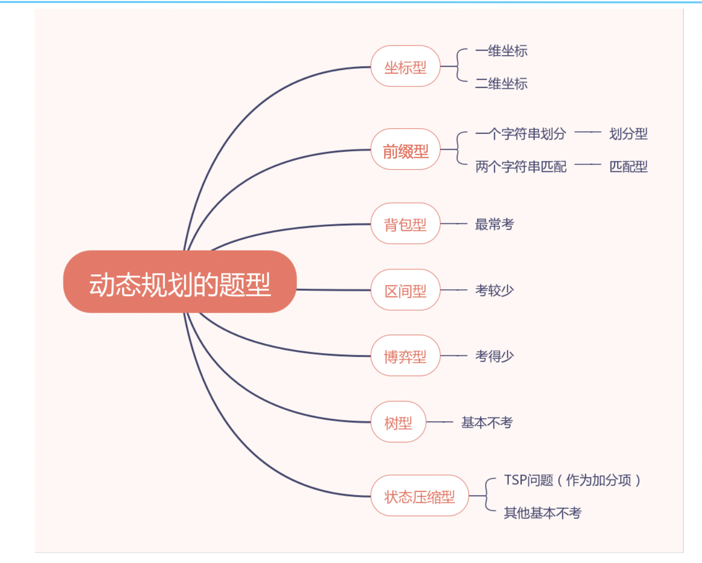

Definition
==========

.. hint::

    - The function must solve sub problems with same nature but smaller scale: **Divide and Conquer**
    - Dynamic Programming sub problems **overlaps with each other**, while Divide and Conquer sub problems don't
    - For calculated mid values from a function, record it to prevent redundant calculation
    - Next function call for the same parameters, return the value directly
    - The saved value is similar to the **cache** in system design

.. note::
    - 是否存在一种状态表示方法, 使得状态之间的依赖关系可以被拓扑排序
    - 推论: 动态规划处理的状态要有方向性, 不能有 **循环依赖**

Use
=====

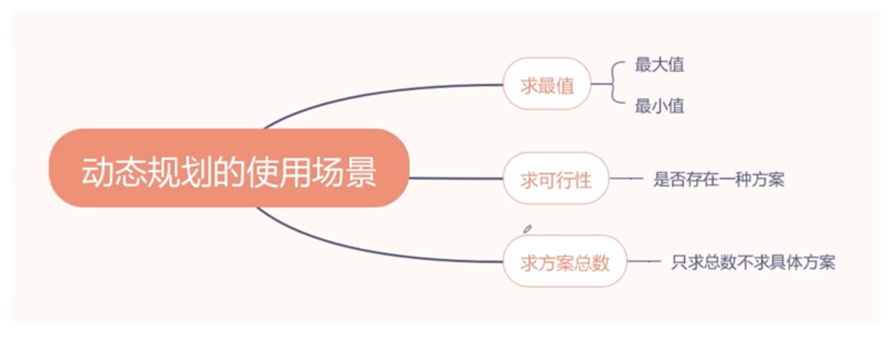

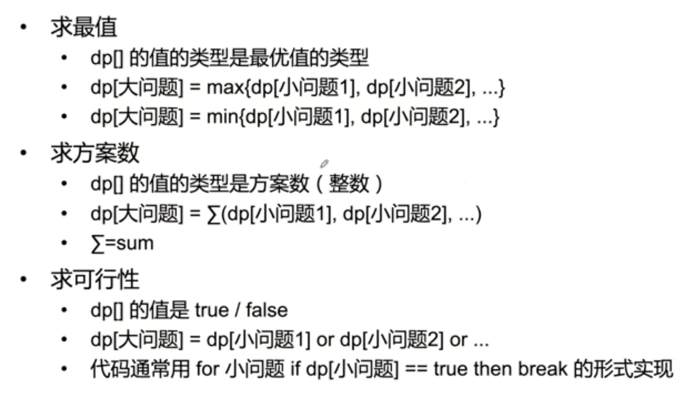

Not Use
=======

.. hint::

    - Find All **Specific** Solution (找所有具体方案)
    - Unsorted Data (输入数据无序)
    - Brutal Force is Polynomial Time Complexity (暴力算法已经是多项式复杂度)

Determine State
===============

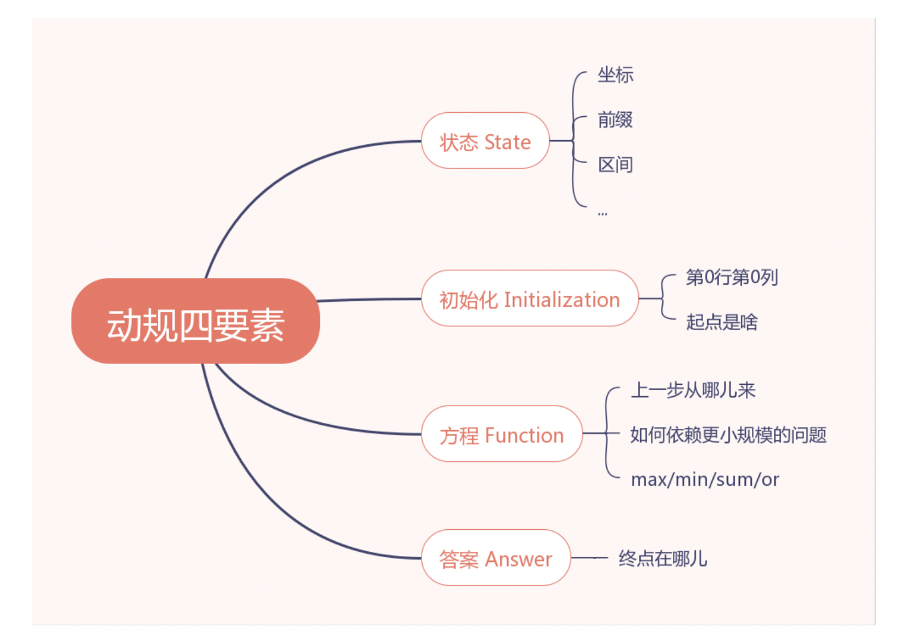

.. hint::

    - Put all variables that can affect the final result as a dimension of the :code:`dp` array
    - 选代表: when dealing with overlapping state, choose **one delegate** of repeated state

Time Complexity
===============

.. hint::
   
   - Total number of states * Time to process each state
   - Total number of states is usually the **space complexity** of :code:`dp` array

Rolling Array Optimization
==========================

.. hint::
    - Notice :code:`dp[i]` is only dependent on :code:`dp[i - 1]`
    - No need to keep :code:`dp[0], ..., dp[i - 2]`
    - Usually roll on **first dimension**
    - **Number of Dependent Rows** : :code:`i, i - 1` is 2
    - Roll on **row** : :code:`row_index % number of dependent rows`
    - Roll on **column** : :code:`column_index % number of dependent columns`

记录最优路径
============

.. hint::

    - 使用同样维度的 :code:`prev` 数组
    - 记录走到 :code:`(i, j)` 的决策
    - 从终点倒推路径

Memoization (记忆化搜索)
========================

.. hint::

    - Memoization is a **implmentation method** of **Dynamic Programming** using **Searching**

.. danger::

    - If **Time Complexity** and **Recurssion Depth** are both :math:`O(n)`, cause **stack overflow**
    - Not great solution for DP problems with time complexity of :math:`O(n)`

Coordinates (坐标型动态规划)
****************************

.. contents:: Table of Contents
   :depth: 2
   :local:
   :backlinks: none

Use Case
========

.. warning::

    - 1D, 2D axis traverse
    - Counting **subsequence** : 子序列总数

      - 把子序列想象为 **一维路径**
      - :code:`dp[i]` 应该表示以第 :code:`i` 位字符 :code:`s[i]` 结尾的子序列
      - :code:`dp[i]` 表示 **前** :code:`i` 个字符组成的子序列是前缀型思想, 此处 **不适用**

Problem
=======

:problem:`Number of Ways to Stay in the Same Place After Some Steps II (停在原地的方案数2)`
-------------------------------------------------------------------------------------------

`LintCode 1827 Medium <https://www.jiuzhang.com/problem/number-of-ways-to-stay-in-the-same-place-after-some-steps-ii/>`_

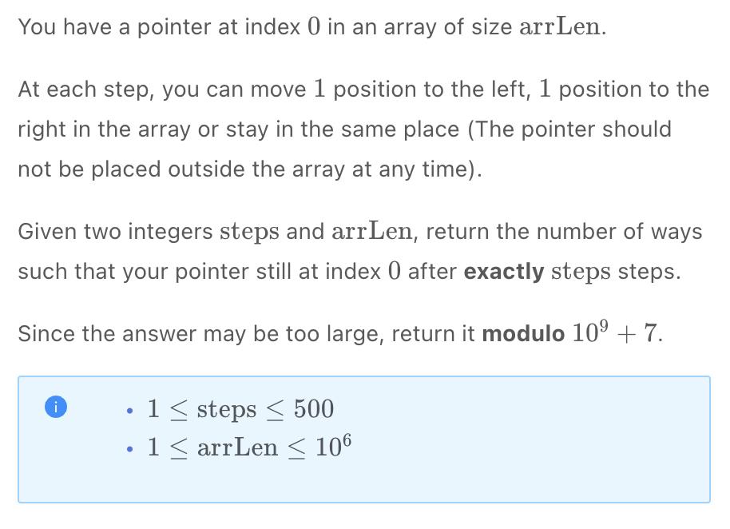

.. code-block:: bash

    Input: 
    3
    2
    Output: 
    4
    Explanation: 
    There are 4 differents ways to stay at index 0 after 3 steps.
    Right, Left, Stay
    Stay, Right, Left
    Right, Stay, Left
    Stay, Stay, Stay

    Input: 
    2
    4
    Output: 
    2
    Explanation: 
    There are 2 differents ways to stay at index 0 after 2 steps
    Right, Left
    Stay, Stay

    Input: 
    4
    2
    Output: 
    8

:solution:`1827 Dynammic Programming`
^^^^^^^^^^^^^^^^^^^^^^^^^^^^^^^^^^^^^

.. hint::
    - Count solution numbers + coordinates: use dynamic programming
    - Input: number of steps, length of array
    - State: :code:`dp[i][j]` is the **solutions number** to reach point :code:`j` after taking :code:`i` steps
    - Function: :code:`dp[i][j] = dp[i - 1][j - 1] + dp[i - 1][j] + dp[i - 1][j + 1]`
    - To prevent memory exceed: Notice right bound determines the farthest distance pointer can go right before getting back to 0 within :code:`steps`

.. note::

    .. code-block:: python

        class Solution:
            """
            @param steps: steps you can move
            @param arr_len: the length of the array
            @return: Number of Ways to Stay in the Same Place After Some Steps
            """
            def num_ways(self, steps: int, arr_len: int) -> int:
                if not steps:
                    return 1
                
                MOD = 10**9 + 7

                # If too many steps to the right, won't be able to get back
                right_bound = min(steps // 2 + 1, arr_len)
                # Possible steps is 0 - steps, so length is steps + 1
                dp = [[0] * right_bound for _ in range(steps + 1)]
                dp[0][0] = 1

                for step in range(1, steps + 1):
                    # handle corner case of 0 and right_bound
                    dp[step][0] = (dp[step - 1][0] + dp[step - 1][1]) % MOD
                    dp[step][right_bound - 1] = (dp[step - 1][right_bound - 1] + \
                                            dp[step - 1][right_bound - 2]) % MOD
                    
                    for i in range(1, right_bound - 1):
                        dp[step][i] = dp[step - 1][i - 1] + dp[step - 1][i] + dp[step - 1][i + 1]
                        dp[step][i] = dp[step][i] % MOD
                
                return dp[steps][0]

:solution:`1827 Rolling Array`
^^^^^^^^^^^^^^^^^^^^^^^^^^^^^^

.. hint::
    - Notice :code:`dp[i]` is only dependent on :code:`dp[i - 1]`
    - No need to keep :code:`dp[0], ..., dp[i - 2]`
    - :code:`this_step = step % 2`
    - :code:`last_step = (step - 1) % 2`

.. note::

    .. code-block:: python

        class Solution:
            """
            @param steps: steps you can move
            @param arr_len: the length of the array
            @return: Number of Ways to Stay in the Same Place After Some Steps
            """
            def num_ways(self, steps: int, arr_len: int) -> int:
                if not steps:
                    return 1
                
                MOD = 10**9 + 7

                # If too many steps to the right, won't be able to get back
                right_bound = min(steps // 2 + 1, arr_len)
                # Possible steps is 0 - steps, so length is steps + 1
                # dp = [[0] * right_bound for _ in range(steps + 1)]
                dp = [[0] * right_bound for _ in range(2)]
                dp[0][0] = 1

                for step in range(1, steps + 1):
                    # handle corner case of 0 and right_bound
                    this_step = step % 2
                    last_step = (step - 1) % 2
                    dp[this_step][0] = (dp[last_step][0] + dp[last_step][1]) % MOD
                    dp[this_step][right_bound - 1] = (dp[last_step][right_bound - 1] + \
                                            dp[last_step][right_bound - 2]) % MOD
                    
                    for i in range(1, right_bound - 1):
                        dp[this_step][i] = (dp[last_step][i - 1] + \
                                            dp[last_step][i] + \
                                            dp[last_step][i + 1]) % MOD
                
                return dp[steps % 2][0]

:problem:`Distinct Subsequences II (不同的子序列 II)`
-----------------------------------------------------

`LintCode 1702 Hard <https://www.jiuzhang.com/problem/distinct-subsequences-ii/>`_

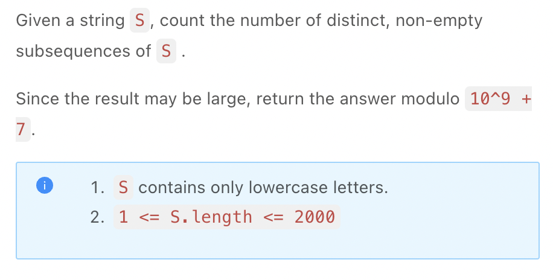

.. code-block:: bash

    输入: "abc"
    输出: 7
    解释: 7 个不同的子序列分别是 "a", "b", "c", "ab", "ac", "bc", 以及 "abc"。

.. code-block:: bash

    输入: "aba"
    输出: 6
    解释: 6 个不同的子序列分别是 "a", "b", "ab", "ba", "aa" 以及 "aba"。

.. code-block:: bash

    输入: "aaa"
    输出: 3
    解释: 3 个不同的子序列分别是 "a", "aa" 以及 "aaa"。

:solution:`1702 Dynamic Programming`
^^^^^^^^^^^^^^^^^^^^^^^^^^^^^^^^^^^^

.. hint::

    - Permute the characters will have overlap substring
    - State:

      - :code:`dp[i]` is the number of substrings consists of the first :code:`i` chars

        - :code:`dp[i + 1] != dp[i] + dp[i - 1] ... + dp[0]` because :code:`dp[i]` contains parts of :code:`dp[i - 1]`, still **overlaps**

      - :code:`dp[i]` is the number of substrings that **ends with** char at index :code:`i`

        - No overlap and :code:`dp[i + 1] == dp[i] + dp[i - 1] ... + dp[0]`
    - Function:

      - :code:`b c a d c`, because :code:`b c` is already counted, :code:`c` at index :code:`4` can not pair with :code:`b` again
      - Subsequence before **previous repeating char** should not be counted again
      - :code:`dp[i] = sum(dp[j])`
    - Initialization:

      - Init :code:`dp[i] = 1`, and all previously appeard chars :code:`dp[j] = 0`
    - Answer:

      - :code:`sum(dp)` as we will have subsequence ending with all possible chars

.. note::

    .. code-block:: python

        class Solution:
            """
            @param s: The string s
            @return: The number of distinct, non-empty subsequences of S.
            """
            def distinct_subseq_i_i(self, s: str) -> int:
                MOD = 10**9 + 7
                length = len(s)

                dp = [0] * length

                visited = set()
                for i in range(length):
                    if s[i] not in visited:
                        dp[i] = 1
                        visited.add(s[i])
                
                for i in range(length):
                    # same char position j
                    # Sum is from j + 1 to i - 1
                    # j, j + 1, ..., i - 1, i
                    for j in range(i - 1, -1, -1):
                        # Add first because same character can combine together
                        dp[i] = (dp[i] + dp[j]) % MOD
                        if s[i] == s[j]:
                            break
                return sum(dp) % MOD

:problem:`Rat Jump (老鼠跳跃)`
----------------------------------------------------------

`LintCode 1861 Hard <https://www.jiuzhang.com/problem/rat-jump/>`_

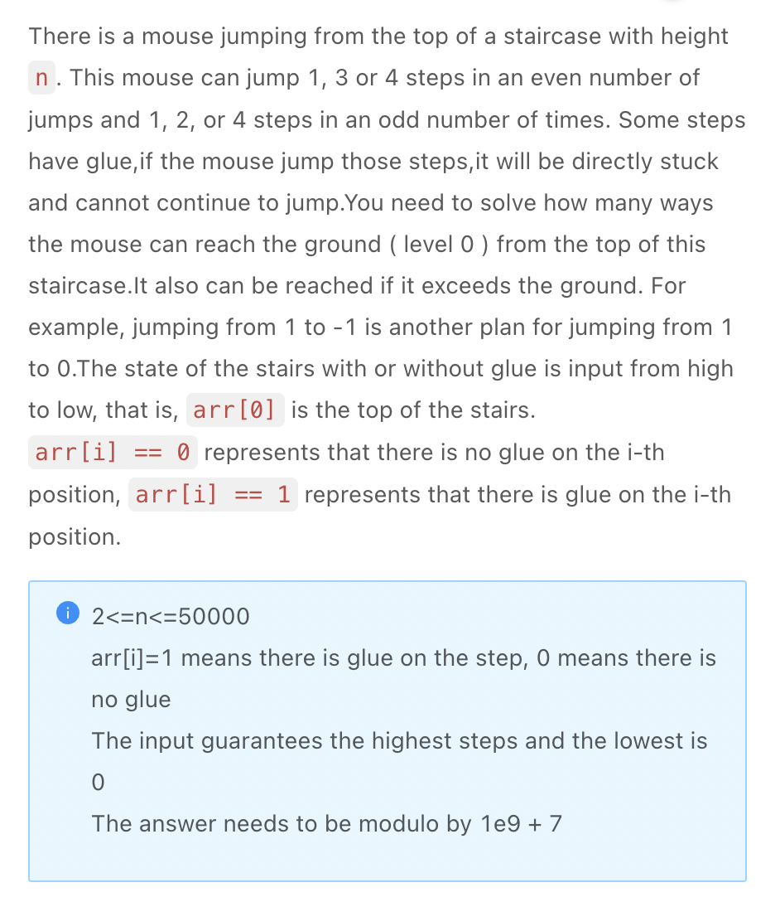

.. code-block:: bash

    Input:
    [0,0,0]
    Output:
    5
    Explanation:
    There are 3 steps.
    The step 2  is the starting point without glue.
    Step 1, no glue.
    Step 0, no glue.
    The mouse jump plans is:
    2--odd(1)-->1--even(1)-->0
    2--odd(1)-->1--even(3)-->-2
    2--odd(1)-->1--even(4)-->-3
    2--odd(2)-->0
    2--odd(4)-->-2

    Input:
    [0,0,1,0]
    Output:
    3
    Explanation:
    There are 4 steps.
    The step 3  is the starting point without glue.
    Step 2, no glue.
    Step 1, have glue.
    Step 0, no glue.

:solution:`1861 Dynamic Programming`
^^^^^^^^^^^^^^^^^^^^^^^^^^^^^^^^^^^^

.. hint::
    - Consider array of length :code:`n`, convert into start from index 0, reach index :code:`n - 1` and beyond
    - State: last step is even or odd affects the state, should be a dimension

      - :code:`dp[i][0]` is the number of solutions from layer :code:`0` to :code:`i` where last step is even
      - :code:`dp[i][1]` is the number of solutions from layer :code:`0` to :code:`i` where last step is odd

    - Initialization: first position must be 0 step which is even, can't be odd

      - :code:`dp[0][0] = 1`
      - :code:`dp[0][1] = 0`

    - Function: use step length to backtrack on last position

      - :code:`dp[i][0] = dp[i - 1][1] + dp[i - 3][1] + dp[i - 4][1]`
      - :code:`dp[i][1] = dp[i - 1][0] + dp[i - 2][0] + dp[i - 4][0]`

    - Answer: :code:`sum(dp[i][0] + dp[i][1])`, where :code:`i` is all possible steps to reach :code:`n - 1` with **1 more step**
    
.. note::

    .. code-block:: python

        class Solution:
            """
            @param s: The string s
            @return: The number of distinct, non-empty subsequences of S.
            """
            def ratJump(self, arr: List[int]) -> int:
                n = len(arr)

                dp = [[0, 0] for _ in range(n - 1)]
                dp[0][0] = 1

                even_jump = [1, 3, 4]
                odd_jump = [1, 2, 4]

                for i in range(1, n - 1):
                    if arr[i] == 1:
                        continue
                    for jump in even_jump:
                        if i - jump >= 0:
                            dp[i][0] = (dp[i][0] + dp[i - jump][1]) % MOD
                    for jump in odd_jump:
                        if i - jump >= 0:
                            dp[i][1] = (dp[i][1] + dp[i - jump][0]) % MOD
                
                result = 0
                for jump in even_jump:
                    # Check all steps that can reach n - 1 within 1 step
                    for i in range(max(0, n - 1 - jump), n - 1):
                        # Previous step is odd for even last step
                        result = (result + dp[i][1]) % MOD
                for jump in odd_jump:
                    for i in range(max(0, n - 1 - jump), n - 1):
                        result = (result + dp[i][0]) % MOD
                return result

:solution:`1861 Rolling Array`
^^^^^^^^^^^^^^^^^^^^^^^^^^^^^^^^^^^^

.. note::

    .. code-block:: python

        class Solution:
            """
            @param s: The string s
            @return: The number of distinct, non-empty subsequences of S.
            """
            def ratJump(self, arr: List[int]) -> int:
                n = len(arr)

                # Dependens on 4 steps before
                # Roll on 4 + 1 = 5
                dp = [[0, 0] for _ in range(5)]
                dp[0][0] = 1

                even_jump = [1, 3, 4]
                odd_jump = [1, 2, 4]

                for i in range(1, n - 1):
                    current = i % 5
                    # Need to clear previous data as we reuse the position
                    dp[current][0], dp[current][1] = 0, 0

                    if arr[i] == 1:
                        continue
                    for jump in even_jump:
                        if i - jump >= 0:
                            prev = (i - jump) % 5
                            dp[current][0] = (dp[current][0] + dp[prev][1]) % MOD
                    for jump in odd_jump:
                        if i - jump >= 0:
                            prev = (i - jump) % 5
                            dp[current][1] = (dp[current][1] + dp[prev][0]) % MOD
                
                result = 0
                for jump in even_jump:
                    # Check all steps that can reach n - 1 within 1 step
                    for i in range(max(0, n - 1 - jump), n - 1):
                        # Previous step is odd for even last step
                        result = (result + dp[i % 5][1]) % MOD
                for jump in odd_jump:
                    for i in range(max(0, n - 1 - jump), n - 1):
                        result = (result + dp[i % 5][0]) % MOD
                return result

:problem:`Maximal Square (最大正方形)`
----------------------------------------------------------

`LintCode 436 Medium <https://www.jiuzhang.com/problem/maximal-square/>`_

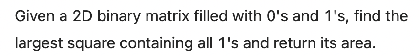

.. code-block:: bash

    Input:
    [
        [1, 0, 1, 0, 0],
        [1, 0, 1, 1, 1],
        [1, 1, 1, 1, 1],
        [1, 0, 0, 1, 0]
    ]
    Output: 4

    Input:
    [
        [0, 0, 0],
        [1, 1, 1]
    ]
    Output: 1

:solution:`436 Dynamic Programming`
^^^^^^^^^^^^^^^^^^^^^^^^^^^^^^^^^^^^

.. hint::

    - State: :code:`dp[i][j]` is the **full-one square** that has the right bottom corner at position :code:`(i, j)`
    - Init: :code:`dp[0][:]` and :code:`dp[:][0]` is the grid value
    - Answer: :code:`max(dp)`
    - Function: :code:`dp[i][j] = min(dp[i][j - 1], dp[i - 1][j], dp[i - 1][j - 1]) + 1`

.. note::

    .. code-block:: python

        class Solution:
            """
            @param matrix: a matrix of 0 and 1
            @return: an integer
            """
            def max_square(self, matrix: List[List[int]]) -> int:
                if not matrix or not matrix[0]:
                    return 0
                
                row, col = len(matrix), len(matrix[0])

                dp = [[0 for _ in range(col)] for __ in range(row)]
                result = 0

                for i in range(row):
                    for j in range(col):
                        if i == 0 or j == 0:
                            dp[i][j] = matrix[i][j]
                        elif matrix[i][j] == 0:
                            dp[i][j] = 0
                        else:
                            dp[i][j] = min(dp[i - 1][j - 1], \
                                dp[i - 1][j], dp[i][j - 1]) + 1
                        
                        result = max(result, dp[i][j])
                
                return result * result

:solution:`436 Rolling Array`
^^^^^^^^^^^^^^^^^^^^^^^^^^^^^^^^^^^^

.. note::

    .. code-block:: python

        class Solution:
            """
            @param matrix: a matrix of 0 and 1
            @return: an integer
            """
            def max_square(self, matrix: List[List[int]]) -> int:
                if not matrix or not matrix[0]:
                    return 0
                
                row, col = len(matrix), len(matrix[0])

                # dp = [[0 for _ in range(col)] for __ in range(row)]
                dp = [[0] * col for _ in range(2)]
                result = 0

                for i in range(row):
                    for j in range(col):
                        current = i % 2
                        prev = (i - 1) % 2
                        if i == 0 or j == 0:
                            dp[current][j] = matrix[i][j]
                        elif matrix[i][j] == 0:
                            dp[current][j] = 0
                        else:
                            dp[current][j] = min(dp[prev][j - 1], \
                                dp[prev][j], dp[current][j - 1]) + 1
                        
                        result = max(result, dp[current][j])
                
                return result * result

:problem:`Count Square Submatrices with All Ones (统计全为1的正方形子矩阵)`
---------------------------------------------------------------------------

`LintCode 1869 Medium <https://www.jiuzhang.com/problem/count-square-submatrices-with-all-ones/>`_

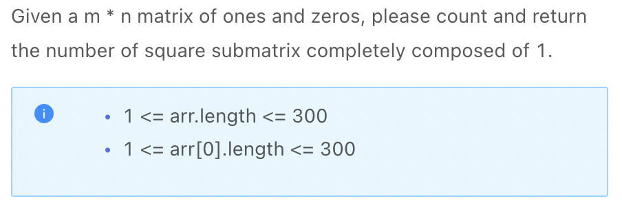

.. code-block:: bash

    Input: 
    matrix =
    [
    [0,1,1,1],
    [1,1,1,1],
    [0,1,1,1]
    ]
    Output: 
    15
    Explanation: 
    There are 10 squares of side 1.
    There are 4 squares of side 2.
    There is  1 square of side 3.
    Total number of squares = 10 + 4 + 1 = 15.

    Input: matrix = 
    [
    [1,0,1],
    [1,1,0],
    [1,1,0]
    ]
    Output: 
    7
    Explanation: 
    There are 6 squares of side 1.  
    There is 1 square of side 2. 
    Total number of squares = 6 + 1 = 7.

:solution:`1869 Dynamic Programming`
^^^^^^^^^^^^^^^^^^^^^^^^^^^^^^^^^^^^

.. hint::
    - Reference Problem 436
    - Instead of record max square, sum up all dp values

.. note::

    .. code-block:: python

        class Solution:
            """
            @param matrix: a matrix
            @return: return how many square submatrices have all ones
            """
            def count_squares(self, matrix: List[List[int]]) -> int:
                # write your code here
                if not matrix or not matrix[0]:
                    return 0
                
                row, col = len(matrix), len(matrix[0])

                dp = [[0 for _ in range(col)] for __ in range(row)]
                result = 0

                for i in range(row):
                    for j in range(col):
                        if i == 0 or j == 0:
                            dp[i][j] = matrix[i][j]
                        elif matrix[i][j] == 0:
                            dp[i][j] = 0
                        else:
                            dp[i][j] = min(dp[i - 1][j - 1], \
                                dp[i - 1][j], dp[i][j - 1]) + 1
                        
                        result += dp[i][j]
                
                return result

Prefix + Double Sequence (前缀型 + 双序列型动态规划)
****************************************************

.. contents:: Table of Contents
   :depth: 2
   :local:
   :backlinks: none

Use Case
========

.. warning::

    前缀型
    - 一般以前 :code:`i` 个元素为状态
    - 当以前 :code:`i` 个元素为状态时, 注意 :code:`dp` 数组长度需要为 :code:`n + 1`, 因为会有 **前0个数** 的情况

    双序列型
    - 一般以 :code:`dp[i][j]` 表示 **第一个序列前** :code:`i` **个数据** 和 **第二个序列前** :code:`j` **个数据** 一起代表的状体
    - 寻找 :code:`dp[i][j]` 和之前的状态 :code:`dp[i - 1][j], dp[i][j - 1], dp[i - 1][j - 1]` 的关系

Problem
=======

:problem:`Longest Palindromic Subsequence (最长的回文序列)`
-----------------------------------------------------------

`LintCode 667 Medium <https://www.jiuzhang.com/problem/longest-palindromic-subsequence/>`_

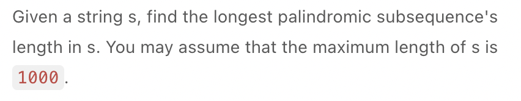

.. code-block:: bash

    Input: "bbbab"
    Output: 4
    Explanation:
    One possible longest palindromic subsequence is "bbbb".

    Input: "bbbbb"
    Output: 5

:solution:`667 Dynamic Programming`
^^^^^^^^^^^^^^^^^^^^^^^^^^^^^^^^^^^

.. hint::

    - Sequence :code:`seq[i:j+1]` from :code:`s[i]` to :code:`s[j]` : take or remove any chars from :code:`s[i:j+1]` while order is preserved
    - 2D array L[i][j]: the longest subsequence between s[i] and s[j]
    - One char palindrome: :code:`L[i][i] = 1`
    - If :code:`s[i] == s[j]` and sequence length is 2, :code:`L[i][j] = 2`
    - If :code:`seq[i + 1:j]` is palindrome and :code:`s[i] == s[j]`, :code:`L[i][j] = L[i + 1][j - 1] + 2`
    - Otherwise, :code:`L[i][j] = max(L[i+1][j], L[i][j-1])`

.. note::
    Time: :math:`O(n^2)`
    Space: :math:`O(n^2)`

    .. code-block:: python

        class Solution:
            """
            @param s: the maximum length of s is 1000
            @return: the longest palindromic subsequence's length
            """
            def longestPalindromeSubseq(self, s):
                if not s:
                    return 0
                length = len(s)
                mapping = [[0 for i in range(length)] for j in range(length)]
                for i in range(length):
                    mapping[i][i] = 1
                for cl in range(2, length + 1):
                    for i in range(length - cl + 1):
                        j = i + cl - 1
                        if s[i] == s[j] and cl == 2:
                            mapping[i][j] = 2
                        elif s[i] == s[j]:
                            mapping[i][j] = mapping[i + 1][j - 1] + 2
                        else:
                            mapping[i][j] = max(mapping[i + 1][j], mapping[i][j - 1])
                return mapping[0][length - 1]

:problem:`Longest Common Subsequence (最长公共子序列)`
-------------------------------------------------------------------------------------------

`LintCode 77 Medium <https://www.jiuzhang.com/problem/longest-common-subsequence/>`_

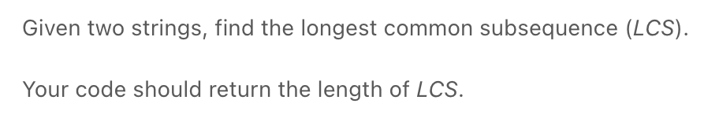

.. code-block:: bash

    Input:
    A = "ABCD"
    B = "EDCA"

    Output:
    1

    Input:
    A = "ABCD"
    B = "EACB"

    Output:
    2

:solution:`77 Dynamic Programming`
^^^^^^^^^^^^^^^^^^^^^^^^^^^^^^^^^^

.. hint::

    - State: :code:`s[i]` 表示前 :code:`i` 个字符中最长公共子序列的长度
    - Initialization: 有空字符串时公共子序列长度 **为0**

      - :code:`dp[0][0] = 0`
      - :code:`dp[i][0] = 0`
      - :code:`dp[0][j] = 0`
    - Function: 

      - 最后字母不一样 :code:`max(dp[i - 1][j], dp[i][j - 1])`
      - 最后字母一样 :code:`max(dp[i - 1][j - 1] + 1)`

    - Answer: :code:`dp[len(ListA)][len(ListB)]`

.. note::

    .. code-block:: python

        class Solution:
            """
            @param a: A string
            @param b: A string
            @return: The length of longest common subsequence of A and B
            """
            def longest_common_subsequence(self, a: str, b: str) -> int:
                if not a or not b:
                    return 0
                m, n = len(a), len(b)
                dp = [[0] * (n + 1) for _ in range(2)]

                for i in range(1, m + 1):
                    for j in range(1, n + 1):
                        current = i % 2
                        prev = (i - 1) % 2
                        if a[i - 1] == b[j - 1]:
                            dp[current][j] = dp[prev][j - 1] + 1
                        else:
                            dp[current][j] = max(dp[prev][j], dp[current][j - 1])
                
                return dp[m % 2][n]

:problem:`Paper Review (论文查重)`
-------------------------------------------------------------------------------------------

`LintCode 1463 Hard <https://www.jiuzhang.com/problem/paper-review/>`_

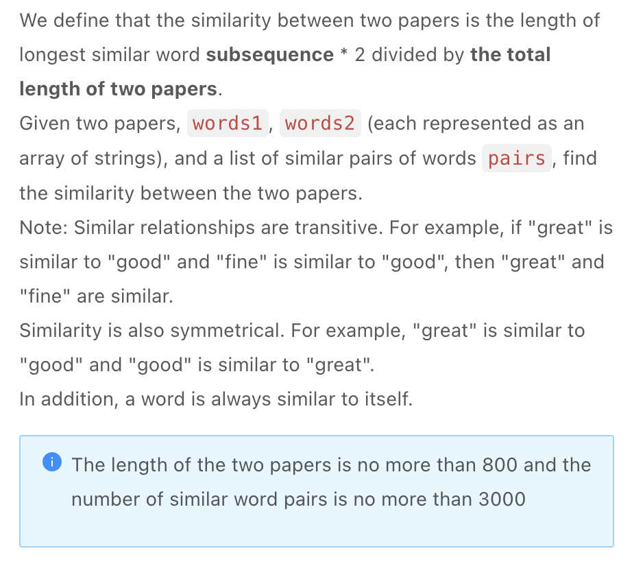

.. code-block:: bash

    Input: words1= ["great","acting","skills","life"], words2= ["fine","drama","talent","health"], pairs=  [["great", "good"], ["fine", "good"], ["acting","drama"], ["skills","talent"]]
    Output: 0.75
    Explanation:
    The similar word sequence for the two words is
    "great","acting","skills"
    "fine","drama","talent"
    The total length is 8.
    The similarity is 6/8=0.75

    Input: words1= ["I","love","you"], words2= ["you","love","me"], pairs=  [["I", "me"]]
    Output: 0.33
    Explanation:    
    The similar word sequence for the two words is
    "I"
    "me"
    or
    "love"
    "love"
    or
    "you"
    "you"
    The total length is 6.
    The similarity is 2/6=0.33

.. _lint-1463-dp:

:solution:`1463 Union Find + Dynamic Programming`
^^^^^^^^^^^^^^^^^^^^^^^^^^^^^^^^^^^^^^^^^^^^^^^^^

.. hint::

    - 用并查集表示相似关系
    - 问题转换为 **最长公共子序列问题**

.. note::

    .. code-block:: python

        class UnionFind:
            def __init__(self):
                self.father = dict()
            
            def add(self, x):
                if x in self.father:
                    return
                self.father[x] = x
            
            def find(self, x):
                root = x
                while self.father[root] != root:
                    root = self.father[root]
                while root != x:
                    prev = self.father[x]
                    self.father[x] = root
                    x = prev
                return root

            def union(self, x, y):
                root_x, root_y = self.find(x), self.find(y)
                if root_x != root_y:
                    self.father[root_x] = root_y
            
            def is_connected(self, x, y):
                return self.find(x) == self.find(y)

        class Solution:
            def initialization(self, words1, words2, pairs):
                uf = UnionFind()
                for word in words1:
                    uf.add(word)
                for word in words2:
                    uf.add(word)
                for pair in pairs:
                    uf.add(pair[0])
                    uf.add(pair[1])
                    uf.union(pair[0], pair[1])
                return uf

            def get_LCS(self, uf, words1, words2, pairs):
                m, n = len(words1), len(words2)
                dp = [[0] * (n + 1) for _ in range(2)]

                for i in range(m + 1):
                    for j in range(n + 1):
                        left = words1[i - 1]
                        right = words2[j - 1]
                        current = i % 2
                        prev = (i - 1) % 2
                        if left == right or uf.is_connected(left, right):
                            dp[current][j] = dp[prev][j - 1] + 1
                        else:
                            dp[current][j] = max(dp[prev][j], dp[current][j - 1])
                        
                return dp[m % 2][n]

            """
            @param words1: the words in paper1
            @param words2: the words in paper2
            @param pairs: the similar words pair
            @return: the similarity of the two papers
            """
            def getSimilarity(self, words1, words2, pairs):
                if not words1 or not words2:
                    return 0
                
                uf = self.initialization(words1, words2, pairs)
                similar = self.get_LCS(uf, words1, words2, pairs)
                total = len(words1) + len(words2)

                return 2 * similar / total

:problem:`Modern Ludo I (飞行棋 I) Dynamic Programming`
-------------------------------------------------------

.. seealso::
    Follow up

    - See reference :ref:`lint-1565-dp`

.. _lint-119-dp:

:problem:`Edit Distance (编辑距离)`
-------------------------------------------------------------------------------------------

`LintCode 119 Medium <https://www.jiuzhang.com/problem/edit-distance/>`_

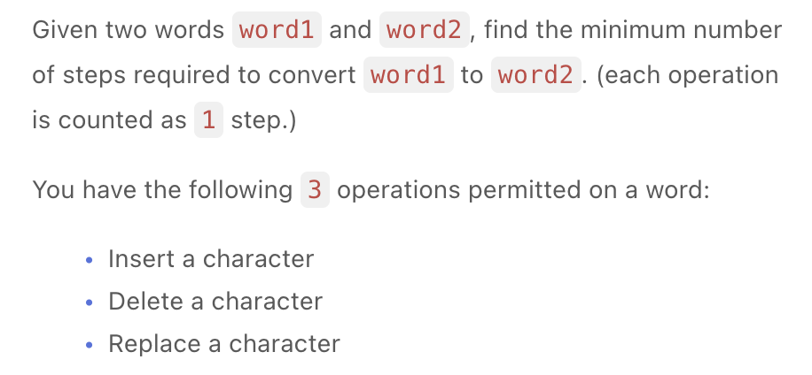

.. code-block:: bash

    Input:
    word1 = "horse"
    word2 = "ros"

    Output:
    3

    Explanation:
    horse -> rorse (replace 'h' with 'r')
    rorse -> rose (remove 'r')
    rose -> ros (remove 'e')

    Input:
    word1 = "intention"
    word2 = "execution"

    Output:
    5

    Explanation:
    intention -> inention (remove 't')
    inention -> enention (replace 'i' with 'e')
    enention -> exention (replace 'n' with 'x')
    exention -> exection (replace 'n' with 'c')
    exection -> execution (insert 'u')

:solution:`119 Dynamic Programming`
^^^^^^^^^^^^^^^^^^^^^^^^^^^^^^^^^^^^^^^^^^

.. hint::
    - 保留2序列当前字符, 无操作: :code:`dp[i - 1][j - 1]`
    - 删除当前字符: :code:`dp[i - 1][j] + 1`
    - 插入字符至当前位置, 必插入序列2中相同的字符, 序列1需要匹配的序列2部分不再需要考虑 :code:`j` 位置: :code:`dp[i][j - 1] + 1`
    - 替换2序列当前字符: :code:`dp[i - 1][j - 1] + 1`
    - State: 最小编辑步数
    - Initialization: :code:`dp[0][j] = j, dp[i][0] = i`, 空串转化为非空串需要插入 :code:`j` 次
    - Function:

      - 最后1位字母相同, 保留: :code:`dp[i - 1][j - 1]`
      - 最后1位字母不同, :code:`min(dp[i - 1][j], dp[i][j - 1], dp[i - 1][j - 1]) + 1`
    - Answer: :code:`dp[-1][-1]`

.. note::

    .. code-block:: python

        class Solution:
            """
            @param word1: A string
            @param word2: A string
            @return: The minimum number of steps
            """
            def min_distance(self, word1: str, word2: str) -> int:
                if not word1 or not word2:
                    return 0
                
                n, m = len(word1), len(word2)
                dp = [[0] * (m + 1) for _ in range(2)]

                for j in range(m + 1):
                    dp[0][j] = j
                
                for i in range(1, n + 1):
                    current = i % 2
                    prev = (i - 1) % 2
                    dp[current][0] = i
                    dp[prev][0] = i - 1
                    for j in range(1, m + 1):
                        dp[current][j] = min(dp[prev][j], dp[current][j - 1]) + 1
                        if word2[j - 1] == word1[i - 1]:
                            dp[current][j] = min(dp[current][j], dp[prev][j - 1])
                        else:
                            dp[current][j] = min(dp[current][j], dp[prev][j - 1] + 1)
                return dp[n % 2][m]

.. _lint-623-dp:

:problem:`K Edit Distance (K步编辑)`
-------------------------------------------------------------------------------------------

`LintCode 623 Medium <https://www.jiuzhang.com/problem/k-edit-distance/>`_

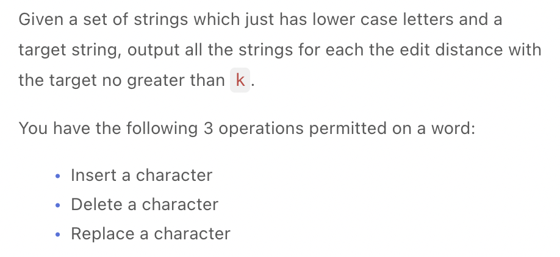

.. code-block:: bash

    Given words = `["abc", "abd", "abcd", "adc"]` and target = `"ac"`, k = `1`
    Return `["abc", "adc"]`
    Input:
    ["abc", "abd", "abcd", "adc"]
    "ac"
    1
    Output:
    ["abc","adc"]

    Explanation:
    "abc" remove "b"
    "adc" remove "d"

    Input:
    ["acc","abcd","ade","abbcd"]
    "abc"
    2
    Output:
    ["acc","abcd","ade","abbcd"]

    Explanation:
    "acc" turns "c" into "b"
    "abcd" remove "d"
    "ade" turns "d" into "b" turns "e" into "c"
    "abbcd" gets rid of "b" and "d"

:solution:`623 Trie + Dynamic Programming`
^^^^^^^^^^^^^^^^^^^^^^^^^^^^^^^^^^^^^^^^^^

.. hint::

    - 用字典树对相同前缀进行优化
    - 公共路径上的点 **共享DP数组**
    - 每算出一行 :code:`dp[i]`, 即存入一个节点至Trie中, 此时空间复杂度 **过高**
    - 滚动数组优化: 每个节点只存dp数组最后计算的一行, 即 :code:`i - 1`
    
.. note::

    .. code-block:: python

        class TrieNode:
            def __init__(self):
                self.is_word = False
                self.children = {}

        class Trie:
            def __init__(self):
                self.root = TrieNode()

            def insert(self, word):
                node = self.root
                for c in word:
                    if c not in node.children:
                        node.children[c] = TrieNode()
                    node = node.children[c]
                node.is_word = True

        class Solution:
            """
            @param words: a set of stirngs
            @param target: a target string
            @param k: An integer
            @return: output all the strings that meet the requirements
            """
            def kDistance(self, words, target, k):
                trie = Trie()
                for word in words:
                    trie.insert(word)

                n = len(target)
                dp = list(range(n + 1))  # [0, 1, 2 ... ]
                results = []
                self.traverse(trie.root, '', 0, dp, target, k, results)
                return results

            def traverse(self, node, word, i, dp, target, k, results):
                n = len(target)
                if node.is_word and dp[n] <= k:
                    results.append(word)

                for c in node.children:
                    dp_next = [i + 1] * (n + 1)
                    for j in range(1, n + 1):
                        # dp[i][j] = min(dp[i - 1][j], dp[i][j - 1], dp[i - 1][j - 1]) + 1
                        dp_next[j] = min(dp[j], dp_next[j - 1], dp[j - 1]) + 1
                        if c == target[j - 1]:
                            # dp[i][j] = min(dp[i][j], dp[i - 1][j - 1])
                            dp_next[j] = min(dp_next[j], dp[j - 1])
                    self.traverse(node.children[c], word + c, i + 1, dp_next, target, k, results)

Backpack (背包问题)
****************************

.. contents:: Table of Contents
   :depth: 2
   :local:
   :backlinks: none

Use Case
========

.. warning::

    - 若干个数之 **和** 要满足 :math:`>` 或 :math:`<` 某个limit的限制条件
    - 一般以前 :code:`i` 个元素为状态
    - 当以前 :code:`i` 个元素为状态时, 注意 :code:`dp` 数组长度需要为 :code:`n + 1`, 因为会有 **前0个数** 的情况

Problem
=======

:problem:`Profitable Schemes (盈利计划)`
-----------------------------------------------------

`LintCode 1607 Hard <https://www.jiuzhang.com/problem/profitable-schemes/>`_

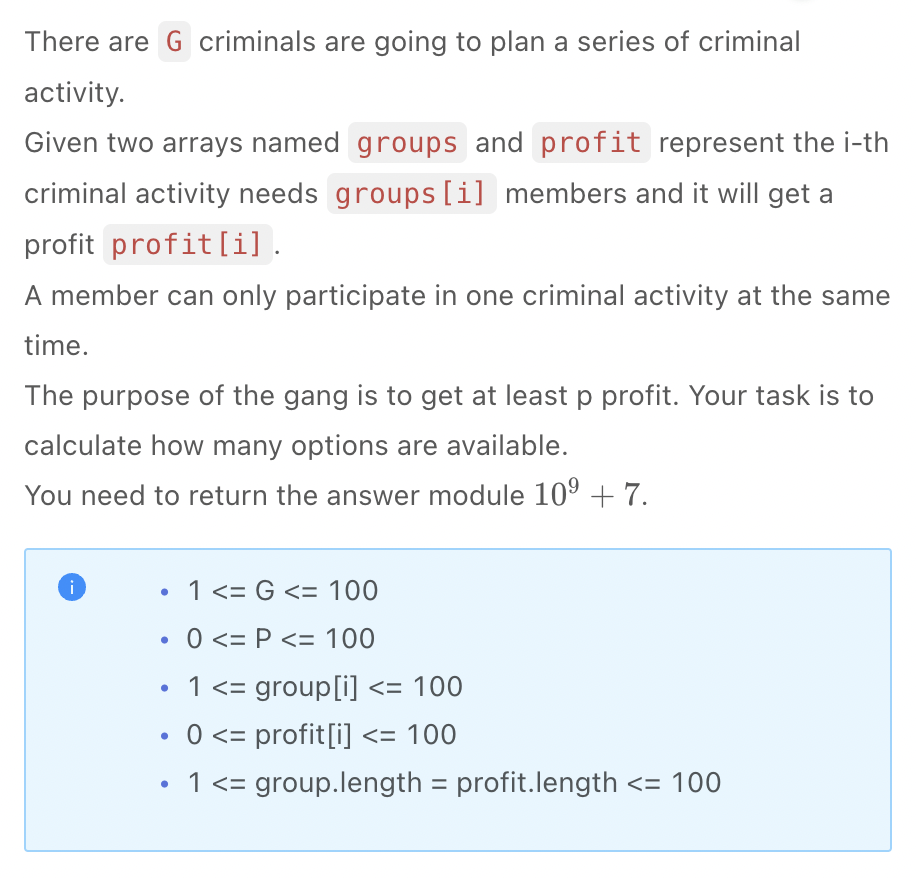

.. code-block:: bash

    Input: G = 5, P = 3, group = [2,2], profit = [2,3]
    Output: 2
    Explanation: 
    To make a profit of at least 3, the gang could either commit crimes 0 and 1, or just crime 1.
    In total, there are 2 schemes.

    Input: G = 10, P = 5, group = [2,3,5], profit = [6,7,8]
    Output: 7
    Explanation: 
    To make a profit of at least 5, the gang could commit any crimes, as long as they commit one.
    There are 7 possible schemes: (0), (1), (2), (0,1), (0,2), (1,2), and (0,1,2).

:solution:`1607 Dynamic Programming`
^^^^^^^^^^^^^^^^^^^^^^^^^^^^^^^^^^^^

.. hint::
    - State: number of solutions, dimensions: first :code:`i` activities, use **exactly** :code:`j` criminals, with **at least** :code:`k` profit.
    - Initialization: find number of solutions where :code:`dp[i][j][k] = 1`

      - :code:`dp[0][0][0] = 1`
      - :code:`dp[0][0][1] = 0`

    - Function: :code:`dp[i][j][k] = dp[i - 1][j][k] + dp[i][j - groups[i - 1]][k - profit[i - 1]]`

      - Don't do activity :code:`i`, first :code:`i - 1` activity has solution :code:`dp[i - 1][j][k]`
      - Do activity :code:`i`, first :code:`i - 1` activity uses :code:`j - groups[i - 1]` criminals and have :code:`k - profit[i - 1]` profit

    - Answer: :code:`sum(dp[activity][0...G][P])`

.. note::

    .. code-block:: python

        class Solution:
            """
            @param g: The people in a gang.
            @param p: A profitable scheme any subset of these crimes that generates at least P profit.
            @param group: The i-th crime requires group[i] gang members to participate.
            @param profit: The i-th crime generates a profit[i].
            @return: Return how many schemes can be chosen.
            """
            def profitable_schemes(self, g: int, p: int, group: List[int], profit: List[int]) -> int:
                n = len(group)

                dp = [[[0] * (p + 1) for _ in range(g + 1)] for __ in range(2)]

                dp[0][0][0] = 1
                
                for i in range(1, n + 1):
                    for j in range(g + 1):
                        for k in range(p + 1):
                            current = i % 2
                            prev = (i - 1) % 2
                            dp[current][j][k] = dp[prev][j][k]
                            # Make sure enough criminals
                            if j >= group[i - 1]:
                                # Make sure last profit is above 0
                                last_profit = max(0, k - profit[i - 1])
                                dp[current][j][k] += \
                                        dp[prev][j - group[i - 1]][last_profit]
                
                result = 0
                for j in range(g + 1):
                    result += dp[n % 2][j][p]
                return result

:problem:`Paint House (房屋染色)`
---------------------------------

`LintCode 515 Medium <https://www.jiuzhang.com/problem/paint-house/>`_

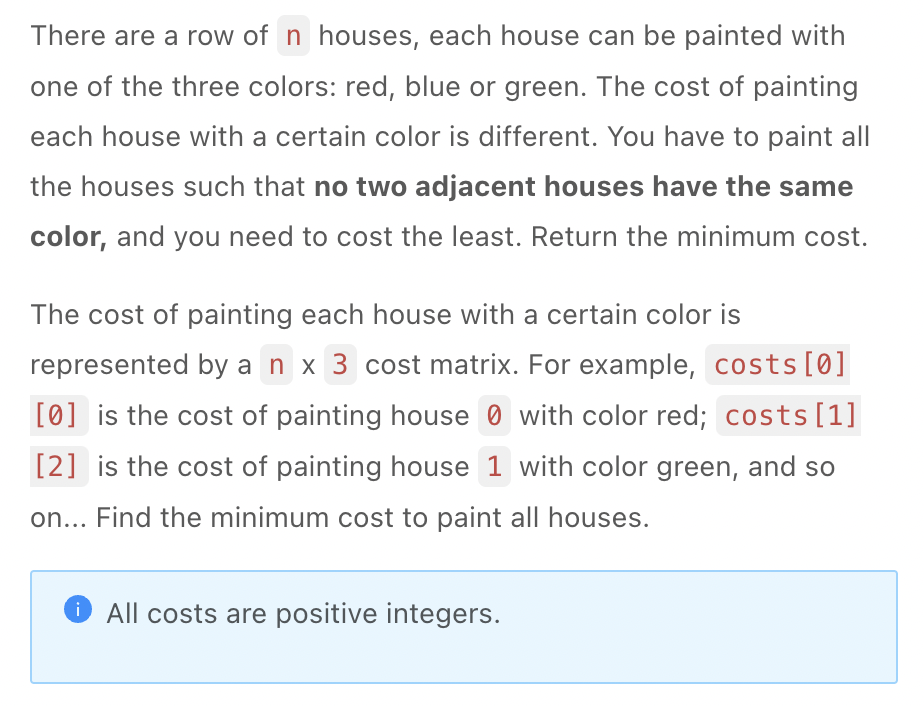

.. code-block:: bash

    Input: [[14,2,11],[11,14,5],[14,3,10]]
    Output: 10
    Explanation: Paint house 0 into blue, paint house 1 into green, paint house 2 into blue. Minimum cost: 2 + 5 + 3 = 10.

    Input: [[1,2,3],[1,4,6]]
    Output: 3

:solution:`515 Dynamic Programming`
^^^^^^^^^^^^^^^^^^^^^^^^^^^^^^^^^^^

.. hint::

    - use :code:`i` to denote the house index, :code:`j` to denote the color to use, :code:`dp[i][j]` gives the minimum cost

.. note::

    .. code-block:: python

        class Solution:
            """
            @param costs: n x 3 cost matrix
            @return: An integer, the minimum cost to paint all houses
            """
            def min_cost(self, costs: List[List[int]]) -> int:
                n = len(costs)
                if not n:
                    return 0

                dp = [[float('inf')] * 3 for _ in range(n)]
                for i in range(3):
                    dp[0][i] = costs[0][i]
                
                for house in range(1, n):
                    dp[house][0] = min(dp[house - 1][1], dp[house - 1][2]) + \
                                costs[house][0]
                    dp[house][1] = min(dp[house - 1][0], dp[house - 1][2]) + \
                                costs[house][1]
                    dp[house][2] = min(dp[house - 1][0], dp[house - 1][1]) + \
                                costs[house][2]
                
                return min(dp[n - 1][0], dp[n - 1][1], dp[n - 1][2])

:solution:`515 Rolling Array`
^^^^^^^^^^^^^^^^^^^^^^^^^^^^^

.. hint::

    - Note that :code:`dp[i]` is only related to :code:`dp[i - 1]`
    - We can roll index in :code:`dp` to save space
    
.. note::
    Space: :math:`O(1)`

    .. code-block:: python

        class Solution:
            """
            @param costs: n x 3 cost matrix
            @return: An integer, the minimum cost to paint all houses
            """
            def min_cost(self, costs: List[List[int]]) -> int:
                n = len(costs)
                if not n:
                    return 0

                dp = [[float('inf')] * 3 for _ in range(2)]
                for i in range(3):
                    dp[0][i] = costs[0][i]
                
                current = 0
                previous = 1
                for house in range(1, n):
                    previous = current
                    current = 1 - previous
                    dp[current][0] = min(dp[previous][1], dp[previous][2]) + \
                                costs[house][0]
                    dp[current][1] = min(dp[previous][0], dp[previous][2]) + \
                                costs[house][1]
                    dp[current][2] = min(dp[previous][0], dp[previous][1]) + \
                                costs[house][2]
                
                return min(dp[current][0], dp[current][1], dp[current][2])

:problem:`Partition Equal Subset Sum (划分和相等的子集)`
--------------------------------------------------------

`LintCode 588 Medium <https://www.jiuzhang.com/problem/partition-equal-subset-sum/>`_

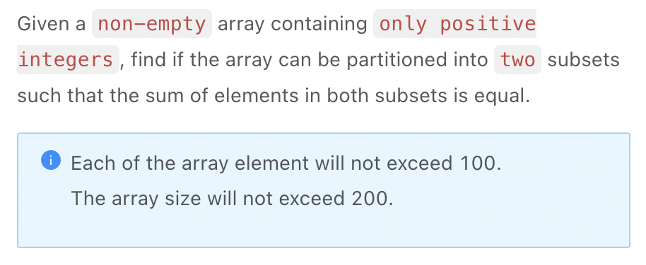

:solution:`588 Dynamic Programming`
^^^^^^^^^^^^^^^^^^^^^^^^^^^^^^^^^^^

.. hint::

    - Total sum is odd, must be False
    - Total sum is even, find a subsequence that sums to :math:`\frac{sum}{2}`
    - Each number can only be used once
    - This is converted into a **backpack problem**
    - :code:`dp[n][m]`: when choosing :code:`n` items, can its sum value **equal to** :code:`m`
    - Last step: :code:`dp[n][m] = dp[n - 1][m - a[n]] | dp[n - 1][m]`

      - :code:`n - 1` can not fit :code:`m`, put in last item :code:`a[n]` to fit
      - :code:`n - 1` can fit :code:`m`, :code:`n` can also fit

    - Transfer function: :code:`dp[i][j] = (j >= a[n] && dp[i - 1][j - a[n]]) | dp[i - 1][j]`
    - Initial State: :code:`dp[*][*] = False`, :code:`dp[i][0] = True`

.. note::

    .. code-block:: python

        class Solution:
            """
            @param nums: a non-empty array only positive integers
            @return: true if can partition or false
            """
            def can_partition(self, nums: List[int]) -> bool:
                total = sum(nums)
                if total % 2 != 0:
                    return False
                total = total // 2
                n = len(nums)
                # dp shape: n * (total + 1)
                dp = [[False] * (total + 1) for _ in range(n)]
                dp[0][0] = True
                for i in range(n):
                    if i == 0: # Avoid i - 1 overflow
                        if nums[i] <= total:
                            dp[i][nums[i]] = True
                        continue
                    for j in range(total + 1):
                        dp[i][j] = dp[i - 1][j] or \
                                (j >= nums[i] and dp[i - 1][j - nums[i]])
                return dp[n - 1][total]

:solution:`588 Rolling Array`
^^^^^^^^^^^^^^^^^^^^^^^^^^^^^

.. hint::

    - state depends only on previous state :code:`i - 1` at position :code:`j` and :code:`j - nums[i]`
    - Can omit dimension :code:`i`
    - When calculating :code:`j - nums[i]` position, note that without state dimension :code:`i` numbers may be used multiple times which is illegal
    - calculate from position :code:`total` down to :code:`0` to avoid multiple use of smaller numbers

.. note::
    Time: :math:`O(N \cdot total)`
    Space: :math:`O(total)`

    .. code-block:: python

        class Solution:
            """
            @param nums: a non-empty array only positive integers
            @return: true if can partition or false
            """
            def can_partition(self, nums: List[int]) -> bool:
                total = sum(nums)
                if total % 2 != 0:
                    return False
                total = total // 2
                n = len(nums)
                dp = [False] * (total + 1)
                dp[0] = True
                for i in range(n):
                    for j in range(total, -1, -1):
                        dp[j] = dp[j] or \
                                (j >= nums[i] and dp[j - nums[i]])
                return dp[total]

:problem:`Float Combination Sum (浮点数组合和)`
--------------------------------------------------------

`LintCode 1800 Hard <https://www.jiuzhang.com/problem/float-combination-sum/>`_

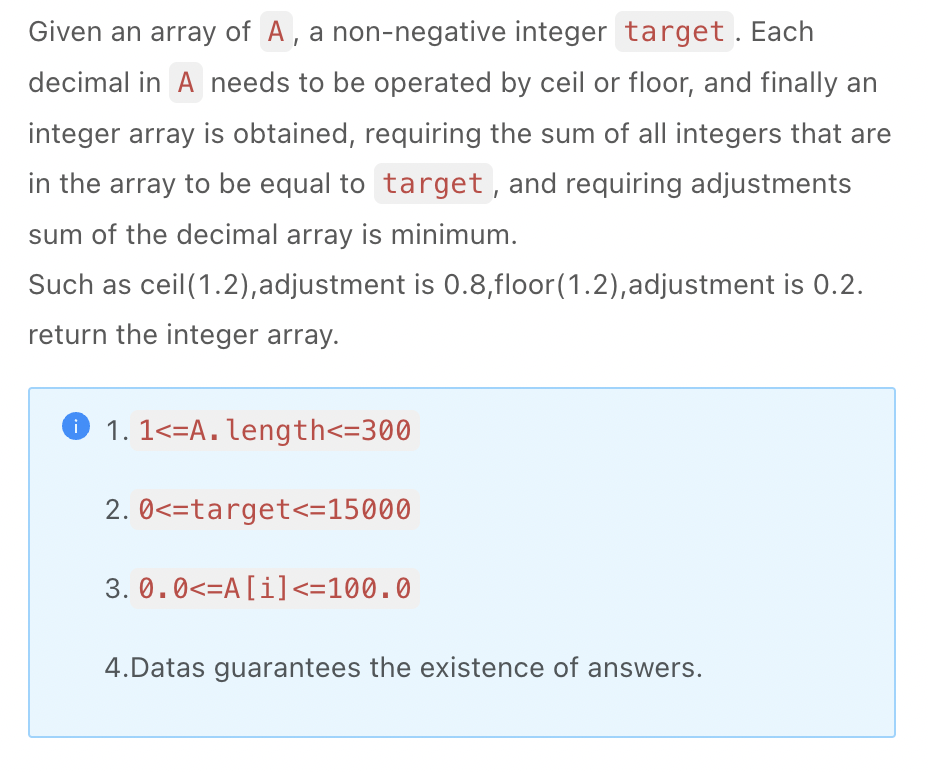

.. code-block:: bash

    Input: A=[1.2,1.7],target=3
    Output: [1,1,3,4]
    Explanation: 1.2->1,1.7->2.

    Input: A=[2.4,2.5],target=5
    Output: [2,3]
    Explanation: 2.4->2,2.5->3.

:solution:`1800 Dynamic Programming`
^^^^^^^^^^^^^^^^^^^^^^^^^^^^^^^^^^^^

.. hint::

    - State: 前 :code:`i` 个数字调整后, 和为 :code:`j` 的最小调整代价
    - 第 :code:`i - 1` 个数字向上取整, 值为 :code:`ceil(A[i - 1])`

      - 前 :code:`i - 1` 个数字和为 :code:`j - ceil(A[i - 1])`
      - 调整第 :code:`i` 个数字代价为 :code:`ceil(A[i - 1]) - A[i - 1]`
      - 总代价为 :code:`upplay = dp[i - 1][j - ceil(A[i - 1])] + (ceil(A[i - 1]) - A[i - 1])`
    - 第 :code:`i - 1` 个数字向下取整, 值为 :code:`floor(A[i - 1])`

      - 前 :code:`i - 1` 个数字和为 :code:`j - floor(A[i - 1])`
      - 调整第 :code:`i` 个数字代价为 :code:`A[i - 1] - floor(A[i - 1])`
      - 总代价为 :code:`downplay = dp[i - 1][j - floor(A[i - 1])] + (A[i - 1] - floor(A[i - 1]))`
    - Function: :code:`dp[i][j] = min(upplay, downplay)`
    - Answer: :code:`dp[n][target]`, 前 :code:`n` 个数字调整后和为 :code:`target` 的最小调整代价, 记录 **最优路径**
    - 向上取整: :code:`prev[i][j] = 1`, 向下取整: :code:`prev[i][j] = 0`

.. note::

    .. code-block:: python

        def getArray(self, A, target):
            import math

            n = len(A)
            dp = [[float('inf')] * (target + 1) for _ in range(n + 1)]
            prev = [[-1] * (target + 1) for _ in range(n + 1)]

            dp[0][0] = 0

            for i in range(n + 1):
                ceil = int(math.ceil(A[i - 1]))
                floor = int(math.floor(A[i - 1]))
                for j in range(target + 1):
                    if j >= ceil and dp[i - 1][j - ceil] + ceil - A[i - 1] < dp[i][j]:
                        dp[i][j] = dp[i - 1][j - ceil] + ceil - A[i - 1]
                        prev[i][j] = 1 # 1 means taking ceil
                    if j >= floor and dp[i - 1][j - floor] + A[i - 1] - floor < dp[i][j]:
                        dp[i][j] = dp[i - 1][j - floor] + A[i - 1] - floor
                        prev[i][j] = 0 # 0 means taking floor
            result = list(A)
            for i in range(n, 0, -1):
                # First loop actual target
                # next loop is last final output number: result[i - 1]
                if prev[i][target] == 1:
                    result[i - 1] = int(math.ceil(A[i - 1]))
                else:
                    result[i - 1] = int(math.floor(A[i - 1]))
                target = result[i - 1]

Statistical DP (概率型动态规划)
*******************************

.. contents:: Table of Contents
   :depth: 2
   :local:
   :backlinks: none

Use Case
========

.. hint::

    - When problem involves expectation and probability as result
    - :code:`dp` definition will be the term we want to calculate
    - Probability: :code:`dp[i]` denotes the **probability** to reach state :code:`i`
    - Expectation: :code:`dp[i]` denotes the **number of steps** to reach state :code:`i`

Problem
=======

:problem:`Dices Sum (骰子求和)`
-------------------------------

`LintCode 20 Medium <https://www.jiuzhang.com/problem/dices-sum/>`_

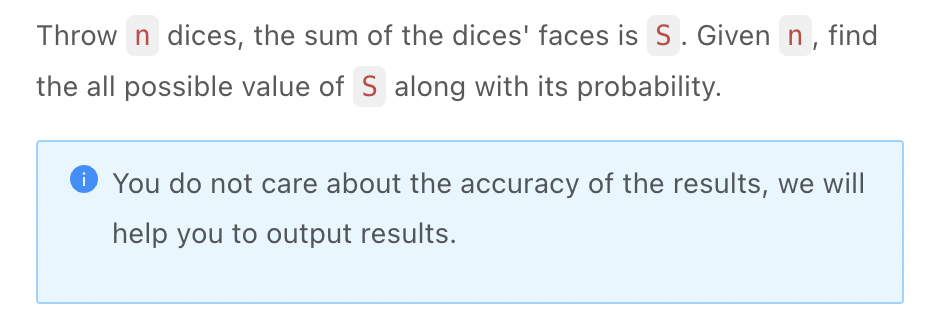

.. code-block:: bash

    Input:
    n = 1
    Output:
    [[1, 0.17], [2, 0.17], [3, 0.17], [4, 0.17], [5, 0.17], [6, 0.17]]

    Input:
    n = 2
    Output:
    [[2,0.03],[3,0.06],[4,0.08],[5,0.11],[6,0.14],[7,0.17],[8,0.14],[9,0.11],[10,0.08],[11,0.06],[12,0.03]]

:solution:`20 Dynamic Programming`
^^^^^^^^^^^^^^^^^^^^^^^^^^^^^^^^^^

.. hint::

    - :code:`dp[i][j]` is the probability of throwing :code:`i` times and total is :code:`j`
    - :code:`dp[i][j] = dp[i - 1][j - k] / 6` if this throw dice value is :code:`k`

.. note::

    .. code-block:: python

        class Solution:
            # @param {int} n an integer
            # @return {tuple[]} a list of tuple(sum, probability)
            def dicesSum(self, n):
                result = []
                dp = [[0] * (6 * n + 1) for _ in range(6 * n + 1)]
                
                for i in range(1, 6 + 1):
                    dp[1][i] = 1 / 6.0

                for i in range(2, n + 1):
                    # Target dice value
                    for j in range(1, 6 * i + 1):
                        # Current dice value
                        for k in range(1, 6 + 1):
                            if j < k:
                                continue
                            dp[i][j] += dp[i - 1][j - k] / 6
                
                for i in range(n, 6 * n + 1):
                    result.append([i, dp[n][i]])

                return result

:problem:`Knight Probability in Chessboard (“马”在棋盘上的概率)`
------------------------------------------------------------------

`LintCode 1084 Medium <https://www.jiuzhang.com/problem/knight-probability-in-chessboard/>`_

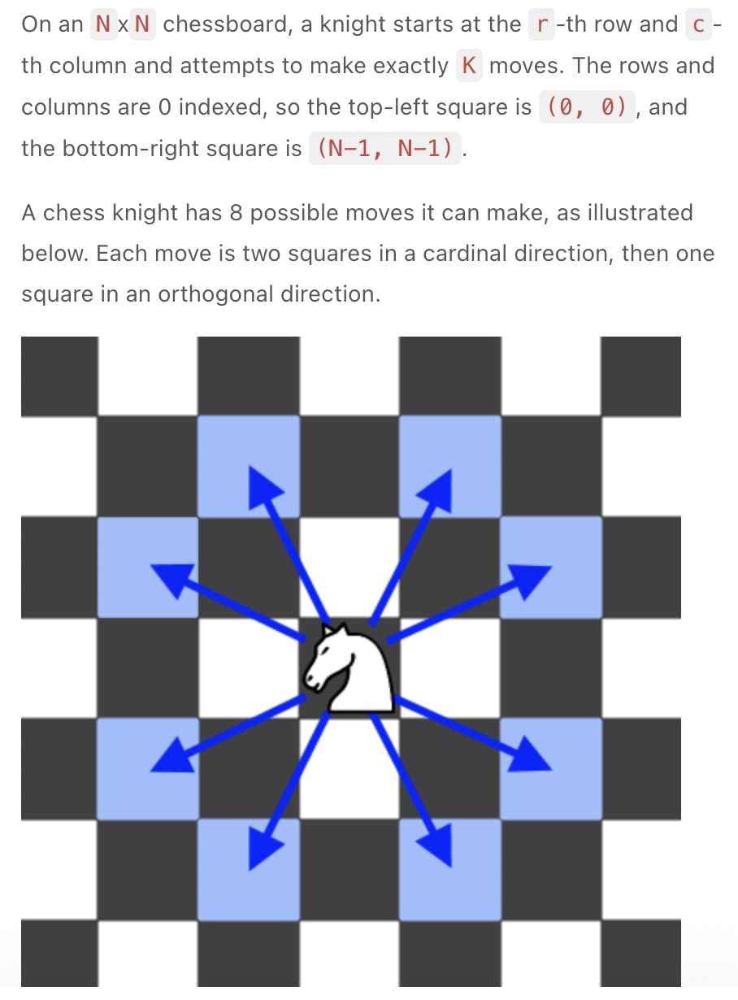

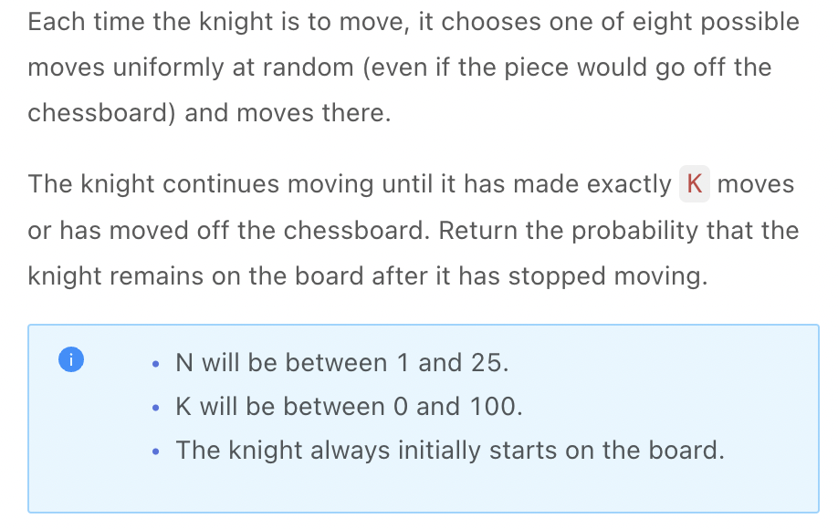

.. danger::
    
    Wrong Solution
    - Use bfs to move along possible steps, count invalid moves and valid moves with counter, then calculate probability
    - REASON: To reach the starting points on step 2 has a conditional probability, can't be counted as "1" as the first steps
    - Can not count number of points / total move points as probability

:solution:`1084 Dynamic Programming`
^^^^^^^^^^^^^^^^^^^^^^^^^^^^^^^^^^^^

.. hint::

    - :code:`dp[i][j][k]` is the probability to reach point :code:`(i, j)` after moving :code:`k` steps
    - :code:`dp[i][j][k] = sum(dp[i - dx][j - dy][k - 1] / 8)`, last step and direction :code:`(dx, dy)` with probability of :math:`\frac{1}{8}`

.. note::

    .. code-block:: python

        class Solution:
            """
            @param n: int
            @param k: int
            @param r: int
            @param c: int
            @return: the probability
            """
            def __init__(self):
                self.DIRECTIONS = [(1, 2), (-1, 2), (1, -2), (-1, -2), 
                    (2, 1), (2, -1), (-2, 1), (-2, -1)]

            def knight_probability(self, n: int, k: int, r: int, c: int) -> float:
                dp = [[[0] * (k + 1) for _ in range(n)] for __ in range(n)]
                dp[r][c][0] = 1
                for k in range(k + 1):
                    for i in range(n):
                        for j in range(n):
                            for dx, dy in self.DIRECTIONS:
                                x = i - dx
                                y = j - dy
                                if self.is_valid(x, y, n):
                                    dp[i][j][k] += dp[x][y][k - 1] * 0.125
                result = 0
                for i in range(n):
                    for j in range(n):
                        result += dp[i][j][k]
                return result
            
            def is_valid(self, x, y, n):
                if x < 0 or y < 0 or x >= n or y >= n:
                    return False
                return True

Sub Array (区间型动态规划)
*******************************

.. contents:: Table of Contents
   :depth: 2
   :local:
   :backlinks: none

Use Case
========

.. hint::

    - 子问题是数组的 **一段区间**, 即 **子数组** 上的动态规划
    - 状态方程一般为: :code:`dp[i][j] = dp[i][k] + dp[k + 1][j] + cost[i][j]`

Problem
=======

:problem:`Stone Game (石子归并)`
------------------------------------------------------------

`LintCode 476 Medium <https://www.jiuzhang.com/problem/stone-game/>`_

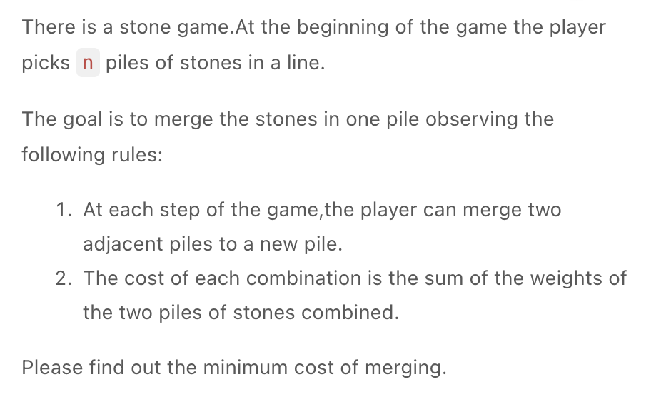

.. code-block:: bash

    Input: [3, 4, 3]
    Output: 17

    Input: [4, 1, 1, 4]
    Output: 18
    Explanation:
    1. Merge second and third piles => [4, 2, 4], score = 2
    2. Merge the first two piles => [6, 4], score = 8
    3. Merge the last two piles => [10], score = 18

.. _lint-476-dp:

:solution:`476 Dynamic Programming`
^^^^^^^^^^^^^^^^^^^^^^^^^^^^^^^^^^^

.. hint::

    - State: :code:`dp[i][j]` 是将 :code:`stone[i ... j]` 合并的最小cost
    - Function:

      - 最后一步是合并 :code:`s[i]` 和 :code:`s[i + 1 ... j]`, :code:`dp[i][j] = dp[i + 1][j] + sum(stones[i, j + 1])`
      - 最后一步是合并 :code:`s[i], s[i + 1]` 和 :code:`s[i + 2 ... j]`, :code:`dp[i][j] = dp[i][i + 1] + dp[i + 2][j] + sum(stones[i, j + 1])`
      - 以此类推, :code:`dp[i][j] = min(dp[i][j], dp[i][x] + dp[x + 1][j] + prefix_sum[j + 1] - prefix_sum[i])`

.. note::

    .. code-block:: python

        class Solution:
            """
            @param a: An integer array
            @return: An integer
            """
            def stone_game(self, a: List[int]) -> int:
                n = len(a)
                if n == 0:
                    return 0;
                dp = [[float('inf') for _ in range(n)] for _ in range(n)]
                prefix = [0] * (n + 1)
                #前缀和
                for i in range(n):
                    prefix[i + 1] = prefix[i] + a[i]

                # 初始化: 一开始, 所有石块自成一堆
                for i in range(n):
                    dp[i][i] = 0
                for i in range(n - 2, -1, -1):
                    for j in range(i + 1, n):
                        # 枚举i, j区间的分段点
                        for x in range(i, j):
                            dp[i][j] = min(dp[i][j], dp[i][x] + dp[x + 1][j] + prefix[j + 1] - prefix[i])
                return dp[0][n - 1]

:problem:`Minimum Cost to Merge Stones (合并石头的最低成本)`
------------------------------------------------------------

`LintCode 1798 Hard <https://www.jiuzhang.com/problem/minimum-cost-to-merge-stones/>`_

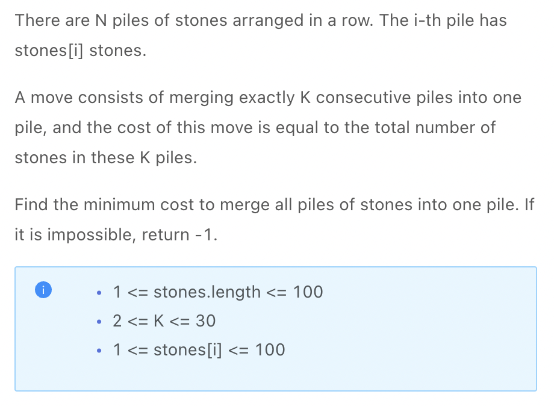

.. code-block:: bash

    Input: stones = [3, 2, 4, 1], K = 2
    Output: 20
    Explanation: 
    We start with [3, 2, 4, 1]
    We merge [3, 2] for a cost of 5, and we are left with [5, 4, 1]
    We merge [4, 1] for a cost of 5, and we are left with [5, 5]
    We merge [5, 5] for a cost of 10, and we are left with [10]
    The total cost was 20, and this is the minimum possible

    Input: stones = [3, 2, 4, 1], K = 3
    Output: -1
    Explanation: After any merge operation, there are 2 piles left, and we cant merge anymore. So the task is impossible

.. hint::

    - State: 区间 :code:`[i, j]` 合并为 :code:`k` 堆数组的最小代价
    - 当 :code:`k = 1`

      - 由上题得知, 合成 :code:`1` 堆石头的上一步是 :code:`K` 堆石头, :ref:`lint-476-dp`
      - 前面合成至 :code:`K` 堆石头共计cost :code:`dp[i][j][K]`
      - 合并区间 :code:`[i, j]` 的 :code:`K` 堆石头cost :code:`sum(stones[i:j + 1])`, 即 :code:`prefix[j + 1] - prefix[i]`
      - 总计为 :code:`dp[i][j][1] = dp[i][j][K] + prefix[j + 1] - prefix[i]`

    - 当 :code:`k > 1`, 假设区间 :code:`[i, j]` 被分为两部分 :code:`[i, x], [x + 1, j]`

      - 因为最终结果 :code:`k` 堆石头确定, 必定存在

        - :code:`x1` 使得 :code:`[i, x1]` 为 :code:`1` 堆, :code:`[x1 + 1, j]` 为 :code:`k - 1` 堆
        - :code:`x2` 使得 :code:`[i, x2]` 为 :code:`k - 1` 堆, :code:`[x2 + 1, j]` 为 :code:`1` 堆
        - 我们将循环检查所有 :code:`x` 的值, 所以两种假设取其中 **任何一种都可覆盖所有组合**
        - 假设 :code:`[i, x]` 已经被分为 :code:`k - 1` 堆, :code:`[x + 1, j]` 为 :code:`1` 堆
      - :code:`k` 在 :code:`[2, K]` 时, **可以覆盖所有分区组合**
      - :code:`dp[i][j] = min{dp[i][x][k - 1] + dp[x + 1][j][1]}`

.. note::

    .. code-block:: python

        class Solution:
            """
            @param stones: 
            @param K: 
            @return: return a integer 
            """
            def mergeStones(self, stones, K):
                n = len(stones)
                
                if (n - 1) % (K - 1) != 0:
                    return -1
                
                # preprocessing
                prefix_sum = self.get_prefix_sum(stones)
                
                # state: dp[i][j][k] i到j这一段合并为 k 堆石子的最小代价
                dp = [[
                    [float('inf')] * (K + 1)
                    for _ in range(n)
                ] for __ in range(n)]
                
                # initialization: 一开始所有石子各自为一堆，代价为 0
                for i in range(n):
                    dp[i][i][1] = 0
                
                # function:
                # dp[i][j][k] = min{dp[i][x][k - 1] + dp[x + 1][j][1]} // for k > 1
                # dp[i][j][1] = dp[i][j][K] + sum(stones[i..j]) // for k = 1
                for i in range(n - 2, -1, -1):
                    for j in range(i + 1, n):
                        for k in range(2, K + 1):
                            for x in range(i, j):
                                dp[i][j][k] = min(dp[i][j][k], dp[i][x][k - 1] + dp[x + 1][j][1])
                        dp[i][j][1] = dp[i][j][K] + prefix_sum[j + 1] - prefix_sum[i]
                
                # answer: dp[0][n - 1][1]
                return -1 if dp[0][n - 1][1] == float('inf') else dp[0][n - 1][1]
                
            def get_prefix_sum(self, A):
                prefix_sum = [0]
                for a in A:
                    prefix_sum.append(prefix_sum[-1] + a)
                return prefix_sum