.. include:: ../_static/.special.rst

##############################
Divide and Conquer (分治法)
##############################

Table of Contents
*****************

.. contents::

Binary Tree Value and Paths(二叉树上的值或路径)
**************************************************

Lowest Common Ancestor II (最近公共祖先II)
======================================================

`LintCode 474 Easy <https://www.lintcode.com/problem/474/>`_

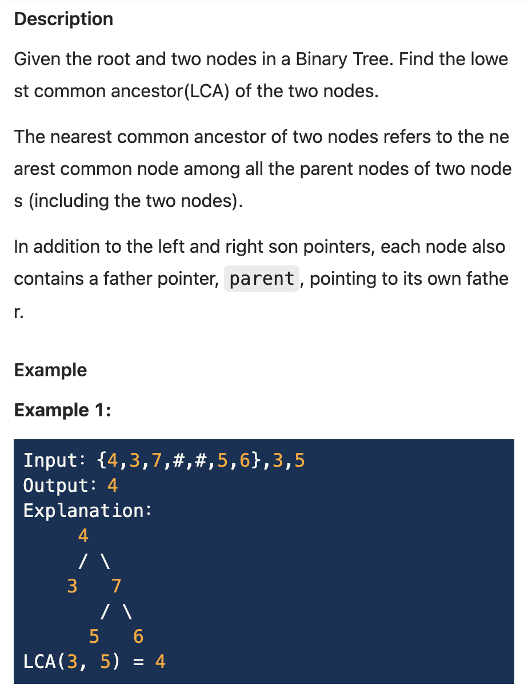

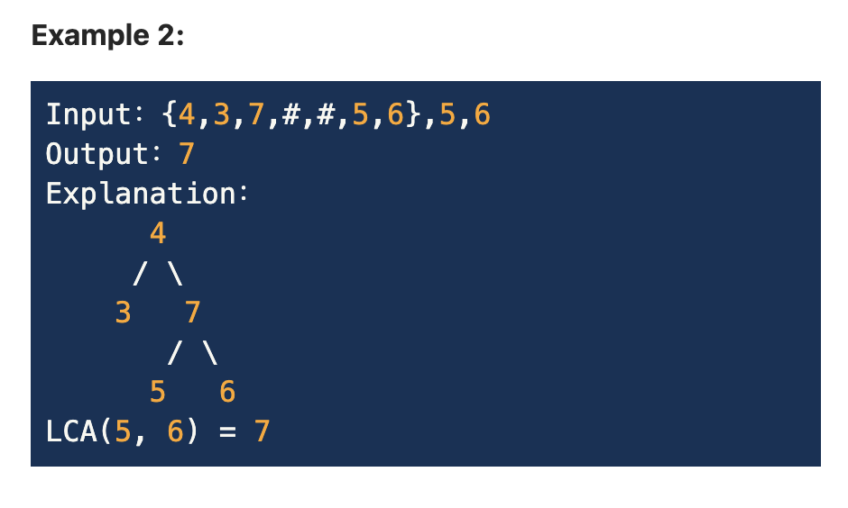

.. hint::
    - Node has parent pointer, simplifies the problem

.. note::
    - Time: :math:`O(\log n)`

    .. code-block:: python

        """
        Definition of ParentTreeNode:
        class ParentTreeNode:
            def __init__(self, val):
                self.val = val
                self.parent, self.left, self.right = None, None, None
        """

        class Solution:
            """
            @param: root: The root of the tree
            @param: A: node in the tree
            @param: B: node in the tree
            @return: The lowest common ancestor of A and B
            """
            def lowestCommonAncestorII(self, root, A, B):
                if not root:
                    return None
                
                path = set()
                current = A
                while current:
                    path.add(current)
                    current = current.parent
                
                current = B
                while current:
                    if current in path:
                        return current
                    current = current.parent
                return None

Lowest Common Ancestor of a Binary Tree (最近公共祖先)
======================================================

`LintCode 88 Medium <https://www.lintcode.com/problem/88/>`_

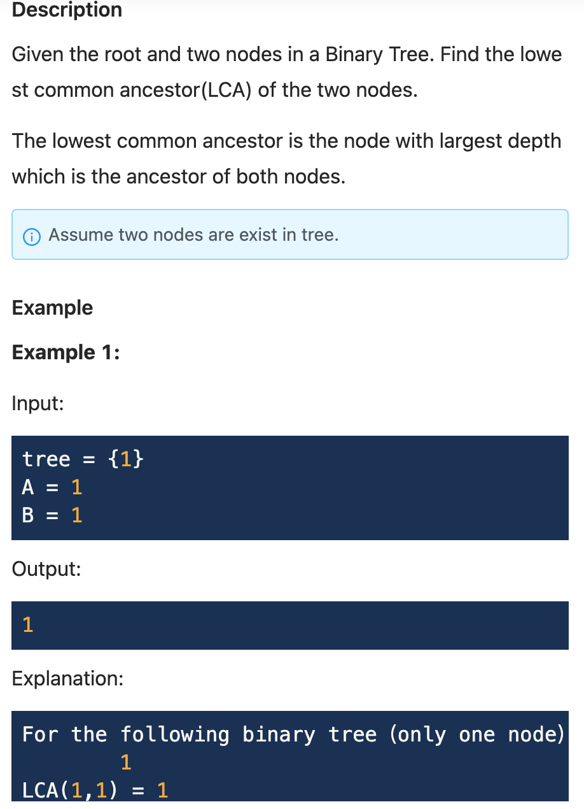

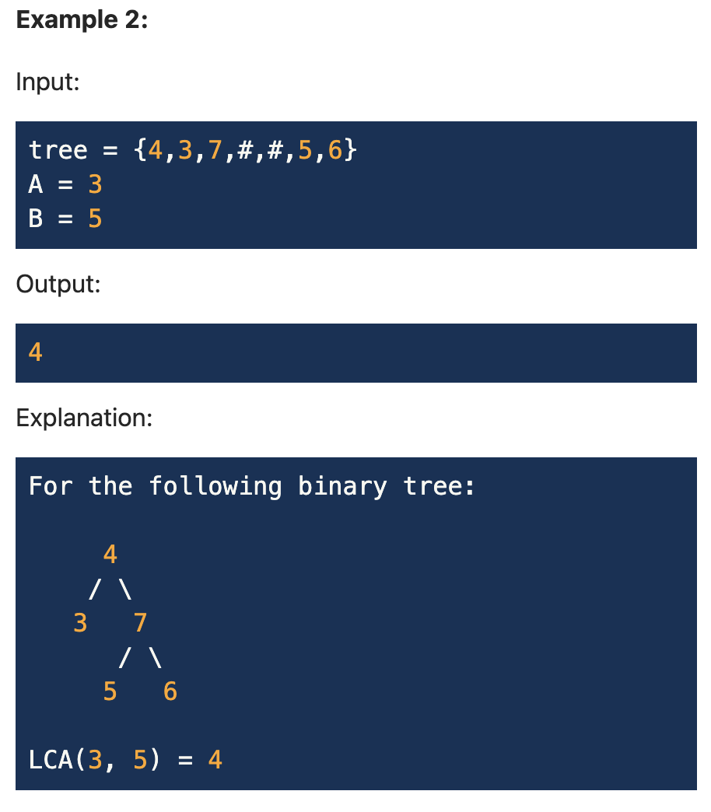

.. hint::
    - The problem guaranteed that both target nodes must exist in the tree
    - If found a target node in left tree and found a target node in right tree, root is their common ancestor
    - If found a target node in left tree and nothing in right tree, both of them in left tree, and other target must be in deeper branches
    - At this time the found target node must be their common ancestor

.. note::
    - Time: :math:`O(\log n)`

    .. code-block:: python

        """
        Definition of TreeNode:
        class TreeNode:
            def __init__(self, val):
                self.val = val
                self.left, self.right = None, None
        """

        class Solution:
            """
            @param: root: The root of the binary search tree.
            @param: A: A TreeNode in a Binary.
            @param: B: A TreeNode in a Binary.
            @return: Return the least common ancestor(LCA) of the two nodes.
            """
            def lowestCommonAncestor(self, root, A, B):
                if not root:
                    return None
                
                if root == A or root == B:
                    return root
                
                left = self.lowestCommonAncestor(root.left, A, B)
                right = self.lowestCommonAncestor(root.right, A, B)
                if left and right:
                    return root
                if left:
                    return left
                if right:
                    return right
                return None

.. caution::
    Lowest Common Ancestor

Lowest Common Ancestor III (最近公共祖先III)
======================================================

`LintCode 578 Medium <https://www.lintcode.com/problem/578/>`_

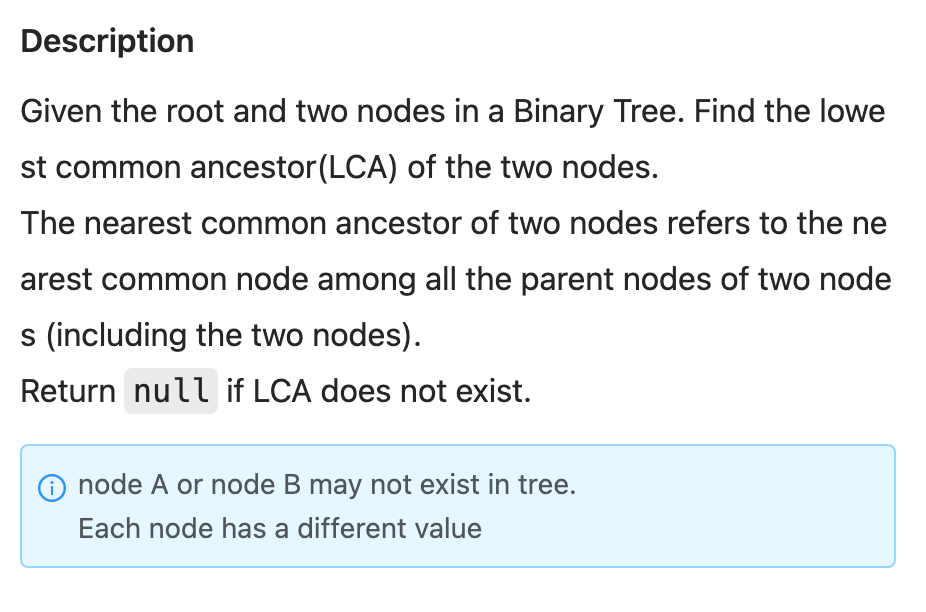

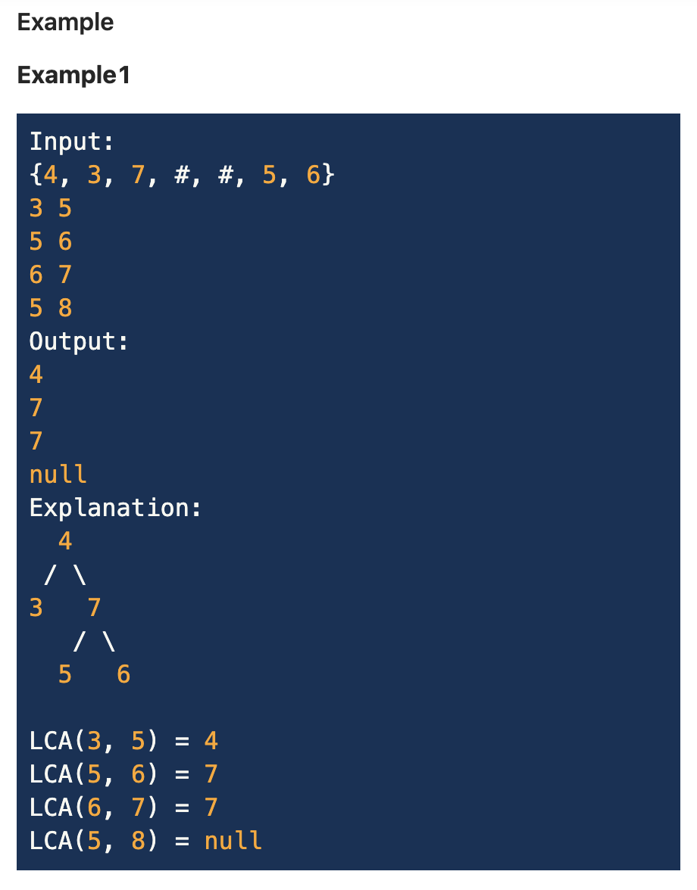

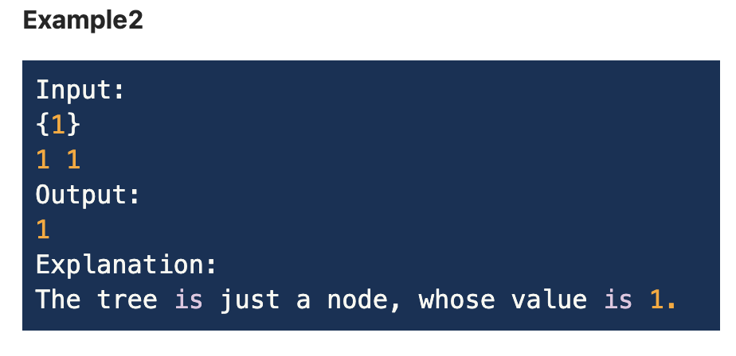

.. hint::
    - Node is not guaranteed to be in the tree
    - Must return a boolean to indicate whether a target node is actually found inside the tree
    - The search function dfs to branch end, guarantee to find target node if exist in that branch
    - The exist flag indicate whether the target node is found
    - Thus if any of the exist flag is not True in the end, that target node doesn't exist in the tree

.. note::
    - Time: :math:`O(\log n)`

    .. code-block:: python

        """
        Definition of TreeNode:
        class TreeNode:
            def __init__(self, val):
                this.val = val
                this.left, this.right = None, None
        """

        class Solution:
            """
            @param: root: The root of the binary tree.
            @param: A: A TreeNode
            @param: B: A TreeNode
            @return: Return the LCA of the two nodes.
            """
            def lowestCommonAncestor3(self, root, A, B):
                if not root:
                    return None
                a_flag, b_flag, node = self.find_ancestor(root, A, B)
                return node if a_flag and b_flag else None

            def find_ancestor(self, root, A, B):
                if root is None:
                    return False, False, None
                
                left_a, left_b, lnode = self.find_ancestor(root.left, A, B)
                right_a, right_b, rnode = self.find_ancestor(root.right, A, B)

                a_flag = left_a or right_a or root == A
                b_flag = left_b or right_b or root == B

                if root == A or root == B:
                    return a_flag, b_flag, root
                
                if lnode is not None and rnode is not None:
                    return a_flag, b_flag, root
                if lnode is not None:
                    return a_flag, b_flag, lnode
                if rnode is not None:
                    return a_flag, b_flag, rnode
                return a_flag, b_flag, None

Balanced Binary Tree (平衡二叉树)
======================================

`LintCode 93 Easy <https://www.lintcode.com/problem/93/>`_

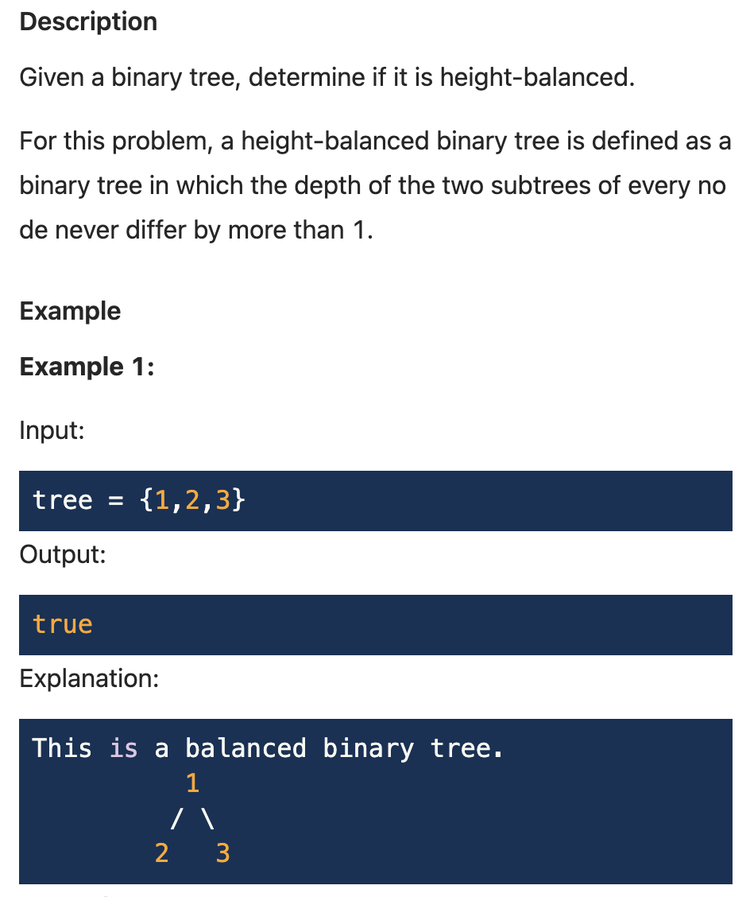

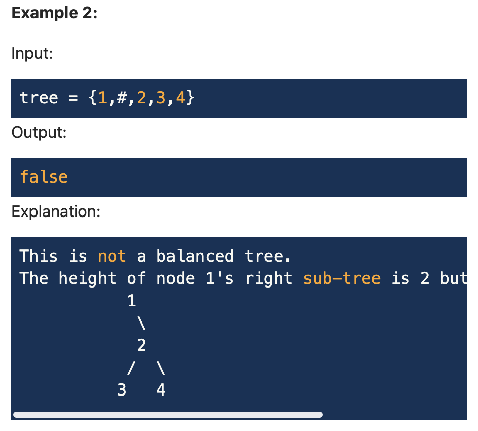

.. hint::
    Divide and Conquer

.. note::
    Time: :math:`O(n)`

    .. code-block:: python

        """
        Definition of TreeNode:
        class TreeNode:
            def __init__(self, val):
                self.val = val
                self.left, self.right = None, None
        """

        class Solution:
            """
            @param root: The root of binary tree.
            @return: True if this Binary tree is Balanced, or false.
            """
            def isBalanced(self, root):
                if not root:
                    return True
                balanced, height = self.check_height(root)
                return balanced
            
            def check_height(self, node):
                if not node:
                    return True, 0
                lbalance, lheight = self.check_height(node.left)
                rbalance, rheight = self.check_height(node.right)
                height = max(lheight, rheight) + 1
                if not lbalance or not rbalance:
                    return False, height
                if abs(lheight - rheight) > 1:
                    return False, height
                return True, height

Maximum Depth of Binary Tree (二叉树的最大深度)
=================================================

`LintCode 97 Easy <https://www.lintcode.com/problem/97/>`_

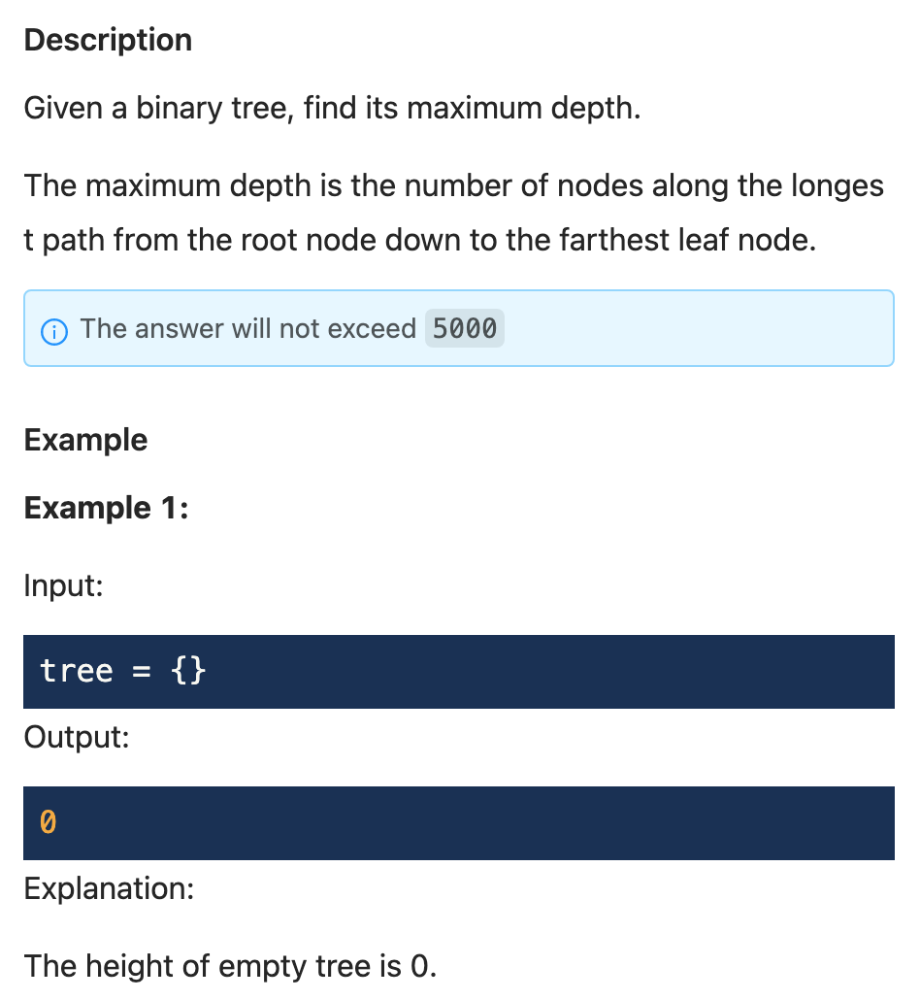

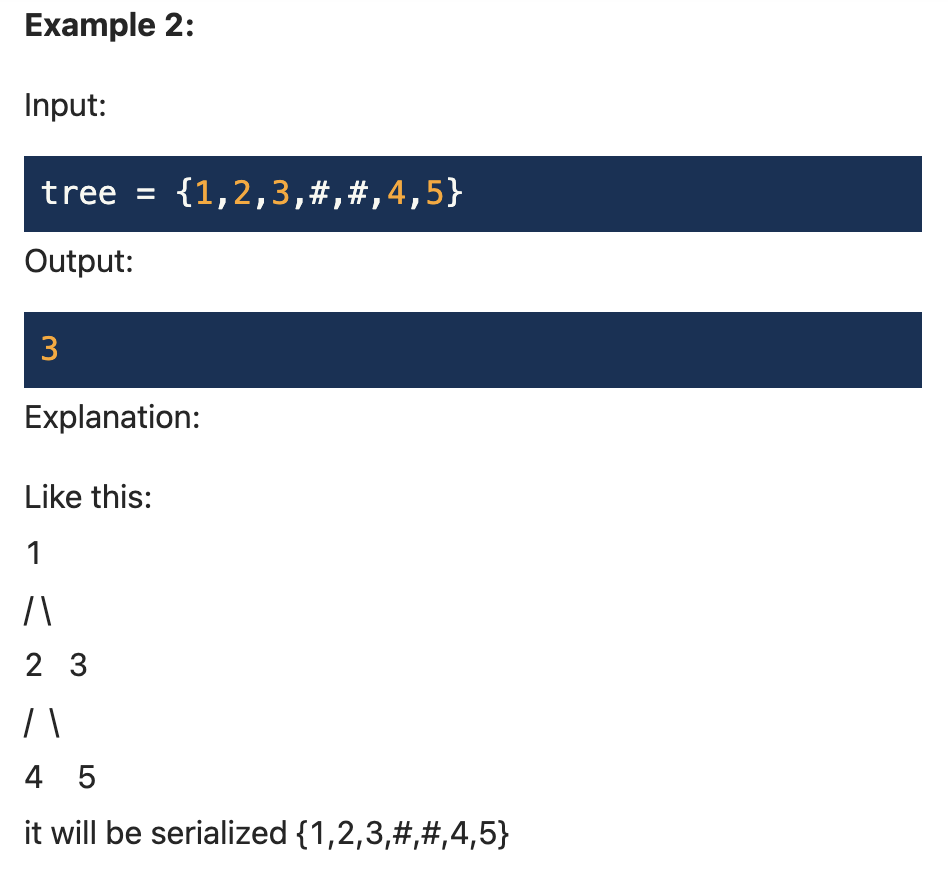

.. hint::
    Divide and Conquer

.. note::
    Time: :math:`O(n)`

    .. code-block:: python

        """
        Definition of TreeNode:
        class TreeNode:
            def __init__(self, val):
                self.val = val
                self.left, self.right = None, None
        """

        class Solution:
            """
            @param root: The root of binary tree.
            @return: An integer
            """
            def maxDepth(self, root):
                if not root:
                    return 0
                return self.find_height(root)
            
            def find_height(self, node):
                if not node:
                    return 0

                return max(self.find_height(node.left), self.find_height(node.right)) + 1

Minimum Subtree (最小子树)
=================================================

`LintCode 596 Easy <https://www.lintcode.com/problem/596/>`_

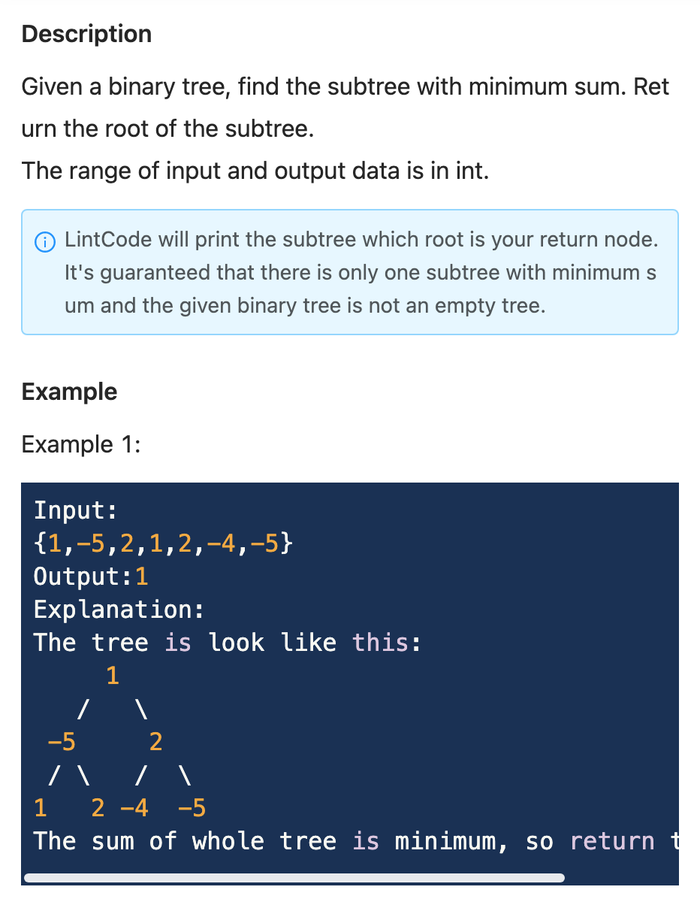

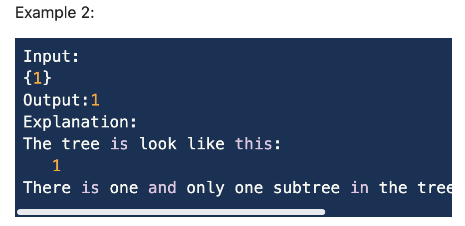

.. hint::
    Divide and Conquer

.. note::
    - Time: :math:`O(\log n)`

    .. code-block:: python

        """
        Definition of TreeNode:
        class TreeNode:
            def __init__(self, val):
                self.val = val
                self.left, self.right = None, None
        """

        class Solution:
            """
            @param root: the root of binary tree
            @return: the root of the minimum subtree
            """
            def findSubtree(self, root):
                if not root:
                    return None
                
                total, best, node = self.get_min_subtree(root)
                return node
                
            def get_min_subtree(self, root):
                if not root:
                    return 0, sys.maxsize, None
                
                lsum, lbest, lnode = self.get_min_subtree(root.left)
                rsum, rbest, rnode = self.get_min_subtree(root.right)
                total = lsum + rsum + root.val
                best = min([total, lbest, rbest])

                if best == lbest:
                    return total, lbest, lnode
                elif best == rbest:
                    return total, rbest, rnode
                else:
                    return total, total, root

Maximum Subtree (最大子树)
=================================================

`LintCode 628 Easy <https://www.lintcode.com/problem/628/>`_

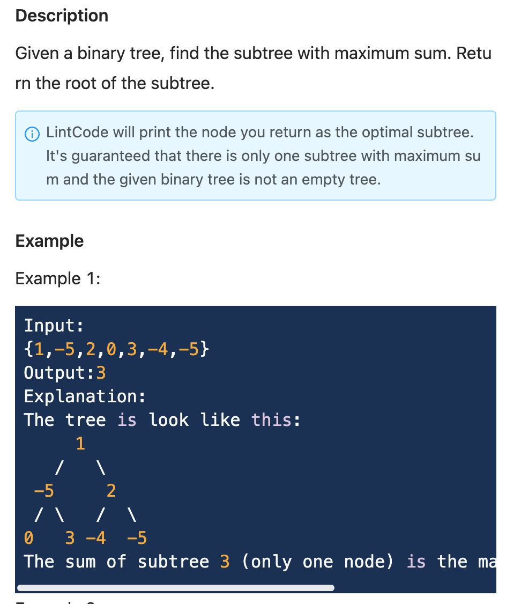

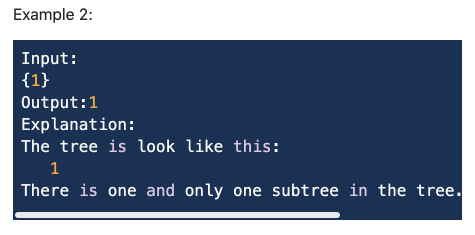

.. hint::
    Divide and Conquer

    - Note that subtree contains root + left subtree + right subtree
    - The problem requires **best node** as a result
    - When divide problem, keep passing parameters and problem definition the same
    - As a result, the three parameters needed are: subtree sum, best sum, best node

.. note::
    Time: :math:`O(n)`

    .. code-block:: python

        """
        Definition of TreeNode:
        class TreeNode:
            def __init__(self, val):
                self.val = val
                self.left, self.right = None, None
        """

        class Solution:
            """
            @param root: the root of binary tree
            @return: the maximum weight node
            """
            def findSubtree(self, root):
                if not root:
                    return None
                total, best, node = self.find_max_tree(root)
                return node
            
            def find_max_tree(self, node):
                if not node:
                    return 0, sys.minsize, None
                lsum, lbest, lnode = self.find_max_tree(node.left)
                rsum, rbest, rnode = self.find_max_tree(node.right)
                print(lsum, lbest, rsum, rbest)
                total = node.val + lsum + rsum
                final = max([total, lbest, rbest])
                if final == total:
                    return total, total, node
                if final == lbest:
                    return total, lbest, lnode
                if final == rbest:
                    return total, rbest, rnode

Binary Tree Structure Change(改变二叉树)
**********************************************

Flatten Binary Tree to Linked List(将二叉树拆成链表)
======================================================

`LintCode 453 Easy <https://www.lintcode.com/problem/453/>`_

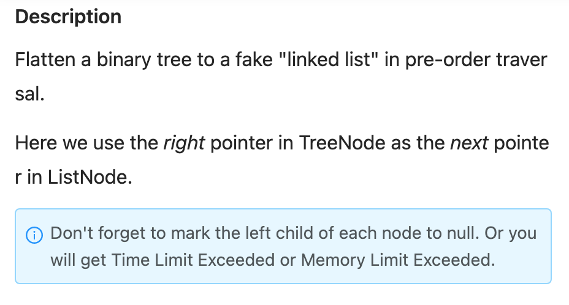

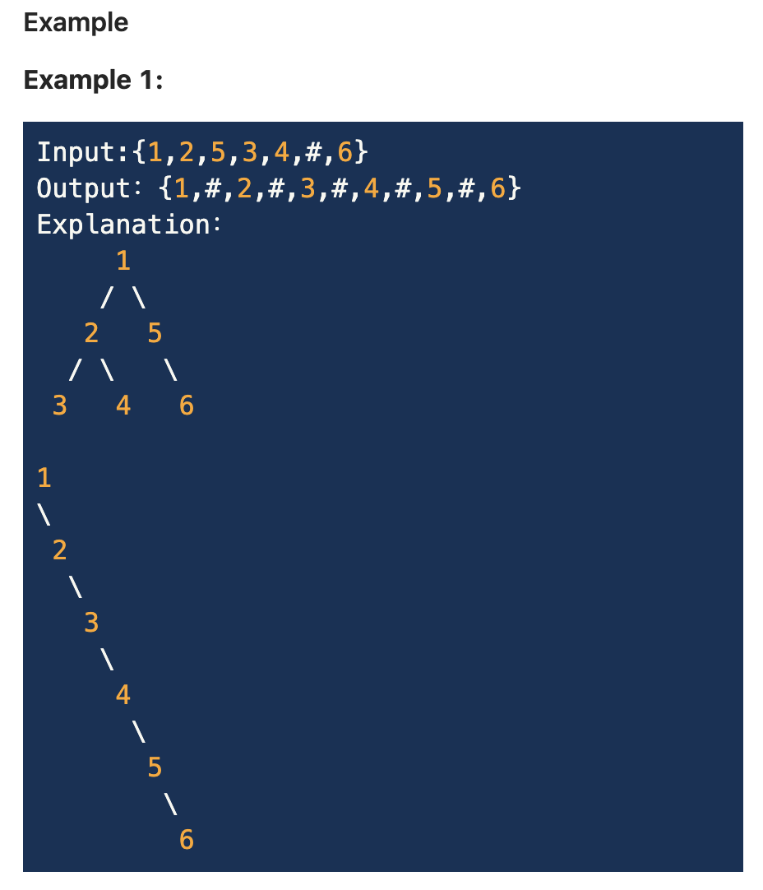

.. hint::
    - Pre order traverse on binary tree
    - Each time do "root -> left subtree -> right subtree"
    - Note that root.left and root.right which is subtree head is already known
    - Return subtree tail is fine
    - If left subtree is empty, right subtree is already connected at root.right

.. note::
    - Time: :math:`O(n)`

    .. code-block:: python

        """
        Definition of TreeNode:
        class TreeNode:
            def __init__(self, val):
                self.val = val
                self.left, self.right = None, None
        """

        class Solution:
            """
            @param root: a TreeNode, the root of the binary tree
            @return: nothing
            """
            def flatten(self, root):
                if not root:
                    return None
                return self.rebuild(root)
            
            def rebuild(self, root):
                if not root:
                    return None

                ltail = self.rebuild(root.left)
                rtail = self.rebuild(root.right)
                if ltail:
                    ltail.right = root.right
                    root.right = root.left
                    root.left = None
                return rtail or ltail or root

Binary Search Tree (二叉查找树)
************************************

.. danger::

    - A binary search in order traverse is **strictly monotonically increasing**
    - :math:`O(n)` to find min node if the binary search tree is a left link
    - :math:`O(\log n)` for height if the binary search tree is **balanced**
    - DFS on BST
        - Pre Order
        - In Order
        - Post Order

BST TreeNode
================

.. note::

    .. code-block:: python

        class TreeNode:
            def __init__(self, val):
                self.val = val
                self.left, self.right = None, None

BST TreeNode Search
=====================

.. note::

    .. code-block:: python

        def searchBST(root, val):
            if not root:
                return None # 未找到值为val的节点
            if val < root.val:
                return searchBST(root.left, val) # val小于根节点值，在左子树中查找哦
            elif val > root.val:
                return searchBST(root.right, val) # val大于根节点值，在右子树中查找
            else:
                return root

BST TreeNode Update
=====================

.. note::

    .. code-block:: python

        def updateBSTBST(root, target, val):
            if not root:
                return  # 未找到target节点
            if target < root.val:
                updateBST(root.left, target, val) # target小于根节点值，在左子树中查找哦
            elif target > root.val:
                updateBST(root.right, target, val) # target大于根节点值，在右子树中查找
            else:  # 找到了
                root.val = val

BST TreeNode Insert
=====================

.. note::

    .. code-block:: python

        def insertNode(root, node):
            if not root:
                return node
            if root.val > node.val:
                root.left = insertNode(root.left, node)
            else:
                root.right = insertNode(root.right, node)
            return root

BST TreeNode Delete
=====================

.. hint::

    - 考虑待删除的节点为叶子节点，可以直接删除并修改父亲节点(Parent Node)的指针，需要区分待删节点是否为根节点
    - 考虑待删除的节点为单支节点(只有一棵子树——左子树 or 右子树)，与删除链表节点操作类似，同样的需要区分待删节点是否为根节点
    - 考虑待删节点有两棵子树，可以将待删节点与右子树中的最小节点进行交换，由于右子树中的最小节点一定为叶子节点，所以这时再删除待删的节点可以参考第一条
    - http://www.algolist.net/Data_structures/Binary_search_tree/Removal

.. note::

    .. code-block:: python

        def removeNode(root, value):
            dummy = TreeNode(0)
            dummy.left = root
            parent = findNode(dummy, root, value)
            node = None
            if parent.left and parent.left.val == value:
                node = parent.left
            elif parent.right and parent.right.val == value:
                node = parent.right
            else:
                return dummy.left
            deleteNode(parent, node)
            return dummy.left

        def findNode(parent, node, value):
            if not node:
                return parent
            if node.val == value:
                return parent
            if value < node.val:
                return findNode(node,node.left, value)
            else:
                return findNode(node, node.right, value)

        def deleteNode(parent, node):
            if not node.right:
                if parent.left == node:
                    parent.left = node.left
                else:
                    parent.right = node.left
            else:
                temp = node.right
                father = node
                while temp.left:
                    father = temp
                    temp = temp.left
                if father.left == temp:
                    father.left = temp.right
                else:
                    father.right = temp.right
                if parent.left == node:
                    parent.left = temp
                else:
                    parent.right = temp
                temp.left = node.left
                temp.right = node.right
                

Search Range in Binary Search Tree
=========================================

`LintCode 11 Medium <https://www.lintcode.com/problem/11/>`_

Two Sum IV - Input is a BST
=========================================

`LintCode 689 Medium <https://www.lintcode.com/problem/689/>`_

Trim a Binary Search Tree
=========================================

`LintCode 701 Medium <https://www.lintcode.com/problem/701/>`_

Binary Search Tree Iterator (二叉查找树迭代器)
======================================================

`LintCode 86 Hard <https://www.lintcode.com/problem/86/>`_

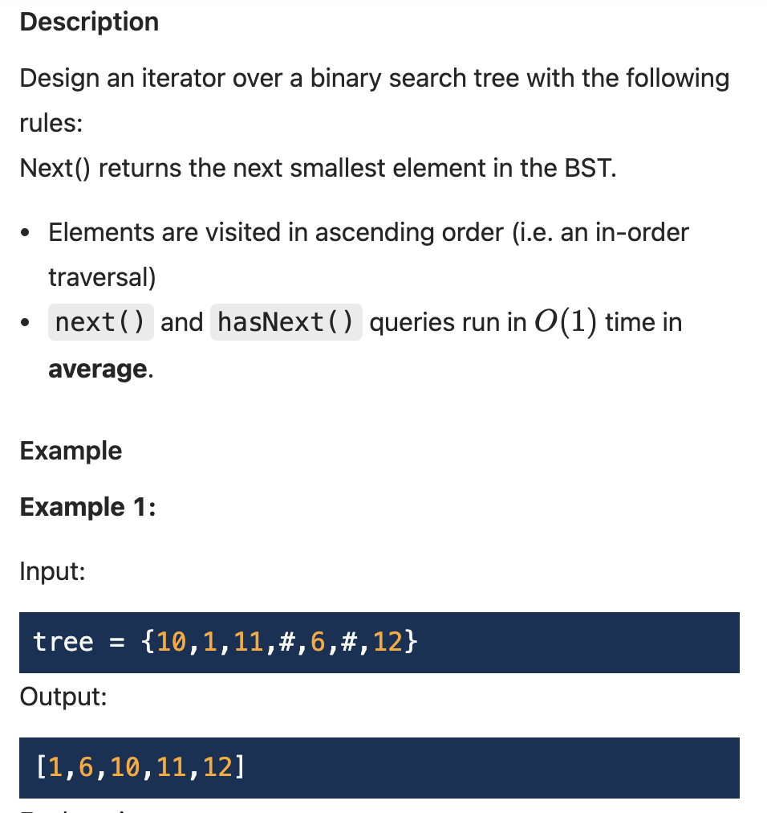

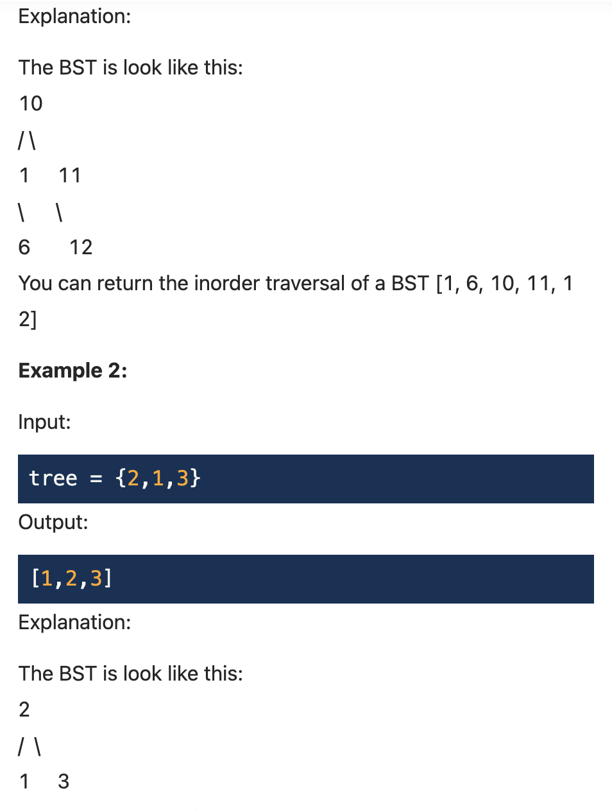

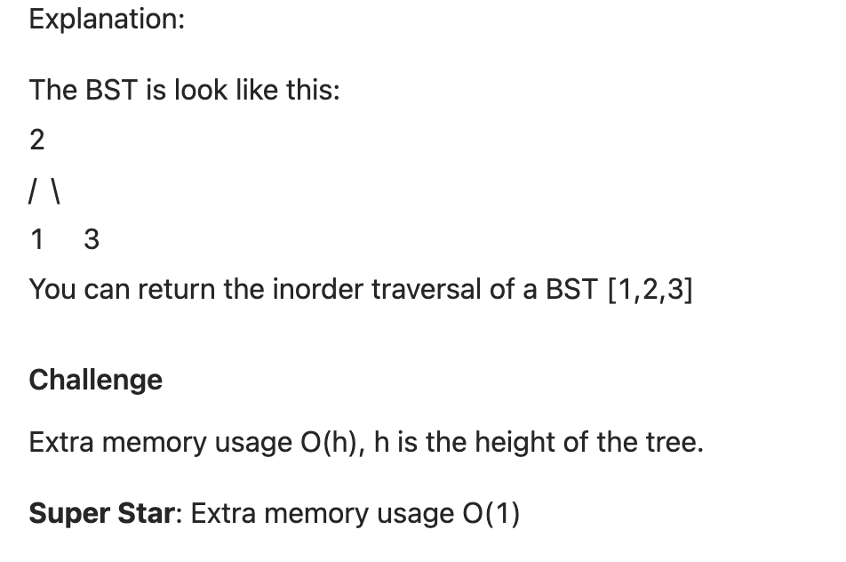

.. hint::
    Non-Recursive

    - When converting from recursive to non-recursive, must write manual stack to replace original stack
    - Min node in BST: the left most node from root, keep left() until :code:`left() == null`
    - :code:`hasNext()`
        - :code:`stack[-1]` always saves the current iterator pointer
        - Check if stack has any value gives whether there is next
    - In order next
        - If current node has right subtree
            - Inside right subtree, go to left most path
            - Save every node along path to stack, as these nodes are larger than left most node and havn't been visited
            - left most node inside right subtree is next node, saved at :code:`stack[-1]`
        - If current node has no right subtree
            - pop iterator current pointer in stack: :code:`stack[-1]`
            - Keep peeking stack top, backtrack to **first right turning point** (:math:`A<^B_C` shape)
            - 右拐点A is a left child of some parent, A is the next node
        - Note
            - When stack top has right subtree, stack top is not popped until next backtrack
            - When stack top has not right subtree, pop until encounter a stack top that is a left child
            - Stack can contain both visited nodes and unvisited nodes
    - In order prev
        - This implementation supports in order previous, swap every left and right position in next() function give prev()
.. note::

    - Time: 
        - :code:`next()`: :math:`O(1)` average time, :math:`O(n)` traverse tree
    - Space:
        - :math:`O(h)`, h is height

    .. code-block:: python

        """
        Definition of TreeNode:
        class TreeNode:
            def __init__(self, val):
                self.val = val
                self.left, self.right = None, None

        Example of iterate a tree:
        iterator = BSTIterator(root)
        while iterator.hasNext():
            node = iterator.next()
            do something for node 
        """

        class BSTIterator:
            """
            @param: root: The root of binary tree.
            """
            def __init__(self, root):
                self.stack = []
                self.left_most(root)

            def left_most(self, node):
                while node:
                    self.stack.append(node)
                    node = node.left

            """
            @return: True if there has next node, or false
            """
            def hasNext(self):
                return len(self.stack) > 0

            """
            @return: return next node
            """
            def _next(self):
                node = self.stack[-1]
                if node.right is not None:
                    n = node.right
                    while n is not None:
                        self.stack.append(n)
                        n = n.left
                else:
                    n = self.stack.pop()
                    while self.stack and self.stack[-1].right == n:
                        n = self.stack.pop()
                return node

.. hint::
    Optimization

    - In order next
        - pop iterator current pointer in stack: :code:`stack[-1]`
        - If current node has right subtree
            - Inside right subtree, go to left most path
            - Save every node along path to stack, as these nodes are larger than left most node and havn't been visited
            - left most node inside right subtree is next node, saved at :code:`stack[-1]`
        - If current node has no right subtree
            - Stack top is always the next node
        - Note
            - In this implementation the stack always contain **unvisited node** only

.. caution::
    Time: :math:`O(1)` for next

    .. code-block:: python

        """
        Definition of TreeNode:
        class TreeNode:
            def __init__(self, val):
                self.val = val
                self.left, self.right = None, None

        Example of iterate a tree:
        iterator = BSTIterator(root)
        while iterator.hasNext():
            node = iterator.next()
            do something for node 
        """

        class BSTIterator:
            """
            @param: root: The root of binary tree.
            """
            def __init__(self, root):
                self.stack = []
                self.next_min(root)

            def next_min(self, node):
                while node:
                    self.stack.append(node)
                    node = node.left

            """
            @return: True if there has next node, or false
            """
            def hasNext(self):
                return len(self.stack) > 0

            """
            @return: return next node
            """
            def _next(self):
                node = self.stack.pop()
                if node.right:
                    self.next_min(node.right)
                return node

Closest Binary Search Tree Value (二叉搜索树中最接近的值)
===========================================================

`LintCode 900 Hard <https://www.lintcode.com/problem/900/>`_

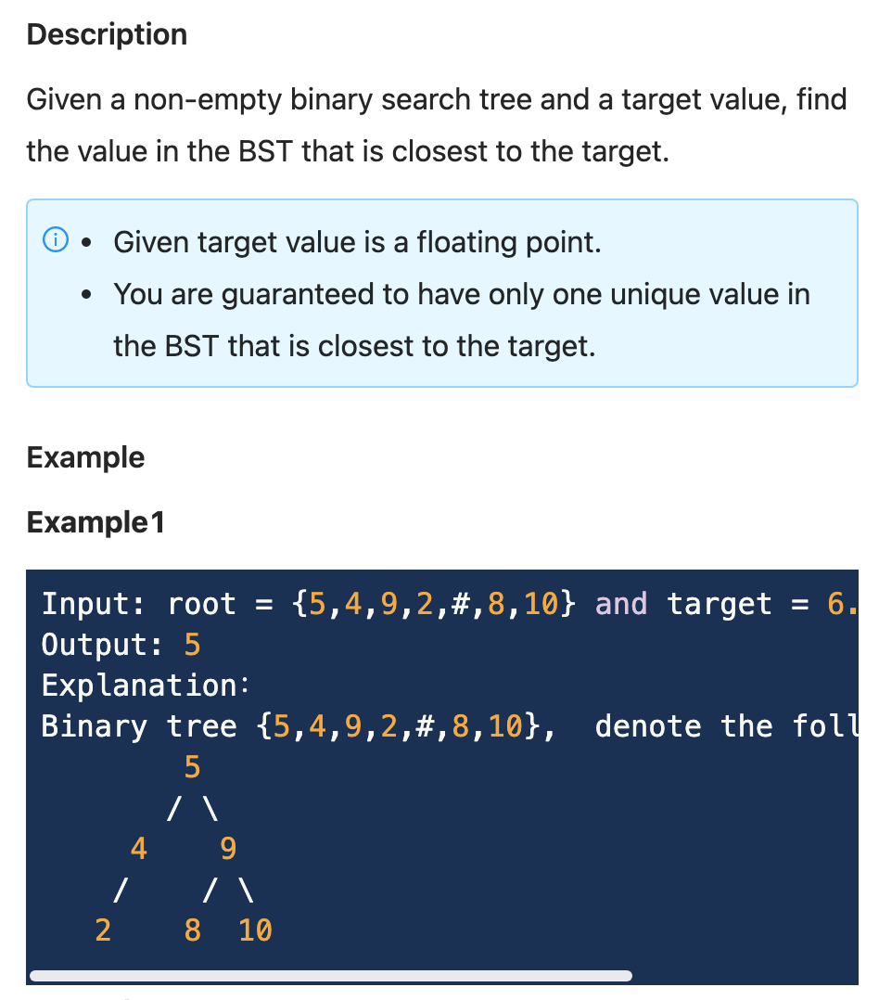

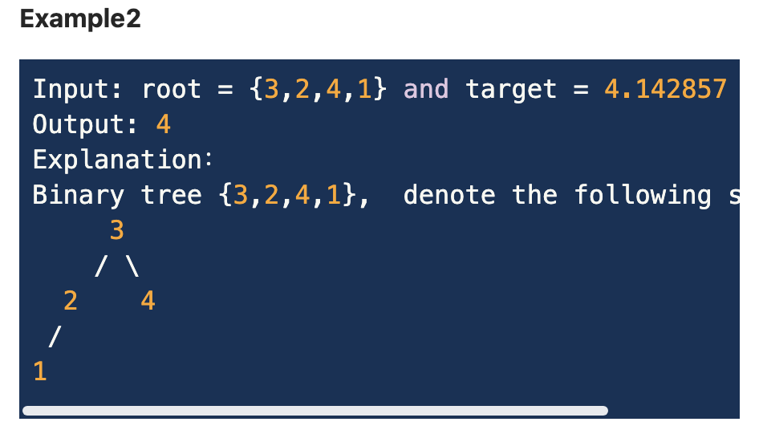

.. hint::
    Binary Search Tree Iterator

    - Absolute subtraction
        - Note that :code:`lsub, rsub` has to have :code:`abs()`
        - When target is larger than right most node in bst
        - :code:`next_pt` never moved and is root
        - :code:`prev_pt` according to last comparison is right most node, max in bst
        - Now :code:`next_pt.val < prev_pt.val < target`
        - Must use :code:`abs()` to get distance
.. note::
    Time: :math:`O(h)` for height h

    .. code-block:: python

        """
        Definition of TreeNode:
        class TreeNode:
            def __init__(self, val):
                self.val = val
                self.left, self.right = None, None
        """

        class Solution:
            """
            @param root: the given BST
            @param target: the given target
            @return: the value in the BST that is closest to the target
            """
            def closestValue(self, root, target):
                if not root:
                    return -1
                node = root
                prev_pt = root
                next_pt = root
                while node:
                    if node.val > target:
                        next_pt = node
                        node = node.left
                    elif node.val < target:
                        prev_pt = node
                        node = node.right
                    else:
                        return node.val
                lsub = abs(target - prev_pt.val)
                usub = abs(next_pt.val - target)
                return prev_pt.val if lsub < usub else next_pt.val

Closest Binary Search Tree Value II (二叉搜索树中最接近的值II)
================================================================

`LintCode 901 Hard <https://www.lintcode.com/problem/901/>`_

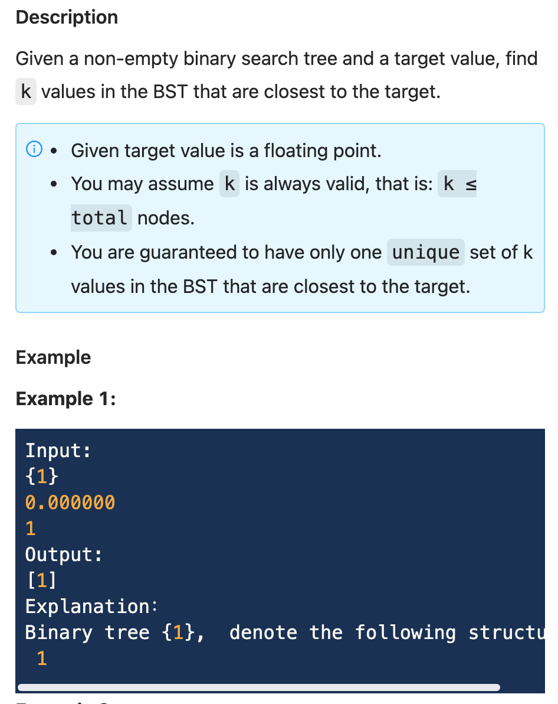

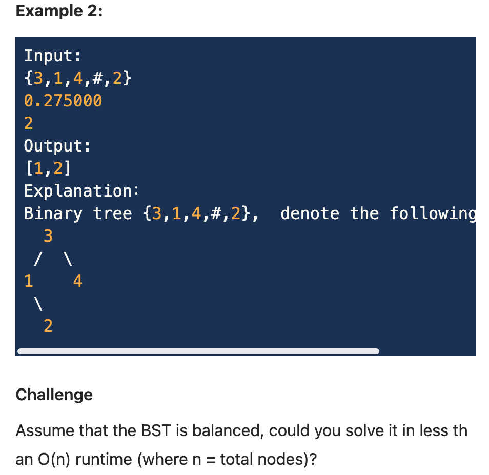

.. hint::
    Binary Search Tree Iterator

    - Fake Insert Target
        - Use :code:`get_stack()` function to fake insert target inside BST
        - Depending on node value, put into either :code:`prev_stack` or :code:`next_stack`
    - :code:`get_next()`
        - Use :code:`next_stack` to find next node
        - If stack top has right subtree, get left most node in right subtree
        - If stack top has no right subtree, keep popping stack until a left child appear as stack top (right turning point)
        - Because all right child nodes should already be in :code:`prev_stack`, so new stack top in :code:`next_stack` should be next node
    - :code:`get_prev()`
        - Use :code:`prev_stack` to find prev node
        - If stack top has left subtree, get right most node in left subtree
        - If stack top has no left subtree, keep popping stack until a right child appear as stack top (left turning point)
        - Because all left child nodes should already be in :code:`next_stack`, so new stack top in :code:`prev_stack` should be prev node
    - Get :code:`k` answers
        - for :code:`k` times
        - compare :code:`prev_stack, next_stack` stack top values
        - put the closer to target one into results

.. note::
    - Time: :math:`O(h + k)`, :math:`O(h)` for search tree, :math:`O(k)` for get :code:`k` results
    - Space: :math:`O(h)` for both stacks

    .. code-block:: python

        """
        Definition of TreeNode:
        class TreeNode:
            def __init__(self, val):
                self.val = val
                self.left, self.right = None, None
        """

        class Solution:
            def __init__(self):
                self.prev_stack = []
                self.next_stack = []

            """
            @param root: the given BST
            @param target: the given target
            @param k: the given k
            @return: k values in the BST that are closest to the target
            """
            def closestKValues(self, root, target, k):
                if not root:
                    return []
                self.get_position(root, target)
                result = []
                for _ in range(k):
                    if not self.next_stack and not self.prev_stack:
                        break
                    next_dist = sys.maxsize if not self.next_stack else abs(self.next_stack[-1].val - target)
                    prev_dist = sys.maxsize if not self.prev_stack else abs(self.prev_stack[-1].val - target)

                    if next_dist > prev_dist:
                        result.append(self.get_prev())
                    else:
                        result.append(self.get_next())
                return result

            
            def get_position(self, node, target):
                while node:
                    if node.val > target:
                        self.next_stack.append(node)
                        node = node.left
                    else:
                        self.prev_stack.append(node)
                        node = node.right
            
            def get_next(self):
                value = self.next_stack[-1].val
                node = self.next_stack.pop().right
                while node:
                    self.next_stack.append(node)
                    node = node.left
                return value

            def get_prev(self):
                value = self.prev_stack[-1].val
                node = self.prev_stack.pop().left
                while node:
                    self.prev_stack.append(node)
                    node = node.right
                return value

Kth Smallest Element in a BST (BST中第K小的元素)
===========================================================

`LintCode 902 Medium <https://www.lintcode.com/problem/902/>`_

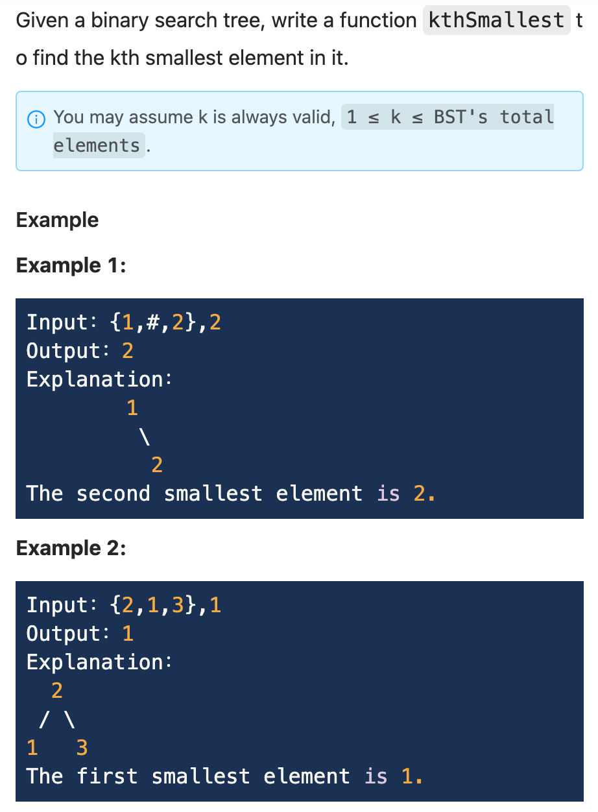

.. hint::
    In order traverse

.. note::
    - Time: :math:`O(n)`

    .. code-block:: python

        """
        Definition of TreeNode:
        class TreeNode:
            def __init__(self, val):
                self.val = val
                self.left, self.right = None, None
        """

        class Solution:
            """
            @param root: the given BST
            @param k: the given k
            @return: the kth smallest element in BST
            """
            def kthSmallest(self, root, k):
                if not root:
                    return -1
                
                stack = []
                while root:
                    stack.append(root)
                    root = root.left
                for i in range(k - 1):
                    node = stack.pop()
                    if node.right:
                        node = node.right
                        while node:
                            stack.append(node)
                            node = node.left
                        
                return stack[-1].val