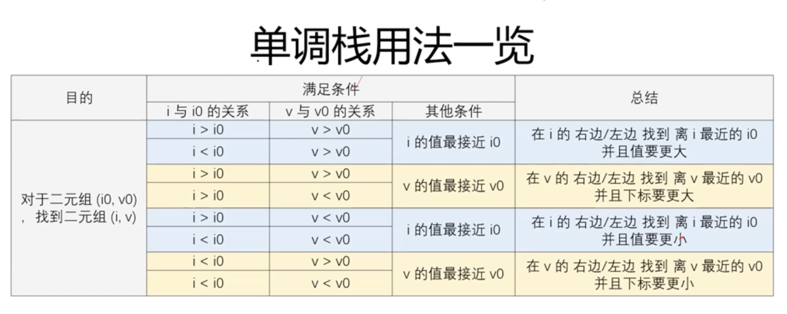
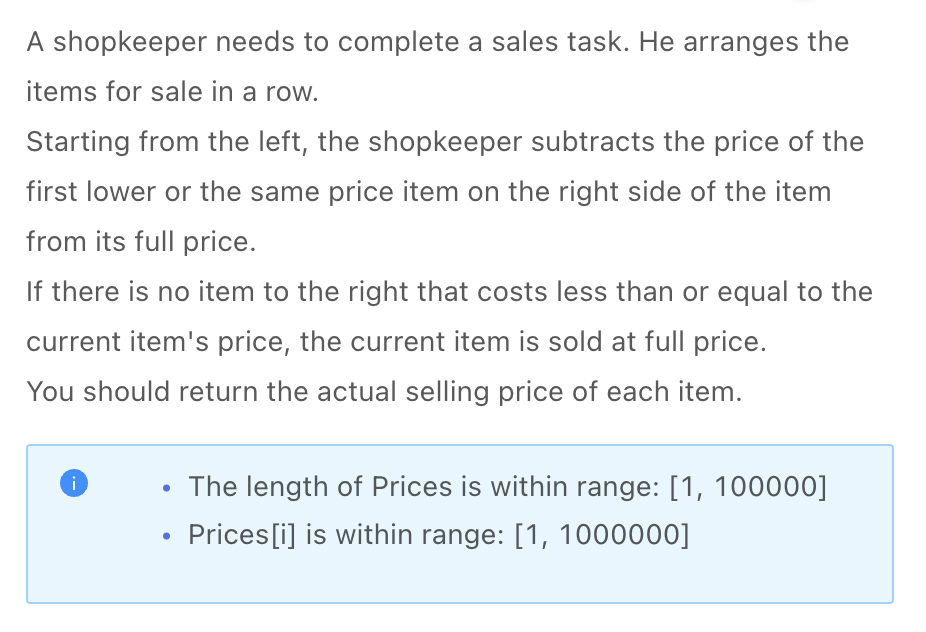
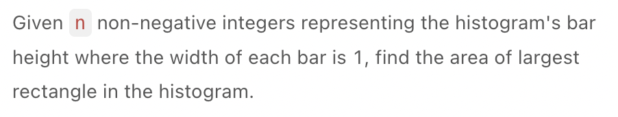
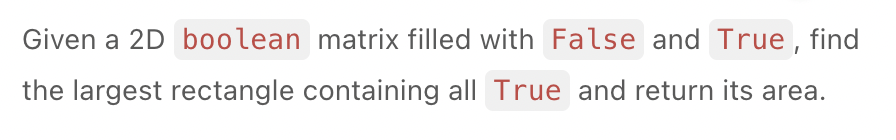
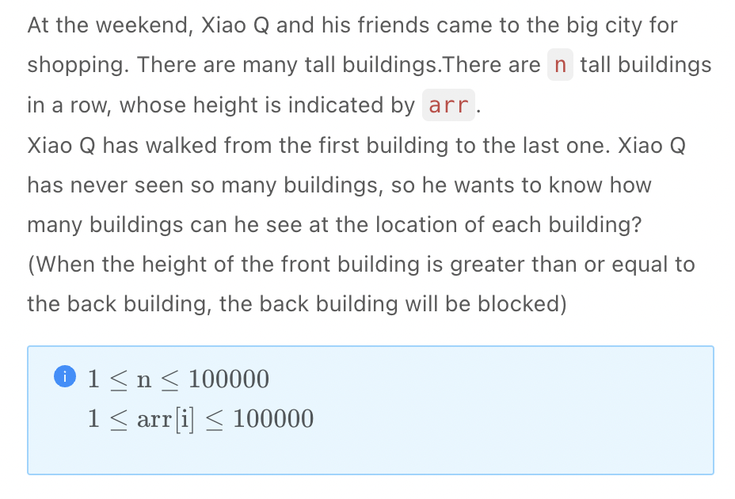
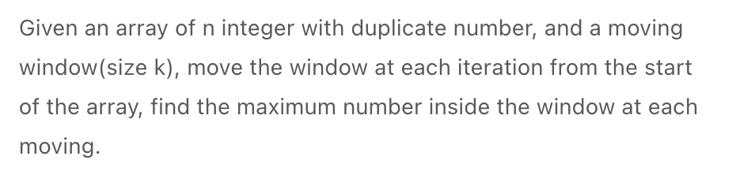
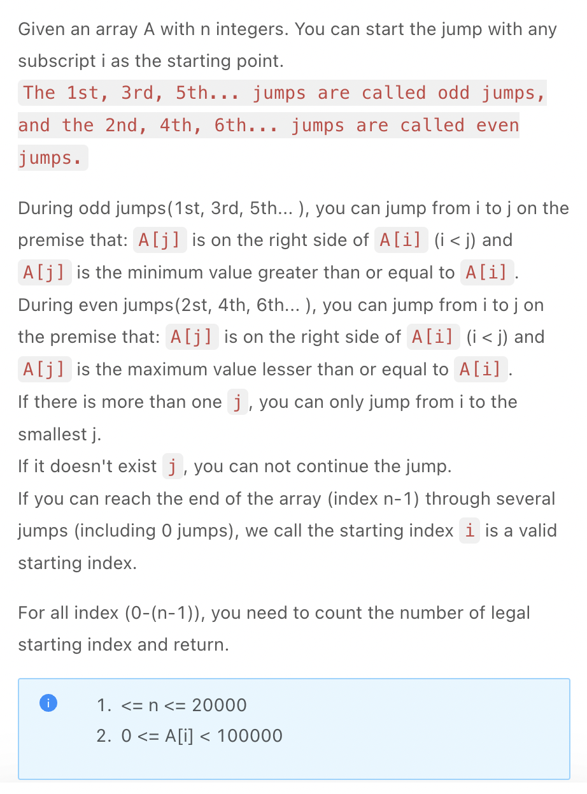

.. include:: ../_static/.special.rst

#####################
Monotonic Stack/Queue
#####################

.. contents:: Table of Contents
   :depth: 2

Summmary
********

Use Case
========

.. warning::
    - 对于数组中某个元素, 找到它左边或者右边 **离它最近的** 一个 **比它大** 或者 **比它小** 的数字
    - 时间复杂度 :code:`O(n)`
    - 需要 :math:`O(1)` 时间 **弹出栈底元素** 时, 应该使用 **双向队列** :code:`deque` 实现 **单调队列**

Definition
==========

.. hint::

    - 使用栈
    - 栈内元素按某种特征排列: 通常为单调递增或递减
    - 扫描数据时实时维护栈内排列

.. note::

    .. code-block:: python

        # 单调栈递增
        for i in range(n):
            while 栈非空 and 插入元素 <= 栈顶元素:
                # 记录答案
                # 此元素会破坏单调性, 需要弹出
                stack.pop()
            stack.push(i)

Directional Mono Stack
**********************

.. contents:: Table of Contents
   :depth: 2
   :local:
   :backlinks: none

Use Case
========

.. warning::
   - 使用单调栈寻找紧邻当前值的更大/更小值
   - 注意可以从两个方向分别进行一次单调栈维护来获取值

Problem
=======

:problem:`Final Discounted Price (最终优惠价)`
-------------------------------------------------------------------------------------------

`LintCode 1852 Medium <https://www.jiuzhang.com/problem/final-discounted-price/>`_

.. code-block:: bash

    Example 1:

    Input:
    Prices = [2, 3, 1, 2, 4, 2]
    Output: 
    [1, 2, 1, 0, 2, 2]
    Explanation: 
    The item 0 and 1 are each discounted by 1 unit, The item 3 at 2 units, is discounted 2 units, as would the item 4 at 4 units. 

    Example 2:

    Input:
    Prices = [1, 2, 3, 4, 5]
    Output:
    [1, 2, 3, 4, 5]
    Explanation: 
    each item should keep full price beacause there are not equal or lower priced items to the right

.. danger::
    - 单调栈模板题

:solution:`1852 Monotonic Stack`
^^^^^^^^^^^^^^^^^^^^^^^^^^^^^^^^

.. hint::
    - 使用单调栈时栈内存入 **下标**

.. note::

    .. code-block:: python

        class Solution:
            """
            @param prices: a list of integer
            @return: return the actual prices
            """
            def FinalDiscountedPrice(self, prices):
                stack = []
                result = list(prices)

                for i in range(len(prices)):
                    while stack and prices[stack[-1]] >= prices[i]:
                        result[stack[-1]] = prices[stack[-1]] - prices[i]
                        stack.pop()
                    stack.append(i)
                return res

.. _lint-122-problem:

:problem:`Largest Rectangle in Histogram (直方图最大矩形覆盖)`
-------------------------------------------------------------------------------------------

`LintCode 122 Hard <https://www.jiuzhang.com/problem/largest-rectangle-in-histogram/>`_

.. code-block:: bash

    Example 1:

    Input:

    height = [2,1,5,6,2,3]
    Output:

    10
    Explanation:

    The third and fourth rectangular truncated rectangle has an area of 2*5=10.

    Example 2:

    Input:

    height = [1,1]
    Output:

    2
    Explanation:

    The first and second rectangular truncated rectangle has an area of 2*1=2.

:solution:`122 Mono Stack`
^^^^^^^^^^^^^^^^^^^^^^^^^^

.. hint::
    - 直方图面积之间没有推导关系, 动态规划不适用
    - 枚举矩形左下角发现, 当前直方的高度决定了矩形大小, 其左右边是 **左右方向上第一个高度比当前高度小的直方边缘**
    - 发现此问题转化为: 枚举高度, 并找到 **左右方向上第一个比当前高度小的位置** , 通过位置差算出矩形宽

.. note::

    .. code-block:: python

        class Solution:
            """
            @param heights: A list of integer
            @return: The area of largest rectangle in the histogram
            """
            def largest_rectangle_area(self, heights: List[int]) -> int:
                if not heights:
                    return 0
                n = len(heights)
                result = 0
                stack = []
                # 多加一个末尾工具位来保证pop出栈中的所有元素
                for i in range(n + 1):
                    value = heights[i] if i < n else -1
                    while stack and heights[stack[-1]] > value:
                        top = stack.pop()
                        left = stack[-1] if stack else -1
                        width = i - left - 1
                        result = max(result, width * heights[top])
                    stack.append(i)
                return result

:problem:`Maximal Rectangle (最大矩形)`
-------------------------------------------------------------------------------------------

`LintCode 510 Hard <https://www.jiuzhang.com/problem/maximal-rectangle/>`_

.. code-block:: bash

    Example 1

    Input:
    [
    [1, 1, 0, 0, 1],
    [0, 1, 0, 0, 1],
    [0, 0, 1, 1, 1],
    [0, 0, 1, 1, 1],
    [0, 0, 0, 0, 1]
    ]
    Output: 6
    Example 2

    Input:
    [
        [0,0],
        [0,0]
    ]
    Output: 0

:solution:`510 Monotonic Stack`
^^^^^^^^^^^^^^^^^^^^^^^^^^^^^^^

.. seealso::
   - 前置问题: :ref`lint-122-problem`

.. hint::

    - 可转化为遍历矩阵每一行, 寻找可作为底边的一行, 使问题转化为 :ref:`lint-122-problem`
    - 枚举每一行作为直方图的x轴时, 更新直方图的高度

      - 此行为1, 高度 += 1
      - 此行为0, 高度 = 0

    - 直接使用直方图求面积

.. note::

    .. code-block:: python

        class Solution:
            """
            @param matrix: a boolean 2D matrix
            @return: an integer
            """
            def maximal_rectangle(self, matrix: List[List[bool]]) -> int:
                if not matrix or not matrix[0]:
                    return 0
                
                n, m = len(matrix), len(matrix[0])
                heights = [0] * m
                result = 0
                
                # 枚举直方图底边
                for i in range(n):
                    for j in range(m):
                        if matrix[i][j] == 1:
                            heights[j] += 1
                        else:
                            heights[j] = 0
                    
                    result = max(result, self.largest_rectangle_area(heights))
                
                return result

            def largest_rectangle_area(self, heights: List[int]) -> int:
                if not heights:
                    return 0
                n = len(heights)
                result = 0
                stack = []
                # 多加一个末尾工具位来保证pop出栈中的所有元素
                for i in range(n + 1):
                    value = heights[i] if i < n else -1
                    while stack and heights[stack[-1]] > value:
                        top = stack.pop()
                        left = stack[-1] if stack else -1
                        width = i - left - 1
                        result = max(result, width * heights[top])
                    stack.append(i)
                return result

:problem:`Tall Building (高楼大厦)`
-------------------------------------------------------------------------------------------

`LintCode 285 Medium <https://www.jiuzhang.com/problem/tall-building/>`_

.. code-block:: bash

    Input:[5,3,8,3,2,5]
    Output:[3,3,5,4,4,4]
    Explanation:
    When Xiao Q is at position 0, he can see 3 tall buildings at positions 0, 1, and 2.
    When Xiao Q is at position 1, he can see  3 tall buildings at positions 0, 1, and 2.
    When Xiao Q is at position 2, he can see the building at position 0, 1 forward, and the building at position 3, 5 backward, plus the third building, a total of 5 buildings can be seen.
    When Xiao Q is at position 3, he can see 4 tall buildings in positions 2, 3, 4, and 5.
    When Xiao Q is at position 4, he can see 4 tall buildings in positions 2, 3, 4, and 5.
    When Xiao Q is at position 5, he can see 4 tall buildings in positions 2, 3, 4, and 5.

:solution:`285 Monotonic Stack`
^^^^^^^^^^^^^^^^^^^^^^^^^^^^^^^

.. hint::
    - **从左往右遍历数组** : 站在一个楼房前, 向左看一定可以看到所有 **从左到右递减** 的楼, 单调栈得 :code:`left`
    - **从右往左遍历数组** : 站在一个楼房前, 向右看一定可以看到所有 **从左到右递增** 的楼, 单调栈得 :code:`right`
    - 使用2次单调栈遍历, :code:`result = left + right + 1`
    - 考虑当两个楼房 **高度相等**, 此时比它矮的楼房看不到第二个楼房, 所以 :code:`=` 时也一样要更新栈

.. note::

    .. code-block:: python

        class Solution:
            """
            @param arr: the height of all buildings
            @return: how many buildings can he see at the location of each building
            """
            def tall_building(self, arr: List[int]) -> List[int]:
                if not arr:
                    return []
                length = len(arr)
                results = [1] * length
                self.count_building(arr, results, range(length))
                self.count_building(arr, results, range(length - 1, -1, -1))
                return results

            def count_building(self, arr, results, ranger):
                stack = []
                for i in ranger:
                    results[i] += len(stack)
                    while stack and arr[stack[-1]] <= arr[i]:
                        stack.pop(-1)
                    stack.append(i)

Monotonic Queue
**********************

.. contents:: Table of Contents
   :depth: 2
   :local:
   :backlinks: none

Use Case
========

.. warning::
   - 当需要弹出栈底元素时, 使用 **单调队列**

Problem
=======

:problem:`Sliding Window Maximum (滑动窗口的最大值)`
-------------------------------------------------------------------------------------------

`LintCode 362 Hard <https://www.jiuzhang.com/problem/sliding-window-maximum/>`_

.. code-block:: bash

    Example 1:

    Input:
    [1,2,7,7,8]
    3
    输出:
    [7,7,8]

    Explanation:
    At first the window is at the start of the array like this `[|1, 2, 7| ,7, 8]` , return the maximum `7`;
    then the window move one step forward.`[1, |2, 7 ,7|, 8]`, return the maximum `7`;
    then the window move one step forward again.`[1, 2, |7, 7, 8|]`, return the maximum `8`;

    Example 2:

    Input:
    [1,2,3,1,2,3]
    5
    Output:
    [3,3]

    Explanation:
    At first, the state of the window is as follows: ` [,2,3,1,2,1 | , 3] `, a maximum of ` 3 `;
    And then the window to the right one. ` [1, | 2,3,1,2,3 |] `, a maximum of ` 3 `;

:solution:`362 Monotonic Queue`
^^^^^^^^^^^^^^^^^^^^^^^^^^^^^^^

.. hint::

    - 新元素与栈内元素比较, 弹出栈内小元素, 因为不可能为最大值
    - 窗口移动时要 **弹出栈底元素**, 因此使用双向队列 :code:`deque`

.. note::

    .. code-block:: python

        class Solution:
            """
            @param nums: A list of integers.
            @param k: An integer
            @return: The maximum number inside the window at each moving.
            """
            def max_sliding_window(self, nums: List[int], k: int) -> List[int]:
                if not nums:
                    return []
                q = collections.deque()
                results = []

                for i in range(len(nums)):
                    while q and nums[q[-1]] < nums[i]:
                        q.pop()
                    q.append(i)
                
                    if i >= k - 1:
                        results.append(nums[q[0]])
                    
                    # 此时窗口起点已经到达栈底元素位置
                    # 需要把栈底元素去除
                    if i - k + 1 == q[0]:
                        q.popleft()
                return results

Monotonic Stack Optimization
****************************

.. contents:: Table of Contents
   :depth: 2
   :local:
   :backlinks: none

Use Case
========

.. warning::
   - 使用图中情况来优化其他算法

Problem
=======

:problem:`Odd Even Jump (奇偶跳)`
-------------------------------------------------------------------------------------------

`LintCode 1778 Hard <https://www.jiuzhang.com/problem/odd-even-jump/>`_

.. code-block:: bash

    Example 1:

    Input: [10,13,12,14,15]
    Output: 2
    Explanation:
    From starting index i = 0, we can jump to i = 2 because A[2] is the smallest value in (A[1], A[2], A[3], A[4]) that is greater or equal to A[0],
    then we can't make any jump because there is no A[j] <= A[2].
    From starting index i = 1 or i = 2, we can jump to i = 3 at the first jump, then we can't make the second jump.
    From starting index i = 3, we can jump to i = 4, so we reach the end of array.
    From starting index i = 4, we are at the end of array already.
    So there are 2 different starting indexes (i = 3, i = 4) which we can reach the end with several jumps.
    The answer is 2.

    Example 2:

    Input: [2,3,1,1,4]
    Output: 3
    Explanation:
    From starting index i = 0, we can make the first jump to i = 1 because A[1] is the smallest value in (A[1], A[2], A[3], A[4]) that is greater than or equal to A[0].
    Then, we can make the second jump from i = 1 to i = 2 because A[2] is the largest value in (A[2], A[3], A[4]) that is less than or equal to A[1]. We found A[3] is also the largest value, but 2 is a smaller index, so we must jump to i = 2.
    Then, we can make the third jump from i = 2 to i = 3 because A[3] is the smallest value in (A[3], A[4]) that is greater than or equal to A[2].
    Then, we can not make the forth jump from i = 3.

    From starting index i = 1, we can make the first jump to i = 4, then we reach the end of array, so i = 1 is a valid starting index.
    From starting index i = 2, we can make the first jump to i = 3, then we can not make the second jump.
    From starting index i = 3, we can make the first jump to i = 4, then we reach the end of array, so i = 3 is a valid starting index.
    From starting index i = 4, we are already at the end of array, so i = 4 is a valid starting index.
    So there are 3 different starting indexes (i = 1, i = 3, i = 4) which we can reach the end with several jumps.
    The answer is 3.

:solution:`1778 Brutal Force`
^^^^^^^^^^^^^^^^^^^^^^^^^^^^^

.. hint::

    - 奇数跳和偶数跳可以看作连接每个节点的边
    - 枚举每个起点, 用2个数组分别记录下一步奇数和偶数跳, 构图消耗 :math:`O(n^2)`
    - 枚举每个起点, 计算是否能够到达 :code:`n - 1`
    - 时间复杂度为 :math:`O(n^2)`

:solution:`1778 Monotonic Stack + Breath First Search`
^^^^^^^^^^^^^^^^^^^^^^^^^^^^^^^^^^^^^^^^^^^^^^^^^^^^^^

.. hint::

    搜索
    - 因为终点确定为 :code:`n - 1`, 可以从终点倒推可能经过的点
    - 每个点都可能由 **奇数跳** 和 **偶数跳** 分别到达: **拆点法**, 使用tuple中的 **0表示奇数跳**, **1表示偶数跳**
    - 注意出发点一定是通过 **奇数跳(第一步)** 到达

    构图
    - 对于一次跳跃, 从点 :code:`(下标, 数值)` :math:`(i_1, a_1)` 跳到 :math:`(i_2, a_2)` 满足以下条件

      - :math:`i_1 < i_2`
      - 对于奇数跳, :math:`a_1 < a_2` 且 :math:`a_2` 离 :math:`a_1` 下标最近
      - 对于奇数跳, :math:`a_1 > a_2` 且 :math:`a_2` 离 :math:`a_1` 下标最近

    - 在一般单调栈中

      - :math:`a_1 < a_2`
      - :math:`i_1 < i_2` 且 :math:`i_2` 离 :math:`i_1` 下标最近

    - 此时可做转化, 数值与下标作用相对于传统单调栈 **对调**

      - :code:`a[i]` 升序排序, 对于 **奇数跳** 保证右侧数值更大, 找到第一个 **下标变大** 的点
      - :code:`a[i]` 降序排序, 对于 **偶数跳** 保证右侧数值更小, 找到第一个 **下标变大** 的点
      - 将奇数跳和偶数跳的对应点存入2个数组

.. note::

    .. code-block:: python

        class Solution:
            """
            @param A: An integer array A
            @return: Return the number of good starting indexes
            """
            def oddEvenJumps(self, A):
                graph = self.build_graph(A)
                # n - 1 点跳0步一定可以
                result = 1
                visited = set([(len(A) - 1, 0), (len(A) - 1, 1)])
                deque = collections.deque()
                deque.append((len(A) - 1, 0))
                deque.append((len(A) - 1, 1))
                while deque:
                    node = deque.popleft()
                    for neighbor in graph[node]:
                        if neighbor not in visited:
                            deque.append(neighbor)
                            visited.add(neighbor)
                        # 是奇数跳, 可作为出发点
                        if neighbor[1] == 1:
                            result += 1
                return result
            
            def build_graph(self, A):
                graph = dict()
                stack = []
                for i in range(len(A)):
                    graph[(i, 0)] = []
                    graph[(i, 1)] = []
                
                pairs = sorted([v, i] for i, v in enumerate(A))
                for v, i in pairs:
                    # 数(v, i)对栈中所有点都是最近的更大值
                    while stack and stack[-1] <= i:
                        graph[(i, 0)].append((stack[-1], 1))
                        stack.pop()
                    stack.append(i)
                
                pairs = sorted([-v, i] for i, v in enumerate(A))
                for v, i in pairs:
                    # 数(v, i)对栈中所有点都是最近的更小值
                    while stack and stack[-1] <= i:
                        graph[(i, 1)].append((stack[-1], 0))
                        stack.pop()
                    stack.append(i)
                
                return graph
