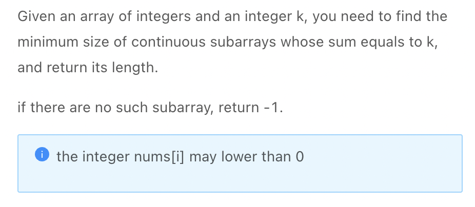
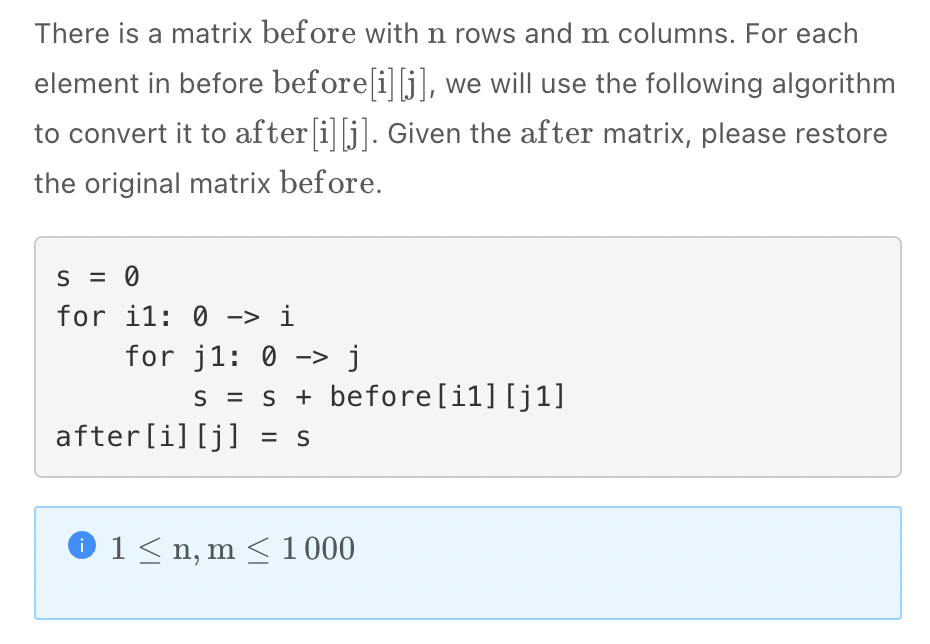

.. include:: ../_static/.special.rst

##############
Prefix Sum
##############

.. contents:: Table of Contents
   :depth: 2

Summary
*******

Use Case
========

.. warning::

    - 子数组求和

Definition
===============================

Basic Design
------------

.. note::

    - Build a new array :code:`prefix_sum` of length :math:`n + 1`
    - All :code:`i`, :code:`j` here are **index from prefix sum array**
    - :code:`prefix_sum[i]` is the sum of first :code:`i` numbers, which is array range :math:`[0, i - 1]`
    - :code:`prefix_sum[0] = 0`
    - Sum from :code:`i` to :code:`j` is :code:`x = prefix_sum[j + 1] - prefix_sum[i]`

Initialize Prefix Sum
---------------------

.. note::
    Time: :math:`O(n)`

    .. code-block:: python

        def build_prefix_sum(nums):
            n = len(nums)
            prefix_sum = [0] * (n + 1)
            for i in range(n):
                prefix_sum[i + 1] = prefix_sum[i] + nums[i]
            return prefix_sum

Prefix Sum in Subarray
*************************

.. contents:: Table of Contents
   :depth: 2
   :local:
   :backlinks: none

Problem
=======

.. _lint-1844-problem:

:problem:`Subarray Sum Equals To K II (子数组和为K II)`
-------------------------------------------------------

`LintCode 1844 Medium <https://www.jiuzhang.com/problem/subarray-sum-equals-k-ii/>`_

:solution:`1844 Brutal Force`
^^^^^^^^^^^^^^^^^^^^^^^^^^^^^

- Time :math:`O(n^3)`

.. tabs::

    .. code-tab:: python Python

        for left in range(n):
            for right in range(left, n):
                ans = 0
                for i in range(left, right + 1):
                    ans += nums[i]
                    compare(ans, k)
                    check minimum length

:solution:`1844 Brutal Force + Prefix Sum`
^^^^^^^^^^^^^^^^^^^^^^^^^^^^^^^^^^^^^^^^^^

.. note::
    Brutal Force with Prefix Sum
    Time :math:`O(n^2)`

    .. code-block:: python

        n = len(nums)
        prefix_sum = [0] * (n + 1)
        for i in range(n):
            prefix_sum[i + 1] = prefix_sum[i] + nums[i]

        for left in range(n):
            for right in range(left, n):
                ans = prefix[right + 1] - prefix[left]
                compare(ans, k)
                check mininum length

:solution:`1844 Prefix Sum + HashMap`
^^^^^^^^^^^^^^^^^^^^^^^^^^^^^^^^^^^^^

.. tip::
    Consider algorithms that's :math:`O(n)`

    - Two pointers: need sorting and non negative
    - Binary Tree: irrelavent
    - :math:`O(1)` operations on certain data structure for :math:`n` times: HashMap, UnionFind
    - Monotonic Stack and Queue

    Eventually, we choose operations on :code:`HashMap` in order to save the previous prefix sum

    - Any subarray of :code:`sum(nums[j:i])` can be denoted as :code:`sum(nums[j:i]) = prefix_sum[i + 1] - prefix_sum[j]`
    - The condition is :code:`sum(nums[j:i]) = prefix_sum[i + 1] - prefix_sum[j] = k`
    - A previously calculated prefix sum :code:`prefix_sum[j]` can be denoted as :code:`prefix_sum[j] = prefix_sum[i + 1] - k`, which is **current sum** minus **target sum**
    - To save previous prefix sum calculation, we cache the result of :code:`{prefix_sum_value: prefix_sum_index}`
    - Note that :code:`prefix_sum_index = array_index + 1 = i + 1`, as :code:`prefix_sum[i + 1]` means the sum from array element :code:`0` to :code:`i`

.. note::
    Time: :math:`O(n)`

    .. code-block:: python

        class Solution:
            """
            @param nums: a list of integer
            @param k: an integer
            @return: return an integer, denote the minimum length of continuous subarrays whose sum equals to k
            """
            # Minimum size
            # Negative Integers
            # Continuous
            # Non empty
            def subarray_sum_equals_k_i_i(self, nums: List[int], k: int) -> int:
                prefix_sum_cache = dict()
                prefix_sum_cache[0] = 0
                prefix_sum = 0
                result = float('inf')
                for i in range(len(nums)):
                    # Prefix Sum prefix_sum[i] = sum(nums[0:i]), sum of element from 0 to i - 1, i is prefix sum array index 
                    prefix_sum += nums[i]
                    # prefix_sum[j] = prefix_sum[0, i + 1] - k
                    # k = prefix_sum[0, i + 1] - prefix_um[0, j] = sum(nums[j:i])
                    # The subarray is found
                    if (prefix_sum - k) in prefix_sum_cache:
                        length = i + 1 - prefix_sum_cache[prefix_sum - k]
                        result = min(result, length)
                    # For prefix sum array the index will be i + 1, i is index from num array
                    prefix_sum_cache[prefix_sum] = i + 1
                return -1 if result == float('inf') else result

.. seealso::
    Follow up

    - When result **is** :code:`k`, reference :ref:`lint-1844-problem`
    - When result is **at least** :code:`k`, reference :ref:`lint-1507-problem`
    - When result is **at least** :code:`k`, and all numbers are **positive**, reference :ref:`lint-406-problem`
    - When result is **the max length of subarray** to get k

      - :code:`result = min(result, length)`
      - .. code-block:: python

            # Only add when prefix sum not appear before
            # Otherwise keep left most index to get max length
            if prefix_sum not in prefix_sum_cache:
                prefix_sum_cache[prefix_sum] = i + 1

:problem:`Matrix restoration (矩阵还原)`
----------------------------------------

`LintCode 1840 Medium <https://www.lintcode.com/problem/1840/>`_

:solution:`1840 Prefix Sum`
^^^^^^^^^^^^^^^^^^^^^^^^^^^

.. hint::

    - :code:`after[i][j] = after[i - 1][j] + after[i, j - 1] - after[i - 1][j - 1]`

.. note::
    Time: :math:`O(n^2)`

    .. code-block:: python

        class Solution:
            """
            @param n: the row of the matrix
            @param m: the column of the matrix
            @param after: the matrix
            @return: restore the matrix
            """
            def matrix_restoration(self, n: int, m: int, after: List[List[int]]) -> List[List[int]]:
                if not n:
                    return [[]]
                if not m:
                    return [[]]
                before = [[0] * m for _ in range(n)]
                for i in range(n):
                    for j in range(m):
                        before[i][j] = after[i][j] - \
                            self.get_valid(after, n, m, i, j - 1)
                        before[i][j] -= self.get_valid(after, n, m, i - 1, j)
                        before[i][j] += self.get_valid(after, n, m, i - 1, j - 1)
                return before

            def get_valid(self, arr, n, m , i, j):
                if i >= n or i < 0 or j >= m or j < 0:
                    return 0
                return arr[i][j]
