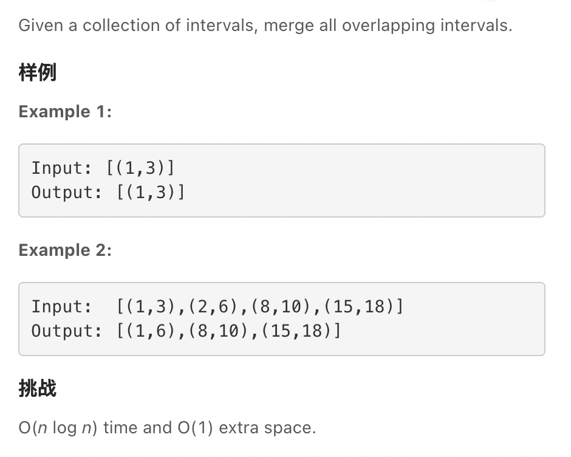
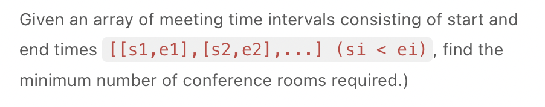
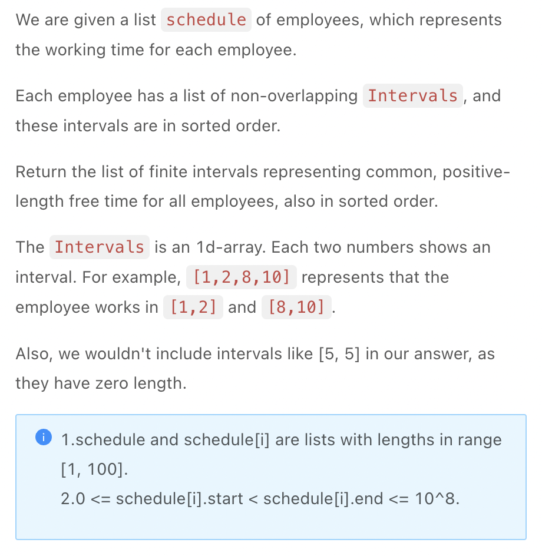

.. include:: ../_static/.special.rst

#####################
Scan Line
#####################

.. contents:: Table of Contents
   :depth: 2

Summmary
********

Use Case
========

.. warning::
   - 合并区间
   - 当区间1的 :code:`end` 与区间2的 :code:`start` 重合时

     - :code:`(start, -1), (end, 1)`, :code:`sort` 后 :code:`end` 在 :code:`start` 前, 同时 **未匹配的区间** 最多只有1个, 区间可合并
     - :code:`(start, 1), (end, -1)`, :code:`sort` 后 :code:`start` 在 :code:`end` 前, 同时 **未匹配的区间** 最多有2个, 区间不可合并

Definition
==========

.. note::
    - 每个区间的左右端点 **排序**
    - 找到一个左边界, 不断更新可能的右边界, 直到不能合并

Merge Intervals
***************

.. contents:: Table of Contents
   :depth: 2
   :local:
   :backlinks: none

Use Case
========

.. warning::
   - 合并区间

Problem
=======

:problem:`Merge Intervals (合并区间)`
-------------------------------------

`LintCode 156 Easy <https://www.jiuzhang.com/problem/merge-intervals/>`_

:solution:`156 Scan Line`
^^^^^^^^^^^^^^^^^^^^^^^^^

.. hint::
    - 将所有左右端点 **排序**
    - 将左端点计作1, 右断电计作-1, 可以合并的区间是左右端点相加为0
    - 此时左右端点完全抵消, 成为一个区间
    - 此时 :code:`(start, -1)`, :code:`(end, 1)`, 当 :code:`start`, :code:`end` 重合于一点

      - :code:`sort` 之后 :code:`start` 端点在后
      - 区间 **可以合并**, 所以计算时同时未配对的左端点最多只有一个

.. note::

    .. code-block:: python

        """
        Definition of Interval:
        class Interval(object):
            def __init__(self, start, end):
                self.start = start
                self.end = end
        """

        class Solution:
            """
            @param intervals: interval list.
            @return: A new interval list.
            """
            def merge(self, intervals: List[Interval]) -> List[Interval]:
                bounds = []
                for interval in intervals:
                    bounds.append((interval.start, -1))
                    bounds.append((interval.end, 1))
                bounds.sort()

                result = []
                is_matched = 0
                for bound in bounds:
                    if is_matched == 0:
                        left = bound[0]
                    # 记录区间左右端点的匹配情况
                    is_matched += bound[1]
                    if is_matched == 0:
                        right = bound[0]
                        result.append(Interval(left, right))
                return result

:problem:`Meeting Rooms II (会议室 II)`
---------------------------------------

`LintCode 919 Medium <https://www.jiuzhang.com/problem/meeting-rooms-ii/>`_

.. code-block:: bash

    Example1

    Input: intervals = [(0,30),(5,10),(15,20)]
    Output: 2
    Explanation:
    We need two meeting rooms
    room1: (0,30)
    room2: (5,10),(15,20)
    Example2

    Input: intervals = [(2,7)]
    Output: 1
    Explanation: 
    Only need one meeting room

:solution:`919 Scan Line`
^^^^^^^^^^^^^^^^^^^^^^^^^

.. hint::
    - Use heap to sort end points
    - Max room needed is the max unclosing left end point of overlapping intervals

.. note::

    .. code-block:: python

        """
        Definition of Interval:
        class Interval(object):
            def __init__(self, start, end):
                self.start = start
                self.end = end
        """

        class Solution:
            """
            @param intervals: an array of meeting time intervals
            @return: the minimum number of conference rooms required
            """
            def min_meeting_rooms(self, intervals: List[Interval]) -> int:
                if not intervals:
                    return 0
                
                import heapq

                heap = []
                for interval in intervals:
                    # 端点重合区间不可合并, max_unmatched = 2
                    heapq.heappush(heap, (interval.start, 1))
                    heapq.heappush(heap, (interval.end, -1))
                meeting, result = 0, 0
                while heap:
                    # 取出当前堆中时间最小的端点
                    meeting += heapq.heappop(heap)[1]
                    # 0 <= meeting <= max concurrent meetings
                    result = max(result, meeting)
                return result

:problem:`Employee Free Time (员工空闲时间)`
--------------------------------------------

`LintCode 850 Hard <https://www.jiuzhang.com/problem/employee-free-time/>`_

.. code-block:: bash

    Example 1:

    Input: schedule = [[1,2,5,6],[1,3],[4,10]]
    Output: [(3,4)]
    Explanation:
    There are a total of three employees, and all common
    free time intervals would be [-inf, 1], [3, 4], [10, inf].
    We discard any intervals that contain inf as they aren't finite.
    Example 2:

    Input: schedule = [[1,3,6,7],[2,4],[2,5,9,12]]
    Output: [(5,6),(7,9)]
    Explanation: 
    There are a total of three employees, and all common
    free time intervals would be [-inf, 1], [5, 6], [7, 9],[12,inf].
    We discard any intervals that contain inf as they aren't finite.

:solution:`850 Scan Line`
^^^^^^^^^^^^^^^^^^^^^^^^^

.. hint::
    - 空闲时间, 未匹配的区间左端点数量为0
    - 重合 **需要合并**, 避免出现 **时长为0** 的未合并区间

.. note::
   
   .. code-block:: python

        """
        Definition of Interval:
        class Interval(object):
            def __init__(self, start, end):
                self.start = start
                self.end = end
        """

        class Solution:
            """
            @param schedule: a list schedule of employees
            @return: Return a list of finite intervals 
            """
            def employee_free_time(self, schedule: List[List[int]]) -> List[Interval]:
                if not schedule:
                    return []
                import heapq
                heap, result = [], []
                for employee in schedule:
                    for i in range(0, len(employee), 2):
                        heapq.heappush(heap, (employee[i], -1))
                        heapq.heappush(heap, (employee[i + 1], 1))
                
                count, n = 0, len(heap)
                while n > 1:
                    left = heapq.heappop(heap)
                    right = heap[0]
                    count += left[1]
                    # 检查为完全匹配后的右节点和左节点之间
                    if left[1] == 1 and right[1] == -1 and count == 0:
                        result.append(Interval(left[0], right[0]))
                    n -= 1
                return result

