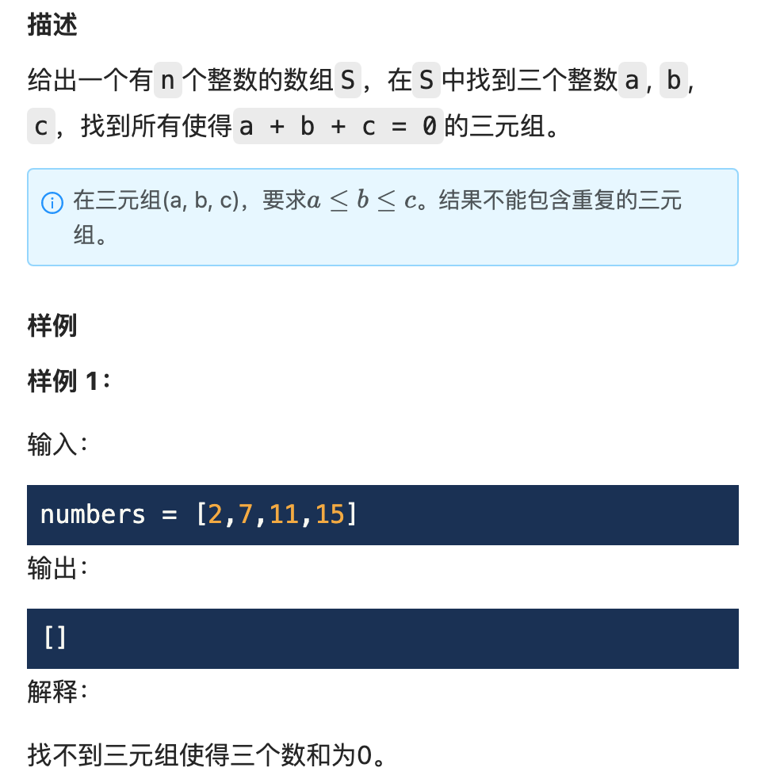
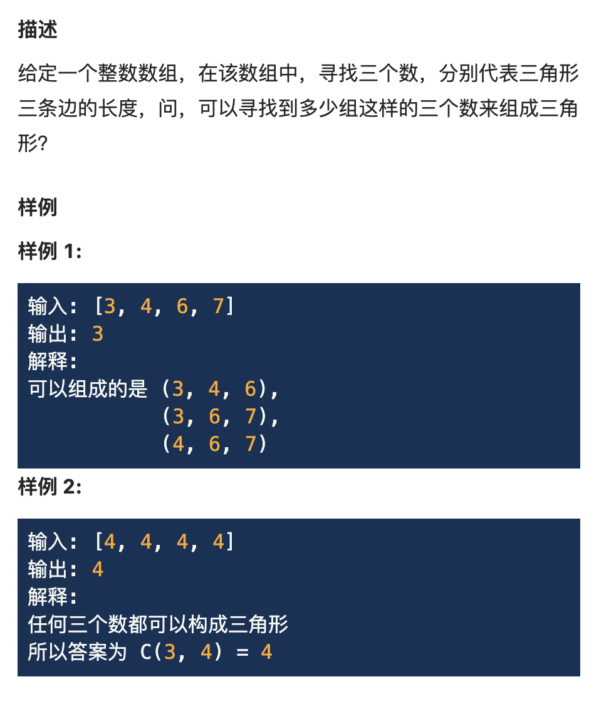
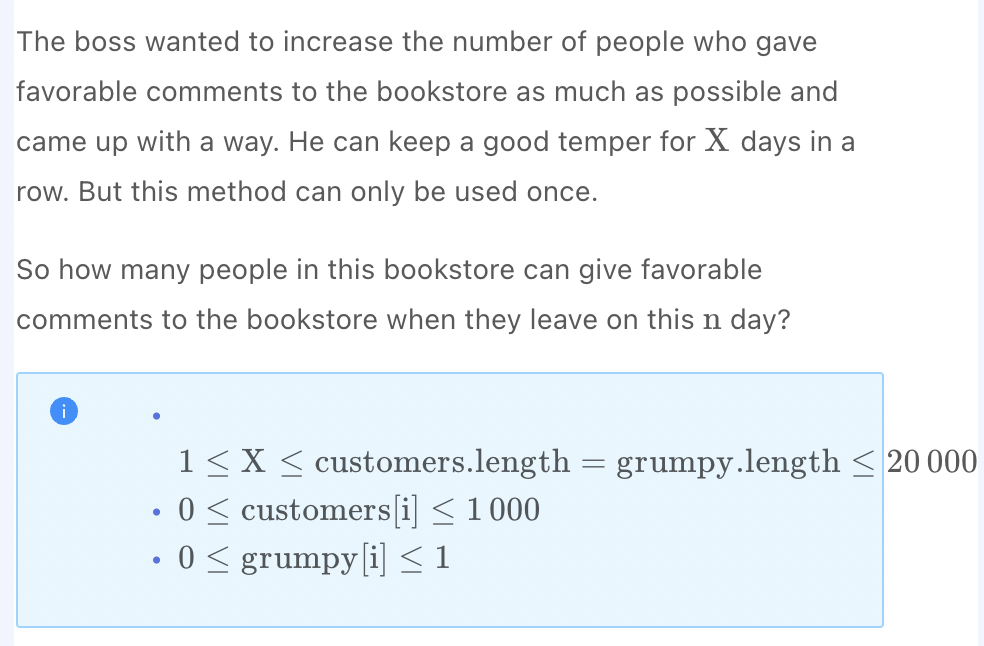

.. include:: ../_static/.special.rst

##############
Two Pointers
##############

.. contents:: Table of Contents
   :depth: 2

Summary
*******

Use Case
==========

Time Complexity: :math:`O(n)`

相向双指针 (Left & Right Boundary): 对称操作型 (Reverse)
**********************************************************

.. contents:: Table of Contents
   :depth: 2
   :local:
   :backlinks: none

Use Case
========

.. warning::
   - 回文字符串
   - 对称性检查

Problem
=======

:problem:`Valid Palindrome (有效回文串)`
----------------------------------------

`LintCode 415 Medium <https://www.jiuzhang.com/problem/valid-palindrome/>`_

.. code-block:: bash

    Example 1:
    Input: "A man, a plan, a canal: Panama"
    Output: true
    Explanation: "amanaplanacanalpanama"

    Example 2:
    Input: "race a car"
    Output: false
    Explanation: "raceacar"

:solution:`415 Two Pointers - Reverse`
^^^^^^^^^^^^^^^^^^^^^^^^^^^^^^^^^^^^^^

.. hint::
    - No extra space: do not copy string

.. note::
    Time: :math:`O(n)`

    .. code-block:: python

        class Solution:
            """
            @param s: A string
            @return: Whether the string is a valid palindrome
            """
            def isPalindrome(self, s):
                left, right = 0, len(s) - 1
                while left < right:
                    while left < right and not self.is_valid(s[left]):
                        left += 1
                    while left < right and not self.is_valid(s[right]):
                        right -= 1
                    if left < right and s[left].lower() != s[right].lower():
                        return False
                    left += 1
                    right -= 1
                return True
            
            def is_valid(self, c):
                return c.isalpha() or c.isdigit()

:problem:`Valid Palindrome II (有效回文 II)`
--------------------------------------------

`LintCode 891 Medium <https://www.jiuzhang.com/problem/valid-palindrome-ii/>`_

.. code-block:: bash

    Example 1:

    Input: s = "aba"
    Output: true
    Explanation: Originally a palindrome.
    Example 2:

    Input: s = "abca"
    Output: true
    Explanation: Delete 'b' or 'c'.
    Example 3:

    Input: s = "abc"
    Output: false
    Explanation: Deleting any letter can not make it a palindrome.

:solution:`891 Two Pointers - Reverse`
^^^^^^^^^^^^^^^^^^^^^^^^^^^^^^^^^^^^^^

.. hint::

    - When encounter a pair of differenct char: :code:`'abca' -> 'bc'`
        - Remove either :code:`b` or :code:`c`
        - If the rest is not palindrome, whole string is not
        - Otherwise remove one char makes a palindrome

.. note::
    :math:`O(n)`

    .. code-block:: python

        class Solution:
            """
            @param s: a string
            @return: whether you can make s a palindrome by deleting at most one character
            """
            def validPalindrome(self, s):
                if s is None:
                    return False
                
                left, right = self.diff(s, 0, len(s) - 1)
                if left >= right:
                    return True
                
                return self.is_palindrome(s, left + 1, right) or \
                    self.is_palindrome(s, left, right - 1)
            
            def is_palindrome(self, s, left, right):
                left, right = self.diff(s, left, right)
                return left >= right
            
            # Find different char pair location
            def diff(self, s, left, right):
                while left < right:
                    if s[left] != s[right]:
                        return left, right
                    left += 1
                    right -= 1
                return left, right

相向双指针 (Left & Right Boundary): 两数和型 (Two Sum)
**********************************************************

.. contents:: Table of Contents
   :depth: 2
   :local:
   :backlinks: none

Use Case
========

.. warning::
   - **有序数组** 中根据两数和分别移动 **左右指针** 直到达到特定条件

Problem
=======

:problem:`Two Sum (两数之和)`
-----------------------------

`LintCode 56 Easy <https://www.jiuzhang.com/problem/two-sum/>`_

.. code-block:: bash

    Example 1:
    Input:
    numbers = [2,7,11,15]
    target = 9
    Output:
    [0,1]
    Explanation:
    numbers[0] + numbers[1] = 9

    Example 2:
    Input:
    numbers = [15,2,7,11]
    target = 9
    Output:
    [1,2]
    Explanation:
    numbers[1] + numbers[2] = 9

    挑战
    Either of the following solutions are acceptable:

    O(n) Space, O(nlogn) Time
    O(n) Space, O(n) Time

:solution:`56 HashMap`
^^^^^^^^^^^^^^^^^^^^^^

.. note::
    Time: :math:`O(n)`
    Space: :math:`O(n)`
    
    .. code-block:: python

        class Solution:
            """
            @param numbers: An array of Integer
            @param target: target = numbers[index1] + numbers[index2]
            @return: [index1, index2] (index1 < index2)
            """
            def twoSum(self, numbers, target):
                if not numbers:
                    return [-1, -1]
                mapping = {}
                for i, num in enumerate(numbers):
                    if target - num in mapping.keys():
                        return mapping[target - num], i
                    mapping[num] = i
                return [-1, -1]

:solution:`56 Two Pointers - Two Sum`
^^^^^^^^^^^^^^^^^^^^^^^^^^^^^^^^^^^^^

.. hint::

    - Two pointers algo must be performed on sorted array
    - Required to return index in original array, requires extra space to save number - index mapping

.. note::
    Time: :math:`O(n \log n)`
    Space: :math:`O(n)`

    .. code-block:: python

        class Solution:
            """
            @param numbers: An array of Integer
            @param target: target = numbers[index1] + numbers[index2]
            @return: [index1, index2] (index1 < index2)
            """
            def twoSum(self, numbers, target):
                if not numbers:
                    return [-1, -1]
                nums = [(number, i) for i, number in enumerate(numbers)]
                nums.sort()
                left = 0
                right = len(nums) - 1
                while left < right:
                    result = nums[left][0] + nums[right][0]
                    if result > target:
                        right -= 1
                    elif result < target:
                        left += 1
                    else:
                        lidx = min(nums[left][1], nums[right][1])
                        ridx = max(nums[left][1], nums[right][1])
                        return [lidx, ridx]
                return [-1, -1]

Two Sum III (两数之和III)
===============================

`LintCode 607 Easy <https://www.lintcode.com/problem/607/>`_

.. hint::
    Two Sum, Data Structure Design

    - Online problem, find a data structure to store and process real time data stream
    - Depends on the requirement, choose to save space or save time on a particular **CRUD function**

.. note::
    Add 

    - Time: :math:`O(1)`
    - Space: :math:`O(n)`

    Find

    - Time: :math:`O(n)`
    - Space: :math:`O(n)`

    .. code-block:: python

        class TwoSum:
            nums = {}
            """
            @param number: An integer
            @return: nothing
            """
            def add(self, number):
                self.nums[number] = self.nums.get(number, 0) + 1
            """
            @param value: An integer
            @return: Find if there exists any pair of numbers which sum is equal to the value.
            """
            def find(self, value):
                for i in self.nums.keys():
                    if value - i == i:
                        return self.nums.get(value - i, 0) >= 2
                    if self.nums.get(value - i, 0) >= 1:
                        return True
                return False

Three Sum (三数之和)
===============================

`LintCode 57 Medium <https://www.lintcode.com/problem/57/>`_

.. hint::
    Two Sum

    - Fix either max or min number from the three number solution, the rest of the array is a two sum problem
    - When :code:`num[i - 1] == num[i]`, solution is alreayd found for the value, check again means repeat solution

.. note::
    Time: :math:`O(n \log n + n^2) = O(n^2)`
    Space: :math:`O(k)`

    .. code-block:: python

        class Solution:
            """
            @param numbers: Give an array numbers of n integer
            @return: Find all unique triplets in the array which gives the sum of zero.
            """
            def threeSum(self, numbers):
                if not numbers:
                    return []
                if len(numbers) < 3:
                    return []
                numbers.sort()
                result = []
                for i in range(len(numbers) - 2):
                    if i > 0 and numbers[i - 1] == numbers[i]:
                        continue
                    left = i + 1
                    right = len(numbers) - 1
                    while left < right:
                        target = numbers[left] + numbers[right]
                        if target == -numbers[i]:
                            result.append([numbers[i], numbers[left], numbers[right]])
                            left += 1
                            right -= 1
                            while left < right and numbers[left - 1] == numbers[left]:
                                left += 1
                            while left < right and numbers[right + 1] == numbers[right]:
                                right -= 1
                        elif target > -numbers[i]:
                            right -= 1
                        else:
                            left += 1
                        
                return result

Triangle Count (三角形计数)
===============================

`LintCode 382 Medium <https://www.lintcode.com/problem/382/>`_

.. hint::
    Two Sum

    - Fix either max or min number from the three edges, the rest of the array is a two sum problem
    - Repeat solutions are not removed in this problem

.. note::
    Time: :math:`O(n \log n + n^2) = O(n^2)`
    Space: :math:`O(k)`

    .. code-block:: python

        class Solution:
            """
            @param numbers: Give an array numbers of n integer
            @return: Find all unique triplets in the array which gives the sum of zero.
            """
            def triangleCount(self, numbers):
                if not numbers:
                    return 0
                if len(numbers) < 3:
                    return 0
                numbers.sort()
                result = 0
                for i in range(2, len(numbers)):
                    left = 0
                    right = i - 1
                    while left < right:
                        target = numbers[right] + numbers[left]
                        if target > numbers[i]:
                            result += (right - left)
                            right -= 1
                        else:
                            left += 1    
                return result

4 Sum II (4数和 II)
===============================

`LintCode 976 Medium <https://www.lintcode.com/problem/976/>`_

.. hint::
    Two Sum

    - Combine 2 arrays together into 1 dict, thus the question is converted to two Sum

.. note::
    Time: :math:`O(n^2)`
    Space: :math:`O(n^2)`

    .. code-block:: python

        class Solution:
            """
            @param A: a list
            @param B: a list
            @param C: a list
            @param D: a list
            @return: how many tuples (i, j, k, l) there are such that A[i] + B[j] + C[k] + D[l] is zero
            """
            def fourSumCount(self, A, B, C, D):
                dic = {}
                for a in A:
                    for b in B:
                        total = a + b
                        dic[total] = dic.get(total, 0) + 1
                result = 0
                for c in C:
                    for d in D:
                        total = c + d
                        result += dic.get(-total, 0)
                return result

相向双指针 (Left & Right Boundary): 分区型 (Partition)
**********************************************************

.. contents:: Table of Contents
   :depth: 2
   :local:
   :backlinks: none

Definition
==========

Quick Sort
----------

.. caution::

    Quick Sort Template

    - Select pivot :code:`p`
    - :math:`num \leq p`, swap to p left, :math:`num \geq p`, swap to p right
    - :math:`num == p`
        - Notice that :math:`num == p` can be either in left or in right
        - Prevent the pivot partition unequal when lots of same number are in array
        - E.g.: :code:`[1, 1, 1, 2]` select pivot 1, when condition is :math:`num < p` and :math:`num \geq p`, partition becomes :code:`[], [1, 1, 2]`

    .. code-block:: python

        def quickSort(A, start, end):
            if start >= end:
                return
            left, right = start, end
            # Get value not index, in case index swapped
            pivot = A[(start + end) // 2]
            # Condition not left < right
            # So that when while loop ends, left section and right section cross
            # Left always points to right section begin when loop breaks
            # Maitain left and right not corssing when enter next layer of quick sort
            while left <= right:
                # Use A[left] < pivot so that A[i] == pivot is kept at original section
                # Left section is A[i] <= pivot
                while left <= right and A[left] < pivot:
                    left += 1
                # Use A[left] < pivot so that A[i] == pivot is kept at original section
                # Right section is A[i] >= pivot
                while left <= right and A[right] > pivot:
                    right -= 1
                if left <= right:
                    A[left], A[right] = A[right], A[left]
                    left += 1
                    right -= 1
            quickSort(A, start, right)
            quickSort(A, left, end)

Quick Select
------------

.. caution::

    Quick Select Template

    - When swap ends (:code:`while i <= j` breaks), start < j <= i < end
    - :code:`start + (k - 1) <= j`, :math:`k^[th]` is at left section :math:`start <= k <= j`
    - :code:`start + (k - 1) >= i`, :math:`k^[th]` is at right section :math:`i <= k <= end`
    - Special Case: :code:`i == j + 2`
        - When last while loop is at :code:`i == j`, end loop may have a number in between :code:`i` and :code:`j`
        - That number is at :code:`j + 1`

Use Case
========

.. warning::
   - 回文字符串
   - 对称性检查

Problem
=======

:problem:`Kth Largest Element (第k大元素)`
------------------------------------------

`LintCode 5 Medium <https://www.jiuzhang.com/problem/kth-largest-element/>`_

.. code-block:: bash

    Example 1:
    Input:
    k = 1
    nums = [1,3,4,2]
    Output:
    4
    Explanation:
    The first largest element is four.

    Example 2:
    Input:
    k = 3
    nums = [9,3,2,4,8]
    Output:
    4
    Explanation:
    The third largest largest element is four.

    挑战
    O(n) time, O(1) extra memory.

.. danger::

    - **快速选择** 模板题

:solution:`5 Two Pointers - Partition`
^^^^^^^^^^^^^^^^^^^^^^^^^^^^^^^^^^^^^^^

.. hint::

    - 循环结束时 :code:`start < right <= left < end`
    - 左起第 :code:`k` 个数在 :code:`right` 左边: :code:`start + (k - 1) <= right`, 此时k大数在 **左子数组**
    - 左起第 :code:`k` 个数在 :code:`left` 右边: :code:`start + (k - 1) >= left`, 此时k大数在 **右子数组**

      - 新的右子数组左边界从 :code:`left` 开始, 第 :code:`k` 个数应为左起 :code:`k - (left - start)`

.. note::
    Time: :math:`O(n)`
    Space: :math:`O(1)`

    .. code-block:: python

        class Solution:
            """
            @param k: An integer
            @param nums: An array
            @return: the Kth largest element
            """
            def kthLargestElement(self, k, nums):
                if not nums:
                    return -1
                return self.quick_select(nums, 0, len(nums) - 1, k)

            def quick_select(self, nums, start, end, k):
                if start >= end:
                    return nums[start]
                pivot = nums[(start + end) // 2]
                left = start
                right = end
                while left <= right:
                    while left <= right and nums[left] > pivot:
                        left += 1
                    while left <= right and nums[right] < pivot:
                        right -= 1
                    if left <= right:
                        nums[left], nums[right] = nums[right], nums[left]
                        left += 1
                        right -= 1
                if start + k - 1 <= right:
                    return self.quick_select(nums, start, right, k)
                if start + k - 1 >= left:
                    return self.quick_select(nums, left, end, k - (left - start))
                return nums[right + 1]

:problem:`Partition Array (数组划分)`
-------------------------------------

`LintCode 31 Medium <https://www.jiuzhang.com/problem/partition-array/>`_

.. image:: ../_static/question/lint_31.png
   :scale: 30 %
   :alt: Warning!

.. code-block:: bash

Example 1:
Input:
nums = []
k = 9
Output:
0
Explanation:
Empty array, print 0.

Example 2:
Input:
nums = [3,2,2,1]
k = 2
Output:
1
Explanation:
the real array is[1,2,2,3].So return 1.

挑战
Can you partition the array in-place and in O(n)?

:solution:`31 Two Pointers - Parition`
^^^^^^^^^^^^^^^^^^^^^^^^^^^^^^^^^^^^^^

.. note::
    Time: :math:`O(n)`
    Space: :math:`O(1)`

    .. code-block:: python

        class Solution:
            """
            @param nums: The integer array you should partition
            @param k: An integer
            @return: The index after partition
            """
            def partitionArray(self, nums, k):
                if not nums:
                    return 0
                left = 0
                right = len(nums) - 1
                while left <= right:
                    while left <= right and nums[left] < k:
                        left += 1
                    while left <= right and nums[right] >= k:
                        right -= 1
                    if left <= right:
                        nums[left], nums[right] = nums[right], nums[left]
                        left += 1
                        right -= 1
                return left

Interleaving Positive and Negative Numbers (交错正负数)
==============================================================

.. hint::
    Quick Select

    - More negative/positive numbers, then negative/positive number must be at two ends
    - First paritition by value 0, then swap numbers between positive and negative sections

.. note::
    Time: :math:`O(n)`
    Space: :math:`O(1)`

    .. code-block:: python

        class Solution:
            """
            @param: A: An integer array.
            @return: nothing
            """
            def rerange(self, A):
                if not A:
                    return []
                left, right = 0, len(A) - 1
                while left <= right:
                    while left <= right and A[left] < 0:
                        left += 1
                    while left <= right and A[right] >= 0:
                        right -= 1
                    if left <= right:
                        A[left], A[right] = A[right], A[left]
                # left points to positive section start
                # left is negative count
                if len(A) - left > left:
                    right = len(A) - 2
                    left = 0
                elif len(A) - left < left:
                    right = len(A) - 1
                    left = 1
                else:
                    right = len(A) - 2
                    left = 1
                while left < right:
                    A[left], A[right] = A[right], A[left]
                    left += 2
                    right -= 2
                return A

Sort Colors (颜色分类)
============================================

`LintCode 148 Medium <https://www.lintcode.com/problem/148/>`_

.. hint::
    Quick Select

    - Left and right sections are naturally sorted, so only one traverse is enough
    - Use 3 pointers left ,right, idx, where left divide left section with all 0s, right divide right section with all 2s, idx traverse
    - swap left
        - because all left of idx is already scanned, swapped :code:`nums[left]` value guarantee to be :math:`\leq 1`
        - idx need to move to next position as :code:`nums[idx]` value is now :math:`\leq 1`
    - swap right
        - swapped :code:`nums[right]` value guarantee to be :math:`\geq 1`
        - :code:`nums[right - 1]` value not visited
        - need to compare :code:`nums[idx]` and :code:`nums[right - 1]`
        - idx do not move

.. note::
    Time: :math:`O(n)`
    Space: :math:`O(1)`

    .. code-block:: python

        class Solution:
            """
            @param nums: A list of integer which is 0, 1 or 2 
            @return: nothing
            """
            def sortColors(self, nums):
                if not nums:
                    return nums
                left = 0
                right = len(nums) - 1
                idx = 0
                while idx <= right:
                    if nums[idx] == 0:
                        nums[left], nums[idx] = nums[idx], nums[left]
                        left += 1
                        idx += 1
                    elif nums[idx] == 2:
                        nums[right], nums[idx] = nums[idx], nums[right]
                        right -= 1
                    else:
                        idx += 1
                return nums

Sort Colors II (颜色分类 II)
============================================

`LintCode 143 Medium <https://www.lintcode.com/problem/143/>`_

.. hint::
    Quick Sort Partition

    - Select medium value of the range as pivot
    - Partition with pivot
    - In subsections, repeat the process until sorted
    - Divide :code:`color_start, color_end` section into two parts each time for :math:`\log_2 k` times

.. note::
    Time: :math:`O(n \log k)`
    Space: :math:`O(\log k)`

    .. code-block:: python

        class Solution:
            """
            @param colors: A list of integer
            @param k: An integer
            @return: nothing
            """
            def sortColors2(self, colors, k):
                if not colors:
                    return []
                self.color_sort(colors, 0, len(colors) - 1, 1, k)
                return colors
            
            def color_sort(self, colors, start, end, color_start, color_end):
                if color_start == color_end:
                    return
                pivot = (color_start + color_end) // 2
                left = start
                right = end
                while left <= right:
                    while left <= right and colors[left] <= pivot:
                        left += 1
                    while left <= right and colors[right] > pivot:
                        right -= 1
                    if left <= right:
                        colors[left], colors[right] = colors[right], colors[left]
                        left += 1
                        right -= 1
                self.color_sort(colors, start, right, color_start, pivot)
                self.color_sort(colors, left, end, pivot + 1, color_end)

同向双指针(Same Direction Two Pointers): 滑动窗口(Sliding Window)
*****************************************************************

.. contents:: Table of Contents
   :depth: 2
   :local:
   :backlinks: none

Problem
=======

:problem:`Move Zeroes (移动零)`
-------------------------------

`LintCode 539 Medium <https://www.jiuzhang.com/problem/move-zeroes/>`_

.. code-block:: bash

    Example 1:

    Input: nums = [0, 1, 0, 3, 12],
    Output: [1, 3, 12, 0, 0].
    Example 2:

    Input: nums = [0, 0, 0, 3, 1],
    Output: [3, 1, 0, 0, 0].

:solution:`Two Pointers - Sliding Window`
^^^^^^^^^^^^^^^^^^^^^^^^^^^^^^^^^^^^^^^^^

.. hint::

    - left pointer records next insert position
    - traverse pointer traverse array and count 0s
    - eventually write 0s at the end of array

.. note::
    Time: :math:`O(n)`
    Space: :math:`O(1)`

    .. code-block:: python

        class Solution:
            """
            @param nums: an integer array
            @return: nothing
            """
            def moveZeroes(self, nums):
                if not nums:
                    return []
                left = 0
                zero_count = 0
                for i in range(len(nums)):
                    if nums[i] == 0:
                        zero_count += 1
                        continue
                    if i > left:
                        nums[left] = nums[i]
                    left += 1
                for i in range(1, zero_count + 1):
                    nums[len(nums) - i] = 0
                return nums

.. _lint-406-problem:

:problem:`Minimum Size Subarray Sum (和大于S的最小子数组)`
----------------------------------------------------------

`LintCode 406 Medium <https://www.jiuzhang.com/problem/minimum-size-subarray-sum/>`_

:solution:`406 Two Pointers - Slinding Window`
^^^^^^^^^^^^^^^^^^^^^^^^^^^^^^^^^^^^^^^^^^^^^^

.. hint::

    - Same direction two pointers
    - Expand when sum is too small
    - Maintain right pointer :code:`end` unchanged when switch left pointer :code:`start`, so that sliding window maintains

.. note::
    - Time: :math:`O(n)`

    .. code-block:: python

        class Solution:
            """
            @param nums: an array of integers
            @param s: An integer
            @return: an integer representing the minimum size of subarray
            """
            def minimum_size(self, nums: List[int], s: int) -> int:
                if not nums:
                    return -1
                
                result = float('inf')
                length = len(nums)
                all_sum = 0
                # Maintain right pointer when left pointer changes to keep window
                end = 0

                for start in range(length):
                    while end < length and all_sum < s:
                        all_sum += nums[end]
                        end += 1
                    
                    if all_sum >= s:
                        result = min(result, end - start)
                    
                    # Check next start
                    all_sum -= nums[start]
                
                return -1 if result == float('inf') else result

.. seealso::

  - :math:`O(n \log n)` approach using **Binary Search**, check :ref:`lint-406-binary-search`

:problem:`Substring With At Least K Distinct Characters (至少K个不同字符的子串)`
--------------------------------------------------------------------------------

`LintCode 1375 Medium <https://www.jiuzhang.com/problem/substring-with-at-least-k-distinct-characters/>`_

.. code-block:: bash

    Example 1:

    Input: S = "abcabcabca", k = 4
    Output: 0
    Explanation: There are only three distinct characters in the string.
    Example 2:

    Input: S = "abcabcabcabc", k = 3
    Output: 55
    Explanation: Any substring whose length is not smaller than 3 contains a, b, c.
    For example, there are 10 substrings whose length are 3, "abc", "bca", "cab",..., "abc"
    There are 9 substrings whose length are 4, "abca", "bcab", "cabc",...,"cabc"
    There is 1 substring whose length is 12, "abcabcabcabc"
    So the answer is 1 + 2 + ... + 10 = 55.

:solution:`1375 Two Pointers - Sliding Window`
^^^^^^^^^^^^^^^^^^^^^^^^^^^^^^^^^^^^^^^^^^^^^^

.. hint::

    - Need to track letter frequency, so use **hashmap**
    - Same direction two pointers, **sliding window**
    - Because all 26 letters as hashmap keys are known, optimize **hashmap** into **array** of 26, index as key

.. note::
    - Time: :math:`O(n)`

    .. code-block:: python

        class Solution:
            """
            @param s: a string
            @param k: an integer
            @return: the number of substrings there are that contain at least k distinct characters
            """
            def k_distinct_characters(self, s: str, k: int) -> int:
                if not s:
                    return 0
                
                if k > len(s):
                    return 0
                
                letter_dict = [0] * 26

                length = len(s)
                end = 0
                result = 0
                counter = 0
                for start in range(length):
                    while end < length and counter < k:
                        letter_idx = ord(s[end]) - ord('a')
                        if letter_dict[letter_idx] == 0:
                            counter += 1
                        letter_dict[letter_idx] += 1
                        end += 1
                    if counter == k:
                        result += (length - end + 1)
                    letter_idx = ord(s[start]) - ord('a')
                    letter_dict[letter_idx] -= 1
                    if not letter_dict[letter_idx]:
                        counter -= 1
                return result

:problem:`Minimum Window Substring (最小子串覆盖)`
--------------------------------------------------

`LintCode 32 Medium <https://www.jiuzhang.com/problem/minimum-window-substring/>`_

:solution:`32 Two Pointers - Sliding Window`
^^^^^^^^^^^^^^^^^^^^^^^^^^^^^^^^^^^^^^^^^^^^

.. hint::

    - Need to track letter frequency, so use **hashmap**
    - Same direction two pointers, **sliding window**
    - Need to track frequency while keep noting original target count of letters, so use 2 hashmaps
    - Only update :code:`match_counter` right before fullfilling the target count, so comparison is :code:`== target_dict.get(source[end], 0)`, preventing duplication

.. note::
    - Time: :math:`O(n + m)`

    .. code-block:: python

        class Solution:
            """
            @param source: A string
            @param target: A string
            @return: A string denote the minimum window, return "" if there is no such a string
            """
            def min_window(self, source: str, target: str) -> str:
                if not source or not target:
                    return ""
                
                letter_dict = dict()
                target_dict = dict()
                src_len = len(source)
                match_counter = 0
                for i in target:
                    target_dict[i] = target_dict.get(i, 0) + 1
                
                length = float('inf')
                result = ""
                end = 0
                for start in range(src_len):
                    while end < src_len and match_counter < len(target_dict):
                        letter_dict[source[end]] = letter_dict.get(source[end], 0) + 1
                        if letter_dict[source[end]] == target_dict.get(source[end], 0):
                            match_counter += 1
                        end += 1
                    if match_counter == len(target_dict) and end - start < length:
                        length = end - start
                        result = start
                    letter_dict[source[start]] -= 1
                    # can't use < target_dict count to prevent duplicate -=1 on match counter 
                    # when source have multiple required letter
                    if letter_dict[source[start]] == target_dict.get(source[start], 0) - 1:
                        match_counter -= 1
                return source[result:result + length] if length < float('inf') else ""

:problem:`Grumpy Bookstore Owner (爱生气的书店老板)`
----------------------------------------------------

`LintCode 1849 Medium <https://www.jiuzhang.com/problem/grumpy-bookstore-owner/>`_

.. code-block:: bash

    Example 1:
    Input:
    [1,0,1,2,1,1,7,5]
    [0,1,0,1,0,1,0,1]
    3
    Output: 
    16
    Explanation: 
    The bookstore owner keeps themselves not grumpy for the last 3 days. 
    The maximum number of customers that can be satisfied = 1 + 1 + 1 + 1 + 7 + 5 = 16.

:solution:`1849 Brutal Force`
^^^^^^^^^^^^^^^^^^^^^^^^^^^^^

.. hint::
    - The number of days to keep happy is the length of sliding window :code:`x`
    - The weight sum of the favorable comments is :code:`result[i] = (1 - grumpy[i]) * customer[i]`

      - :code:`0` is favorable comment and :code:`1` is not, so use :code:`(1 - grumpy[i])` as weight
    - Need :math:`O(x)` to calculate the weight sum within each sliding window, need to check :math:`O(n)` positions
    - Time cost :math:`O(nx)`

:solution:`1849 Two Pointers - Sliding Window`
^^^^^^^^^^^^^^^^^^^^^^^^^^^^^^^^^^^^^^^^^^^^^^

.. hint::
    - Note that sliding window move 1 step, only first element pop out and last element push in.
    - Use two pointer where the distance is always :code:`x`

.. note::
    Time: :math:`O(n)`

    .. code-block:: python

        class Solution:
            """
            @param customers: the number of customers
            @param grumpy: the owner's temper every day
            @param x: X days
            @return: calc the max satisfied customers
            """
            def max_satisfied(self, customers: List[int], grumpy: List[int], x: int) -> int:
                if not customers or not grumpy:
                    return 0
                
                total = 0
                for i in range(len(grumpy)):
                    if i < x:
                        total += customers[i]
                    else:
                        total += (1 - grumpy[i]) * customers[i]
                result = total
                start, end = 0, x
                
                while end < len(grumpy):
                    if grumpy[end] == 1:
                        total += customers[end]
                    if grumpy[start] == 1:
                        total -= customers[start]
                    result = max(result, total)
                    start += 1
                    end += 1
                return result

同向双指针(Same Direction Two Pointers): 隔板法(Partition)
*****************************************************************

.. contents:: Table of Contents
   :depth: 2
   :local:
   :backlinks: none

Use Case
========

.. warning::
    - May not be optimized as often :math:`O(n^2)`
    - 需要找到 **两端不相交的数组**, 使用分区

Problem
=======

:problem:`Best Time to Buy and Sell Stock III (买卖股票的最佳时机 III)`
-----------------------------------------------------------------------

`LintCode 151 Medium <https://www.jiuzhang.com/problem/best-time-to-buy-and-sell-stock-iii/>`_

.. code-block:: bash

    Input : [4,4,6,1,1,4,2,5]
    Output : 6

:solution:`151 Two Pointers - Partition`
^^^^^^^^^^^^^^^^^^^^^^^^^^^^^^^^^^^^^^^^

.. hint::

    - 枚举 parition boundary, partition the problem into finding the max profit of stock where you can buy+sell only **one time** on **two** partitions
    - Not optimized solution

.. note::
    Time: :math:`O(n^2)`

    .. code-block:: python

        class Solution:
            """
            @param prices: Given an integer array
            @return: Maximum profit
            """
            def max_profit(self, prices: List[int]) -> int:
                if not prices:
                    return 0
                
                result = 0
                n = len(prices)

                for i in range(n):
                    left_profit = self.get_profit(prices, 0, i)
                    right_profit = self.get_profit(prices, i, n)
                    result = max(result, left_profit + right_profit)
                return result
            
            def get_profit(self, prices, start, end):
                min_price = float('inf')
                profit = 0
                for i in range(start, end):
                    min_price = min(prices[i], min_price)
                    profit = max(profit, prices[i] - min_price)
                return profit

:problem:`Pick Apples (捡苹果)`
-------------------------------

`LintCode 1850 Medium <https://www.lintcode.com/problem/1850/>`_

.. code-block:: bash

    Example 1:
    Input:
    A = [6, 1, 4, 6, 3, 2, 7, 4]
    K = 3
    L = 2
    Output: 
    24
    Explanation: 
    beacuse Alice can choose tree 3 to 5 and collect 4 + 6 + 3 = 13 apples, and Bob can choose trees 7 to 8 and collect 7 + 4 = 11 apples.Thus, they will collect 13 + 11 = 24.

    Example 2:
    Input:
    A = [10, 19, 15]
    K = 2
    L = 2
    Output: 
    -1
    Explanation: 
    beacause it is not possible for Alice and Bob to choose two disjoint intervals.

:solution:`1850 Two Pointers - Partition + Sliding Window`
^^^^^^^^^^^^^^^^^^^^^^^^^^^^^^^^^^^^^^^^^^^^^^^^^^^^^^^^^^

.. hint::
    Two Pointer Parition + Sliding Window

    - Two pointer divide array into **two parition subarrays**
    - On each of the array, run **sliding window** to find the most apples

      - left :code:`L`, right :code:`K`
      - left :code:`K`, right :code:`L`
      - compare

.. note::
    - Time: :math:`O(nk)`
    
    .. code-block:: python

        class Solution:
            """
            @param a: a list of integer
            @param k: a integer
            @param l: a integer
            @return: return the maximum number of apples that they can collect.
            """
            def pick_apples(self, a: List[int], k: int, l: int) -> int:
                if not a:
                    return 0
                length = len(a)
                result = -1
                for i in range(length):
                    left_max_L = self.find_apple(a, l, 0, i)
                    right_max_K = self.find_apple(a, k, i, length)
                    if left_max_L != -1 and right_max_K != -1:
                        result = max(result, left_max_L + right_max_K)

                    left_max_K = self.find_apple(a, k, 0, i)
                    right_max_L = self.find_apple(a, l, i, length)
                    if left_max_K != -1 and right_max_L != -1:
                        result = max(result, left_max_K + right_max_L)
                return result
            
            def find_apple(self, a, k, start, end):
                if k > end - start:
                    return -1
                
                total = 0
                for i in range(start, start + k):
                    total += a[i]
                max_apple = total
                left = start
                right = start + k
                while right < end:
                    total -= a[left]
                    total += a[right]
                    max_apple = max(max_apple, total)
                    left += 1
                    right += 1
                return max_apple

同向双指针(Same Direction Two Pointers): 双数组型(Merge Array)
**************************************************************

.. contents:: Table of Contents
   :depth: 2
   :local:
   :backlinks: none

Use Case
========

.. warning::

    - Merge sort requires extra :math:`O(n)` space to merge **sorted** arrays

Merge Sort Template
===================

.. note::

    - Select pivot :code:`p`
    - :math:`num \leq p`, swap to p left, :math:`num \geq p`, swap to p right
    - :math:`num == p`
        - Notice that :math:`num == p` can be either in left or in right
        - Prevent the pivot partition unequal when lots of same number are in array
        - E.g.: :code:`[1, 1, 1, 2]` select pivot 1, when condition is :math:`num < p` and :math:`num \geq p`, partition becomes :code:`[], [1, 1, 2]`
    
    .. code-block:: python

        def sort_int(A):
            if not A:
                return A
            temp = [0 for i in range(len(A))]
            mergeSort(A, 0, len(A) - 1, temp)

        def mergeSort(A, start, end, temp):
            if start >= end:
                return
            mergeSort(A, start, (start + end) // 2, temp)
            mergeSort(A, (start + end) // 2 + 1, temp)
            mergeSortedArray(A, start, end, temp)
            return A

        def mergeSortedArray(A, start, end, temp):
            middle = (start + end) // 2
            left = start
            right = middle + 1
            temp_idx = start
            while left <= middle and right < end:
                if A[left] <= A[right]:
                    temp[temp_idx] = A[left]
                    left += 1
                else:
                    temp[temp_idx] = A[right]
                    right += 1
                temp_idx += 1
            while left < middle:
                temp[temp_idx] = A[left]
                left += 1
                temp_idx += 1
            while right < len(A):
                temp[temp_idx] = A[right]
                right += 1
                temp_idx += 1
            for i in range(start, end + 1):
                A[i] = temp[i]

:problem:`Merge Sorted Array (合并排序数组)`
--------------------------------------------

`LintCode 6 Easy <https://www.jiuzhang.com/problem/merge-two-sorted-arrays/>`_

.. code-block:: bash

    Merge two given sorted ascending integer array A and B into a new sorted integer array.

    样例
    Example 1:

    Input:

    A = [1]
    B = [1]
    Output:

    [1,1]
    Explanation:

    return array merged.

    Example 2:

    Input:

    A = [1,2,3,4]
    B = [2,4,5,6]
    Output:

    [1,2,2,3,4,4,5,6]
    挑战
    How can you optimize your algorithm if one array is very large and the other is very small?

:solution:`6 Two Pointers - Merge Array`
^^^^^^^^^^^^^^^^^^^^^^^^^^^^^^^^^^^^^^^^

.. note::
    Time: :math:`O(m + n)`
    Space: :math:`O(m + n)`

    .. code-block:: python

        class Solution:
            """
            @param A: sorted integer array A
            @param B: sorted integer array B
            @return: A new sorted integer array
            """
            def mergeSortedArray(self, A, B):
                if not A:
                    return B
                if not B:
                    return A
                left, right = 0, 0
                result = []
                while left < len(A) and right < len(B):
                    if A[left] <= B[right]:
                        result.append(A[left])
                        left += 1
                    else:
                        result.append(B[right])
                        right += 1
                while left < len(A):
                    result.append(A[left])
                    left += 1
                while right < len(B):
                    result.append(B[right])
                    right += 1
                return result

背向双指针 (Reverse Two Pointers)
**********************************************************

.. contents:: Table of Contents
   :depth: 2
   :local:
   :backlinks: none

Use Case
========

.. warning::
    - 检查对称性

:problem`Longest Palindrome Substring (最长回文子串)`
-----------------------------------------------------

`LintCode 200 Medium <https://www.jiuzhang.com/problem/longest-palindromic-substring/>`_

:solution:`200 Brutal Force`
^^^^^^^^^^^^^^^^^^^^^^^^^^^^

.. hint::

    - For each length: :math:`O(n)`
    - For each substring start point: :math:`O(n)`
    - Check if substring is palindrome: :math:`O(n)`

.. note::
    Time: :math:`O(n^3)`
    Space: :math:`O(n)`

:solution:`200 Reverse Two Pointers`
^^^^^^^^^^^^^^^^^^^^^^^^^^^^^^^^^^^^

.. hint::

    - Don't check palindrome for substring center every time
    - Start from substring center, check left and right and find difference
    - :math:`n` **odd** length substring center, :math:`n - 1` **even** length substring center

.. note::
    Time: :math:`O(n^2)`
    Space: :math:`O(n)`

    .. code-block:: python

        class Solution:
            """
            @param s: a string which consists of lowercase or uppercase letters
            @return: the length of the longest palindromes that can be built
            """
            def longestPalindrome(self, s):
                if not s:
                    return ""
                answer = (0, 0)
                for mid in range(len(s)):
                    # Odd Length
                    answer = max(answer, self.find_palindrome(s, mid, mid))
                    # Even Length
                    answer = max(answer, self.find_palindrome(s, mid, mid + 1))
                return s[answer[1]:answer[1] + answer[0]]
            
            def find_palindrome(self, s, left, right):
                while left >= 0 and right < len(s) and s[left] == s[right]:
                    left -= 1
                    right += 1
                # Return length, left
                # Length is (right - 1) - (left + 1) + 1 = right - left - 1
                return right - left - 1, left + 1

:problem:`Heaters (加热器)`
---------------------------

`LintCode 1219 Medium <https://www.jiuzhang.com/problem/heaters/>`_

:solution:`1219 Binary Search`
^^^^^^^^^^^^^^^^^^^^^^^^^^^^^^

.. hint::
    - Binary search find the house position between heaters
    - Need to sort heaters to ensure order
    - Maintain the **maximum** of **shortest radius** to ensure coverage

.. note::
    - Time: :code:`O(n \log n + m \log m)`

    .. code-block:: python

        class Solution:
            """
            @param houses: positions of houses
            @param heaters: positions of heaters
            @return: the minimum radius standard of heaters
            """
            def find_radius(self, houses: List[int], heaters: List[int]) -> int:
                if not houses or not heaters:
                    return -1
                
                heaters.sort()
                min_radius = 0
                for house in houses:
                    radius = self.get_single_radius(house, heaters)
                    min_radius = max(min_radius, radius)
                return min_radius
            
            def get_single_radius(self, house, heaters):
                start, end = 0, len(heaters) - 1
                while start + 1 < end:
                    mid = (start + end) // 2
                    if heaters[mid] <= house:
                        start = mid
                    else:
                        end = mid
                left_dist = abs(house - heaters[start])
                right_dist = abs(house - heaters[end])
                return min(left_dist, right_dist)

:solution:`1219 Reverse Two Pointers`
^^^^^^^^^^^^^^^^^^^^^^^^^^^^^^^^^^^^^

.. hint::
    - Must compare based on house loop

      - If based on heater loop, next heater can be closer to next house
      - Need to check in next loop
    - Can handle unsorted heater array

.. note::
    - Time: :math:`O((m + n) \log n)`

    .. code-block:: python

        class Solution:
            """
            @param houses: positions of houses
            @param heaters: positions of heaters
            @return: the minimum radius standard of heaters
            """
            def find_radius(self, houses: List[int], heaters: List[int]) -> int:
                if not houses or not heaters:
                    return -1
                
                heaters.sort()
                houses.sort()
                heat_len = len(heaters)
                house_idx = 0
                heat_idx = 0
                min_radius = 0

                while house_idx < len(houses) and heat_idx < heat_len:
                    radius = abs(houses[house_idx] - heaters[heat_idx])
                    # Check the distance between the next heater and current house
                    # No next heater, distance is infinity
                    if heat_idx + 1 < heat_len:
                        next_radius = abs(houses[house_idx] - heaters[heat_idx + 1])
                    else:
                        next_radius = float('inf')
                    
                    if radius < next_radius:
                        min_radius = max(min_radius, radius)
                        # Check next house
                        house_idx += 1
                    else:
                        # Check based on heater to next house is not correct
                        # Next heater might be closer to next house
                        # will need to compare between heater and next heater in next loop
                        heat_idx += 1
                return min_radius
