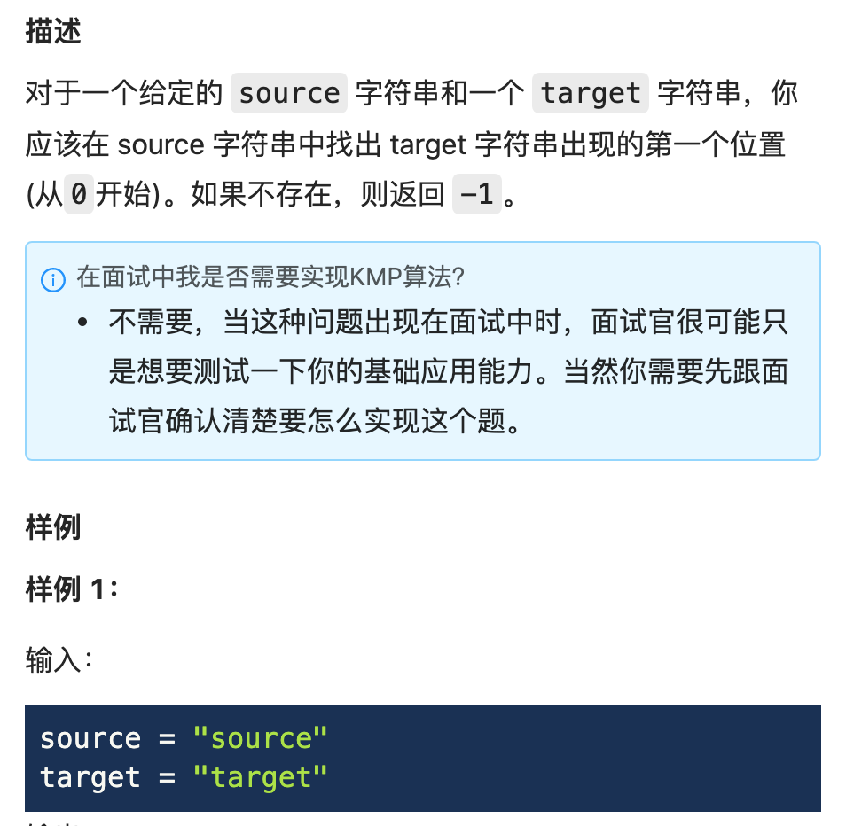
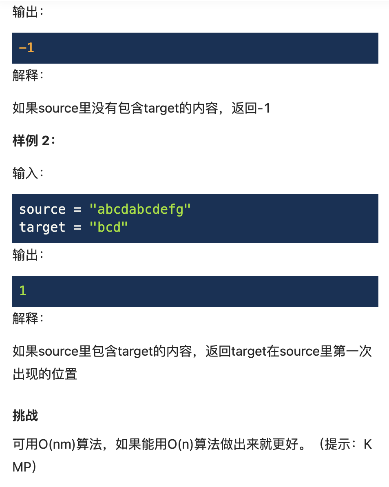
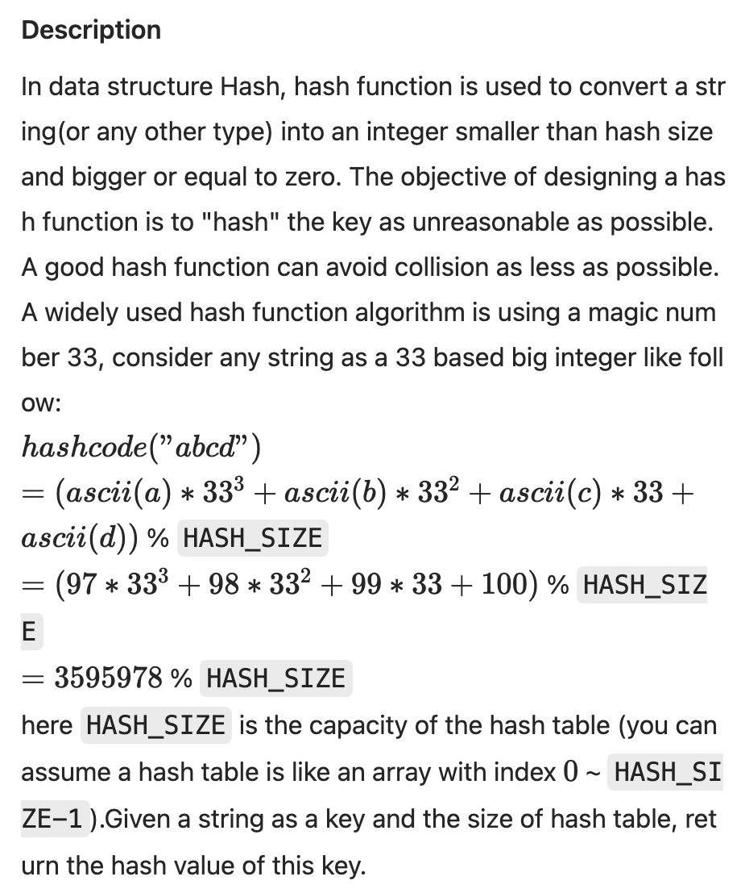
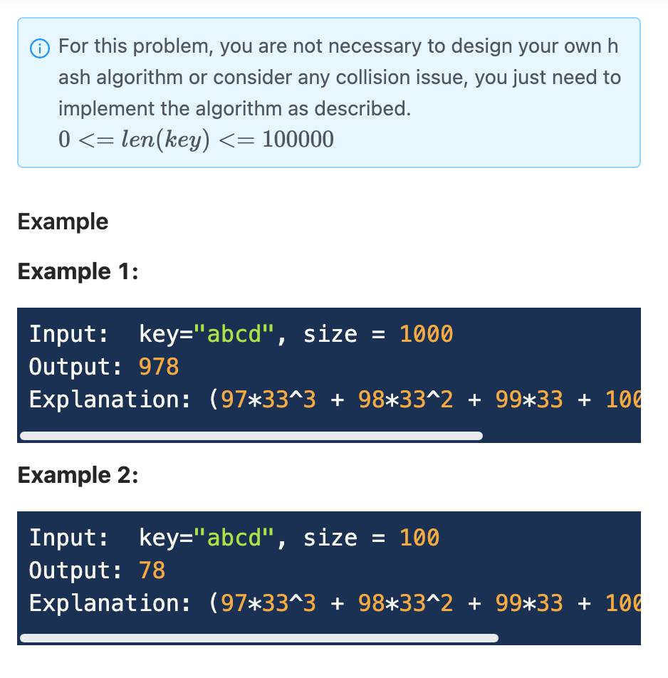
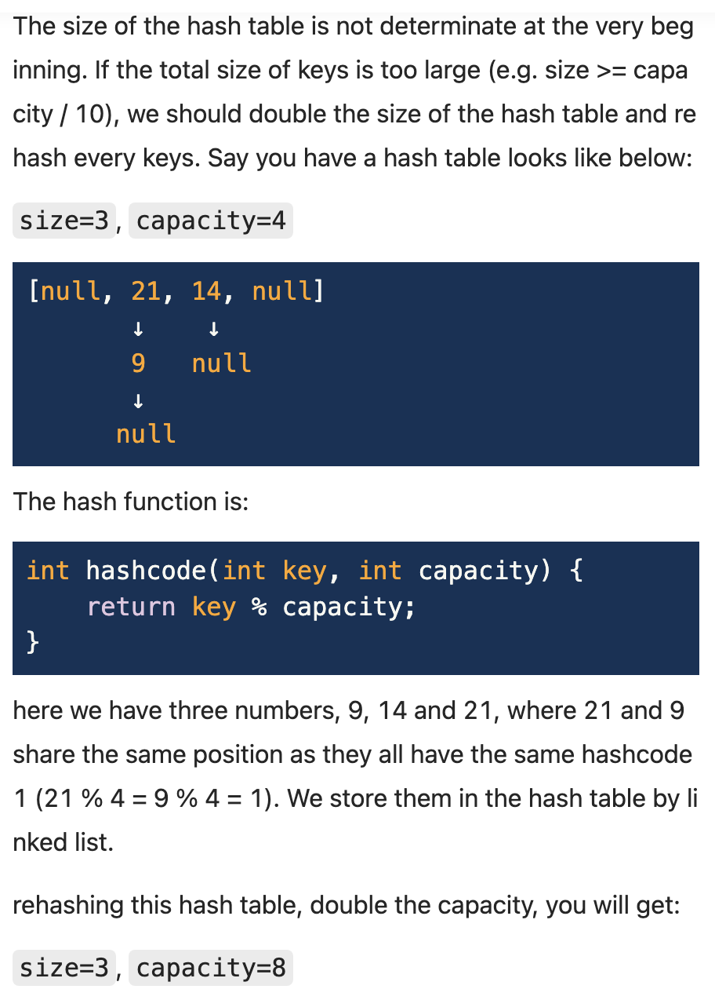
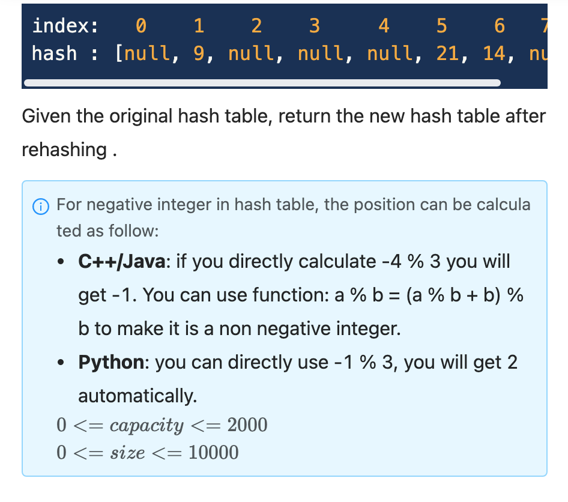
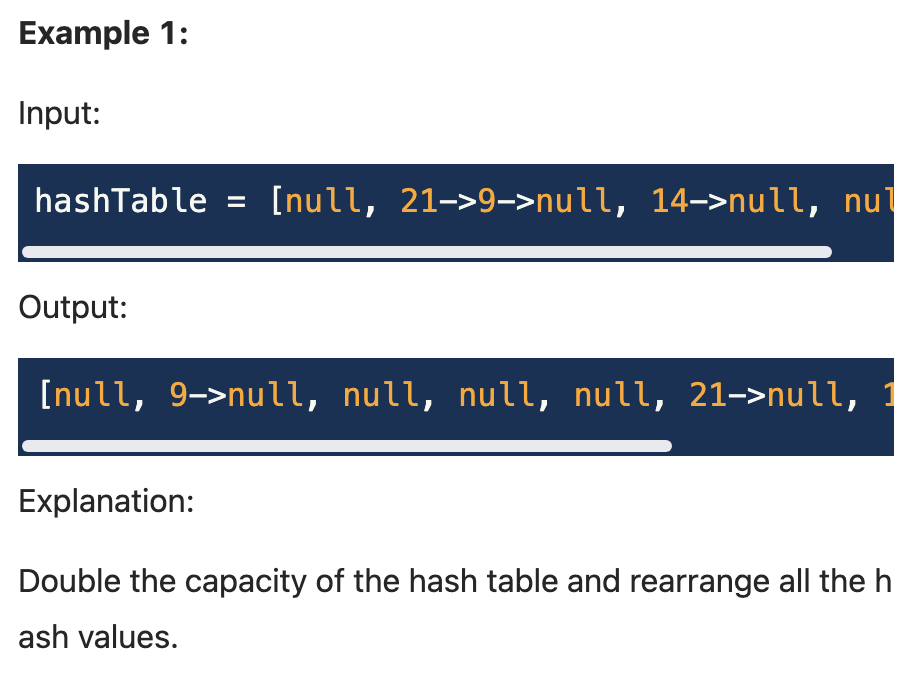
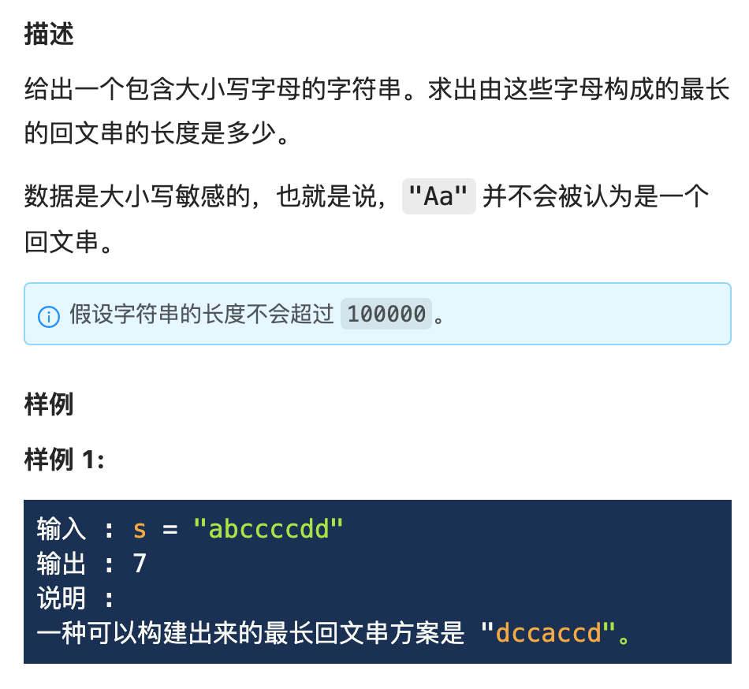

######
Hash
######

Table of Contents
*****************

.. contents::

HashMap vs HashSet
**********************

.. danger::

    HashMap

    - 对HashMap的Key调用hashCode()方法，返回int值，即对应的hashCode；
    - 把此hashCode作为哈希表的索引，查找哈希表的相应位置，若当前位置内容为NULL，则把HashMap的Key、Value包装成Entry数组，放入当前位置；
    - 若当前位置内容不为空，则继续查找当前索引处存放的链表，利用equals方法，找到Key相同的Entry数组，则用当前Value去替换旧的Value；
    - 若未找到与当前Key值相同的对象，则把当前位置的链表后移（Entry数组持有一个指向下一个元素的引用），把新的Entry数组放到链表表头；

    HashSet

    - 往HashSet添加元素的时候，HashSet会先调用元素的hashCode方法得到元素的哈希值 ，
    - 然后通过元素 的哈希值经过移位等运算，就可以算出该元素在哈希表中 的存储位置。
    - 情况1： 如果算出元素存储的位置目前没有任何元素存储，那么该元素可以直接存储到该位置上。
    - 情况2： 如果算出该元素的存储位置目前已经存在有其他的元素了，那么会调用该元素的equals方法与该位置的元素再比较一次
    - 如果equals返回的是true，那么该元素与这个位置上的元素就视为重复元素，不允许添加，如果equals方法返回的是false，那么该元素运行添加。

Manual Hash Function
**********************

Strstr (字符串查找)
====================

`LintCode 13 Easy <https://www.lintcode.com/problem/13/>`_

.. hint::

   - Can't use ``source[i:i + len(target)] == target``.
      - Same as using of ``substring, find, indexOf`` function.
      - Used extra space to store substring.

.. note::
    :math:`O(n^2)`

    .. code-block:: python

        class Solution:
            """
            @param source: 
            @param target: 
            @return: return the index
            """
            def strStr(self, source, target):
                if not target:
                    return -1
                for i in range(len(source) - len(target) + 1):
                    for j in range(len(target)):
                        if source[i + j] != target[j]:
                            break
                    else:
                        return i
                return -1

.. hint::

    * If comparing between source substring and target can be :math:`O(1)`
    * Comparison between integer numbers is :math:`O(1)`
    * String to integer: **hash funciton**
        * Hash function: :math:`(source[i] \cdot 31^{len(source) - 1} + source[i + 1] \cdot 31^{len(source) - 2} + \cdots + source[-1] \cdot 31^0) \% 10^6`
        * Mod :math:`10^6` (large number) to prevent overflow

.. note::
    :math:`O(n + m)`
    Robin-Karp Algorithm

    .. code-block:: python

        class Solution:
            """
            @param source: 
            @param target: 
            @return: return the index
            """
            def strStr(self, source, target):
                if not target:
                    return 0
                m = len(target)
                power = 1
                BASE = 10**6
                for i in range(m):
                    power = (power * 31) % BASE
                
                target_hash = 0
                for i in range(m):
                    target_hash = (target_hash * 31 + ord(target[i])) % BASE
                
                source_hash = 0
                for i in range(len(source)):
                    source_hash = (source_hash * 31 + ord(source[i])) % BASE

                    if i < m - 1:
                        continue
                    
                    if i >= m:
                        source_hash -= (ord(source[i - m]) * power) % BASE
                        if source_hash < 0:
                            source_hash += BASE

                    if source_hash == target_hash:
                        if source[i - m + 1:i + 1] == target:
                            return i - m + 1
                return -1

Hash Function (哈希函数)
===========================================

`LintCode 128 Easy <https://www.lintcode.com/problem/128/>`_

.. note::
    - Time: :math:`O(L)`

    .. code-block::python

        class Solution:
            """
            @param key: A string you should hash
            @param HASH_SIZE: An integer
            @return: An integer
            """
            def hashCode(self, key, HASH_SIZE):
                ans = 0
                for i in range(len(key)):
                    ans = (ans * 33 + ord(key[i])) % HASH_SIZE
                return int(ans)

Rehashing (重哈希)
===========================================

`LintCode 129 Medium <https://www.lintcode.com/problem/129/>`_

.. note::
    Time: :math:`O(L)`

    .. code-block:: python

        """
        Definition of ListNode
        class ListNode(object):

            def __init__(self, val, next=None):
                self.val = val
                self.next = next
        """
        class Solution:
            """
            @param hashTable: A list of The first node of linked list
            @return: A list of The first node of linked list which have twice size
            """
            def rehashing(self, hashTable):
                if not hashTable:
                    return []
                HASH_SIZE = len(hashTable) * 2
                new_table = [None] * HASH_SIZE

                for head in hashTable:
                    while head:
                        new_slot = head.val % HASH_SIZE
                        node = ListNode(head.val, new_table[new_slot])
                        new_table[new_slot] = node
                        dummy, tail = node.next, node.next
                        while tail and tail.next:
                            tail = tail.next
                        if dummy:
                            tail.next, node.next = node, None
                            new_table[new_slot] = dummy

                        head = head.next
                return new_table

Hash Set
********

Longest Palindrome (最长回文串)
===========================================

`LintCode 627 Easy <https://www.lintcode.com/problem/627/>`_

.. hint::
    - Only char count matters

.. note::
    Time: :math:`O(n)`
    Space: :math:`O(1)`

        .. code-block:: python

            class Solution:
                """
                @param s: a string which consists of lowercase or uppercase letters
                @return: the length of the longest palindromes that can be built
                """
                def longestPalindrome(self, s):
                    if not s:
                        return 0
                    hash_set = set()
                    length = 0
                    for c in s:
                        if c in hash_set:
                            length += 2
                            hash_set.remove(c)
                        else:
                            hash_set.add(c)
                    if len(hash_set) > 0:
                        length += 1
                    return length
