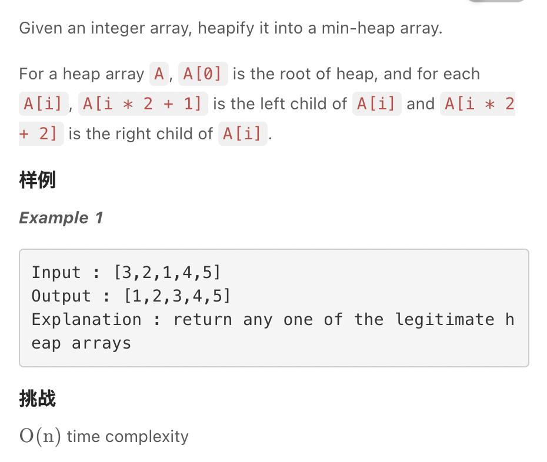
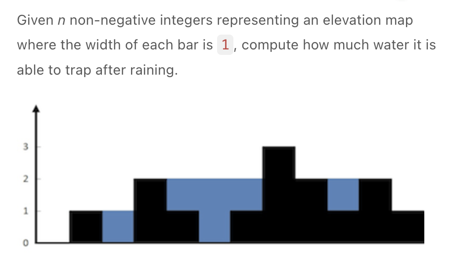

.. include:: ../_static/.special.rst

######
Heap
######

.. contents:: Table of Contents
   :depth: 2

Summary
*******

Definition
==========

.. hint::

    - 最大堆: 最大值在堆顶
    - 必为 **complete binary tree** 完全二叉树: 从根结点到 **倒数第二层** 满足完美二叉树，最后一层可以不完全填充，其叶子结点都 **靠左对齐**。
    - 堆高度必为 :math:`O(\log n)`
    - Binary Heap
        - Parent: :code:`i`
        - Left Child: :code:`2 * i + 1`
        - Right Child: :code:`2 * i + 2`
        - Child: :code:`i`
        - Parent: :code:`(i - 1) / 2`

Function
========

.. hint::
    - heapify: :math:`O(n)`
    - traverse: :math:`O(n \log n)`
    - add: :math:`O(\log n)`
    - pop: :math:`O(\log n)`
    - min / max: :math:`O(1)`

Template
========

Heapify (堆化)
--------------

`LintCode 130 Medium <https://www.lintcode.com/problem/130/>`_

.. caution::
    Sift up

    - Time: :math:`O(n \log n)`

    .. code-block:: python

        class Solution:
            def siftup(self, A, k):
                while k != 0:
                    father = (k - 1) // 2
                    if A[k] > A[father]:
                        break
                    A[k], A[father] = A[father], A[k]
                    k = father
            
            def heapify(self, A):
                for i in range(len(A)):
                    self.siftup(A, i)

.. caution::
    Sift down

    - Choose the parent node that's closest to last layer child node
    - Last but one layer has node :math:`O(n / 4)`, sift down one time to bottom
    - Last but two layer has node :math:`O(n / 8)`, sift down two time to bottom
    - :math:`T(n) = O(n / 4) + O(2 \cdot n / 8) + O(3 \cdot n / 16)`
    - :math:`2T(n) - T(n) = O(n / 2) + O(n / 4) + \cdots + O(n / {2^n}) = O(n)`
    - Time: :math:`O(n)`

    .. code-block:: python

        import sys
        import collections
        class Solution:
            # @param A: Given an integer array
            # @return: void
            def siftdown(self, A, k):
                while k * 2 + 1 < len(A):
                    son = k * 2 + 1    #A[i]左儿子的下标
                    if k * 2 + 2 < len(A) and A[son] > A[k * 2 + 2]:
                        son = k * 2 + 2    #选择两个儿子中较小的一个
                    if A[son] >= A[k]:
                        break

                    A[son], A[k] = A[k], A[son]
                    k = son
            
            def heapify(self, A):
                for i in range((len(A) - 1) // 2, -1, -1):
                    self.siftdown(A, i)

Heap Sort
---------

.. hint::

    - For :code:`nums` of length :code:`n`, build heap and pop min for n times

.. note::
    - Time Complexity :math:`O(n \log n)` and stable
    - Space Complexity :math:`O(1)` and stable

    .. code-block:: python

        class Solution:
            """
            @param A: an integer array
            @return: nothing
            """
            def sortIntegers(self, A):
                self.heapify(A)
                for i in range(len(A) - 1, -1, -1):
                    # pop max from heap and put into array last at positioin i
                    A[0], A[i] = A[i], A[0]
                    self.siftdown(A, 0, i - 1)

            def siftdown(self, A, left, right):
                k = left
                while k * 2 + 1 <= right:
                    son = k * 2 + 1
                    if son + 1 <= right and A[son] < A[son + 1]:
                        son = son + 1
                    if A[son] <= A[k]:
                        break
                    A[son], A[k] = A[k], A[son]
                    k = son
            
            def heapify(self, A):
                for i in range((len(A) - 1) // 2, -1, -1):
                    self.siftdown(A, i, len(A) - 1)

堆作为辅助数据结构
******************

.. contents:: Table of Contents
   :depth: 2
   :local:
   :backlinks: none

Use Case
========

.. hint::
    - 数据流下 :math:`O(1)` 时间动态取极值

Problem
=======

:problem:`Trapping Rain Water (接雨水)`
---------------------------------------

`LintCode 363 Medium <https://www.lintcode.com/problem/363/>`_

.. code-block:: bash

    Example 1:
    Input: [0,1,0]
    Output: 0

    Example 2:
    Input: [0,1,0,2,1,0,1,3,2,1,2,1]
    Output: 6

    挑战
    O(n) time and O(1) memory
    O(n) time and O(n) memory is also acceptable.

:solution:`363 heap`