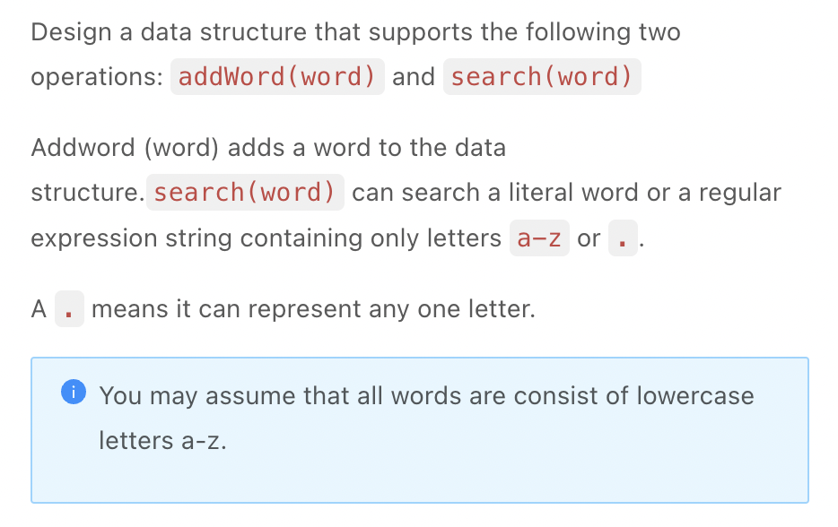
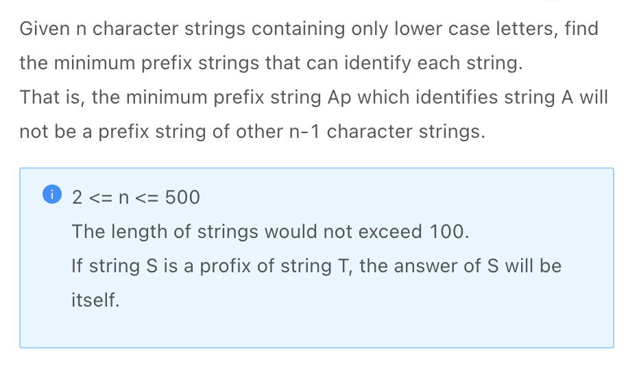
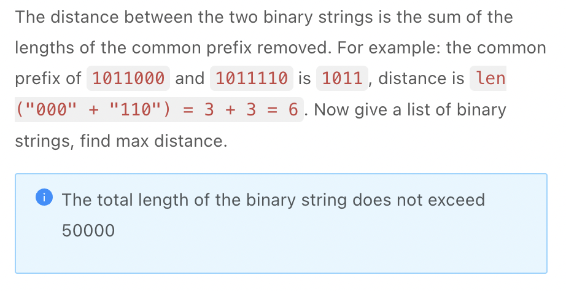

.. include:: ../_static/.special.rst

#####################
Trie / Prefix Tree
#####################

.. contents:: Table of Contents
   :depth: 2

Summmary
********

Use Case
==========

.. warning::

    - **字典树** DFS: 在字典树上进行DFS
    - **优化** : 优化其他算法

Definition
==========

.. hint::

    - 字母存在边上
    - 单词存在点上
    - :code:`is_word` 表示是否为完整单词, 避免情况

.. note::

    .. code-block:: python

        class TrieNode:
            def __init__(self):
                self.children = {}
                self.is_word = False
                self.word = None
        
        class Trie:
            def __init__(self):
                self.root = TrieNode()
            
            def get_root(self):
                return self.root
            
            # Time Complexity: O(L)
            def insert(self, word):
                node = self.root
                for i in range(len(word)):
                    if word[i] not in node.children:
                        node.children[word[i]] = TrieNode()
                    node = node.children[word[i]]
                node.is_word = True
                node.word = word

Trie DFS
**********

.. contents:: Table of Contents
   :depth: 2
   :local:
   :backlinks: none

Problem
=======

:problem:`Add and Search Word - Data structure design (单词的添加与查找)`
-------------------------------------------------------------------------------------------

`LintCode 473 Medium <https://www.jiuzhang.com/problem/add-and-search-word-data-structure-design/>`_

.. code-block:: bash

    Input:
    addWord("a")
    search(".")
    Output:
    true

    Input:
    addWord("bad")
    addWord("dad")
    addWord("mad")
    search("pad")  
    search("bad")  
    search(".ad")  
    search("b..")  
    Output:
    false
    true
    true
    true

.. hint::

    - Perform DFS on Trie to check if word in Trie

.. note::

    .. code-block:: python

        class TrieNode:
            def __init__(self):
                self.children = {}
                self.is_word = False
                self.word = None

        class Trie:
            def __init__(self):
                self.root = TrieNode()
            
            def get_root(self):
                return self.root
            
            # Time Complexity: O(L)
            def insert(self, word):
                node = self.root
                for i in range(len(word)):
                    if word[i] not in node.children:
                        node.children[word[i]] = TrieNode()
                    node = node.children[word[i]]
                node.is_word = True
                node.word = word

        class WordDictionary:
            def __init__(self):
                self.trie = Trie()

            """
            @param: word: Adds a word into the data structure.
            @return: nothing
            """
            def addWord(self, word):
                self.trie.insert(word)

            def dfs(self, root, word, idx):
                if idx == len(word):
                    return root.is_word
                letter = word[idx]
                if letter == ".":
                    for w in root.children:
                        if self.dfs(root.children[w], word, idx + 1):
                            return True
                    return False
                if letter in root.children:
                    return self.dfs(root.children[letter], word, idx + 1)
                return False

            """
            @param: word: A word could contain the dot character '.' to represent any one letter.
            @return: if the word is in the data structure.
            """
            def search(self, word):
                return self.dfs(self.trie.get_root(), word, 0)

:problem:`Identifying Strings (识别字符串)`
-------------------------------------------------------------------------------------------

`LintCode 333 Medium <https://www.jiuzhang.com/problem/identifying-strings/>`_

.. code-block:: bash

    Input:["aaa","bbc","bcd"]
    Output:["a","bb","bc"]
    Explanation:"a" is only the profix of "aaa".
    "bb" is only the profix of "bbc".
    "bc" is only the profix of "bcd".

.. hint::

    - the prefix uniquely identifies the word
    - If edge is walked only 1 time, it uniquely identifies a word
    - Ues :code:`prefix_count` in trie node to track edge count

.. note::

    .. code-block:: python

        class TrieNode:
            def __init__(self):
                self.children = {}
                self.is_word = False
                self.word = None
                self.prefix_count = 0

        class Trie:
            def __init__(self):
                self.root = TrieNode()
            
            def get_root(self):
                return self.root
            
            # Time Complexity: O(L)
            def insert(self, word):
                node = self.root
                for i in range(len(word)):
                    if word[i] not in node.children:
                        node.children[word[i]] = TrieNode()
                    node = node.children[word[i]]
                    node.prefix_count += 1
                node.is_word = True
                node.word = word

        class Solution:
            """
            @param stringArray: a string array
            @return: return every strings'short peifix
            """
            def ShortPerfix(self, stringArray):
                trie = Trie()
                results = []
                
                for word in stringArray:
                    trie.insert(word)
                
                for word in stringArray:
                    results.append(self.get_unique_prefix(trie.get_root(), word))
                
                return results

            def get_unique_prefix(self, root, word):
                node = root

                for i in range(len(word)):
                    # root.prefix_count = 0
                    # check word[0] node prefix_count on loop 1
                    if node.prefix_count == 1:
                        return word[:i]
                    node = node.children[word[i]]
                # if finish traversing word and still no prefix identified
                # the word itself is serving as a prefix
                # e.g. aa vs aaaa, aa itself is a prefix and should return aa
                return word

:problem:`Max Distance (最大距离)`
-------------------------------------------------------------------------------------------

`LintCode 1624 Medium <https://www.jiuzhang.com/problem/max-distance/>`_

.. code-block:: bash

    Input: ["011000","0111010","01101010"]
    Output: 9
    Explanation: the the common prefix of "0111010" and "01101010" is "011", distance is len("1010")+len("01010")=9

    Input: ["011000","0111011","01001010"]
    Output: 11
    Explanation:the the common prefix of "0111011" and "01001010" is "01", distance is len("11011")+len("001010")=11

:solution:`1624 Trie + Depth First Search`
^^^^^^^^^^^^^^^^^^^^^^^^^^^^^^^^^^^^^^^^^^

.. hint::

    - 构建Trie后寻找 **最大高度和**, 即搜索树上 **两个节点之间的最长路径**
    - 考虑并比较 **所有可能为最大值的情况**
    - 最长路径经过root, 节点有2个子树, 取两子树最大高度和, 加上 :code:`root->left`, :code:`root->right` 2条边
    - 最长路径为单一子树

      - 分岔点本身为一个单词, 此时 :code:`node.is_word == True`, 子树最大高度为root到最深叶子处的最大高度
      - 节点为单子树, 此时最长路径可能出现在任意一个子树中

.. note::

    .. code-block:: python

        class TrieNode:
            def __init__(self):
                self.children = dict()
                self.is_word = False
                self.max_height = 1
            
        class Trie:
            def __init__(self):
                self.root = TrieNode()
            
            def insert(self, word):
                node = self.root

                for i, w in enumerate(word):
                    if w not in node.children:
                        node.children[w] = TrieNode()
                    node = node.children[w]
                    node.max_height = max(node.max_height, len(word) - i - 1)
                
                node.is_word = True
            
            def get_root(self):
                return self.root
            
        class Solution:
            """
            @param s: the list of binary string
            @return: the max distance
            """
            def getAns(self, s):
                trie = Trie()
                for word in s:
                    trie.insert(s)
                return self.dfs(trie.get_root())
            
            def dfs(self, root):
                result = 0
                # 最长路径经过root
                if len(root.children) == 2:
                    result = max(result, 
                                root.children['0'].max_height,
                                root.children['1'].max_height)
                # root只有一个子树, 且此时分岔点root与最深叶子节点为最长路径
                if root.is_word:
                    result = max(result, root.max_height)
                if '0' in root.children:
                    result = max(result, self.dfs(root.children['0']))
                if '1' in root.children:
                    result = max(result, self.dfs(root.children['1']))
                return result
                    
:problem:`Edit Distance (编辑距离)`
-------------------------------------------------------------------------------------------

.. seealso::

    - See reference :ref:`lint-119-dp`

:problem:`K Edit Distance (K步编辑)`
-------------------------------------------------------------------------------------------

.. seealso::

    - See reference :ref:`lint-623-dp`

:problem:`Word Search III (单词搜索 III)`
-------------------------------------------------------------------------------------------

.. seealso::

    - See reference :ref:`lint-1848-dfs`

:problem:`Word Squares (单词矩阵)`
-------------------------------------------------------------------------------------------

.. seealso::

    - See reference :ref:`lint-634-dfs`