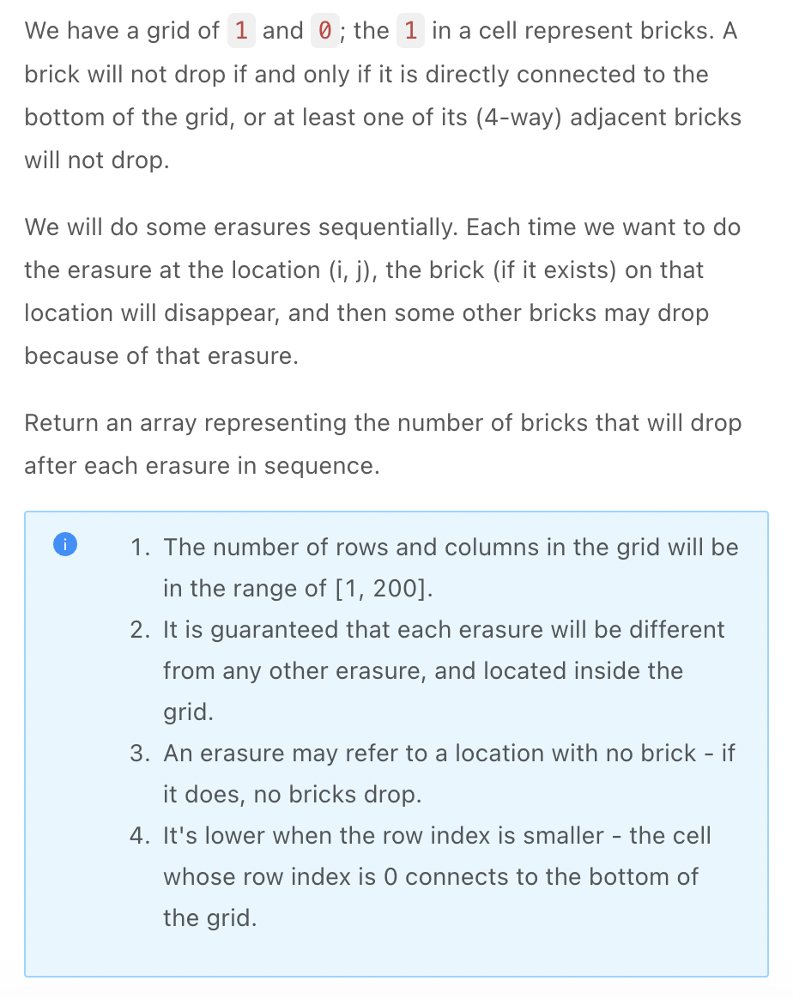

.. include:: ../_static/.special.rst

#####################
Union Find
#####################

.. contents:: Table of Contents
   :depth: 2

Summmary
********

Use Case
==========

.. warning::

    - 支持 **集合之间** 快速合并及查找

      - :math:`O(1)` 合并集合
      - :math:`O(1)` 查找 :code:`x` 所属集合: :code:`find(x)`
      - :math:`O(1)` 查找 :code:`x, y` 是否属于同一集合: :code:`is_connected(x, y)`

    - :code:`is_connected`

      - 两点是否在一个集合中
      - 两点是否在一个连通块中
      - 两点是否连通
    
    - 不能直接做删除节点操作

      - 可以尝试逆序操作, 使得正序删除节点变为 **从终点开始逆序增加节点**
      - :ref:`lint-1014-problem`

Definition
==========

.. hint::

    - 每个集合为一个 **多叉树**, **根节点** 代表了这个集合
    - 初始化时一般用 :code:`father = {x: x for x in nodes}` 来添加所有已知的node
    - 用 hash table 存放每个节点的 parent: :code:`father.put(x, y), father[x] = y`, 即 :code:`x` 的父节点是 :code:`y`
    - :code:`find(x)`: 向上遍历到 **根节点**

      - :code:`while father[root]: root = father[root]`, 此时函数复杂度为 :math:`O(n)`
      - **路径压缩优化** : 在找到一个节点的根后, 把 **路径上所有的点** 都指向 **根**, 优化后函数复杂度为 :math:`O(1)`
      - **路径压缩优化** 函数复杂度为 :math:`O(n)`
      - 
    - :code:`is_connected(x, y)`: check :code:`find(x) == find(y)`
    - :code:`union(x, y)`: 一个元素的根指向另一个元素的根
    - 

.. note::

    .. code-block:: python

        class UnionFind:
            def __init__(self, node_size):
                self.father = dict()
                self.set_size = dict()
                self.set_total = 0

            def add(self, x):
                if x in self.father:
                    return
                # 使用相同值方便set_size计算
                self.father[x] = x
                self.set_size[x] = 1
                self.set_total += 1
            
            def find(self, x):
                root = x
                if self.father.get(root, -1) == -1:

                # 检测是否为相同值
                while self.father[root] != root:
                    root = self.father[root]

                # 路径压缩
                while x != root:
                    original_father = self.father[x]
                    self.father[x] = root
                    x = original_father
                return root
            
            def union(self, x, y):
                root_x = self.find(x)
                root_y = self.find(y)
                if root_x != root_y:
                    self.set_total -= 1
                    self.father[root_y] = root_x
                    self.set_size[root_y] += self.set_size[root_x]
            
            def get_set_size(self, x):
                # 只有根节点才是整个集合的大小
                return self.set_size[self.father[x]]

            def is_connected(self, x, y):
                return self.find(x) == self.find(y)

连通问题
********

.. contents:: Table of Contents
   :depth: 2
   :local:
   :backlinks: none

Problem
=======

:problem:`Graph Valid Tree (图是否是树)`
-------------------------------------------------------------------------------------------

`LintCode 178 Medium <https://www.jiuzhang.com/problem/graph-valid-tree/>`_

.. code-block:: bash

    Input: n = 5 edges = [[0, 1], [0, 2], [0, 3], [1, 4]]
    Output: true.

    Input: n = 5 edges = [[0, 1], [1, 2], [2, 3], [1, 3], [1, 4]]
    Output: false.

:solution:`179 Union Find`
^^^^^^^^^^^^^^^^^^^^^^^^^^^^^^^^^^^^^

.. hint::

    - 初始化时在 :code:`father` 中加入所有已知点, 并以点本身为root
    - 因此判断 :code:`root` 条件变为 :code:`father[root] == root`
    - 使用 :code:`size` 在 :code:`merge` 记录集合个数

.. note::

    .. code-block:: python

        class UnionFind:
            def __init__(self, n):
                self.father = dict()
                self.size = n

            def find(self, x):
                root = x
                while root != self.father[root]:
                    root = self.father[root]
                while x != root:
                    original_father = self.father[root]
                    self.father[x] = root
                    x = original_father
                return root

            def merge(self, x, y):
                root_x = self.find(x)
                root_y = self.find(y)
                if root_x != root_y:
                    self.size -= 1
                    self.father[root_y] = root_x

        class Solution:
            """
            @param n: An integer
            @param edges: a list of undirected edges
            @return: true if it's a valid tree, or false
            """
            def valid_tree(self, n: int, edges: List[List[int]]) -> bool:
                if not n:
                    return False
                if n == 1 and len(edges) == 0:
                    return True
                if n - 1 != len(edges):
                    return False
                uf = UnionFind(n)
                uf.father = {i: i for i in range(n)}
                size = n
                for x, y in edges:
                    uf.merge(x, y)

                return uf.size == 1

:problem:`Graph Valid Tree II (图是否是树 II)`
-------------------------------------------------------------------------------------------

`LintCode 444 Medium <https://www.jiuzhang.com/problem/graph-valid-tree-ii/>`_

.. code-block:: bash

    Input:
    addEdge(1, 2)
    isValidTree()
    addEdge(1, 3)
    isValidTree()
    addEdge(1, 5)
    isValidTree()
    addEdge(3, 5)
    isValidTree()
    Output: ["true","true","true","false"]

:solution:`444 Union Find`
^^^^^^^^^^^^^^^^^^^^^^^^^^^^^^^^^^^^^

.. hint::
    - 在 :code:`add`, :code:`merge` 时记录并查集的 **节点数** 和 **边数**

.. note::

    .. code-block:: python

        class Solution:

            def __init__(self):
                self.father = dict()
                self.edge_num = 0
                self.vtx_num = 0
                self.size = 0

            def add(self, x):
                if x in self.father:
                    return
                self.father[x] = x
                self.vtx_num += 1
                self.size += 1

            def find(self, x):
                root = x
                while self.father[root] != root:
                    root = self.father[root]
                while x != root:
                    original_father = self.father[x]
                    self.father[x] = root
                    x = original_father
                return root
            """
            @param a: the node a
            @param b: the node b
            @return: nothing
            """
            def addEdge(self, a, b):
                self.add(a)
                self.add(b)
                root_a, root_b = self.find(a), self.find(b)
                if root_a != root_b:
                    self.father[root_a] = root_b
                    self.size -= 1
                self.edge_num += 1

            """
            @return: check whether these edges make up a valid tree
            """
            def isValidTree(self):
                if self.vtx_num - 1 != self.edge_num:
                    return False
                return self.size == 1

:problem:`Number of Islands II (岛屿的个数 II)`
-------------------------------------------------------------------------------------------

`LintCode 434 Medium <https://www.jiuzhang.com/problem/graph-valid-tree-ii/>`_

.. code-block:: bash

    Input: n = 4, m = 5, A = [[1,1],[0,1],[3,3],[3,4]]
    Output: [1,1,2,2]
    Explanation:
    0.  00000
        00000
        00000
        00000
    1.  00000
        01000
        00000
        00000
    2.  01000
        01000
        00000
        00000
    3.  01000
        01000
        00000
        00010
    4.  01000
        01000
        00000
        00011

    Input: n = 3, m = 3, A = [[0,0],[0,1],[2,2],[2,1]]
    Output: [1,1,2,2]

.. seealso::

    - BFS solution for offline problem see :ref:`lint-433-problem`

.. _lint-434-union_find:

:solution:`434 Union Find`
^^^^^^^^^^^^^^^^^^^^^^^^^^^^^^^^

.. hint::

    - BFS for online data need to spend :math:`O(MN)` to traverse matrix and change each grid, time complexity :math:`O(M^2 N^2)`

.. note::

    .. code-block:: python

        """
        Definition for a point:
        class Point:
            def __init__(self, x=0, y=0):
                self.x = x
                self.y = y
        """

        class Solution:
            """
            @param n: An integer
            @param m: An integer
            @param operators: an array of point
            @return: an integer array
            """
            def num_islands2(self, n: int, m: int, operators: List[Point]) -> List[int]:
                if not operators:
                    return []
                DIRECTION = [
                    (1, 0),
                    (-1, 0),
                    (0, 1),
                    (0, -1)
                ]

                uf = UnionFind()
                land = set()
                total = []

                for op in operators:
                    # If operator given is already a land
                    if (op.x, op.y) in land:
                        total.append(uf.get_set_total())
                        continue
                    
                    land.add((op.x, op.y))
                    uf.add((op.x, op.y))
                    for direct in DIRECTION:
                        x = op.x + direct[0]
                        y = op.y + direct[1]
                        if self.is_valid(x, y, n, m, land):
                            uf.union((op.x, op.y), (x, y))
                    total.append(uf.get_set_total())
                return total

.. _lint-1014-problem:

:problem:`Bricks Falling When Hit (打砖块)`
-------------------------------------------------------------------------------------------

`LintCode 1014 Hard <https://www.jiuzhang.com/problem/bricks-falling-when-hit/>`_

.. code-block:: bash

    Input: grid = [[1,0,0,0],[1,1,1,0]], hits = [[1,0]]
    Output: [2]
    Explanation: If we erase the brick at (1, 0), the brick at (1, 1) and (1, 2) will drop. So we should return 2.

    Input: grid = [[1,0,0,0],[1,1,0,0]], hits = [[1,1],[1,0]]
    Output: [0,0]
    Explanation: When we erase the brick at (1, 0), the brick at (1, 1) has already disappeared due to the last move.

:solution:`1014 Union Find`
^^^^^^^^^^^^^^^^^^^^^^^^^^^^^^^^

.. hint::

    - 并查集不能直接做节点的删除
    - 将敲掉砖块的正序操作逆转为从 **最后一个坐标** 开始 **逆序添加** 砖块, 检查添加之后有哪些砖块 **重新与墙连接**
    - 敲掉砖块 :code:`grid[x][y]` 时, 不能直接赋值 :code:`0`, 而是使用 :code:`grid[x][y] -= 1`, 使得 **重复击中相同坐标** 时只有 **正序第一次击中** 即 **逆序最后一次击中** 有效

.. note::

    .. code-block:: python

        class UnionFind:
            def __init__(self):
                self.father = dict()
                self.set_size = dict()
                self.set_total = 0
            
            def add(self, x):
                if x in self.father:
                    return
                self.father[x] = x
                self.set_size[x] = 1
            
            def find(self, x):
                root = x
                while self.father[root] != root:
                    root = self.father[root]
                while root != x:
                    x_father = self.father[x]
                    self.father[x] = root
                    x = x_father
                return root
            
            def union(self, x, y):
                root_x = self.find(x)
                root_y = self.find(y)

                if root_x != root_y:
                    self.father[root_y] = root_x
                    self.set_size[root_x] += self.set_size[root_y]
            
            def get_set_size(self, x):
                return self.set_size[self.father[x]]
            
            def is_connected(self, x, y):
                return self.find(x) == self.find(y)

        class Solution:
            def __init__(self):
                self.DIRECTION = [(0, 1), (0, -1), (-1, 0), (1, 0)]
                self.WALL = (-1, -1)
            
            def init_bricks(self, uf, grid, hits):
                rows, cols = len(grid), len(grid[0])

                # 正序敲下所有砖块
                for hit in hits:
                    # 每次-1, 确保标记敲砖时坐标有重复的情况
                    grid[hit[0]][hit[1]] -= 1
                uf.add(self.WALL)

                for row in range(rows):
                    for col in range(cols):
                        # bricks not hit
                        if grid[row][col] == 1:
                            uf.add((row, col))
                
                for col in range(cols):
                    if grid[0][col] == 1:
                        uf.union(self.WALL, (0, col))
                
                for row in range(rows):
                    for col in range(cols):
                        if grid[row][col] == 1:
                            self.union_neighbor(uf, grid, row, col)
            
            def union_neighbor(self, uf, grid, x, y):
                for dx, dy in self.DIRECTION:
                    nx = x + dx
                    ny = y + dy
                    if self.is_valid(nx, ny, grid):
                        uf.union((x, y), (nx, ny))
            
            def is_valid(self, x, y, grid):
                rows, cols = len(grid), len(grid[0])
                return 0 <= x < rows and 0 <= y < cols and grid[x][y] == 1

            """
            @param grid: a grid
            @param hits: some erasures order
            @return: an array representing the number of bricks that will drop after each erasure in sequence
            """
            def hit_bricks(self, grid: List[List[int]], hits: List[List[int]]) -> List[int]:
                if not grid or not grid[0] or not hits:
                    return []
                dropped = [0] * len(hits)
                uf = UnionFind()
                self.init_bricks(uf, grid, hits)

                for i in range(len(hits) - 1, -1, -1):
                    x, y = hits[i]
                    # 在坐标处增加砖块
                    grid[x][y] += 1
                    # 本身为1: 从未被击中过
                    # 本身为0: 被击中砖块
                    # 本身为-1: 被多次击中的砖块, 仅在最后一次进行检查, 即正序第一次被击中时
                    if grid[x][y] != 1:
                        continue
                    
                    before = uf.get_set_size(self.WALL)
                    uf.add((x, y))

                    self.union_neighbor(uf, grid, x, y)

                    # 连上墙
                    if x == 0:
                        uf.union((0, y), self.WALL)
                    
                    if uf.is_connected((x, y), self.WALL):
                        after = uf.get_set_size(self.WALL)
                        dropped[i] = max(0, after - before - 1)
                    else:
                        # 击中砖块没有相连的砖块
                        dropped[i] = 0
                return dropped

:problem:`Maximum Association Set (最大关联集合)`
-------------------------------------------------------------------------------------------

`LintCode 805 Medium <https://www.jiuzhang.com/problem/maximum-association-set/>`_

.. code-block:: bash

    Example 1:
        Input:  ListA = ["abc","abc","abc"], ListB = ["bcd","acd","def"]
        Output:  ["abc","acd","bcd","def"]
        Explanation:
        abc is associated with bcd, acd, dfe, so the largest set is the set of all books
        
    Example 2:
        Input:  ListA = ["a","b","d","e","f"], ListB = ["b","c","e","g","g"]
        Output:  ["d","e","f","g"]
        Explanation:
        The current set are [a, b, c] and [d, e, g, f], then the largest set is [d, e, g, f]

:solution:`805 Union Find`
^^^^^^^^^^^^^^^^^^^^^^^^^^^^^^^^

.. hint::

    - 如果每一步 :code:`uf.union(x, y)` 时都实时记录两个集合的具体内容, 则每次合并会创建一个新的 :code:`set`, 空间复杂度为 :math:`O(n^2)`
    - 所以只在所有添加完成之后, 找到最大的集合, 再检测每个节点是否存在于该 **最大集合** 中

.. note::

    .. code-block:: python

        class UnionFind:
            def __init__(self):
                self.father = dict()
                self.set_size = dict()
                self.set_total = 0
            
            def add(self, x):
                if x in self.father:
                    return
                self.father[x] = x
                self.set_size[x] = 1
            
            def find(self, x):
                root = x
                while self.father[root] != root:
                    root = self.father[root]
                while root != x:
                    x_father = self.father[x]
                    self.father[x] = root
                    x = x_father
                return root
            
            def union(self, x, y):
                root_x = self.find(x)
                root_y = self.find(y)

                if root_x != root_y:
                    self.father[root_y] = root_x
                    self.set_size[root_x] += self.set_size[root_y]

            def get_set_size(self, x):
                return self.set_size[self.father[x]]

            def is_connected(self, x, y):
                return self.find(x) == self.find(y)

        class Solution:
            def __init__(self):
                self.father = {}
            """
            @param ListA: The relation between ListB's books
            @param ListB: The relation between ListA's books
            @return: The answer
            """
            def maximumAssociationSet(self, ListA, ListB):
                uf = UnionFind()
                for i in range(len(ListA)):
                    uf.add(ListA[i])
                    uf.add(ListB[i])
                    uf.union(ListA[i], ListB[i])

                max_size = 0
                root = None
                for i in range(len(ListA)):
                    if max_size < uf.get_set_size(ListA[i]):
                        root = ListA[i]
                        max_size = uf.get_set_size()
                    if max_size < uf.get_set_size(ListB[i]):
                        root = ListB[i]
                        max_size = uf.get_set_size()
                    
                result = set()
                for i in range(len(ListA)):
                    if uf.is_connected(ListA[i], root):
                        result.add(ListA[i])
                    if uf.is_connected(ListB[i], root):
                        result.add(ListB[i])
                
                return list(result)

:problem:`Paper Review (论文查重)`
-------------------------------------------------------------------------------------------

.. seealso::

    - See reference :ref:`lint-1463-dp`