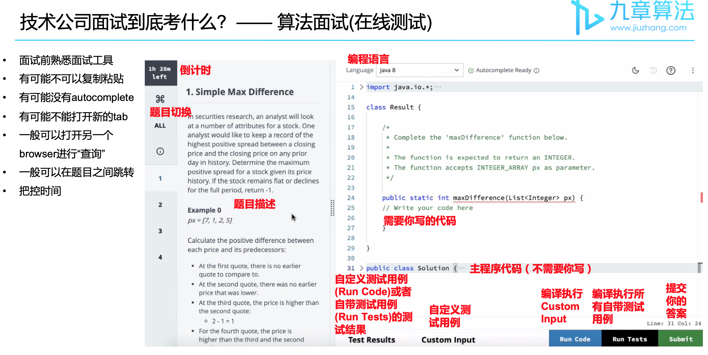
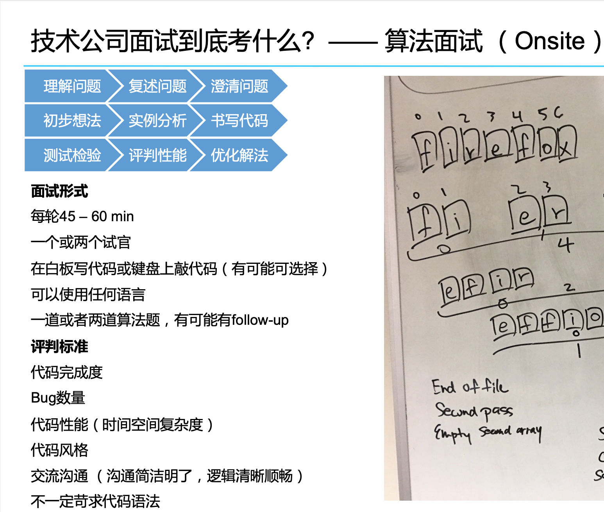
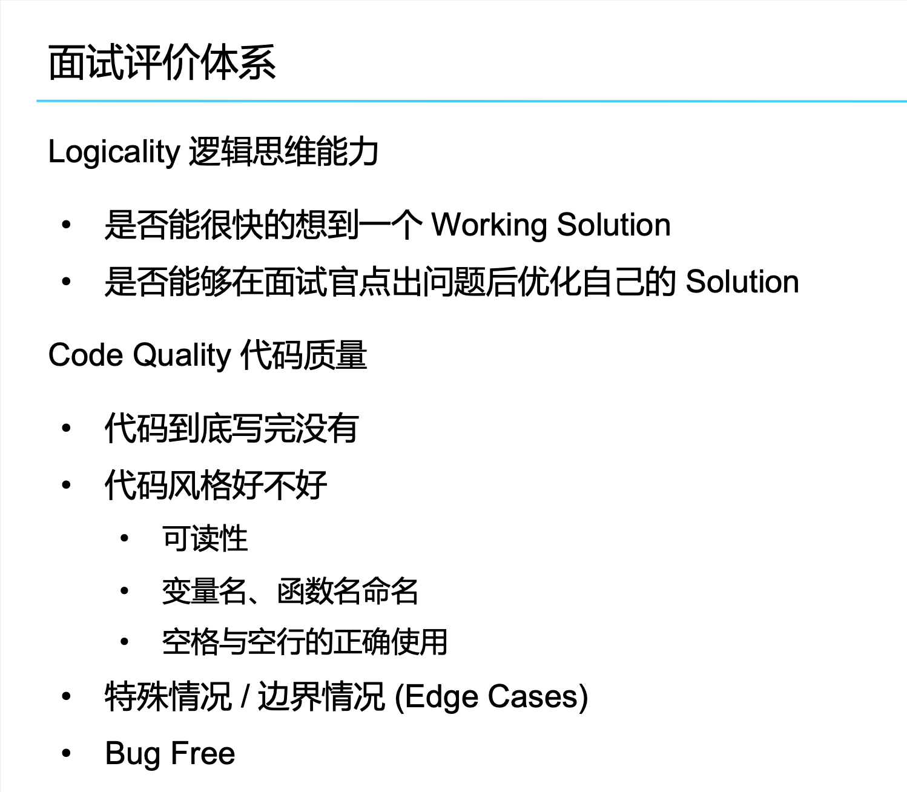
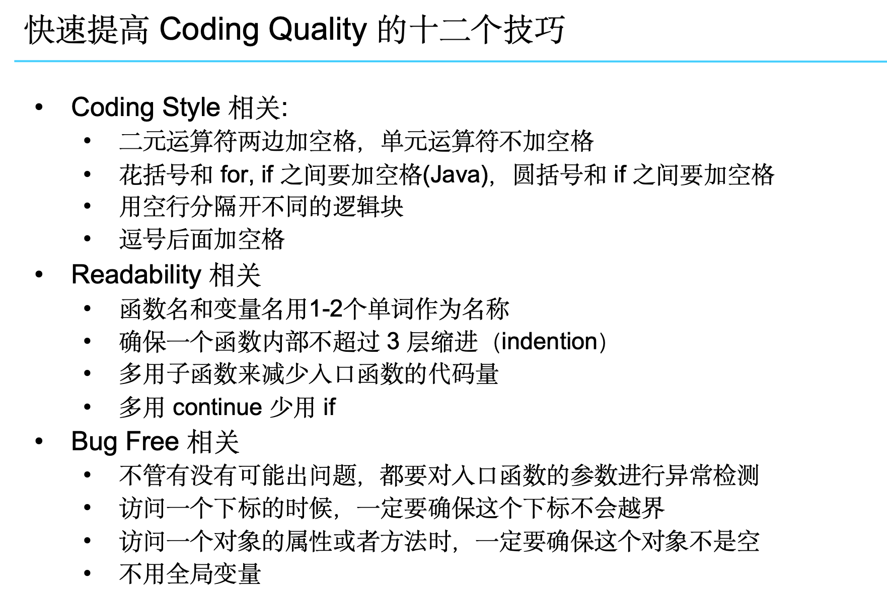
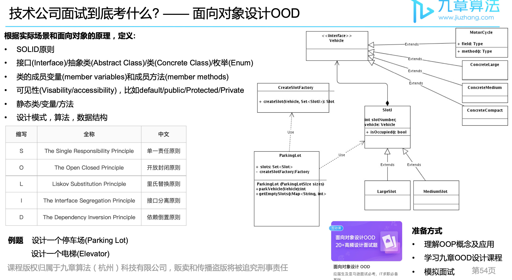
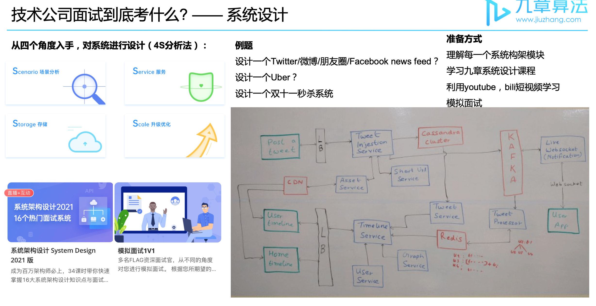
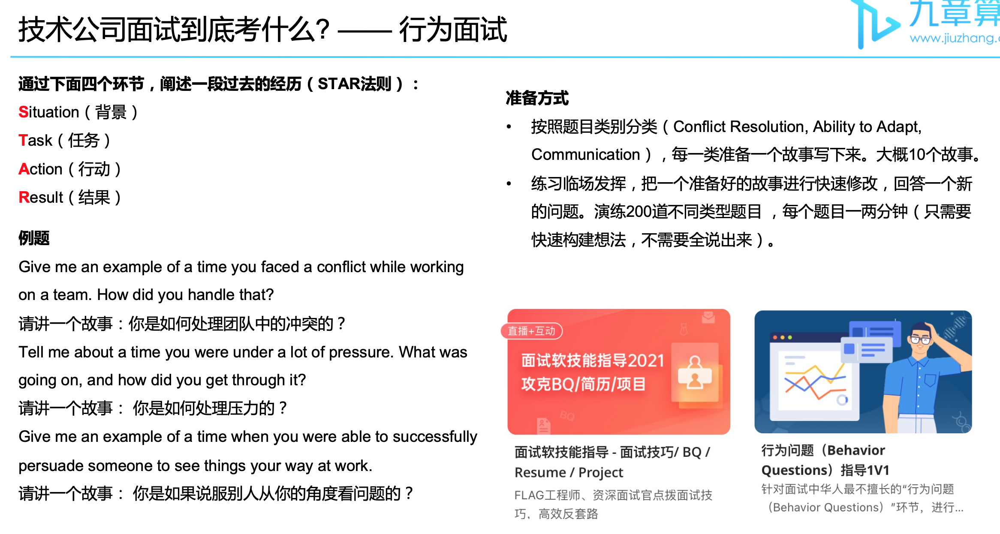

#########
Interview
#########

.. contents::

Online Assessment
******************

Onsite
******************

Assessment Metric
=================

Coding Style
============

Resume Question
**********************

Object Oriented Design
**********************

System Design
**********************

Behavior Question
**********************
