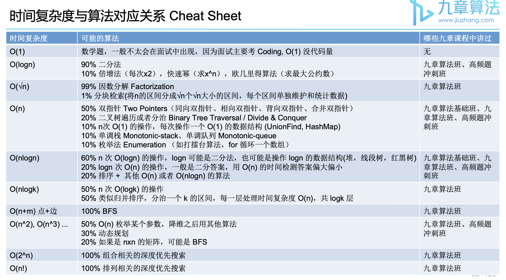
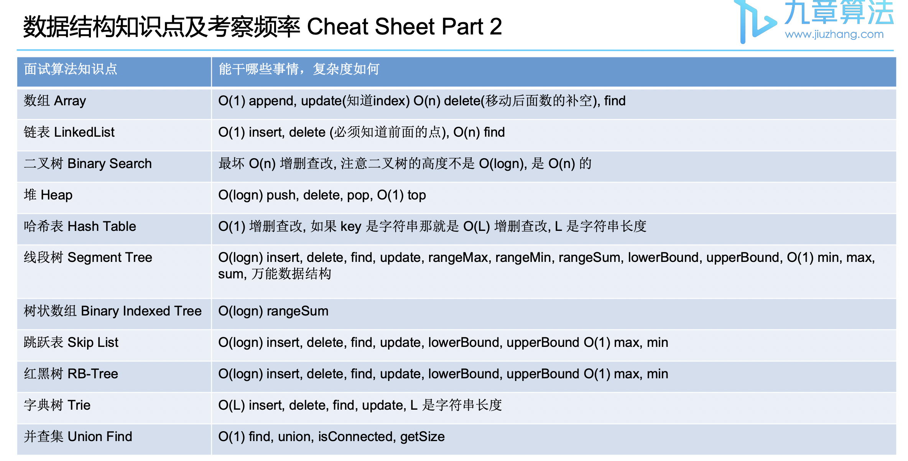

#########
Code Note
#########

Algorithm Table
****************

.. note::
   - 极限范围一般是 :math:`O(10^6), O(10^7)`
   - 所以如数据规模 :math:`O(10^3)`, :math:`O(n^2)` 的时间复杂度可过

.. toctree::
   :maxdepth: 1
   :caption: General

   Interview <general/interview>
   Behavior Questions <general/behavior>

.. toctree::
   :maxdepth: 1
   :caption: Algorithm

   Prefix Sum <algorithm/prefix>
   Two Pointers <algorithm/two_pointers>
   Binary Search <algorithm/binary_search>
   Breadth First Search <algorithm/bfs>
   Depth First Search <algorithm/dfs>
   Dynamic Programming <algorithm/dp>
   Divide and Conquer <algorithm/dq>
   Monotonic Stack/Queue <algorithm/mono_stack>
   Scan Line <algorithm/scan_line>

.. toctree::
   :maxdepth: 1
   :caption: Data Structure

   Hash <data_structure/hash>
   Heap <data_structure/heap>
   Union Find <data_structure/union_find>
   Trie <data_structure/trie>

.. toctree::
   :maxdepth: 1
   :caption: System Design

   System Design <system/system>
   News Feed System <system/news_feed>
   Programming Language <system/language>

.. toctree::
   :maxdepth: 1
   :caption: SSD

   SSD Basic <SSD/ssd>
   SSD NAND <SSD/NAND>
   SSD Firmware <SSD/FW>