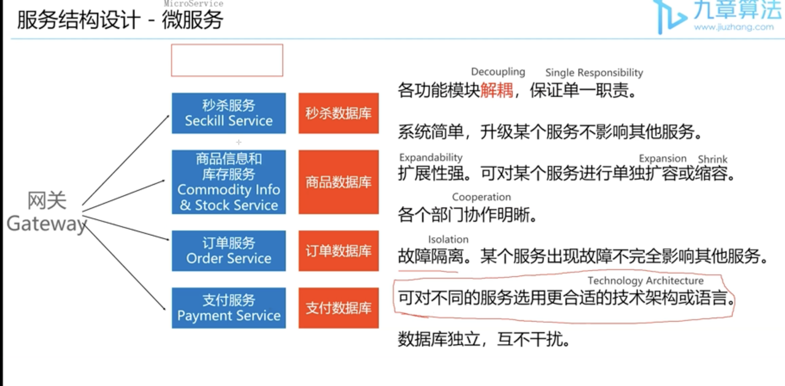
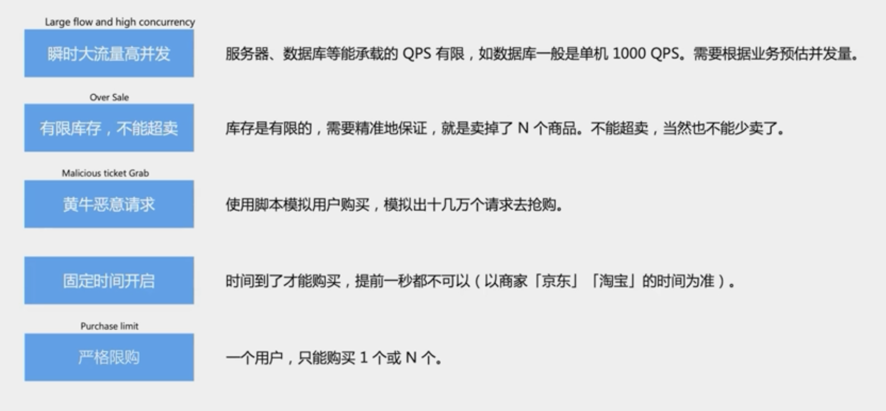

.. include:: ../_static/.special.rst

##############
System Design
##############

.. contents:: Table of Contents
   :depth: 3

基础概念
********

网站服务器 Web Server
=====================

.. hint::
  - 提供 **超文本协议** 服务 (HTTP/HTTPS)

    - 网页浏览器(Web Browser)和网站服务器(Web Server)之间规定 **传输数据格式** 的协议

  - QPS = 1K, MySQL数据库单点(单一服务器), single point server

数据库 Database
===============

.. hint::
  - 存储数据的仓库
  - 一般不对公网提供访问权限, 只允许内网(Web Server) 访问
  - 支持数据的 **增删查改** Create Delete Search Update
  - Web Server和Database Server是独立的两台机器
  - 适合存储 **结构化数据** Structured Data: names, dates, card number in **table format**
  
文件系统 File System
====================

.. hint::
  - 操作系统 Operating System 的组成部分
  - 目录结构 (Index Structure)
  - 数据系统基于文件系统存在
  - 接口单一: 起始地址 + 数据大小 (字节)
  - Non-volatile: 断电后数据依然存在
  - 适合存储 **非结构化数据** Unstructured Data: .avi, .jpg

缓存 Cache
==========

.. hint::
  - 相对概念, 可存在于:

    - 内存 Memcache
    - 磁盘 Hard Disk
    - CPU L1/L2 Cache
    - 服务器端 Redis
    - 客户端 Browser Cache
  - Memcache是 Key-Value 结构
  - 

访问量估算
==========

- 衡量系统压力
- QPS: Query Per Second
- DAU: Daily Active Users
- MAU: Monthly Active Users

消息队列 (Message Queue)
========================

服务雪崩 (Avalanche)
====================

熔断机制 (Fuse)
---------------

内容分发网络 (Content Distribution Network)
===========================================

- 将前端静态资源 (HTML, JS, CSS, Image, Video) 存入 **靠近用户地理位置** 的代理服务器
- 用户访问时减少延迟

系统设计问题
************

.. warning::
  - 设计XXX系统
  - 设计XXX系统中的某个功能

系统需求
========

.. image:: ../_static/img/system_4s.png
   :scale: 40 %
   :alt: Warning!

场景 Scenario
=============

.. hint::

  - 需要设计哪些功能
  - 需要承载多大的访问量: QPS, MAU, DAU

估算
-----

- QPS = 100, 本地电脑 local laptop
- QPS = 1K, MySQL数据库单点(单一服务器), single point server
- QPS = 100K, Redis数据库单点(单一服务器)
- QPS = 1M, a cluster of 1000 web server, consider maintainance

服务结构设计 (Service)
======================

Monolithic Design (单体架构)
----------------------------

Micro Service Design (微服务架构)
---------------------------------

Storage 存储
============

.. hint::
  - Select: 为每个 application / Service 选择合适的存储结构
  - Schema: 细化 **数据结构**

  - Application: 算法 + 数据结构
  - System: 服务+ 数据存储

数据库 Database
***************

SQL vs No SQL
=============

- SQL: 结构化数据, 自由创建index
- No SQL: 分布式, auto-scale, replica

主键 Primary Key
================

.. hint::
  - 用于唯一标记一条数据
  - ID 类型

    - SQL: **Sequential ID**, 新插入的数据ID自动增加
    - No-SQL: **Generated ID**, ID为随机生成的长字符串, 生成新ID不需要参考其他数据, 所以 **不需要加锁**, 方便 **多进程插入**

Redis Database
=========================

Redis Database
--------------

- 存于内存中
- 非关系型键值对: Non-SQL Kay-Value Pair
- 可以将数据持久化到磁盘中(Data Persistance)
- 单线程数据库, 通过IO多路复用 (IO Multiplexing) 实现并发

Redis支持的数据结构
^^^^^^^^^^^^^^^^^^^

- 字符串/数字 (STRING)
- 哈希表 (HASH)
- 链表 (LIST)
- 集合 (SET)
- 有序集合 (ZSET)

Redis的原子性 (Atomicity)
^^^^^^^^^^^^^^^^^^^^^^^^^

- 指令失败时完全回滚 (rollback)

Redis的用途
^^^^^^^^^^^

- 数据缓存 (cache)
- 数据持久存储 (data persistance)
- 消息队列 (Message Queue)

Cassandra Database
==================

- key分为两个部分: 

  - row_key: partition key, 决定数据存在哪个sharding上, 机器位置, 无法:code:`range`或者:code:`query`
  - column_key: key-value中的key, 支持范围查询 :code:`query(row_key, column_start, column_end)`

- 以grid为一条数据: :code:`row_key + column_key + value`
- No SQL的column是动态的, 可以无限大并随意添加

分布式事务 Distributed Transaction
==================================

- 保证各数据库间的强一致性 (Strong Consistency)

Data Persistance
================

- After power loss, data is still recorded
- Should not only be stored in memory, but also in hard drive
- Not supported: **Memcached**

缓存 (Cache)
============

- 预先存储之后要查询的信息, 避免重复计算或存取数据库
- key-value结构
- 拥有 **淘汰机制**, 会替换不常用的值

常用数据库
----------

- Memcached (不支持数据持久化)
- Redis (支持数据持久化)

:problem:`LRU Cache (LRU缓存)`
---------------------------------------

`LintCode 134 Hard <https://www.lintcode.com/problem/134/>`_

.. code-block:: bash

    Input:
    LRUCache(2)
    set(2, 1)
    set(1, 1)
    get(2)
    set(4, 1)
    get(1)
    get(2)
    Output: [1,-1,1]
    Explanation: 
    cache cap is 2, set(2,1), set(1, 1), get(2) and return 1, set(4,1) and delete (1,1), because (1,1) is the least use, get(1) and return -1, get(2) and return 1.

    Input:
    LRUCache(1)
    set(2, 1)
    get(2)
    set(3, 2)
    get(2)
    get(3)
    Output: [1,-1,2]
    Explanation: 
    cache cap is 1, set(2,1), get(2) and return 1, set(3,2) and delete (2,1), get(2) and return -1, get(3) and return 2.

.. hint::

    - LRU 缓存机制可以通过hashmap 和 double linked list 维护所有在缓存中的 key-value pair

      - double linked list 按照 **使用顺序** 存储 key-value pair: head -> 最近使用, tail -> 最久未使用
      - hashmap将 cache data的key 映射到 double linked list中这个data的位置

    - Get操作: 判断key是否存在
      - key不存在, 返回-1
      - key存在, 对应节点是最近被使用的节点, :code:`head = hashmap[key]`, 返回值

    - Set操作: 判断key是否存在
      - key存在, 对应节点是最近被使用的节点, :code:`hasmap[key].value = value`, :code:`head = hashmap[key]`, 返回值

.. note::

    .. code-block:: python

        class DLinkedNode:
            def __init__(self, key=0, value=0):
                self.key = key
                self.value = value
                self.prev = None
                self.next = None

        class LRUCache:
            """
            @param: capacity: An integer
            """
            def __init__(self, capacity):
                self.cache = dict()
                # 使用伪头部和伪尾部节点    
                self.head = DLinkedNode()
                self.tail = DLinkedNode()
                self.head.next = self.tail
                self.tail.prev = self.head
                self.capacity = capacity
                self.size = 0

            """
            @param: key: An integer
            @return: An integer
            """
            def get(self, key):
                if key not in self.cache:
                    return -1
                # 如果 key 存在，先通过哈希表定位，再移到头部
                node = self.cache[key]
                self.moveToHead(node)
                return node.value

            """
            @param: key: An integer
            @param: value: An integer
            @return: nothing
            """
            def set(self, key, value):
                if key not in self.cache:
                    # 如果 key 不存在，创建一个新的节点
                    node = DLinkedNode(key, value)
                    # 添加进哈希表
                    self.cache[key] = node
                    # 添加至双向链表的头部
                    self.addToHead(node)
                    self.size += 1
                    if self.size > self.capacity:
                        # 如果超出容量，删除双向链表的尾部节点
                        removed = self.removeTail()
                        # 删除哈希表中对应的项
                        self.cache.pop(removed.key)
                        self.size -= 1
                else:
                    # 如果 key 存在，先通过哈希表定位，再修改 value，并移到头部
                    node = self.cache[key]
                    node.value = value
                    self.moveToHead(node)
            
            def addToHead(self, node):
                node.prev = self.head
                node.next = self.head.next
                self.head.next.prev = node
                self.head.next = node
            
            def removeNode(self, node):
                node.prev.next = node.next
                node.next.prev = node.prev

            def moveToHead(self, node):
                self.removeNode(node)
                self.addToHead(node)

            def removeTail(self):
                node = self.tail.prev
                self.removeNode(node)
                return node

Seckill System (秒杀系统)
*************************

Requirement (需求)
==================

Service (秒杀系统服务)
======================

Micro Service Design (微服务架构)
---------------------------------

Storage (秒杀系统数据库)
========================

- 商品信息: commodity_info
- 秒杀活动: seckill_info
- 库存信息: stock_info
- 订单信息: order_info

Seckill (秒杀操作)
====================

MySQL读取库存的高并发问题
-------------------------

缓存预热 (Warm Up)
^^^^^^^^^^^^^^^^^^

- Database read the **seckill_info** 读取活动信息
- **Cache the data** in database into **redis** database 缓存至Redis内存数据库

读取库存和扣减库存的并发问题
----------------------------

- 用户请求查询数据库校验库存
- 符合条件, 扣减库存
- 并发时会产生库存数据不一致

Lua Script
^^^^^^^^^^

- 通过Lua脚本实现原子操作
- Redis Transaction 事务, atomic
- 解决了redis **读取库存** 和 **扣减库存** 的并发问题

.. code-block:: lua

  if (redis.call('exists', KEYS[1] == 1)) then
    -- read stock number from redis
    local stock = tonumber(redis.call('get', KEYS[1]));
    if (stock <= 0) then
      return -1;
    end;
    -- decrease stock number in redis
    redis.call('decr', KEYS[1]);
    return stock - 1;
  end;
  return -1;

Redis扣减成功和数据库操作的高并发问题
-------------------------------------

- Redis操作成功, 需要锁定MySQL数据库库存, 创建订单

锁定库存
^^^^^^^^

- 创建订单 **"预定"** 一个物品库存

  - 当用户在时间限制内完成支付, 扣减库存
  - 当用户未在时间限制内成功支付, 解除锁定, 该物品库存重新加入售卖

削峰 (Peak Clipping)
^^^^^^^^^^^^^^^^^^^^

- 通过消息队列 (Message Queue) 更改MySQL数据库库存

恶意下单问题
------------

- 扣减库存的时机

  - 下单就减库存: 恶意下单
  - 下单不减库存, 支付成功后减库存: 用户下单后无法支付, 体验差
  - 下单 **锁定** 库存, 支付成功后减库存

Limit (限购操作)
====================

用户ID查重
----------

- :code:`SADD` 将ID加入 **Redis集合**, 
- :code:`SISMEMBER` 判断ID是否已存在于集合中

前端页面限流
------------

- 购买按钮点击一次后禁用
- 必要时重定向至繁忙页面

Countdown (活动倒计时)
======================

- 前端轮询 **(Poll)** 服务器时间, 获取活动开始的 **时间差**

User System (用户系统)
**********************

Requirement (需求)
==================

- 读多写少, 需要使用 **缓存(cache)**
- 低数量级功能

  - 登陆 (重新输入密码)
  - 修改用户资料
  - 注册
- 高数量级功能

  - 搜索用户

搜索操作 (Search User)
======================

- 使用缓存
- 考虑对cache和database的分布操作可能 **中途失败**, 导致cache和database里的数据不一致 (Dirty Data)

  - :code:`db.set(user); cache.set(key, user);`
  - :code:`db.set(user); cache.delete(key);`
  - :code:`cache.set(key, user); db.set(user);`

- 多线程不安全操作

  - :code:`cache.delete(key); db.set(key, user);`
  - 当线程A删除cache, 使各线程cache miss并开始读取数据库
  - 线程B可能先完成从数据库读取数据并写入cache
  - 线程A将新的值写入数据库
  - 此时数据库与cache值不一致

- 正确操作

  - :code:`database.set(user); cache.delete(key);`
  - 仍然可能有Dirty Data, 但概率降低
  - 给cache设置 **ttl** 时限, 到时cache失效, 可以修复不一致情况

.. code-block:: python

  class UserService:
      def get_user(self, user_id):
          key = 'user::%s' % user_id
          user = cache.get(key)
          if user:
              return user
          user = database.get(user_id)
          cache.set(key, user)

      def set_user(self, user):
          key = 'user::%s' % user_id
          database.set(user)
          cache.delete(key)

登陆操作 (Authentication)
=========================

Session 会话
------------

- 用户登陆后创建一个Session对象
- 返回session_key给前端浏览器, 浏览器存入cookie中
- 之后前端所有用户请求都要带上cookie
- 服务器检查session_key对应的session是否存在或过期

UUID (Universal Unique ID)
^^^^^^^^^^^^^^^^^^^^^^^^^^

- 作为session_key, 由32位16进制的数字组成

好友关系 (Follow)
=================

单向好友 (Follow)
-----------------

- 无需被关注方同意
- SQL Database

  - from_user_id, to_user_id
- NoSQL Database

  - Redis: key: user_id, value: set(following_user_id)
  - Cassandra: row_key: user_id, column_key: following_user_id

双向好友 (Friend)
-----------------

- 需要被加好友方同意
- 存储为2条数据

  - from_user_id, to_user_id
  - 可以优化查询SQL语句, 不需要使用 :code:`or`
  - :code:`select * from friendship where from_user_id = x`

6度好友关系 (6-degree relationship)
-----------------------------------

